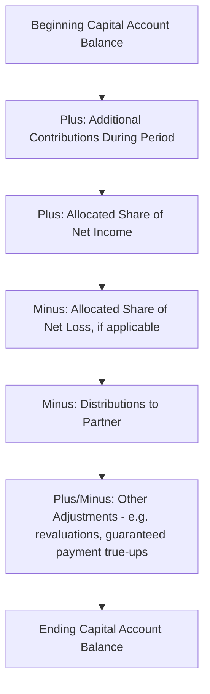

## Partnership Formation and Capital Account Maintenance

### Overview

Partnership accounting departs structurally from corporate accounting because a partnership has no single class of stock, no retained earnings account, and no unified equity pool — instead, each partner maintains an individually tracked **capital account** reflecting their contributions, allocated share of income/loss, and distributions. This topic covers the accounting mechanics of forming a partnership (recording initial contributions of cash and noncash property) and the ongoing maintenance of capital accounts, which together form the foundation for every subsequent partnership accounting topic in this chapter (profit/loss allocation, admission/withdrawal of partners, and liquidation).

### Legal and Accounting Framework

A partnership's accounting is governed by the partnership agreement itself (the primary source of accounting rules between partners) supplemented by general partnership accounting principles and, for tax-basis capital account maintenance, IRC Section 704(b) and related Treasury Regulations governing "substantial economic effect." While ASC 505-10 and general GAAP principles inform financial-statement-basis capital accounting, partnerships frequently maintain capital accounts on multiple bases simultaneously (GAAP basis, tax basis, and Section 704(b) basis), which can diverge and require careful reconciliation — a recurring practical and forensic complexity unique to partnership accounting.

### Initial Formation — Recording Contributions

At formation, each partner's capital account is credited for the fair value of the assets contributed, net of any liabilities assumed by the partnership.

$$\text{Initial Capital Account Balance} = \text{Fair Value of Assets Contributed} - \text{Liabilities Assumed by Partnership}$$

**Cash contributions** are recorded at face value. **Noncash property contributions** (equipment, real estate, inventory, or even intangible assets like expertise or goodwill in specific circumstances) are recorded at their **fair value** at the contribution date, not the contributing partner's historical cost basis — this is a key distinction from the partner's own tax basis in the contributed property, which is often preserved separately for tax purposes even though the book/GAAP capital account reflects fair value.

**Worked Example — Formation with Mixed Contributions:**

Three partners form a partnership:

- Partner A contributes $100,000 cash
- Partner B contributes equipment with a fair value of $150,000 and a historical cost basis to B of $90,000, subject to a $30,000 note payable assumed by the partnership
- Partner C contributes a building with a fair value of $300,000 and a mortgage of $100,000 assumed by the partnership

| Partner | Asset Contributed | Fair Value | Liability Assumed | Net Capital Credit |
| --- | --- | --- | --- | --- |
| A | Cash | $100,000 | — | $100,000 |
| B | Equipment | $150,000 | $30,000 | $120,000 |
| C | Building | $300,000 | $100,000 | $200,000 |

Journal entry:

| Account | Debit | Credit |
| --- | --- | --- |
| Cash | $100,000 |  |
| Equipment | $150,000 |  |
| Building | $300,000 |  |
| Notes Payable |  | $30,000 |
| Mortgage Payable |  | $100,000 |
| A, Capital |  | $100,000 |
| B, Capital |  | $120,000 |
| C, Capital |  | $200,000 |

Note that the noncash assets are recorded at their fair value to the partnership, **not** at the contributing partner's original cost — this often means the partnership's book basis in contributed property differs from the contributing partner's tax basis, a divergence that must be tracked separately (often using a "built-in gain/loss" schedule) for tax allocation purposes under IRC Section 704(c), even though this topic focuses on the financial/book accounting treatment.

### Capital Account Structure and Maintenance

Each partner's capital account is a running ledger that captures all equity-affecting activity attributable to that specific partner:

$$\text{Ending Capital} = \text{Beginning Capital} + \text{Contributions} + \text{Allocated Share of Net Income} - \text{Allocated Share of Net Loss} - \text{Distributions} \pm \text{Other Capital Adjustments}$$

### Worked Example — Capital Account Rollforward

**Facts:** Continuing the three-partner example above, assume the partnership agreement allocates profits and losses equally (1/3 each). In Year 1, the partnership earns $90,000 in net income; Partner A withdraws $20,000 cash as a distribution during the year; no other partners take distributions.

|  | Partner A | Partner B | Partner C |
| --- | --- | --- | --- |
| Beginning capital | $100,000 | $120,000 | $200,000 |
| Plus: Allocated net income (1/3 each) | $30,000 | $30,000 | $30,000 |
| Less: Distributions | ($20,000) | $0 | $0 |
| **Ending capital** | **$110,000** | **$150,000** | **$230,000** |

Note that capital account balances need not — and typically do not — remain equal to each other even under an equal profit-sharing arrangement, since they reflect each partner's unique history of contributions and distributions.

### Guaranteed Payments and Interest on Capital

Many partnership agreements provide for **guaranteed payments** to specific partners (compensation for services rendered, or a stipulated return on invested capital) that are paid or allocated regardless of whether the partnership has sufficient net income to cover them — these are typically deducted in arriving at the residual profit/loss to be allocated under the general profit-sharing ratio, functioning conceptually similarly to a salary or preferred return before the remaining "residual" income is split.

**Example**: A partnership agreement provides Partner A a guaranteed payment of $40,000 for services, with any remaining income/loss split equally three ways. If the partnership earns $100,000 net income before guaranteed payments:

| Step | Amount |
| --- | --- |
| Net income before guaranteed payments | $100,000 |
| Less: Guaranteed payment to A | ($40,000) |
| Residual income to be allocated equally | $60,000 |
| Each partner's residual share (1/3) | $20,000 |

Partner A's total allocation: $40,000 (guaranteed payment) + $20,000 (residual share) = $60,000

Partners B and C each receive: $20,000 (residual share only)

### Non-Cash Contribution Complications — Bonus and Goodwill Methods

When a new or existing partner contributes assets (or when partnership interests are revalued) and the fair value of what is contributed does not align with the resulting capital account credit implied by the partnership agreement's stated ownership percentages, two methods reconcile the difference:

- **Bonus method**: No goodwill or intangible asset is recorded; instead, capital is reallocated among the partners' existing capital accounts to reflect the agreed-upon ownership percentages, effectively transferring capital from existing partners to the new/contributing partner (or vice versa) without recognizing any new asset.
- **Goodwill method**: An intangible asset (goodwill) is recognized on the partnership's books, calculated based on the implied total value of the partnership suggested by the new partner's contribution relative to their acquired ownership percentage, with the goodwill allocated to the *existing* partners' capital accounts in their profit-sharing ratio.

**Worked Example — Bonus Method:**

Partners A and B each have $50,000 capital (total $100,000), sharing profits equally. Partner C contributes $60,000 cash for a 1/3 interest in the new partnership (implying total capital should be $100,000 + $60,000 = $160,000, with C entitled to 1/3, or $53,333).

Since C contributed $60,000 but is only credited $53,333 under a 1/3 interest, the excess $6,667 is treated as a bonus to the existing partners (A and B), split according to their existing profit-sharing ratio (assume equal, 50/50 between A and B):

| Partner | Capital Before | Adjustment | Capital After |
| --- | --- | --- | --- |
| A | $50,000 | +$3,334 | $53,334 |
| B | $50,000 | +$3,333 | $53,333 |
| C | — | $53,333 (from $60,000 contributed) | $53,333 |
| **Total** | **$100,000** |  | **$160,000** |

**Worked Example — Goodwill Method (same facts):**

Under the goodwill method, C's $60,000 contribution for a 1/3 interest implies a total partnership value of $180,000 ($60,000 ÷ 1/3), rather than the simple sum of $160,000. The $20,000 difference ($180,000 implied total value − $160,000 actual net assets after contribution) is recorded as goodwill, allocated to the *existing* partners (A and B) in their prior profit-sharing ratio:

| Partner | Capital Before | Goodwill Allocation | Capital After |
| --- | --- | --- | --- |
| A | $50,000 | +$10,000 | $60,000 |
| B | $50,000 | +$10,000 | $60,000 |
| C | — | $60,000 (contribution) | $60,000 |
| **Total** | **$100,000** | **+$20,000 goodwill** | **$180,000** |

The choice between methods is a matter of the partnership agreement's terms (and, under U.S. GAAP, goodwill recognition in this context is less commonly used in modern practice compared to the bonus method, given general skepticism toward recognizing internally generated goodwill absent an arm's-length transaction establishing fair value).

### GAAP Capital vs. Tax (Section 704(b)) Capital vs. Outside Basis

A distinctive complexity of partnership accounting is that capital accounts are commonly maintained on **multiple, non-identical bases simultaneously**:

| Basis | Purpose | Key Feature |
| --- | --- | --- |
| GAAP/book capital | Financial reporting | Reflects fair value of noncash contributions; income/loss per GAAP |
| Section 704(b) capital | Tax allocation "substantial economic effect" safe harbor | Reflects fair value at contribution; adjusted for tax depreciation/revaluations per specific regulatory rules |
| Tax basis capital (partner's outside basis) | Determines gain/loss on partner's disposition of their interest, and loss limitation | Reflects each partner's cost basis, adjusted for share of taxable income/loss, tax-exempt income, nondeductible expenses, and liabilities under partnership tax rules |

These three bases frequently diverge — for instance, due to built-in gain/loss on contributed property (Section 704(c) allocations), different depreciation methods for book versus tax purposes, or the treatment of partnership liabilities in outside basis calculations (which have no direct GAAP capital account analog). Reconciling these bases is a routine and often complex task in partnership financial reporting and forensic review, particularly for private equity funds, real estate partnerships, and other entities where tax and book divergence can be substantial and where restatement risk from misapplied Section 704(b) mechanics can have both financial reporting and tax compliance consequences.

### Negative Capital Accounts

Unlike corporate equity, individual partner capital accounts can — and frequently do — go **negative**, particularly when a partner's allocated losses or distributions exceed their cumulative contributions and income. A negative capital account is not inherently improper; however, it raises important considerations:

- Whether the partner has an obligation to restore the deficit upon liquidation (a "deficit restoration obligation" or DRO), which affects loss allocation limits under tax rules and the partnership's own risk allocation.
- Whether the partnership agreement or applicable law limits a partner's loss allocation to the extent it would create (or increase) a negative capital account balance absent a DRO or other economic risk-bearing arrangement.
- The interaction with "qualified income offset" provisions commonly included in partnership agreements to satisfy IRS safe harbor requirements for substantial economic effect.

### Practical and Forensic Considerations

- **Fair value support for noncash contributions**: Because noncash contributions are recorded at fair value (not the contributing partner's cost basis), the reasonableness and independence of the valuation used at formation is a common area of scrutiny — self-serving or unsupported valuations that inflate a particular partner's initial capital credit relative to other partners' cash contributions warrant careful forensic examination.
- **Multiple capital account basis reconciliation errors**: Given the routine divergence between GAAP, Section 704(b), and tax basis capital accounts, reconciliation errors (or a failure to maintain all required bases) are a recurring source of both financial misstatement and tax compliance exposure — forensic review of partnership records should verify each basis is separately and consistently maintained.
- **Bonus/goodwill method selection consistency**: Because these two methods can produce materially different capital allocations among partners for economically similar transactions, consistency in application (as dictated by the partnership agreement, not ad hoc selection favoring a particular partner) is an important control and review point.
- **Guaranteed payment characterization**: Distinguishing a guaranteed payment (treated similarly to compensation, deducted before residual allocation) from a distribution or a disproportionate profit allocation is sometimes manipulated to achieve a desired tax or economic outcome for a specific partner — the substance of the arrangement, not merely its label in the partnership agreement, should govern its accounting characterization.

**Related Topics:**

- Profit and loss allocation methods in partnerships (including special/preferred allocations)
- Admission of a new partner and changes in ownership interests
- Withdrawal, retirement, or death of a partner
- Partnership liquidation and the marshaling of assets
- Section 704(b) and 704(c) tax allocation rules in depth
- Limited liability company (LLC) capital account analogs and member equity accounting