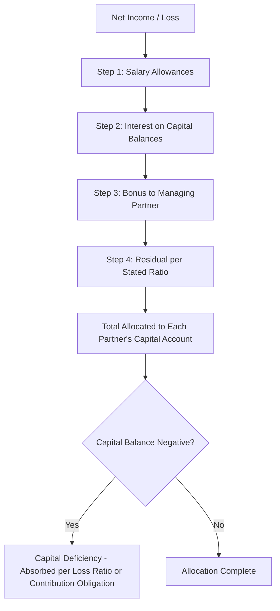

## Allocation of Profits, Losses, and Special Allocations

<syllabot_broad_topic/>

### Overview

Partnership profit and loss allocation determines how the partnership's net income or net loss for a period is distributed among partners' capital accounts. This is distinct from cash distributions — allocation is a bookkeeping/tax attribution of income, while distribution is the actual transfer of cash or property. The allocation method is governed primarily by the partnership agreement; in its absence, most jurisdictions (and the Revised Uniform Partnership Act, RUPA) default to equal sharing regardless of capital contribution.

### Governing Framework

**Key Points**

- The partnership agreement is the primary authority for allocation; it overrides default statutory rules.
- If silent on losses but specifies profits, losses typically follow the profit ratio (common law and RUPA default).
- Allocations must have "substantial economic effect" under U.S. tax law (IRC §704(b)) to be respected for tax purposes, separate from the book/GAAP allocation used for financial reporting.
- Financial accounting allocation (GAAP) and tax allocation (IRC) can differ; this section focuses primarily on the accounting mechanics, with tax rules noted where relevant.

### Common Allocation Methods

#### 1. Fixed Ratio (Stated Ratio)

Partners agree to a specific ratio (e.g., 3:2:1) unrelated to capital balances. Simplest method, common when partners contribute non-monetary value (expertise, time) unequally.

**Example**

Partnership ABC has partners A, B, and C sharing profits/losses 50:30:20. Net income for the year = $200,000.

$$A = 200{,}000 \times 0.50 = 100{,}000$$

$$B = 200{,}000 \times 0.30 = 60{,}000$$

$$C = 200{,}000 \times 0.20 = 40{,}000$$

Journal entry:

| Account | Debit | Credit |
| --- | --- | --- |
| Income Summary | 200,000 |  |
| A, Capital |  | 100,000 |
| B, Capital |  | 60,000 |
| C, Capital |  | 40,000 |

#### 2. Capital Ratio

Allocation proportional to each partner's capital account balance (beginning, ending, or weighted-average). Weighted-average is preferred when capital changes materially during the period, since it reflects the time-weighted investment.

**Example — Weighted-Average Capital**

Partner D: $100,000 from Jan 1–Jun 30, then withdraws $20,000, leaving $80,000 for Jul 1–Dec 31.

$$\text{Weighted Avg} = \left(100{,}000 \times \frac{6}{12}\right) + \left(80{,}000 \times \frac{6}{12}\right) = 50{,}000 + 40{,}000 = 90{,}000$$

This weighted-average figure is then used as the numerator/denominator basis in the capital ratio calculation alongside other partners' weighted averages.

#### 3. Interest on Capital Balances (Allowance), Then Remainder in Fixed Ratio

A hybrid method: partners first receive a notional "interest" allowance on their capital (compensating for capital invested), and the residual profit/loss is split in a stated ratio.

**Example**

Capital balances: E = $150,000, F = $100,000. Interest allowance = 10% per annum. Remaining profit split 60:40 (E:F). Net income = $80,000.

$$\text{Interest}_E = 150{,}000 \times 0.10 = 15{,}000$$

$$\text{Interest}_F = 100{,}000 \times 0.10 = 10{,}000$$

$$\text{Total Interest} = 25{,}000$$

$$\text{Remainder} = 80{,}000 - 25{,}000 = 55{,}000$$

$$E_{\text{remainder}} = 55{,}000 \times 0.60 = 33{,}000 \quad F_{\text{remainder}} = 55{,}000 \times 0.40 = 22{,}000$$

$$E_{\text{total}} = 15{,}000 + 33{,}000 = 48{,}000 \qquad F_{\text{total}} = 10{,}000 + 22{,}000 = 32{,}000$$

**Note**: If net income is *less* than the total interest allowance, the remainder becomes negative and is still allocated per the residual ratio, which can result in one partner's allocation exceeding total net income while another's is reduced or negative. This is a standard and expected mechanical outcome, not an error.

#### 4. Salary Allowances to Partners

Compensates partners for services rendered, treated as a priority allocation (not an expense reducing net income under most partnership accounting treatments, since partners are not employees for GAAP purposes — salaries are a profit allocation mechanism).

**Example**

Partners G and H. G receives a $40,000 salary allowance; remainder split equally. Net income = $100,000.

$$\text{Remainder} = 100{,}000 - 40{,}000 = 60{,}000$$

$$G = 40{,}000 + 30{,}000 = 70{,}000 \qquad H = 30{,}000$$

If net income is only $30,000 (less than the salary allowance):

$$\text{Remainder} = 30{,}000 - 40{,}000 = -10{,}000$$

$$G = 40{,}000 + (-5{,}000) = 35{,}000 \qquad H = -5{,}000$$

Salary allowances are honored in full even if net income is insufficient, with the shortfall absorbed through the residual sharing ratio — a point frequently tested in exams.

#### 5. Bonus to Managing Partner

An incentive allocation, often computed as a percentage of net income either **before** or **after** the bonus itself is deducted. This distinction materially changes the result and is a classic exam trap.

**Bonus Based on Income Before Bonus**

$$\text{Bonus} = b \times \text{NI}$$

**Bonus Based on Income After Bonus**

$$\text{Bonus} = b \times (\text{NI} - \text{Bonus})$$

Solving algebraically:

$$\text{Bonus} = \frac{b}{1+b} \times \text{NI}$$

**Example**

Managing partner J receives a 10% bonus. Net income = $110,000.

*Before bonus deduction:*

$$\text{Bonus} = 0.10 \times 110{,}000 = 11{,}000$$

*After bonus deduction:*

$$\text{Bonus} = \frac{0.10}{1.10} \times 110{,}000 = 10{,}000$$

Verification for "after" method: $10{,}000 = 0.10 \times (110{,}000 - 10{,}000) = 0.10 \times 100{,}000 = 10{,}000$ ✓

### Combined Multi-Tier Allocation (Comprehensive Method)

Most real partnership agreements layer several of the above in a specified order. The standard priority sequence is:

1. Salary allowances
2. Interest on capital balances
3. Bonus to managing partner (if applicable)
4. Remainder per stated ratio

**Example — Full Combined Allocation**

Partners K, L, M. Net income = $150,000.

- Salaries: K = $20,000, L = $15,000, M = $0
- Interest: 8% on beginning capital — K = $100,000, L = $80,000, M = $60,000
- Remainder split equally

| Step | K | L | M | Total |
| --- | --- | --- | --- | --- |
| Net Income |  |  |  | 150,000 |
| Salary | 20,000 | 15,000 | 0 | (35,000) |
| Interest (8%) | 8,000 | 6,400 | 4,800 | (19,200) |
| Subtotal allocated | 28,000 | 21,400 | 4,800 | 95,800 |
| Remainder (150,000 − 35,000 − 19,200 = 95,800), split equally | 31,933 | 31,933 | 31,934 | 95,800 |
| **Total Allocation** | **59,933** | **53,333** | **36,734** | **150,000** |

**Deficiency Case**: If net income were only $40,000 (less than total salaries + interest of $54,200), the remainder becomes negative:

$$\text{Remainder} = 40{,}000 - 35{,}000 - 19{,}200 = -14{,}200$$

This negative remainder is still split equally (−4,733 each), reducing each partner's total allocation below their salary+interest subtotal. This confirms salary and interest allowances are not guaranteed minimum distributions — they are allocation mechanics that can be eroded by the residual split when income is insufficient.

### Loss Allocation

Losses are allocated using the same ratios/method as profits unless the agreement specifies otherwise. Key considerations:

- **Salary and interest allowances during a loss year**: Still applied per the agreement; this often pushes the "remainder" deeply negative, which is then absorbed via the residual ratio — potentially creating negative capital balances (a capital deficiency) for some partners.
- **Capital deficiency**: When a partner's capital account goes negative after loss allocation, that partner theoretically owes the partnership. If uncollectible (partner is insolvent), the deficiency is typically absorbed by the remaining partners in their relative profit/loss ratio — this becomes central to partnership liquidation accounting (a related topic).

### Special Allocations

A **special allocation** assigns a specific item of income, gain, loss, deduction, or credit to a partner (or partners) in a ratio *different* from the general profit/loss sharing ratio. This is common for tax planning and to align economic reality with allocation.

**Common triggers for special allocations:**

- A partner contributes appreciated property; built-in gain/loss is specially allocated to that partner (IRC §704(c) principle — ensures pre-contribution appreciation is taxed to the contributing partner, not shared).
- Depreciation on a specific asset is allocated to the partner who contributed it or who bears the economic risk associated with it.
- Tax credits (e.g., investment tax credits) allocated to the partner best able to use them.
- Guaranteed payments for services or capital use (see below) function similarly to a special allocation but are treated as a priority charge against income, sometimes classified as an expense-like item for the paying partner's share calculation.

**Requirements for Validity (Tax Context)**

For a special allocation to be respected under IRC §704(b) rather than reallocated according to the partners' general interest in the partnership (PIP), it must have **substantial economic effect (SEE)**, requiring:

1. The allocation is reflected in the partners' capital accounts (maintained per Treasury Regulation rules).
2. Liquidating distributions follow positive capital account balances.
3. Partners with capital deficits must be obligated to restore them (Deficit Restoration Obligation, DRO), or a "qualified income offset" provision must be present.

[Inference] The precise regulatory tests for substantiality (the "after-tax economic consequences" test) are technical areas where practitioners typically rely on current Treasury Regulations and professional tax counsel, as interpretations and safe harbors are subject to periodic administrative guidance.

**Example — Special Allocation of Built-In Gain**

Partner N contributes land with a tax basis of $50,000 and fair market value of $80,000 (built-in gain = $30,000). Upon a later sale of the land for $90,000 (total gain = $40,000):

$$\text{Built-in gain allocated to N} = 30{,}000$$

$$\text{Post-contribution gain (shared per general ratio)} = 40{,}000 - 30{,}000 = 10{,}000$$

If the general profit ratio is 50:50 between N and O, the $10,000 post-contribution gain splits $5,000 each, while N alone receives the full $30,000 built-in gain allocation.

### Guaranteed Payments

A guaranteed payment is compensation to a partner for services or use of capital, determined without regard to partnership income (similar to a salary but with distinct tax treatment — deductible by the partnership for computing ordinary income and taxed as ordinary income to the recipient partner, per IRC §707(c)).

**Example**

Partner P receives a guaranteed payment of $25,000 for management services, paid regardless of profitability. If the partnership has a loss of $10,000 before the guaranteed payment:

$$\text{Net loss after guaranteed payment} = -10{,}000 - 25{,}000 = -35{,}000$$

This $35,000 loss is then allocated among all partners per the general ratio.

### Journal Entries Summary

**Recording Net Income Allocation:**

| Account | Debit | Credit |
| --- | --- | --- |
| Income Summary | XXX |  |
| Partner A, Capital |  | XXX |
| Partner B, Capital |  | XXX |

**Recording Net Loss Allocation:**

| Account | Debit | Credit |
| --- | --- | --- |
| Partner A, Capital | XXX |  |
| Partner B, Capital | XXX |  |
| Income Summary |  | XXX |

### Visual: Allocation Waterfall

### Diagram: Allocation Tiers (SVG)

<svg xmlns="http://www.w3.org/2000/svg" viewBox="0 0 640 300" font-family="Arial, sans-serif">
<text x="320" y="24" font-size="16" font-weight="bold" text-anchor="middle">Profit Allocation Waterfall (svg_diagram)</text>
<rect x="40" y="45" width="560" height="40" fill="#dbeafe" stroke="#1e40af" />
<text x="320" y="70" font-size="13" text-anchor="middle">1. Salary Allowances (priority, fixed dollar amounts)</text>
<rect x="40" y="95" width="560" height="40" fill="#bfdbfe" stroke="#1e40af" />
<text x="320" y="120" font-size="13" text-anchor="middle">2. Interest on Capital Balances (% of contributed capital)</text>
<rect x="40" y="145" width="560" height="40" fill="#93c5fd" stroke="#1e40af" />
<text x="320" y="170" font-size="13" text-anchor="middle">3. Bonus to Managing Partner (before/after bonus base)</text>
<rect x="40" y="195" width="560" height="40" fill="#60a5fa" stroke="#1e40af" />
<text x="320" y="220" font-size="13" text-anchor="middle">4. Residual Split (stated ratio, capital ratio, or equal)</text>
<rect x="40" y="245" width="560" height="40" fill="#3b82f6" stroke="#1e40af" />
<text x="320" y="270" font-size="13" fill="white" text-anchor="middle">Total Allocation per Partner Capital Account</text>
</svg>

### Common Pitfalls (Exam Focus)

- Confusing "bonus before bonus deduction" vs. "bonus after bonus deduction" — always verify the base.
- Forgetting that salary/interest allowances still apply in loss years, pushing the residual (and possibly individual partners' final allocations) negative.
- Allocating a special allocation using the general ratio by mistake, rather than the contractually/tax-specified special ratio.
- Treating guaranteed payments as a distribution rather than incorporating them into net income calculation before allocation.
- Using ending capital instead of weighted-average capital when the agreement specifies weighted-average, especially with mid-year capital changes.

**Related Topics**

- Partnership formation and initial capital contributions
- Admission of a new partner (bonus and goodwill methods)
- Withdrawal/retirement of a partner
- Partnership liquidation (lump-sum and installment methods)
- Capital deficiency and the doctrine of marshaling of assets
- IRC §704(b) substantial economic effect and §704(c) built-in gain/loss rules
- Statement of partners' capital (financial statement presentation)