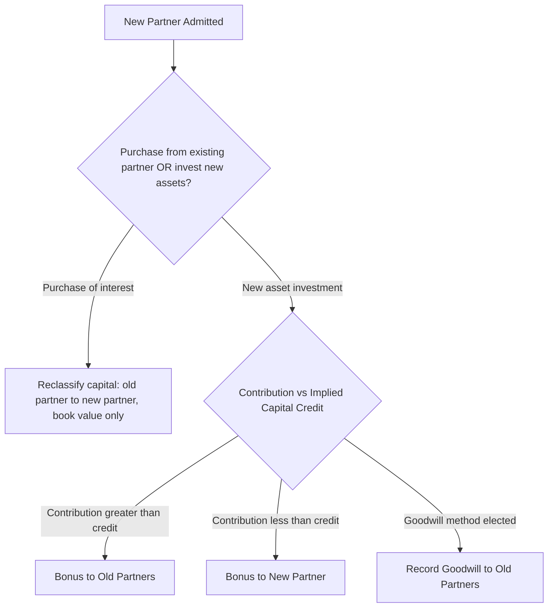

## Admission and Withdrawal of Partners

### Overview

The admission of a new partner or the withdrawal (retirement, death, or expulsion) of an existing partner legally dissolves the old partnership and creates a new one, since a partnership is a voluntary association of specific individuals. In practice, accounting continuity is preserved through revaluation and capital account adjustments rather than full liquidation, unless the partners choose otherwise. Two dominant methods govern the accounting: the **bonus method** and the **goodwill (revaluation) method**.

### Admission of a New Partner

A new partner can be admitted in two principal ways:

1. **Purchase of interest directly from an existing partner** — a personal transaction between the incoming and outgoing partner; it does not affect partnership net assets or require a journal entry beyond reclassifying capital.
2. **Investment of assets directly into the partnership** — increases total partnership net assets; this is where bonus/goodwill methods become relevant.

#### 1. Admission by Purchase of Interest (Personal Transaction)

The new partner pays an existing partner directly (cash changes hands between individuals, not through the partnership). The partnership simply reclassifies the capital account.

**Example**

Partner Q sells half of her $60,000 capital interest to incoming partner R for $40,000 cash (paid personally to Q, not to the partnership).

| Account | Debit | Credit |
| --- | --- | --- |
| Q, Capital | 30,000 |  |
| R, Capital |  | 30,000 |

**Key Point**: The $40,000 price paid is irrelevant to the journal entry — only the *book value* of the capital interest transferred ($30,000) is recorded. The premium Q received personally is not a partnership transaction.

#### 2. Admission by Investment of New Assets

The new partner contributes cash or assets directly to the partnership, increasing total partnership capital. Here, the **contributed amount** is compared against the **implied value** of the interest being acquired to determine bonus or goodwill.

### Bonus Method (Admission)

Under the bonus method, no goodwill is recorded. Any difference between what the new partner contributes and the proportionate book value of capital acquired is treated as a **bonus** transferred between the old and new partners' capital accounts. Total partnership net assets equal the sum of prior book capital plus the new contribution — no revaluation.

**Step Procedure**

1. Compute total capital after admission = old total capital + new partner's contribution.
2. Compute new partner's capital credit = total capital after admission × new partner's agreed ownership %.
3. Compare new partner's capital credit to actual cash contributed.
4. The difference is a bonus — allocated to/from the old partners per their old profit-sharing ratio.

**Example — Bonus to Old Partners**

Partners S and T have capital of $80,000 and $60,000 (total $140,000), sharing profits 60:40. New partner U contributes $50,000 cash for a 25% interest.

$$\text{Total Capital After Admission} = 140{,}000 + 50{,}000 = 190{,}000$$

$$U\text{'s Capital Credit} = 190{,}000 \times 0.25 = 47{,}500$$

$$\text{Bonus to Old Partners} = 50{,}000 - 47{,}500 = 2{,}500$$

Bonus allocated to S and T per their 60:40 ratio:

$$S = 2{,}500 \times 0.60 = 1{,}500 \qquad T = 2{,}500 \times 0.40 = 1{,}000$$

| Account | Debit | Credit |
| --- | --- | --- |
| Cash | 50,000 |  |
| S, Capital |  | 1,500 |
| T, Capital |  | 1,000 |
| U, Capital |  | 47,500 |

**Example — Bonus to New Partner**

Same facts, but U contributes only $40,000 for a 25% interest (U is receiving a "bargain" entry, perhaps due to bringing valuable expertise or clientele).

$$\text{Total Capital After Admission} = 140{,}000 + 40{,}000 = 180{,}000$$

$$U\text{'s Capital Credit} = 180{,}000 \times 0.25 = 45{,}000$$

$$\text{Bonus to U} = 45{,}000 - 40{,}000 = 5{,}000$$

This bonus is deducted from S and T's capital per their old ratio (60:40):

$$S: -3{,}000 \qquad T: -2{,}000$$

| Account | Debit | Credit |
| --- | --- | --- |
| Cash | 40,000 |  |
| S, Capital | 3,000 |  |
| T, Capital | 2,000 |  |
| U, Capital |  | 45,000 |

### Goodwill Method (Admission)

Under the goodwill method, the implied total value of the partnership (based on the new partner's contribution) is used to infer goodwill attributable to the *existing* partners (or occasionally the new partner, if the new partner brings unrecorded value). Goodwill is recorded as an asset, increasing total partnership capital, and no bonus adjustment occurs.

**Step Procedure**

1. Compute implied total partnership value = new partner's contribution ÷ new partner's ownership %.
2. Compare implied total value to (old total capital + new contribution).
3. The excess is goodwill, allocated to the old partners per their old profit-sharing ratio.

**Example**

Same facts as above: S and T ($140,000 total, 60:40 ratio), U contributes $50,000 for 25% interest.

$$\text{Implied Total Value} = \frac{50{,}000}{0.25} = 200{,}000$$

$$\text{Book Value Before Goodwill} = 140{,}000 + 50{,}000 = 190{,}000$$

$$\text{Goodwill} = 200{,}000 - 190{,}000 = 10{,}000$$

Goodwill allocated to S and T (60:40):

$$S = 10{,}000 \times 0.60 = 6{,}000 \qquad T = 10{,}000 \times 0.40 = 4{,}000$$

| Account | Debit | Credit |
| --- | --- | --- |
| Cash | 50,000 |  |
| Goodwill | 10,000 |  |
| S, Capital |  | 6,000 |
| T, Capital |  | 4,000 |
| U, Capital |  | 50,000 |

**Comparison Note**: Under the bonus method, U's capital credit was $47,500 (less than contributed $50,000, difference given to S/T). Under the goodwill method, U's capital credit equals the full $50,000 contributed, with S and T instead receiving recorded goodwill. [Inference] Selection between bonus and goodwill methods is generally a policy election driven by GAAP preference (goodwill method is less common under strict historical-cost GAAP and more associated with prior "push-down" or revaluation practices; the bonus method is more widely used in contemporary US GAAP-based partnership accounting texts), and jurisdiction/textbook conventions may vary.

### Withdrawal (Retirement) of a Partner

A withdrawing partner is normally paid the book value of their capital interest, though payment can be more or less than book value. The difference is again handled via bonus or goodwill method.

#### Bonus Method (Withdrawal)

**Payment Exceeds Book Value (Bonus to Withdrawing Partner)**

The excess payment is charged against the *remaining* partners' capital accounts, per their relative profit-sharing ratio (recalculated to exclude the withdrawing partner).

**Example**

Partners V, W, X have capital of $50,000, $40,000, $30,000, sharing profits 40:35:25. V retires and is paid $65,000 cash.

$$\text{Bonus to V} = 65{,}000 - 50{,}000 = 15{,}000$$

Remaining partners W and X absorb the bonus in their *relative* ratio: W:X = 35:25, i.e., 58.33%:41.67%.

$$W = 15{,}000 \times 0.5833 \approx 8{,}750 \qquad X = 15{,}000 \times 0.4167 \approx 6{,}250$$

| Account | Debit | Credit |
| --- | --- | --- |
| V, Capital | 50,000 |  |
| W, Capital | 8,750 |  |
| X, Capital | 6,250 |  |
| Cash |  | 65,000 |

**Payment Less Than Book Value (Bonus to Remaining Partners)**

If V is instead paid only $44,000:

$$\text{Bonus to Remaining Partners} = 50{,}000 - 44{,}000 = 6{,}000$$

$$W = 6{,}000 \times 0.5833 \approx 3{,}500 \qquad X = 6{,}000 \times 0.4167 \approx 2{,}500$$

| Account | Debit | Credit |
| --- | --- | --- |
| V, Capital | 50,000 |  |
| Cash |  | 44,000 |
| W, Capital |  | 3,500 |
| X, Capital |  | 2,500 |

#### Goodwill Method (Withdrawal)

The excess payment to the withdrawing partner implies goodwill attributable to *all* partners (including the withdrawing one), which is recorded before the withdrawal entry.

**Example**

Same facts: V retires, paid $65,000 versus $50,000 book capital. If the excess ($15,000) represents V's *share* of unrecorded goodwill and V's profit share is 40%:

$$\text{Total Implied Goodwill} = \frac{15{,}000}{0.40} = 37{,}500$$

Goodwill allocated to all three partners per original ratio (40:35:25):

$$V = 37{,}500 \times 0.40 = 15{,}000$$

$$W = 37{,}500 \times 0.35 = 13{,}125$$

$$X = 37{,}500 \times 0.25 = 9{,}375$$

| Account | Debit | Credit |
| --- | --- | --- |
| Goodwill | 37,500 |  |
| V, Capital |  | 15,000 |
| W, Capital |  | 13,125 |
| X, Capital |  | 9,375 |

Then record the withdrawal:

| Account | Debit | Credit |
| --- | --- | --- |
| V, Capital (50,000 + 15,000) | 65,000 |  |
| Cash |  | 65,000 |

**Alternative convention** [Inference]: Some texts instead calculate implied goodwill based on the *total* firm value (excess ÷ withdrawing partner's ratio, applied to the whole firm), then allocate only the withdrawing partner's share to their account while leaving remaining partners' goodwill unrecorded (a "partial goodwill" approach) — presentation varies by jurisdiction and course methodology, so the specific convention taught should be followed as authoritative for exam purposes.

### Death of a Partner

Similar mechanics to retirement apply, with these additions:

- The partnership agreement typically specifies a valuation date (often the date of death) and method (audited financial statements, independent appraisal).
- Income earned from the last financial statement date to the date of death is typically allocated to the deceased partner's estate per the existing profit-sharing ratio.
- The deceased partner's capital account (including any accrued income) becomes a liability owed to the estate ("Due to Estate of [Partner]") until settled, rather than remaining an equity account.

**Example Reclassification**

| Account | Debit | Credit |
| --- | --- | --- |
| Deceased Partner, Capital | XXX |  |
| Due to Estate of [Partner] |  | XXX |

### Revaluation of Assets Upon Admission/Withdrawal

Independent of bonus/goodwill on the capital *interest* itself, partnerships often revalue existing assets (e.g., appreciated real estate, updated receivables allowance) to fair value at the point of a partner change, since new/departing partners should not gain or lose from unrecognized appreciation/depreciation that occurred before/after their involvement. This revaluation surplus or deficit is allocated to the **existing** partners (pre-admission or including withdrawing partner) per their old ratio, *before* the new partner's capital is established or the withdrawing partner's payout is finalized.

**Example**

Prior to admitting U, S and T revalue partnership land from a $30,000 book value to a $45,000 fair value.

$$\text{Revaluation Gain} = 45{,}000 - 30{,}000 = 15{,}000$$

Allocated 60:40 to S and T:

| Account | Debit | Credit |
| --- | --- | --- |
| Land | 15,000 |  |
| S, Capital |  | 9,000 |
| T, Capital |  | 6,000 |

### Visual: Admission Decision Flow

### Diagram: Bonus vs. Goodwill Comparison

<svg xmlns="http://www.w3.org/2000/svg" viewBox="0 0 640 260" font-family="Arial, sans-serif">
<text x="320" y="24" font-size="16" font-weight="bold" text-anchor="middle">Bonus Method vs. Goodwill Method (svg_diagram)</text>
<rect x="30" y="45" width="280" height="190" fill="#e0f2fe" stroke="#0369a1" rx="6" />
<text x="170" y="68" font-size="14" font-weight="bold" text-anchor="middle">Bonus Method</text>
<text x="45" y="95" font-size="12">- No new asset recorded</text>
<text x="45" y="118" font-size="12">- Difference shifts between</text>
<text x="45" y="135" font-size="12"> partner capital accounts</text>
<text x="45" y="158" font-size="12">- Total net assets unchanged</text>
<text x="45" y="181" font-size="12"> by the capital transaction</text>
<text x="45" y="204" font-size="12">- Common under strict</text>
<text x="45" y="221" font-size="12"> historical cost GAAP</text>
<rect x="330" y="45" width="280" height="190" fill="#fef3c7" stroke="#b45309" rx="6" />
<text x="470" y="68" font-size="14" font-weight="bold" text-anchor="middle">Goodwill Method</text>
<text x="345" y="95" font-size="12">- Goodwill asset recorded</text>
<text x="345" y="118" font-size="12">- Old (or all) partners credited</text>
<text x="345" y="135" font-size="12"> per implied firm valuation</text>
<text x="345" y="158" font-size="12">- Total net assets increase</text>
<text x="345" y="181" font-size="12"> by goodwill amount</text>
<text x="345" y="204" font-size="12">- Less common; associated with</text>
<text x="345" y="221" font-size="12"> revaluation-based approaches</text>
</svg>

### Common Pitfalls (Exam Focus)

- Applying the new partner's ownership % to the *pre*-admission capital instead of *post*-admission total capital when computing the implied capital credit.
- Using the *original* profit-sharing ratio (including the withdrawing/incoming partner) instead of the *relative* ratio among remaining partners when allocating a withdrawal bonus.
- Confusing goodwill allocated to *all* partners (full goodwill method) with goodwill allocated only to the departing/incoming partner's implied share (partial goodwill method) — follow the specific convention required by the governing agreement or course.
- Forgetting to revalue assets before computing capital balances used in bonus/goodwill calculations, when the facts indicate unrecorded appreciation exists.
- Treating a personal purchase-of-interest transaction as if it changes total partnership capital (it does not).

**Related Topics**

- Allocation of profits, losses, and special allocations
- Partnership liquidation (lump-sum and installment methods)
- Capital deficiency and loss absorption among remaining partners
- Conversion of a partnership to a corporation
- Statement of partners' capital and its disclosure requirements
- Valuation techniques for goodwill and intangible assets in closely held businesses