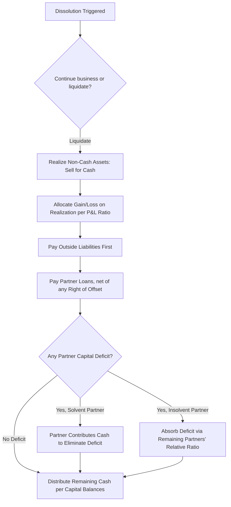

## Partnership Dissolution and Liquidation

<syllabot_broad_topic/>

### Overview

**Dissolution** is the legal termination of the partnership as an ongoing entity, triggered by events such as partner withdrawal, death, admission, bankruptcy, or mutual agreement — it does not necessarily mean the business stops operating (the remaining partners may continue under a reconstituted agreement). **Liquidation** is the process of winding up the business: converting (realizing) all assets to cash, paying liabilities, and distributing remaining cash to partners according to their capital balances. Liquidation always involves dissolution, but dissolution does not always lead to liquidation.

### Key Terminology

- **Realization**: Converting non-cash assets into cash through sale.
- **Gain/Loss on Realization**: Difference between sale proceeds and book value of assets sold; allocated to partners per the profit-and-loss (P&L) sharing ratio.
- **Capital Deficiency**: A partner's capital account balance becomes negative after absorbing losses.
- **Right of Offset**: A partner's loan account to the partnership can be offset against a debit (deficit) capital balance before requiring personal cash contribution.
- **Marshaling of Assets**: A legal doctrine governing the order in which partnership and personal creditors have claims against partnership and personal assets respectively.

### Priority of Claims Upon Liquidation (Statutory Order)

Under RUPA and most partnership statutes, liquidation proceeds are distributed in this priority:

1. Amounts owed to **creditors other than partners** (outside creditors) — including partnership liabilities.
2. Amounts owed to **partners other than for capital and profits** — e.g., partner loans to the partnership.
3. Amounts owed to partners in respect of **capital contributions**.
4. Amounts owed to partners in respect of **profits** (residual capital balances).

[Inference] Some jurisdictions and modern statutory frameworks (e.g., RUPA §807) have modified or eliminated the strict priority distinction between partner loans and partner capital, treating them together in certain circumstances — practitioners should confirm treatment under the specific governing statute and partnership agreement.

### Two Liquidation Methods

#### 1. Lump-Sum (Simple) Liquidation

All non-cash assets are converted to cash in a single, relatively short process (or treated as if realized at once for accounting purposes), liabilities are paid, and the remaining cash is distributed in one final distribution.

**Step Procedure**

1. Sell all non-cash assets; record gain/loss on realization.
2. Allocate gain/loss to partners per their P&L ratio.
3. Pay outside liabilities in full.
4. Pay partner loans (offsetting against any capital deficiency first, if applicable).
5. Distribute remaining cash per ending capital balances.
6. If any partner has a deficit capital balance after loss allocation, that partner must contribute personal cash; if unable to pay (insolvent), the deficiency is absorbed by the remaining partners in their *relative* P&L ratio.

**Example**

Partnership with partners X, Y, Z. Profit/loss ratio 50:30:20. Balance sheet prior to liquidation:

| Assets |  | Liabilities & Capital |  |
| --- | --- | --- | --- |
| Cash | 20,000 | Liabilities | 60,000 |
| Non-cash assets | 180,000 | X, Capital | 70,000 |
|  |  | Y, Capital | 50,000 |
|  |  | Z, Capital | 20,000 |
| **Total** | **200,000** | **Total** | **200,000** |

Non-cash assets are sold for $120,000 (a $60,000 loss).

$$\text{Loss Allocation: } X = 60{,}000 \times 0.50 = 30{,}000$$

$$Y = 60{,}000 \times 0.30 = 18{,}000 \qquad Z = 60{,}000 \times 0.20 = 12{,}000$$

Updated capital balances:

$$X = 70{,}000 - 30{,}000 = 40{,}000$$

$$Y = 50{,}000 - 18{,}000 = 32{,}000$$

$$Z = 20{,}000 - 12{,}000 = 8{,}000$$

Cash available = $20,000 (beginning) + $120,000 (sale proceeds) = $140,000. Pay liabilities $60,000, leaving $80,000 for partners, which exactly equals total remaining capital ($40,000 + $32,000 + $8,000 = $80,000) — no deficiency in this scenario.

**Final Distribution Schedule**

|  | X | Y | Z |
| --- | --- | --- | --- |
| Capital after loss allocation | 40,000 | 32,000 | 8,000 |
| Cash distribution | 40,000 | 32,000 | 8,000 |
| Remaining balance | 0 | 0 | 0 |

**Example — With Capital Deficiency (Solvent Partner)**

Same facts, but non-cash assets sell for only $60,000 (a $120,000 loss).

$$X = 120{,}000 \times 0.50 = 60{,}000 \qquad Y = 120{,}000 \times 0.30 = 36{,}000 \qquad Z = 120{,}000 \times 0.20 = 24{,}000$$

Updated capital:

$$X = 70{,}000 - 60{,}000 = 10{,}000$$

$$Y = 50{,}000 - 36{,}000 = 14{,}000$$

$$Z = 20{,}000 - 24{,}000 = -4{,}000 \text{ (deficiency)}$$

If Z is personally solvent and contributes $4,000 cash to eliminate the deficiency:

| Account | Debit | Credit |
| --- | --- | --- |
| Cash | 4,000 |  |
| Z, Capital |  | 4,000 |

Remaining cash ($20,000 + $60,000 + $4,000 − $60,000 liabilities = $24,000) is distributed: X = $10,000, Y = $14,000.

**Example — With Capital Deficiency (Insolvent Partner)**

If Z cannot pay the $4,000 deficiency (personally insolvent), it is absorbed by X and Y in their *relative* ratio (X:Y = 50:30, i.e., 62.5%:37.5%):

$$X\text{ absorbs} = 4{,}000 \times 0.625 = 2{,}500 \qquad Y\text{ absorbs} = 4{,}000 \times 0.375 = 1{,}500$$

| Account | Debit | Credit |
| --- | --- | --- |
| X, Capital | 2,500 |  |
| Y, Capital | 1,500 |  |
| Z, Capital |  | 4,000 |

Final distribution: X = $10,000 − $2,500 = $7,500; Y = $14,000 − $1,500 = $12,500.

#### 2. Installment Liquidation

Non-cash assets are sold gradually over time (often because a lump-sum sale is impractical), with cash distributed to partners periodically as it becomes available — *before* all assets are sold and *before* total gain/loss is known with certainty. This requires careful safeguards to avoid overpaying a partner who might later need to return cash if further losses materialize.

**Core Principle — Safe Payment Schedules**

Before each interim distribution, accountants prepare a **Schedule of Safe Payments** (or "cash predistribution plan") that assumes:

- All remaining non-cash assets are **worthless** (worst-case realization = $0).
- All partners with potential capital deficiencies are **personally insolvent** (worst case: their deficiency must be absorbed by others).

This ensures no partner receives more cash than they would be entitled to even under the worst possible outcome of future asset sales.

**Step Procedure for Schedule of Safe Payments**

1. Start with each partner's current capital balance (after any gains/losses already recognized and after adjusting for partner loans, which are typically combined with capital for this analysis).
2. Deduct each partner's share of *possible* further loss, assuming remaining assets are worthless — allocated per the full P&L ratio.
3. If this creates a hypothetical deficit for any partner, that deficit is reallocated to the remaining partners per their *relative* ratio (assuming the deficient partner is insolvent).
4. Repeat until no further deficits arise.
5. The resulting positive balances represent the *maximum safe cash* distributable to each partner at that point.

**Example — Schedule of Safe Payments**

Partners A, B, C share profits 40:35:25. Capital balances after first partial sale and loss allocation:

| Partner | Capital Balance |
| --- | --- |
| A | 45,000 |
| B | 30,000 |
| C | (5,000) — deficit |

Remaining non-cash assets (not yet sold) = $60,000 book value (assume potentially worthless for safe payment purposes — this is separate information not yet reflected in the balances above, illustrating step 2 conceptually).

**Step 1**: C already has a deficit of $5,000. Assuming C is insolvent, this is absorbed by A and B in their relative ratio (A:B = 40:35, i.e., 53.33%:46.67%):

$$A\text{ absorbs} = 5{,}000 \times 0.5333 = 2{,}667 \qquad B\text{ absorbs} = 5{,}000 \times 0.4667 = 2{,}333$$

**Schedule of Safe Payments**

|  | A | B | C |
| --- | --- | --- | --- |
| Capital balance | 45,000 | 30,000 | (5,000) |
| Allocate C's deficit (assumed insolvent) | (2,667) | (2,333) | 5,000 |
| **Safe payment amount** | **42,333** | **27,667** | **0** |

Available cash is distributed $42,333 to A and $27,667 to B; C receives nothing until sufficient future gains restore C's position, or C contributes personally.

**Example — Simplified Cash Distribution Plan (Alternative Technique)**

An alternative to recomputing a full safe-payment schedule at every cash availability point is to prepare, at the *outset* of liquidation, a **cash distribution plan (predistribution plan)** ranking which partner(s) receive the first dollars of liquidation cash, based on relative "loss absorption capacity" (capital balance ÷ P&L ratio percentage).

$$\text{Loss Absorption Capacity} = \frac{\text{Capital Balance}}{\text{P\&L Ratio \%}}$$

Using capital balances of $70,000 (X, 50%), $50,000 (Y, 30%), $20,000 (Z, 20%) from the earlier example:

$$X: \frac{70{,}000}{0.50} = 140{,}000 \qquad Y: \frac{50{,}000}{0.30} = 166{,}667 \qquad Z: \frac{20{,}000}{0.20} = 100{,}000$$

Ranking from highest to lowest loss absorption capacity: Y ($166,667) > X ($140,000) > Z ($100,000). This indicates Y can absorb the most losses before being wiped out, so Y is "first in line" to stop receiving new losses and would be prioritized to receive available cash first once liabilities are paid (with X joining next, then all three sharing once their capacities converge). This method predetermines the distribution priority without recalculating a full safe-payment schedule at each cash availability date. [Inference] The exact convergence-point mechanics and vulnerability rankings are a standard installment-liquidation technique, but the specific worked mechanics can vary somewhat by textbook presentation; the safe-payment-schedule method is the more universally taught and audit-verifiable approach.

### Right of Offset (Partner Loans)

If a partner has both a capital deficit and an outstanding loan receivable from the partnership (i.e., the partner had lent money to the firm), most jurisdictions permit offsetting the loan against the deficit before requiring a personal cash contribution.

**Example**

Partner Z has a capital deficit of $4,000 but also has a $6,000 loan account (partnership owes Z $6,000).

| Account | Debit | Credit |
| --- | --- | --- |
| Loan Payable to Z | 4,000 |  |
| Z, Capital |  | 4,000 |

Z's remaining loan balance of $2,000 is then paid in cash per the normal liability-priority order (partner loans typically rank just below outside liabilities).

### Marshaling of Assets Doctrine

When both the partnership and an individual partner are insolvent, marshaling of assets governs creditor priority:

- **Partnership creditors** have first claim on **partnership assets**; only the residual (if any) is available to partners, and only then can a partner's personal creditors reach that residual.
- **Personal creditors** of an individual partner have first claim on that **partner's personal (non-partnership) assets**; only the residual is available to partnership creditors.
- If a partner is personally insolvent and their separate creditors have exhausted personal assets, any unsatisfied claim generally cannot be pursued further against the partnership beyond that partner's own equity interest, and vice versa.

[Inference] The precise application of marshaling has been modified or superseded in some jurisdictions by amendments to the Uniform Partnership Act framework and bankruptcy code interactions; specific creditor-priority outcomes in real insolvency proceedings depend on the controlling statute and are typically resolved with legal counsel.

### Visual: Liquidation Process Flow

### Diagram: Lump-Sum vs. Installment Liquidation

<svg xmlns="http://www.w3.org/2000/svg" viewBox="0 0 640 240" font-family="Arial, sans-serif">
<text x="320" y="24" font-size="16" font-weight="bold" text-anchor="middle">Lump-Sum vs. Installment Liquidation (svg_diagram)</text>
<rect x="30" y="45" width="280" height="170" fill="#dcfce7" stroke="#15803d" rx="6" />
<text x="170" y="68" font-size="14" font-weight="bold" text-anchor="middle">Lump-Sum</text>
<text x="45" y="95" font-size="12">- Single realization event</text>
<text x="45" y="118" font-size="12">- Gain/loss known with certainty</text>
<text x="45" y="141" font-size="12">- One final cash distribution</text>
<text x="45" y="164" font-size="12">- Simpler; used when assets</text>
<text x="45" y="187" font-size="12"> can be sold quickly/together</text>
<rect x="330" y="45" width="280" height="170" fill="#fee2e2" stroke="#b91c1c" rx="6" />
<text x="470" y="68" font-size="14" font-weight="bold" text-anchor="middle">Installment</text>
<text x="345" y="95" font-size="12">- Multiple realization events</text>
<text x="345" y="118" font-size="12">- Future losses uncertain</text>
<text x="345" y="141" font-size="12">- Periodic interim distributions</text>
<text x="345" y="164" font-size="12">- Requires Safe Payment Schedule</text>
<text x="345" y="187" font-size="12"> or predistribution plan</text>
</svg>

### Common Pitfalls (Exam Focus)

- Distributing cash to partners before *outside* liabilities are fully paid — outside creditors always rank ahead of partners.
- Allocating a capital deficiency using the *original* full P&L ratio instead of the *relative* ratio among the remaining (non-deficient) partners.
- Forgetting to apply the right of offset against a partner loan before demanding personal cash contribution from a deficient partner.
- In installment liquidations, distributing cash based on *current* capital balances alone without preparing a safe payment schedule — this risks overpaying a partner who later cannot return funds if further losses arise.
- Confusing loss absorption capacity ranking (used to predetermine distribution priority) with the final safe-payment calculation — the two techniques are complementary but computed differently.
- Assuming dissolution automatically means the business closes — dissolution is a legal/technical event; liquidation is the actual winding-up decision.

**Related Topics**

- Allocation of profits, losses, and special allocations
- Admission and withdrawal of partners
- Corporate liquidation and bankruptcy accounting (Chapter 7 vs. Chapter 11 contexts)
- Statement of partnership realization and liquidation (formal financial statement)
- Marshaling of assets and creditor priority under bankruptcy law
- Joint and several liability of general partners