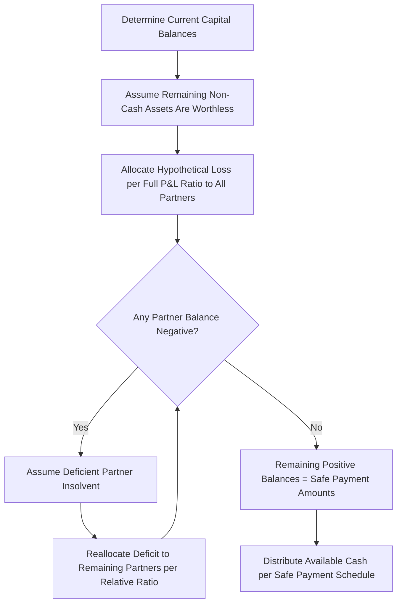

## Schedule of Safe Payments and Installment Liquidation

### Overview

Installment liquidation occurs when partnership assets are converted to cash over an extended period rather than all at once, requiring interim cash distributions to partners *before* the total gain or loss on realization is known. Because future asset sales carry uncertainty, distributing cash based purely on current capital balances risks overpaying a partner who might later need to return funds. The **Schedule of Safe Payments** is the formal technique used to determine the maximum amount that can safely be distributed to each partner at each interim point, without risk of that partner later owing money back to the partnership.

### Core Principle

Before each interim distribution, the accountant tests each partner's position under a **worst-case assumption**:

1. All remaining unsold non-cash assets are assumed to be **completely worthless** (realize $0).
2. Any partner whose capital balance would go negative under that worst case is assumed to be **personally insolvent** and unable to reimburse the partnership.

Only the amount that survives this stress test is "safe" to distribute. This conservative approach protects both the remaining partners and outside creditors from a scenario where a partner receives cash early and cannot return it if additional losses are realized later.

### Step-by-Step Procedure

1. **Determine current capital balances** after recording all gains/losses recognized to date (from assets already sold) and after combining partner loan balances with capital balances (right of offset applied conceptually for this analysis).
2. **Deduct potential loss on remaining assets**: Allocate the full book value of unsold non-cash assets as a hypothetical total loss, split among *all* partners per the full profit-and-loss (P&L) ratio.
3. **Deduct potential liquidation expenses**: If estimated future liquidation costs exist, allocate these as an additional hypothetical loss per the P&L ratio.
4. **Identify resulting deficits**: If any partner's adjusted balance is negative, assume that partner is insolvent.
5. **Reallocate deficits**: Push the deficient partner's negative balance to the remaining (non-deficient) partners, in their *relative* P&L ratio (excluding the deficient partner).
6. **Repeat steps 4–5** iteratively until no partner shows a negative balance — this may require multiple passes if reallocation itself creates a new deficit for another partner.
7. **Remaining positive balances** represent the maximum safe payment to each partner at that point in time.

### Comprehensive Example

Partnership DEF: partners D, E, F share profits and losses 50:30:20. After the first partial sale of assets, the balance sheet shows:

| Assets |  | Liabilities & Capital |  |
| --- | --- | --- | --- |
| Cash | 90,000 | Liabilities | 30,000 |
| Non-cash assets (unsold) | 100,000 | D, Capital | 80,000 |
|  |  | E, Capital | 60,000 |
|  |  | F, Capital | 20,000 |
| **Total** | **190,000** | **Total** | **190,000** |

Outside liabilities of $30,000 are paid in full first, leaving $60,000 cash available for distribution. $100,000 of non-cash assets remain unsold.

**Step 1 — Current Capital Balances (after liabilities paid)**

|  | D | E | F |
| --- | --- | --- | --- |
| Capital balance | 80,000 | 60,000 | 20,000 |

**Step 2 — Assume Remaining Assets Worthless ($100,000 hypothetical loss)**

Allocated per P&L ratio (50:30:20):

$$D = 100{,}000 \times 0.50 = 50{,}000$$

$$E = 100{,}000 \times 0.30 = 30{,}000$$

$$F = 100{,}000 \times 0.20 = 20{,}000$$

**Step 3 — Adjusted Balances**

|  | D | E | F |
| --- | --- | --- | --- |
| Capital balance | 80,000 | 60,000 | 20,000 |
| Assumed loss on remaining assets | (50,000) | (30,000) | (20,000) |
| **Adjusted (safe) balance** | **30,000** | **30,000** | **0** |

No partner shows a deficit in this pass, so the schedule is complete. **Safe payments**: D receives $30,000, E receives $30,000, F receives $0. Total distributed = $60,000 (matches available cash).

### Example with Multi-Round Deficiency Reallocation

Using the same partnership and ratios, suppose instead the unsold non-cash assets have a book value of $140,000 (a larger hypothetical loss).

**Step 2 — Hypothetical Loss Allocation**

$$D = 140{,}000 \times 0.50 = 70{,}000 \qquad E = 140{,}000 \times 0.30 = 42{,}000 \qquad F = 140{,}000 \times 0.20 = 28{,}000$$

**Step 3 — First-Pass Adjusted Balances**

|  | D | E | F |
| --- | --- | --- | --- |
| Capital balance | 80,000 | 60,000 | 20,000 |
| Assumed loss on remaining assets | (70,000) | (42,000) | (28,000) |
| **Subtotal** | **10,000** | **18,000** | **(8,000)** |

F shows a deficit of $8,000. Assuming F is insolvent, this deficit is reallocated to D and E per their *relative* ratio (D:E = 50:30, i.e., 62.5%:37.5%):

$$D\text{ absorbs} = 8{,}000 \times 0.625 = 5{,}000 \qquad E\text{ absorbs} = 8{,}000 \times 0.375 = 3{,}000$$

**Step 4 — Second-Pass Adjusted Balances**

|  | D | E | F |
| --- | --- | --- | --- |
| Subtotal | 10,000 | 18,000 | (8,000) |
| Reallocate F's deficit | (5,000) | (3,000) | 8,000 |
| **Safe payment amount** | **5,000** | **15,000** | **0** |

No further deficits arise, so the schedule is final. **Safe payments**: D = $5,000, E = $15,000, F = $0. Total = $20,000 (the cash available after liabilities in this variant).

**Verification check**: The reallocation process must always sum to zero across the deficient partner's adjustment (the $8,000 removed from F is exactly absorbed by D and E), and the final safe payments must sum to total cash available for distribution.

### Example Requiring Two Iterations of Deficiency Cascading

A more complex case can arise where reallocating one partner's deficit creates a *new* deficit for another partner, requiring a further iteration.

Partners G, H, I share profits 60:25:15. Adjusted balances after assuming all remaining assets worthless:

|  | G | H | I |
| --- | --- | --- | --- |
| Adjusted subtotal | 12,000 | 3,000 | (9,000) |

**Iteration 1**: I's $9,000 deficit is reallocated to G and H per relative ratio (60:25, i.e., 70.59%:29.41%):

$$G\text{ absorbs} = 9{,}000 \times 0.7059 \approx 6{,}353 \qquad H\text{ absorbs} = 9{,}000 \times 0.2941 \approx 2{,}647$$

Updated:

|  | G | H | I |
| --- | --- | --- | --- |
| Subtotal | 12,000 | 3,000 | (9,000) |
| Reallocate I's deficit | (6,353) | (2,647) | 9,000 |
| **New subtotal** | **5,647** | **353** | **0** |

Both G and H remain positive, so no further iteration is needed. **Safe payments**: G = $5,647, H = $353, I = $0.

[Inference] Had H's absorbed share instead pushed H negative, the process would iterate again — reallocating H's new deficit entirely to G (the only remaining partner) — until all balances are non-negative. This cascading mechanic is a standard, well-documented feature of the safe payment schedule technique, though the number of iterations required depends entirely on the specific numbers in a given problem.

### Handling Partner Loans in Installment Liquidation

Partner loans to the partnership are generally combined with that partner's capital account for purposes of the safe payment schedule (applying the right of offset), since a loan effectively increases that partner's total claim but is also available to absorb losses before requiring personal cash contribution.

**Example**

If F in the earlier example also had a $5,000 loan to the partnership, F's combined interest for safe-payment purposes = $20,000 capital + $5,000 loan = $25,000, and this combined figure is what gets reduced by F's hypothetical loss share before any deficiency is assessed.

### Cash Distribution Plan (Predistribution Plan) — Alternative/Complementary Technique

Rather than recomputing a full safe payment schedule at every cash availability date, some practitioners prepare a **cash distribution plan** at the *outset* of liquidation, ranking partners by **loss absorption capacity (LAC)**:

$$\text{LAC} = \frac{\text{Partner's Capital Balance}}{\text{Partner's P\&L Ratio \%}}$$

The partner with the highest LAC can sustain the most losses before their capital is exhausted and is therefore prioritized to receive the first available cash (since they are "furthest" from a deficit). As successive tranches of cash become available, lower-LAC partners are brought into the distribution once the higher-LAC partners' capacities converge to the same level.

**Example**

Using D, E, F (capital $80,000, $60,000, $20,000; ratio 50:30:20):

$$\text{LAC}_D = \frac{80{,}000}{0.50} = 160{,}000 \qquad \text{LAC}_E = \frac{60{,}000}{0.30} = 200{,}000 \qquad \text{LAC}_F = \frac{20{,}000}{0.20} = 100{,}000$$

Ranking (highest to lowest): E ($200,000) > D ($160,000) > F ($100,000). This means F is "closest" to a deficit and should be brought current first if cash is limited, while E can absorb the most additional losses and would be last to receive priority — the plan effectively predetermines who gets paid first without recalculating a full safe-payment schedule each time. [Inference] The precise step-by-step construction of a full predistribution plan (calculating exact convergence points between each pair of partners) varies in presentation across textbooks; the schedule of safe payments (computed fresh at each distribution date) is the more universally examinable and audit-transparent method, while the LAC-ranking approach is often taught as a conceptual/planning complement rather than a replacement.

### Formal Statement Presentation

A **Statement of Partnership Liquidation** (or Realization and Liquidation Statement) is typically prepared showing, period by period: beginning balances, asset realizations (cash received, gain/loss), liability payments, safe payment distributions, and ending balances — serving as the formal audit trail supporting each interim distribution decision.

### Visual: Safe Payment Schedule Logic

### Diagram: Safe Payment Concept

<svg xmlns="http://www.w3.org/2000/svg" viewBox="0 0 640 260" font-family="Arial, sans-serif">
<text x="320" y="24" font-size="16" font-weight="bold" text-anchor="middle">Safe Payment Stress Test (svg_diagram)</text>
<rect x="40" y="50" width="560" height="50" fill="#e0f2fe" stroke="#0369a1" />
<text x="320" y="80" font-size="13" text-anchor="middle">Current Capital Balance (after liabilities paid, loans combined)</text>
<text x="320" y="112" font-size="20" text-anchor="middle">↓ minus</text>
<rect x="40" y="125" width="560" height="50" fill="#fee2e2" stroke="#b91c1c" />
<text x="320" y="155" font-size="13" text-anchor="middle">Worst-Case Assumption: Remaining Assets = \$0, Deficient Partners = Insolvent</text>
<text x="320" y="187" font-size="20" text-anchor="middle">↓ equals</text>
<rect x="40" y="200" width="560" height="50" fill="#dcfce7" stroke="#15803d" />
<text x="320" y="230" font-size="13" text-anchor="middle">Maximum Safe Cash Distribution per Partner</text>
</svg>

### Common Pitfalls (Exam Focus)

- Allocating a hypothetical deficit using the *original* full P&L ratio instead of the *relative* ratio among the remaining, non-deficient partners.
- Stopping after one reallocation pass when a second (or further) iteration is actually required because reallocation pushed another partner negative.
- Forgetting to net partner loans against capital balances before running the safe payment test.
- Distributing cash strictly according to *current* capital balances (ignoring the worst-case assumption), which risks a partner receiving more than their ultimate entitlement.
- Confusing the loss absorption capacity ranking (a planning tool) with the safe payment schedule itself (the actual distribution-determining computation) — LAC ranking does not replace the need to verify safe amounts at each cash availability date.
- Failing to reconcile that the sum of all safe payments must equal the total cash actually available for distribution at that point.

**Related Topics**

- Partnership dissolution and liquidation (lump-sum method)
- Allocation of profits, losses, and special allocations
- Admission and withdrawal of partners
- Marshaling of assets and creditor priority
- Statement of partnership realization and liquidation
- Right of offset for partner loans