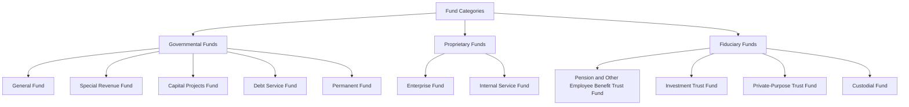

## Fund Accounting Structure and Fund Types

### Overview

Governmental accounting departs fundamentally from commercial (business) accounting because governments are not profit-oriented; their primary objective is public accountability for the use of restricted resources rather than measurement of net income. **Fund accounting** achieves this by segregating financial resources into distinct self-balancing sets of accounts, each dedicated to specific activities or objectives in accordance with legal or administrative restrictions. In the United States, this framework is codified by the **Governmental Accounting Standards Board (GASB)**, with GASB Statement No. 34 (and its successors, including GASB 84 and GASB 87 for more recent refinements) establishing the modern reporting model.

### Definition of a Fund

A **fund** is a fiscal and accounting entity with a self-balancing set of accounts recording cash and other financial resources, together with all related liabilities and residual equities or balances, and changes therein, segregated for the purpose of carrying on specific activities or attaining certain objectives in accordance with special regulations, restrictions, or limitations.

### The Three Fund Categories

GASB organizes all funds into three broad categories, further divided into eleven fund types:

### 1. Governmental Funds

Governmental funds account for the government's basic services financed primarily through taxes, grants, and similar non-exchange revenues. They use the **modified accrual basis of accounting** and the **current financial resources measurement focus**, meaning revenues are recognized when *measurable and available* (typically collectible within 60 days of period-end, per common GASB implementation guidance), and expenditures are recognized when the related liability is incurred, with some exceptions (e.g., long-term debt principal and interest recorded when due, not accrued).

#### General Fund

Accounts for all financial resources not required to be accounted for in another fund. Every government has exactly **one** General Fund, and it typically reports the government's core operations — police, fire, general administration, parks, and similar services.

**Key Points**

- The default/residual fund; used unless a resource is legally or administratively restricted to another fund.
- Financed by general tax revenues (property tax, sales tax, income tax) and unrestricted intergovernmental revenue.
- Reports the largest and most significant fund for most municipalities; typically presented as a major fund by default under GASB rules.

#### Special Revenue Fund

Accounts for the proceeds of specific revenue sources that are restricted or committed to expenditure for specified purposes *other than* debt service or capital projects (e.g., a fund for a dedicated gasoline tax restricted to road maintenance, or a grant fund restricted to a specific program).

**Example**

A city receives a $500,000 state grant restricted exclusively to library operations. This is recorded in a Special Revenue Fund rather than the General Fund because of the legal restriction on use.

#### Capital Projects Fund

Accounts for financial resources restricted, committed, or assigned for the acquisition or construction of major capital facilities (other than those financed by proprietary funds or trust funds for beneficiaries). Typically funded by bond proceeds, grants, or transfers from other funds.

**Example**

A county issues $10 million in general obligation bonds to construct a new courthouse. The bond proceeds and related construction expenditures flow through a Capital Projects Fund; the fund is typically closed out once the project is complete.

#### Debt Service Fund

Accounts for the accumulation of resources for, and the payment of, general long-term debt principal and interest (other than debt serviced by proprietary or fiduciary funds).

**Example**

Property tax revenue specifically levied to fund bond principal and interest payments is recorded in the Debt Service Fund, with expenditures recognized when the debt service payment is legally due, not on an accrual basis.

#### Permanent Fund

Accounts for resources that are legally restricted such that only the **earnings**, not the principal, may be used to support the government's programs (i.e., for the benefit of the government or its citizenry, as opposed to private individuals — which would instead be a Private-Purpose Trust Fund).

**Example**

A cemetery perpetual-care endowment where the principal ($1,000,000) must remain intact permanently, but investment earnings are used annually to fund cemetery upkeep — this is a Permanent Fund because the beneficiary is the government/public, not a private party.

### 2. Proprietary Funds

Proprietary funds account for government activities that are similar to private-sector business operations — financed and operated in a manner similar to a commercial enterprise, often through user charges. They use the **full accrual basis of accounting** and the **economic resources measurement focus**, closely resembling commercial (GAAP-based) financial statements, including reporting of long-term assets, long-term liabilities, and depreciation.

#### Enterprise Fund

Used to account for operations financed and operated similarly to private business enterprises where the intent is that costs of providing goods/services to the public be financed primarily through user charges, or where laws/regulations require periodic determination of revenues earned, expenses incurred, and/or net income.

**Key Points**

- Mandatory use when debt is backed solely by fee revenue, or when legally required, or when a determination of cost recovery via fees is a policy requirement.
- Common examples: water/sewer utilities, public transit systems, municipal airports, golf courses, public hospitals.

**Example**

A city's water utility bills customers for usage, incurs operating expenses (treatment, distribution, salaries), records depreciation on infrastructure, and reports a Statement of Net Position and Statement of Revenues, Expenses, and Changes in Net Position — formats very similar to a commercial enterprise's balance sheet and income statement.

#### Internal Service Fund

Accounts for the financing of goods or services provided by one department or agency to other departments or agencies of the government (or to other governments), on a cost-reimbursement basis.

**Example**

A city operates a central motor pool that services and fuels vehicles for the police, fire, and public works departments, charging each department an internal fee based on usage. This fee-for-service internal activity is recorded in an Internal Service Fund.

**Distinction**: An Enterprise Fund serves *external* customers (the public); an Internal Service Fund serves *internal* customers (other government departments).

### 3. Fiduciary Funds

Fiduciary funds account for resources held by the government in a trustee or agency capacity for others, and therefore *cannot* be used to support the government's own programs. GASB Statement No. 84 (Fiduciary Activities) substantially refined the criteria for what qualifies as a fiduciary activity and reorganized this category. Fiduciary funds use the **full accrual basis** and **economic resources measurement focus** (with the exception of custodial funds, which have a more limited earnings/investment activity).

#### Pension (and Other Employee Benefit) Trust Fund

Accounts for resources held in trust for members and beneficiaries of defined benefit pension plans, defined contribution plans, or other postemployment benefit (OPEB) plans administered by the government.

#### Investment Trust Fund

Accounts for the external portion of investment pools reported by the sponsoring government (i.e., resources belonging to other, legally separate governments that participate in an investment pool managed by the reporting government).

#### Private-Purpose Trust Fund

Accounts for trust arrangements where both principal and income benefit individuals, private organizations, or other governments — not the reporting government's own programs.

**Example**

A scholarship trust fund where a donor's gift principal and investment earnings benefit specific private individual students (not the school district's own general operations) is a Private-Purpose Trust Fund.

#### Custodial Fund

Introduced by GASB 84 to replace most of what was formerly called an "Agency Fund." Accounts for resources held briefly in a purely custodial (agency) capacity, involving no material administrative or direct financial involvement by the government (e.g., collecting taxes on behalf of another government and remitting them, or holding refundable deposits).

**Example**

A county government collects property taxes on behalf of overlapping jurisdictions (school district, city, special districts) and remits the appropriate shares. Because the county's role is purely custodial (collect and pass through), this activity is recorded in a Custodial Fund.

### Measurement Focus and Basis of Accounting Summary

| Fund Category | Measurement Focus | Basis of Accounting |
| --- | --- | --- |
| Governmental Funds | Current financial resources | Modified accrual |
| Proprietary Funds | Economic resources | Full accrual |
| Fiduciary Funds | Economic resources | Full accrual |

### Fund Financial Statements vs. Government-Wide Statements

Under the GASB 34 reporting model, governments prepare **two levels** of financial statements:

1. **Fund financial statements**: Present governmental, proprietary, and fiduciary funds separately, using each category's respective measurement focus and basis of accounting (as above). Major funds are presented individually; non-major funds are aggregated in a single column.
2. **Government-wide financial statements**: Present the government as a whole (excluding fiduciary funds, since those resources are not available to support the government's own activities), using full accrual accounting and the economic resources measurement focus across two columns — **Governmental Activities** and **Business-Type Activities** — plus discretely presented component units if applicable.

**Reconciliation**: Because governmental fund financial statements use modified accrual accounting while government-wide statements use full accrual, GASB requires a formal reconciliation (typically presented at the bottom of the fund statements or in a separate schedule) explaining differences such as capital asset capitalization/depreciation, long-term debt principal, and revenue recognition timing differences.

### Major Fund Determination

GASB establishes quantitative criteria for identifying **major funds** that must be presented in a separate column (rather than aggregated with "other governmental/enterprise funds"). A fund is major if it meets **both** of the following tests:

1. Total assets, liabilities, revenues, or expenditures/expenses of the fund are at least **10%** of the corresponding total for all funds of that category (governmental or enterprise, tested separately).
2. The same element is at least **5%** of the corresponding total for all governmental *and* enterprise funds combined.

The General Fund is *always* reported as major, regardless of whether it meets these tests. Governments may also elect to report any other fund as major if considered particularly important to financial statement users, even if it does not meet the quantitative thresholds.

### Diagram: Fund Category Comparison

<svg xmlns="http://www.w3.org/2000/svg" viewBox="0 0 640 280" font-family="Arial, sans-serif">
<text x="320" y="24" font-size="16" font-weight="bold" text-anchor="middle">Fund Category Comparison (svg_diagram)</text>
<rect x="15" y="45" width="195" height="210" fill="#dbeafe" stroke="#1e40af" rx="6" />
<text x="112" y="68" font-size="13" font-weight="bold" text-anchor="middle">Governmental</text>
<text x="25" y="92" font-size="11">Modified accrual</text>
<text x="25" y="112" font-size="11">Current financial</text>
<text x="25" y="128" font-size="11">resources focus</text>
<text x="25" y="152" font-size="11">General, Special Rev,</text>
<text x="25" y="168" font-size="11">Capital Proj, Debt Svc,</text>
<text x="25" y="184" font-size="11">Permanent</text>
<text x="25" y="212" font-size="11">Tax-supported</text>
<text x="25" y="228" font-size="11">core services</text>
<rect x="222" y="45" width="195" height="210" fill="#dcfce7" stroke="#15803d" rx="6" />
<text x="319" y="68" font-size="13" font-weight="bold" text-anchor="middle">Proprietary</text>
<text x="232" y="92" font-size="11">Full accrual</text>
<text x="232" y="112" font-size="11">Economic resources</text>
<text x="232" y="128" font-size="11">focus</text>
<text x="232" y="152" font-size="11">Enterprise,</text>
<text x="232" y="168" font-size="11">Internal Service</text>
<text x="232" y="212" font-size="11">Business-type,</text>
<text x="232" y="228" font-size="11">fee-supported</text>
<rect x="430" y="45" width="195" height="210" fill="#fef3c7" stroke="#b45309" rx="6" />
<text x="527" y="68" font-size="13" font-weight="bold" text-anchor="middle">Fiduciary</text>
<text x="440" y="92" font-size="11">Full accrual</text>
<text x="440" y="112" font-size="11">Economic resources</text>
<text x="440" y="128" font-size="11">focus (mostly)</text>
<text x="440" y="152" font-size="11">Pension, Investment,</text>
<text x="440" y="168" font-size="11">Private-Purpose Trust,</text>
<text x="440" y="184" font-size="11">Custodial</text>
<text x="440" y="212" font-size="11">Held for others;</text>
<text x="440" y="228" font-size="11">excluded from</text>
<text x="440" y="244" font-size="11">govt-wide stmts</text>
</svg>

### Common Pitfalls (Exam Focus)

- Confusing an Enterprise Fund (serves external/public customers) with an Internal Service Fund (serves internal government departments).
- Applying modified accrual accounting to proprietary or fiduciary funds — only governmental funds use modified accrual.
- Forgetting that fiduciary funds are **excluded** from government-wide financial statements because those resources cannot be used for the government's own programs.
- Misclassifying a restricted-principal, restricted-earnings-use fund: if earnings benefit the government/public, it is a Permanent Fund; if earnings benefit private individuals, it is a Private-Purpose Trust Fund.
- Treating the 10%/5% major fund test as an "either/or" — both thresholds must be satisfied for a fund to be classified as major (except the General Fund, which is always major).
- Forgetting that Custodial Funds (post-GASB 84) apply to purely pass-through custodial activity, whereas activities involving more government discretion or administrative involvement may no longer qualify as fiduciary at all.

**Related Topics**

- Modified accrual vs. full accrual accounting in governmental funds
- Government-wide financial statements and the GASB 34 reporting model
- Budgetary accounting and encumbrances
- Capital assets and infrastructure reporting (including modified approach)
- Interfund transactions and transfers
- Component units and the financial reporting entity