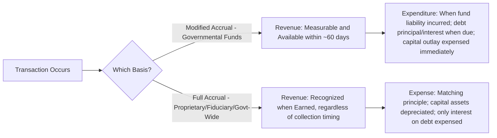

## Modified Accrual versus Full Accrual Basis of Accounting

### Overview

Governmental accounting employs two distinct bases of accounting depending on the fund category being reported: **modified accrual** for governmental funds and **full accrual** for proprietary and fiduciary funds, as well as for government-wide financial statements. The two bases differ primarily in *when* revenues and expenditures/expenses are recognized, reflecting the different purposes each fund category serves — governmental funds emphasize short-term fiscal accountability (was there enough current-period resources to cover current-period obligations), while proprietary/fiduciary funds and government-wide statements emphasize long-term economic accountability (is the entity's overall net position improving or deteriorating).

### Measurement Focus Comparison

| Aspect | Modified Accrual (Governmental Funds) | Full Accrual (Proprietary/Fiduciary/Government-Wide) |
| --- | --- | --- |
| Measurement focus | Current financial resources | Economic resources |
| Revenue recognition | When measurable and available | When earned, regardless of timing of cash receipt |
| Expenditure/expense recognition | When the related fund liability is incurred (with exceptions) | When the related liability is incurred (matching principle) |
| Capital assets | Not reported as assets in the fund; recorded as an expenditure at acquisition | Capitalized and depreciated over useful life |
| Long-term debt | Not reported as a fund liability; proceeds recorded as an "other financing source," principal payments as expenditures | Reported as a long-term liability; only interest accrued as expense |
| Depreciation | Not recorded | Recorded systematically over asset useful life |
| Inventories/prepaids | May use purchases or consumption method | Consumption method (asset until used) |

### Modified Accrual Basis — Detailed Mechanics

#### Revenue Recognition: "Measurable and Available"

Under modified accrual, revenue is recognized when it is both:

1. **Measurable**: The amount can be reasonably estimated.
2. **Available**: Collectible within the current period or soon enough thereafter to pay liabilities of the current period. GASB does not mandate a single bright-line period, but many governments adopt a **60-day** availability window as a common policy convention for property tax and similar revenues, disclosed in their significant accounting policies.

**Example — Property Tax Revenue**

A city levies $5,000,000 in property taxes for fiscal year 2026, due January 1, 2026. By the fiscal year-end (December 31, 2026), $4,700,000 has been collected, and $200,000 of the remaining $300,000 is expected to be collected within 60 days (by early March 2027); $100,000 is expected to be collected later or is estimated uncollectible.

$$\text{Revenue Recognized} = 4{,}700{,}000 + 200{,}000 = 4{,}900{,}000$$

The remaining $100,000 is recorded as **deferred inflows of resources** (not revenue) until it becomes available, since it fails the "available" criterion.

| Account | Debit | Credit |
| --- | --- | --- |
| Property Taxes Receivable | 5,000,000 |  |
| Allowance for Uncollectible Taxes |  | (estimated, per separate analysis) |
| Property Tax Revenue |  | 4,900,000 |
| Deferred Inflows of Resources |  | 100,000 |

#### Expenditure Recognition

Expenditures are generally recognized when the related fund liability is incurred, similar in spirit to accrual, but with important **exceptions** unique to governmental funds:

- **Debt service (principal and interest)**: Recognized as an expenditure only when *legally due* (i.e., on the payment date), not accrued ratably over the period as interest accrues economically.
- **Compensated absences, claims and judgments, and similar long-term liabilities**: Recognized as expenditures only to the extent they are normally expected to be liquidated with expendable available financial resources (i.e., the current-period portion), with the long-term portion deferred to the government-wide level.
- **Capital outlay**: The full purchase cost is recorded as an expenditure in the period of acquisition (not capitalized and depreciated within the fund).

**Example — Capital Asset Purchase**

A city's General Fund purchases a fire truck for $300,000 cash.

| Account | Debit | Credit |
| --- | --- | --- |
| Expenditures — Capital Outlay | 300,000 |  |
| Cash |  | 300,000 |

No asset is recorded in the fund; the entire $300,000 is expensed immediately as an expenditure in the fund financial statements. (At the government-wide level, this same transaction is instead capitalized as a capital asset and depreciated — see reconciliation below.)

**Example — Bond Principal and Interest**

A Debt Service Fund pays $400,000 in bond principal and $150,000 in interest, both due on the payment date within the fiscal year.

| Account | Debit | Credit |
| --- | --- | --- |
| Expenditures — Debt Service, Principal | 400,000 |  |
| Expenditures — Debt Service, Interest | 150,000 |  |
| Cash |  | 550,000 |

Even if additional interest has economically accrued for a few days between the last payment and year-end, it is *not* accrued as a fund expenditure unless a payment is legally due within an early portion of the next period per GASB's limited exception for debt service funds.

### Full Accrual Basis — Detailed Mechanics

#### Revenue Recognition

Revenue is recognized when earned, consistent with commercial accounting principles — for exchange transactions, when goods/services are delivered; for non-exchange transactions (taxes, grants), per the specific GASB non-exchange revenue recognition criteria (time requirements, purpose restrictions, eligibility requirements), without regard to the "available" (collectibility timing) criterion used in modified accrual.

**Example — Enterprise Fund (Water Utility)**

The water utility bills $80,000 for water usage in December, collected in January of the following year. Under full accrual, revenue is recognized in December regardless of when cash is collected.

| Account | Debit | Credit |
| --- | --- | --- |
| Accounts Receivable | 80,000 |  |
| Water Sales Revenue |  | 80,000 |

#### Expense Recognition and Capitalization

- **Capital assets** are capitalized at acquisition and depreciated systematically over their useful lives.
- **Long-term debt** is recorded as a liability on the statement of net position; only interest expense (accrued using the effective interest method or straight-line, as applicable) is recognized as an expense during the period, not the principal repayment.

**Example — Same Fire Truck, Enterprise Fund Context**

If instead purchased by an Enterprise Fund (e.g., a municipal utility), the fire truck (or comparable equipment) would be capitalized:

| Account | Debit | Credit |
| --- | --- | --- |
| Equipment | 300,000 |  |
| Cash |  | 300,000 |

Followed by periodic depreciation (assuming a 10-year useful life, straight-line):

$$\text{Annual Depreciation} = \frac{300{,}000}{10} = 30{,}000$$

| Account | Debit | Credit |
| --- | --- | --- |
| Depreciation Expense | 30,000 |  |
| Accumulated Depreciation |  | 30,000 |

### Reconciliation Between Fund Statements and Government-Wide Statements

Because governmental fund financial statements use modified accrual while government-wide statements use full accrual, GASB requires a formal reconciliation of (a) the governmental funds' balance sheet to the government-wide statement of net position, and (b) the governmental funds' statement of revenues, expenditures, and changes in fund balances to the government-wide statement of activities.

**Common Reconciling Items**

| Reconciling Item | Effect |
| --- | --- |
| Capital assets (net of accumulated depreciation) not reported in governmental funds | Increases net position |
| Long-term liabilities (bonds payable, compensated absences long-term portion) not reported in governmental funds | Decreases net position |
| Current-year capital outlay expenditures | Added back (removed from expenditures; asset capitalized instead) |
| Current-year depreciation expense | Subtracted (not recorded as a fund expenditure) |
| Bond proceeds recorded as "other financing sources" in funds | Removed from revenues (recorded as a liability instead) |
| Bond principal repayments recorded as expenditures in funds | Removed from expenditures (reduces the liability instead) |
| Revenues recognized in government-wide statements but deferred (unavailable) in fund statements | Added to revenue |

**Example — Simplified Reconciliation Excerpt**

|  | Amount |
| --- | --- |
| Net change in fund balances — governmental funds | 250,000 |
| Add: Capital outlay expenditures (capitalized, not expensed, at government-wide level) | 300,000 |
| Less: Depreciation expense on capital assets | (30,000) |
| Less: Bond proceeds (recorded as other financing source in funds, but a liability government-wide) | (500,000) |
| Add: Bond principal repayment (expenditure in funds, reduces liability government-wide) | 400,000 |
| **Change in net position — governmental activities** | **420,000** |

### Visual: Recognition Timing Comparison

### Diagram: Side-by-Side Basis Comparison

<svg xmlns="http://www.w3.org/2000/svg" viewBox="0 0 640 260" font-family="Arial, sans-serif">
<text x="320" y="24" font-size="16" font-weight="bold" text-anchor="middle">Modified Accrual vs. Full Accrual (svg_diagram)</text>
<rect x="30" y="45" width="280" height="195" fill="#fef3c7" stroke="#b45309" rx="6" />
<text x="170" y="68" font-size="14" font-weight="bold" text-anchor="middle">Modified Accrual</text>
<text x="45" y="95" font-size="12">- Governmental funds only</text>
<text x="45" y="118" font-size="12">- Current financial resources</text>
<text x="45" y="141" font-size="12">- Revenue: measurable + available</text>
<text x="45" y="164" font-size="12">- Capital outlay expensed fully</text>
<text x="45" y="187" font-size="12">- No depreciation recorded</text>
<text x="45" y="210" font-size="12">- Debt principal = expenditure</text>
<text x="45" y="233" font-size="12"> when legally due</text>
<rect x="330" y="45" width="280" height="195" fill="#dbeafe" stroke="#1e40af" rx="6" />
<text x="470" y="68" font-size="14" font-weight="bold" text-anchor="middle">Full Accrual</text>
<text x="345" y="95" font-size="12">- Proprietary, fiduciary,</text>
<text x="345" y="118" font-size="12"> government-wide statements</text>
<text x="345" y="141" font-size="12">- Economic resources focus</text>
<text x="345" y="164" font-size="12">- Capital assets capitalized</text>
<text x="345" y="187" font-size="12">- Depreciation recorded</text>
<text x="345" y="210" font-size="12">- Debt = long-term liability;</text>
<text x="345" y="233" font-size="12"> only interest expensed</text>
</svg>

### Common Pitfalls (Exam Focus)

- Recording capital asset purchases as assets within a governmental fund's own fund-level statements — under modified accrual, they are expenditures (capitalization occurs only in the government-wide conversion).
- Accruing bond interest expense in a Debt Service Fund the way one would under full accrual — modified accrual generally recognizes debt service only when legally due, subject to limited early-due-date exceptions.
- Forgetting the "available" criterion for revenue recognition — an amount can be fully measurable (a receivable clearly exists) yet still not qualify as revenue under modified accrual if it will not be collected soon enough to pay current liabilities.
- Omitting the required reconciliation between fund-level and government-wide statements, or getting reconciling items backward (e.g., adding instead of subtracting depreciation).
- Applying modified accrual concepts (like the 60-day availability rule) to proprietary or fiduciary funds, which use full accrual and are not subject to that test.
- Treating bond proceeds as revenue in governmental funds — they are properly classified as an "other financing source," not revenue, even though both increase fund balance.

**Related Topics**

- Fund accounting structure and fund types
- Government-wide financial statements and the GASB 34 reporting model
- Budgetary accounting and encumbrances
- Capital assets and infrastructure reporting (including the modified approach)
- Non-exchange revenue recognition criteria (GASB 33)
- Interfund transactions, transfers, and reimbursements