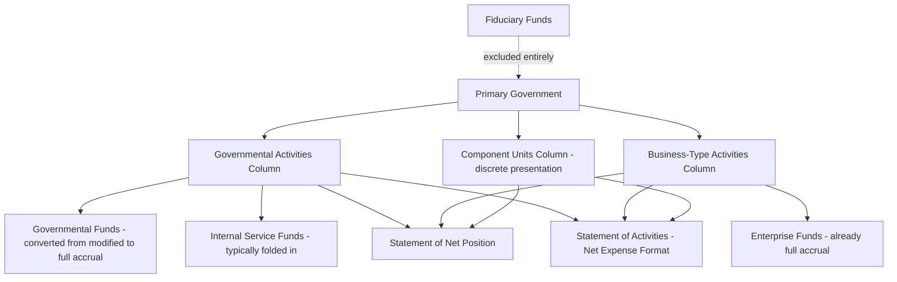

## Government-Wide Financial Statements

<syllabot_broad_topic/>

### Overview

Government-wide financial statements present the financial position and results of operations of a government as a single, unified economic entity, using full accrual accounting and the economic resources measurement focus — much like a commercial enterprise's financial statements. This reporting layer was introduced by **GASB Statement No. 34** (1999) specifically to address a long-standing criticism of fund-based reporting: that fund financial statements, viewed alone, could not answer basic questions such as "Is the government as a whole better off or worse off this year?" or "What is the total cost of providing services?" Government-wide statements consist of two required statements: the **Statement of Net Position** and the **Statement of Activities**.

### Scope and Exclusions

Government-wide statements aggregate **governmental funds** and **proprietary funds**, reported in two separate columns:

- **Governmental Activities**: Includes the General Fund and all other governmental funds (special revenue, capital projects, debt service, permanent), plus internal service funds (which are typically folded into governmental activities since they predominantly serve governmental departments, unless they predominantly serve enterprise funds).
- **Business-Type Activities**: Includes enterprise funds.

**Fiduciary funds are entirely excluded** from government-wide statements, because resources held in a fiduciary capacity (pension trusts, custodial funds, private-purpose trusts) belong to other parties and are not available to finance the government's own programs or operations.

A third column, **Component Units**, may be added for legally separate organizations for which the primary government is financially accountable (e.g., a separately incorporated school building authority or housing authority), presented either discretely (a separate column) or blended (merged into the primary government's columns) depending on the nature of the relationship.

### Statement of Net Position

The government-wide counterpart to a commercial balance sheet, reporting all assets, deferred outflows of resources, liabilities, and deferred inflows of resources, with the residual classified into **net position** (not "fund balance," which is a governmental-fund-only concept).

**Structure**

$$\text{Assets} + \text{Deferred Outflows of Resources} - \text{Liabilities} - \text{Deferred Inflows of Resources} = \text{Net Position}$$

**Net Position Classification (Three Components)**

1. **Net investment in capital assets**: Capital assets, net of accumulated depreciation, reduced by outstanding debt directly attributable to acquiring, constructing, or improving those assets.
2. **Restricted net position**: Resources subject to external restrictions (creditors, grantors, laws/regulations of other governments) or restrictions imposed by law through constitutional provisions or enabling legislation.
3. **Unrestricted net position**: The residual — resources not meeting either of the above classifications; may be positive or negative.

**Example — Net Position Calculation**

A city government reports the following at year-end (governmental activities column):

| Item | Amount |
| --- | --- |
| Capital assets, net of depreciation | 45,000,000 |
| Related outstanding debt (bonds used to build those assets) | (18,000,000) |
| Total other assets (cash, investments, receivables) | 12,000,000 |
| Total other liabilities (accounts payable, accrued liabilities) | (4,500,000) |
| Restricted assets (grant funds restricted to specific programs) | 3,000,000 |

$$\text{Net Investment in Capital Assets} = 45{,}000{,}000 - 18{,}000{,}000 = 27{,}000{,}000$$

$$\text{Restricted Net Position} = 3{,}000{,}000$$

$$\text{Total Net Position} = (45{,}000{,}000 + 12{,}000{,}000) - (18{,}000{,}000 + 4{,}500{,}000) = 34{,}500{,}000$$

$$\text{Unrestricted Net Position} = 34{,}500{,}000 - 27{,}000{,}000 - 3{,}000{,}000 = 4{,}500{,}000$$

### Statement of Activities

The government-wide counterpart to a commercial income statement, but structured distinctively using a **net (expense) revenue format** designed to show the extent to which each function or program is self-financing versus reliant on general tax revenues.

**Structure (Net Cost Format)**

For each function/program (e.g., public safety, public works, education, water utility):

$$\text{Expenses} - \text{Program Revenues} = \text{Net (Expense) Revenue}$$

**Program Revenues** (subtracted directly against the related function's expenses) are classified into three categories:

1. **Charges for services**: Fees paid by direct recipients of a service (e.g., building permit fees, water usage fees, admission fees).
2. **Operating grants and contributions**: Restricted to a specific operating purpose of the function.
3. **Capital grants and contributions**: Restricted to capital acquisition/construction related to the function.

**General Revenues** (not tied to a specific function) — property taxes, general sales taxes, unrestricted grants, investment earnings not restricted to a program — are reported *below* the net expense section and used to derive the overall change in net position.

**Example — Statement of Activities Excerpt**

| Function/Program | Expenses | Charges for Services | Operating Grants | Capital Grants | Net (Expense)/Revenue |
| --- | --- | --- | --- | --- | --- |
| General government | 3,000,000 | 500,000 | — | — | (2,500,000) |
| Public safety | 8,000,000 | 200,000 | 300,000 | — | (7,500,000) |
| Public works | 4,500,000 | 100,000 | — | 1,200,000 | (3,200,000) |
| **Total governmental activities** | **15,500,000** | **800,000** | **300,000** | **1,200,000** | **(13,200,000)** |
| Water utility (business-type) | 6,000,000 | 6,500,000 | — | — | 500,000 |
| **Total primary government** | **21,500,000** | **7,300,000** | **300,000** | **1,200,000** | **(12,700,000)** |

Below this, general revenues are added:

| General Revenues | Amount |
| --- | --- |
| Property taxes | 9,000,000 |
| Sales taxes | 3,500,000 |
| Unrestricted investment earnings | 200,000 |
| **Total general revenues** | **12,700,000** |

$$\text{Change in Net Position} = -13{,}200{,}000 + 500{,}000 + 12{,}700{,}000 = 0$$

$$\text{(governmental activities change)} = -13{,}200{,}000 + 12{,}700{,}000 = -500{,}000$$

$$\text{(business-type activities change)} = 500{,}000$$

This format is specifically designed to make visible how much of each function's cost is *not* covered by direct program revenues (the "net cost of services" borne by general taxpayers) — a key public accountability disclosure that a traditional commercial income statement does not provide.

### Reconciliation Requirements

Because governmental fund statements (modified accrual) differ fundamentally from the government-wide statements (full accrual), GASB requires two formal reconciliations, either presented at the bottom of the respective fund statement or in an accompanying schedule:

1. **Balance Sheet (governmental funds) to Statement of Net Position**: Adjusts for capital assets (added), long-term liabilities (subtracted), internal service fund net position (typically added, since ISFs are folded into governmental activities), and other basis differences.
2. **Statement of Revenues, Expenditures, and Changes in Fund Balances to Statement of Activities**: Adjusts for capital outlay vs. depreciation, bond proceeds vs. liability recognition, principal repayments, and revenue recognition timing differences (the "available" criterion).

### Interfund Activity Eliminations

Government-wide statements eliminate certain interfund transactions to avoid double-counting, most notably:

- **Interfund receivables/payables within the same activity column** (governmental-to-governmental) are eliminated.
- **Internal service fund** balances and transactions with governmental funds are generally eliminated/reclassified so the internal service fund's net effect flows through governmental activities without duplicating revenue and expense on both sides.
- **Transfers** between governmental and business-type activities are *not* eliminated in the government-wide statements (since they represent genuine transfers of resources between the two distinct activity types), but are reported as a separate line ("transfers") after the net (expense)/revenue section.

### Required Supplementary Information (RSI) Context

Government-wide statements are part of the *Basic Financial Statements*, but are supplemented by **Management's Discussion and Analysis (MD&A)**, a narrative overview presented *before* the basic financial statements, and by budgetary comparison schedules and other RSI presented *after* the notes to the financial statements. [Inference] The specific required elements of MD&A and RSI are subject to periodic GASB updates; practitioners should verify current requirements against the most recent GASB Codification and any applicable implementation guides.

### Visual: Government-Wide Reporting Structure

### Diagram: Net Expense Format Logic

<svg xmlns="http://www.w3.org/2000/svg" viewBox="0 0 640 240" font-family="Arial, sans-serif">
<text x="320" y="24" font-size="16" font-weight="bold" text-anchor="middle">Statement of Activities: Net Expense Format (svg_diagram)</text>
<rect x="40" y="45" width="250" height="40" fill="#fee2e2" stroke="#b91c1c" />
<text x="165" y="70" font-size="12" text-anchor="middle">Function Expenses (e.g., Public Safety)</text>
<text x="320" y="70" font-size="18" text-anchor="middle">−</text>
<rect x="350" y="45" width="250" height="40" fill="#dcfce7" stroke="#15803d" />
<text x="475" y="70" font-size="12" text-anchor="middle">Program Revenues (Charges + Grants)</text>
<text x="320" y="110" font-size="16" text-anchor="middle">↓ equals</text>
<rect x="150" y="120" width="340" height="40" fill="#fef3c7" stroke="#b45309" />
<text x="320" y="145" font-size="12" text-anchor="middle">Net (Expense)/Revenue per Function</text>
<text x="320" y="180" font-size="16" text-anchor="middle">+ General Revenues (taxes, unrestricted grants) + Transfers</text>
<rect x="150" y="195" width="340" height="35" fill="#dbeafe" stroke="#1e40af" />
<text x="320" y="217" font-size="12" text-anchor="middle">Change in Net Position</text>
</svg>

### Common Pitfalls (Exam Focus)

- Including fiduciary funds in government-wide statements — they must be excluded entirely, since those resources are not available to the government.
- Misclassifying general revenues (taxes, unrestricted grants) as program revenues — only charges for services and grants restricted to a specific function count as program revenues, reducing that function's net cost.
- Forgetting that internal service funds are typically consolidated into governmental activities (not shown as a separate column) and their internal transactions eliminated to avoid double-counting.
- Confusing "net investment in capital assets" with total capital assets — the classification nets out only debt specifically used to acquire/construct those assets, not all outstanding debt.
- Treating interfund transfers between governmental and business-type activities as eliminated — they are reported, not eliminated, since they represent real transfers between economically distinct activity types.
- Omitting or mishandling the required reconciliations between fund statements and government-wide statements.

**Related Topics**

- Fund accounting structure and fund types
- Modified accrual versus full accrual basis of accounting
- Management's Discussion and Analysis (MD&A) and required supplementary information
- Budgetary accounting and encumbrances
- Capital assets and infrastructure reporting (including the modified approach)
- Component units and the financial reporting entity