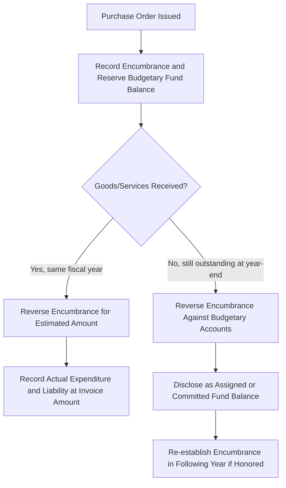

## Budgetary Accounting and Encumbrances

### Overview

Budgetary accounting is a distinctive feature of governmental fund accounting that formally integrates the legally adopted budget into the accounting records themselves, rather than treating the budget as a purely external planning document. This reflects the core accountability objective of government accounting: demonstrating compliance with legally authorized spending limits. **Encumbrance accounting** is the complementary technique used to track outstanding purchase commitments (purchase orders, contracts) *before* the related expenditure is actually incurred, preventing a government from inadvertently overspending its legal appropriation.

### The Budget Cycle

1. **Preparation**: The executive branch (mayor, city manager, governor) prepares a proposed budget, typically based on revenue estimates and departmental spending requests.
2. **Legislative Adoption**: The legislative body (city council, county board, state legislature) reviews, amends, and formally adopts the budget through an appropriations ordinance or act — this adoption is what gives the budget legal force.
3. **Execution**: Departments spend within their appropriations throughout the fiscal year; the accounting system tracks actual revenues/expenditures against budgeted amounts.
4. **Reporting**: A **Budgetary Comparison Schedule** (or Statement) comparing the original budget, the final (amended) budget, and actual results is required as Required Supplementary Information (RSI) for the General Fund and each major Special Revenue Fund with a legally adopted annual budget.

### Recording the Budget: Budgetary Accounts

Governments using formal budgetary integration record the adopted budget directly in the accounting system using memorandum-style budgetary accounts that are the mirror image of actual revenue/expenditure accounts. These accounts are reversed at year-end and do not appear in the government's external financial statements (they exist solely for internal control and are typically shown only in the RSI budgetary comparison schedule, not the basic financial statements themselves).

**Example — Recording the Adopted Budget**

A city adopts a General Fund budget with estimated revenues of $10,000,000 and appropriations (authorized spending) of $9,800,000.

| Account | Debit | Credit |
| --- | --- | --- |
| Estimated Revenues | 10,000,000 |  |
| Appropriations |  | 9,800,000 |
| Budgetary Fund Balance |  | 200,000 |

The $200,000 credit balance in "Budgetary Fund Balance" represents the budgeted surplus (estimated revenues exceeding appropriations). If appropriations exceed estimated revenues, this account would instead carry a debit balance, representing a budgeted deficit financed by drawing down existing fund balance.

**Example — Budget Amendment During the Year**

Mid-year, the council approves a supplemental appropriation of $150,000 for emergency snow removal, funded by an increase in estimated intergovernmental revenue of $150,000.

| Account | Debit | Credit |
| --- | --- | --- |
| Estimated Revenues | 150,000 |  |
| Appropriations |  | 150,000 |

This entry updates the "final budget" figures used in the year-end budgetary comparison schedule.

### Encumbrance Accounting

An **encumbrance** represents a commitment related to unperformed (executory) contracts for goods or services — typically evidenced by an approved purchase order, contract, or other legal commitment. Encumbrances are *not* expenditures or liabilities; they are a budgetary control device that reserves a portion of an appropriation so that a department does not inadvertently commit to spending money it does not have authorized.

**Step Procedure**

1. **At the time a purchase order is issued**: Record an encumbrance and a corresponding reservation of fund balance (or, under GASB 54 terminology, this is disclosed as part of "assigned" or "committed" fund balance, depending on the nature of the constraint).
2. **When goods/services are received and the invoice is recorded**: Reverse the original encumbrance entry (for the estimated amount) and record the actual expenditure and liability (for the actual invoiced amount, which may differ slightly from the original estimate).
3. **At year-end, for outstanding encumbrances**: Under most GASB-consistent practice, outstanding encumbrances are **not** reported as expenditures or liabilities in the financial statements (since goods/services have not yet been received) — they may be disclosed and, if the government intends to honor them, are typically carried forward into the next year's budget as a re-appropriation, with the fund balance classified as "assigned" or "committed" to reflect the intended future use of resources.

**Example — Full Encumbrance Cycle**

A department issues a purchase order for office equipment estimated at $25,000.

*Step 1 — Issue purchase order:*

| Account | Debit | Credit |
| --- | --- | --- |
| Encumbrances | 25,000 |  |
| Budgetary Fund Balance — Reserved for Encumbrances |  | 25,000 |

*Step 2 — Goods received; actual invoice = $24,600:*

Reverse the encumbrance for the original estimated amount:

| Account | Debit | Credit |
| --- | --- | --- |
| Budgetary Fund Balance — Reserved for Encumbrances | 25,000 |  |
| Encumbrances |  | 25,000 |

Record the actual expenditure and liability:

| Account | Debit | Credit |
| --- | --- | --- |
| Expenditures | 24,600 |  |
| Accounts Payable |  | 24,600 |

**Example — Year-End Outstanding Encumbrance**

At fiscal year-end, a $40,000 purchase order for road-paving materials remains outstanding (goods not yet delivered).

*Year-end treatment*: The $40,000 encumbrance is reversed against the budgetary account, and the government typically re-establishes the encumbrance in the following year (assuming the appropriation authority carries forward) or discloses the commitment. Under the GASB 54 fund balance classification framework, the $40,000 would generally be reported within **assigned** fund balance (if management intends the resources for that specific purpose) or **committed** fund balance (if the governing body has formally committed those resources), rather than as a separate "reserved" category (the older "reserved/unreserved" fund balance model was superseded by GASB 54).

| Account | Debit | Credit |
| --- | --- | --- |
| Budgetary Fund Balance — Reserved for Encumbrances | 40,000 |  |
| Encumbrances |  | 40,000 |

The following year, if the government re-establishes the commitment:

| Account | Debit | Credit |
| --- | --- | --- |
| Encumbrances | 40,000 |  |
| Budgetary Fund Balance — Reserved for Encumbrances |  | 40,000 |

### Closing Entries — Budgetary Accounts

At year-end, the original budgetary entry is reversed to close out the budgetary accounts, since they served only as an internal control tool during the year and do not belong in the external financial statements.

**Example — Reversing (Closing) the Budget**

Using the earlier example (Estimated Revenues $10,150,000 after amendment; Appropriations $9,950,000 after amendment):

| Account | Debit | Credit |
| --- | --- | --- |
| Appropriations | 9,950,000 |  |
| Budgetary Fund Balance | 200,000 |  |
| Estimated Revenues |  | 10,150,000 |

This entry exactly reverses the combined effect of the original budget entry and any amendments, returning the budgetary accounts to zero.

### Budgetary Comparison Schedule (RSI)

GASB requires a Budgetary Comparison Schedule (or Statement, if presented as a basic financial statement rather than RSI) for the General Fund and each major Special Revenue Fund with a legally adopted annual budget, presenting at minimum:

| Column | Description |
| --- | --- |
| Original Budget | The first complete appropriated budget adopted by the legislative body |
| Final Budget | The original budget as amended by all legally authorized changes during the year |
| Actual Amounts | Results on the budgetary basis of accounting (which may differ from GAAP — see below) |
| Variance (Final Budget to Actual) | Optional but commonly presented column |

**Example — Simplified Budgetary Comparison Schedule**

|  | Original Budget | Final Budget | Actual | Variance |
| --- | --- | --- | --- | --- |
| Revenues | 10,000,000 | 10,150,000 | 10,220,000 | 70,000 |
| Expenditures | 9,800,000 | 9,950,000 | 9,875,000 | 75,000 |
| **Excess of Revenues over Expenditures** | **200,000** | **200,000** | **345,000** | **145,000** |

### Budgetary Basis vs. GAAP Basis Differences

A government's *legally adopted budget* may be prepared on a basis that differs from GAAP (modified accrual) — for example, some governments budget on a cash basis, or include encumbrances as budgetary "expenditures" even though GAAP does not recognize encumbrances as expenditures. When such differences exist, GASB requires a reconciliation between the budgetary basis and the GAAP basis, typically presented at the bottom of the budgetary comparison schedule (or in an accompanying note).

**Example — Budget-to-GAAP Reconciliation**

| Item | Amount |
| --- | --- |
| Actual amounts (budgetary basis) — Excess of revenues over expenditures | 345,000 |
| Less: Encumbrances outstanding at year-end (treated as budgetary expenditure but not a GAAP expenditure) | (40,000) |
| Add: Prior-year encumbrances that became current-year GAAP expenditures | 25,000 |
| **Excess of revenues over expenditures — GAAP basis** | **330,000** |

### Visual: Encumbrance Lifecycle

### Diagram: Budgetary Account Relationships

<svg xmlns="http://www.w3.org/2000/svg" viewBox="0 0 640 240" font-family="Arial, sans-serif">
<text x="320" y="24" font-size="16" font-weight="bold" text-anchor="middle">Budgetary Accounts at a Glance (svg_diagram)</text>
<rect x="30" y="50" width="180" height="150" fill="#dbeafe" stroke="#1e40af" rx="6" />
<text x="120" y="75" font-size="13" font-weight="bold" text-anchor="middle">Estimated Revenues</text>
<text x="45" y="100" font-size="11">Debit balance account</text>
<text x="45" y="120" font-size="11">Mirrors expected</text>
<text x="45" y="138" font-size="11">Revenue account</text>
<text x="45" y="165" font-size="11">Reversed at year-end</text>
<rect x="230" y="50" width="180" height="150" fill="#fee2e2" stroke="#b91c1c" rx="6" />
<text x="320" y="75" font-size="13" font-weight="bold" text-anchor="middle">Appropriations</text>
<text x="245" y="100" font-size="11">Credit balance account</text>
<text x="245" y="120" font-size="11">Legal spending ceiling</text>
<text x="245" y="138" font-size="11">Mirrors Expenditures</text>
<text x="245" y="165" font-size="11">Reversed at year-end</text>
<rect x="430" y="50" width="180" height="150" fill="#dcfce7" stroke="#15803d" rx="6" />
<text x="520" y="75" font-size="13" font-weight="bold" text-anchor="middle">Encumbrances</text>
<text x="445" y="100" font-size="11">Debit balance account</text>
<text x="445" y="120" font-size="11">Purchase order commitments</text>
<text x="445" y="138" font-size="11">Reduces available</text>
<text x="445" y="156" font-size="11">appropriation balance</text>
<text x="445" y="182" font-size="11">Not a GAAP expenditure</text>
</svg>

### Common Pitfalls (Exam Focus)

- Treating an encumbrance as an expenditure or liability in GAAP-basis financial statements — encumbrances are a budgetary control device only, not recognized as expenditures until goods/services are actually received.
- Forgetting to reverse the *original estimated* encumbrance amount before recording the *actual* invoiced expenditure, which can differ slightly from the encumbered estimate.
- Confusing the direction of budgetary account balances: Estimated Revenues carries a debit balance (like an asset/expense would), while Appropriations carries a credit balance (like a revenue/liability would) — this mirrors the accounts they are meant to offset.
- Omitting the budget-to-GAAP reconciliation when the legally adopted budgetary basis differs from GAAP (e.g., when encumbrances are budgeted as expenditures but are not GAAP expenditures).
- Assuming all funds require a budgetary comparison schedule — GASB requires it specifically for the General Fund and major Special Revenue Funds with a legally adopted annual budget, not for all fund types.
- Mislabeling year-end fund balance classifications using the outdated "reserved/unreserved" terminology instead of the GASB 54 categories (nonspendable, restricted, committed, assigned, unassigned).

**Related Topics**

- Fund accounting structure and fund types
- Modified accrual versus full accrual basis of accounting
- Government-wide financial statements
- Fund balance classification under GASB 54 (nonspendable, restricted, committed, assigned, unassigned)
- Required supplementary information and Management's Discussion and Analysis
- Interfund transactions and transfers