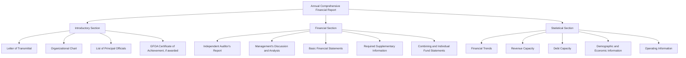

## Annual Comprehensive Financial Report Structure

### Overview

The Annual Comprehensive Financial Report (ACFR) is the complete, formal external financial report issued by a state or local government, encompassing far more than the basic financial statements alone. It represents the government's primary vehicle for demonstrating financial accountability to citizens, oversight bodies, creditors, and rating agencies. [Inference] The report was historically referred to as the "Comprehensive Annual Financial Report (CAFR)"; the Government Finance Officers Association (GFOA) and GASB have moved toward the "Annual Comprehensive Financial Report (ACFR)" terminology in recent years due to the unfortunate acronym of the older name — governments and practitioners should verify current preferred terminology, as adoption of the renamed convention may vary by jurisdiction and transition timing.

### Three Major Sections

The ACFR is organized into three principal sections, each serving a distinct accountability purpose:

### 1. Introductory Section

Provides context and orientation for the reader, and is generally **unaudited**.

**Key Components**

- **Letter of Transmittal**: A formal cover letter from the chief financial officer or equivalent, typically covering the local government's profile, economic condition and outlook, major initiatives, and a summary of financial policies (budget process, internal controls, cash management, risk management).
- **Organizational Chart**: Depicts the government's departmental/functional structure and reporting lines.
- **List of Principal Officials**: Names and titles of elected officials and senior appointed staff.
- **GFOA Certificate of Achievement for Excellence in Financial Reporting**: If the government's prior-year report earned this voluntary recognition from the Government Finance Officers Association, the certificate is often reproduced here as evidence of reporting quality (a recognition program, not a regulatory requirement).

### 2. Financial Section

The core of the ACFR and the only section subject to a full independent audit opinion (though the auditor's opinion covers the basic financial statements specifically, with varying levels of assurance on RSI and supplementary schedules, as detailed below).

#### Independent Auditor's Report

The external auditor's opinion on whether the basic financial statements are presented fairly, in all material respects, in accordance with GAAP. This report typically also addresses:

- Whether RSI (MD&A, budgetary comparison schedules, pension/OPEB schedules) is fairly stated **in relation to** the basic financial statements (limited assurance, not a full opinion), or whether the auditor applied limited procedures and expresses no opinion on it.
- Whether combining/individual fund statements and the statistical section have been subjected to the auditing procedures applied to the basic statements (often stated as "not audited" or "additional analyses... presented for purposes of additional analysis and are not a required part of the basic financial statements").

#### Management's Discussion and Analysis (MD&A)

A narrative, plain-language overview presented as RSI *before* the basic financial statements (a required element per GASB 34), typically covering:

- Condensed comparative financial data for the current and prior year.
- An analysis of overall financial position and results of operations, including reasons for significant changes.
- Analysis of balances and transactions of individual funds.
- Analysis of significant budget variances in the General Fund.
- A description of significant capital asset and long-term debt activity during the year.
- A discussion of currently known facts, decisions, or conditions expected to have a significant effect on financial position or results of operations.

#### Basic Financial Statements

The audited core, comprising:

1. **Government-wide financial statements**: Statement of Net Position and Statement of Activities (full accrual, economic resources focus).
2. **Fund financial statements**: Governmental funds (balance sheet; statement of revenues, expenditures, and changes in fund balances), proprietary funds (statement of net position; statement of revenues, expenses, and changes in net position; statement of cash flows), and fiduciary funds (statement of fiduciary net position; statement of changes in fiduciary net position).
3. **Notes to the Financial Statements**: Considered an integral part of the basic financial statements (not supplementary), covering the summary of significant accounting policies, detailed disclosures on capital assets, long-term debt, pension/OPEB liabilities, risk management, interfund transactions, and commitments/contingencies.

#### Required Supplementary Information (RSI, Other Than MD&A)

Presented *after* the notes to the financial statements, including:

- **Budgetary comparison schedules** for the General Fund and major Special Revenue Funds with legally adopted budgets.
- **Pension and OPEB schedules**: Schedule of changes in net pension/OPEB liability, schedule of contributions, schedule of investment returns (for governments with defined benefit plans, per GASB 68 and GASB 75).
- **Infrastructure condition and maintenance data**: If the government elects to use the "modified approach" for reporting eligible infrastructure assets instead of depreciation.

#### Combining and Individual Fund Statements and Schedules

Supplementary (not "basic") statements presenting detail for **non-major** funds that are aggregated into a single column in the basic fund financial statements, plus individual fund schedules and any other supporting detail the government chooses to present. This section allows a reader to "drill down" into the composition of the aggregated non-major fund columns.

### 3. Statistical Section

Provides broader historical, economic, and demographic context, generally covering a **multi-year trend** (typically the most recent ten fiscal years where data is available), unaudited, and organized by GASB Statement No. 44 into five categories:

#### Financial Trends Information

Multi-year data on net position and fund balance, intended to help readers understand how the government's financial position has changed over time.

#### Revenue Capacity Information

Multi-year data on the government's most significant own-source revenue (commonly property tax), including assessed and estimated actual value of taxable property, property tax rates (direct and overlapping governments), and principal property taxpayers.

#### Debt Capacity Information

Multi-year data on outstanding debt, including ratios of debt to assessed value and debt per capita, legal debt margin calculations, and pledged-revenue coverage for revenue bonds.

**Example — Legal Debt Margin Calculation**

A city has a legal debt limit of 10% of assessed property value. Assessed value = $500,000,000; outstanding general obligation debt subject to the limit = $38,000,000.

$$\text{Legal Debt Limit} = 500{,}000{,}000 \times 0.10 = 50{,}000{,}000$$

$$\text{Legal Debt Margin} = 50{,}000{,}000 - 38{,}000{,}000 = 12{,}000{,}000$$

This margin ($12,000,000) represents the remaining borrowing capacity before the city would exceed its statutory or charter-imposed debt ceiling.

#### Demographic and Economic Information

Population, personal income, unemployment rate, and principal employers — providing socioeconomic context for evaluating the government's revenue base and service demands.

#### Operating Information

Number of government employees by function/program, operating indicators (e.g., number of building permits issued, police calls for service), and capital asset statistics (e.g., miles of streets, number of fire stations) by function, typically presented over a multi-year trend.

### Level of Assurance Summary

| ACFR Section | Audited? | Level of Auditor Involvement |
| --- | --- | --- |
| Introductory Section | No | Not covered by the audit opinion |
| Independent Auditor's Report | N/A | The auditor's own report |
| MD&A | RSI | Limited procedures; "in relation to" basic statements |
| Basic Financial Statements (incl. notes) | Yes | Full audit opinion |
| Other RSI (budgetary, pension/OPEB schedules) | RSI | Limited procedures |
| Combining/Individual Fund Statements | Supplementary | Often subjected to same audit procedures as basic statements, but not opined on separately; disclosed as "supplementary information" |
| Statistical Section | No | Unaudited |

### Diagram: ACFR Assurance Levels

<svg viewBox="0 0 640 260" xmlns="http://www.w3.org/2000/svg" font-family="Arial, sans-serif">
<text x="320" y="24" font-size="16" font-weight="bold" text-anchor="middle">ACFR Levels of Assurance (svg_diagram)</text>
<rect x="40" y="45" width="560" height="40" fill="#dcfce7" stroke="#15803d"/>
<text x="320" y="70" font-size="12" text-anchor="middle">Basic Financial Statements (incl. Notes) — Full Audit Opinion</text>
<rect x="40" y="95" width="560" height="40" fill="#fef3c7" stroke="#b45309"/>
<text x="320" y="120" font-size="12" text-anchor="middle">Required Supplementary Information (MD&A, Budgetary, Pension/OPEB) — Limited Procedures</text>
<rect x="40" y="145" width="560" height="40" fill="#fde68a" stroke="#b45309"/>
<text x="320" y="170" font-size="12" text-anchor="middle">Combining/Individual Fund Statements — Supplementary, Often Subjected to Audit Procedures</text>
<rect x="40" y="195" width="560" height="40" fill="#fee2e2" stroke="#b91c1c"/>
<text x="320" y="220" font-size="12" text-anchor="middle">Introductory and Statistical Sections — Unaudited</text>
</svg>

### Relationship to GFOA Recognition Programs

[Inference] The GFOA's Certificate of Achievement for Excellence in Financial Reporting is a voluntary, peer-review-based recognition program, not a legal or GASB reporting requirement; a government can be fully GAAP-compliant without pursuing or receiving this certificate, and specific program criteria are updated periodically by GFOA, so current detailed criteria should be verified directly against GFOA's published program requirements.

### Common Pitfalls (Exam Focus)

- Assuming the entire ACFR is audited — only the basic financial statements (government-wide, fund statements, and notes) receive a full audit opinion; RSI receives limited procedures, and the introductory/statistical sections are unaudited.
- Confusing MD&A (required, presented *before* the basic statements) with the Letter of Transmittal (part of the unaudited introductory section, presented at the very front of the report) — both provide narrative context but serve different purposes and have different assurance levels.
- Forgetting that combining statements exist specifically to provide detail on **non-major** funds aggregated into a single column elsewhere; major funds are already individually presented in the basic fund financial statements.
- Treating the statistical section's ten-year trend data as audited financial statement disclosure — it is unaudited supplementary contextual information.
- Omitting pension/OPEB RSI schedules for governments with defined benefit plans, which became required following GASB 68 and GASB 75.

**Related Topics**

- Fund accounting structure and fund types
- Government-wide financial statements
- Budgetary accounting and encumbrances
- Modified accrual versus full accrual basis of accounting
- Pension and OPEB accounting and reporting (GASB 68 and GASB 75)
- Component units and the financial reporting entity