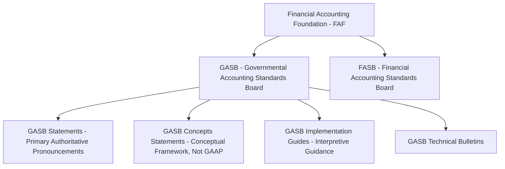

## GASB Standards and the Financial Reporting Model

### Overview

The Governmental Accounting Standards Board (GASB), established in 1984 as an operating component of the Financial Accounting Foundation (FAF), is the independent, private-sector body designated to establish generally accepted accounting principles (GAAP) for U.S. state and local governments. GASB's authority is recognized by the AICPA and state/local government auditors as the source of authoritative GAAP for that sector, paralleling the role the Financial Accounting Standards Board (FASB) plays for private-sector and not-for-profit entities. Understanding GASB's standard-setting structure and the evolution of the financial reporting model provides the conceptual foundation for all governmental accounting topics.

### GASB's Standard-Setting Structure

**Key Points**

- GASB has jurisdiction over state and local governments (cities, counties, school districts, special districts, public colleges/universities using governmental reporting, and similar public entities).
- The federal government is covered by a separate body, the Federal Accounting Standards Advisory Board (FASAB), not GASB.
- Private, not-for-profit, and for-profit entities generally follow FASB standards, though certain not-for-profits affiliated with or component units of governments may follow GASB.
- GASB Concepts Statements establish the conceptual framework (objectives of financial reporting, elements of financial statements, measurement approaches) but are **not** GAAP themselves — they guide GASB's own standard-setting deliberations, similar to FASB's Concepts Statements.

### The GASB Codification Hierarchy

Governmental GAAP is organized in a hierarchy of authoritative sources (analogous to the FASB Accounting Standards Codification for private entities), generally structured as:

1. **GASB Statements and Interpretations** (highest level of authority) — the primary source of GAAP.
2. **GASB Technical Bulletins and, if specifically made applicable to state/local governments, AICPA Industry Audit and Accounting Guides and Statements of Position.**
3. **GASB Implementation Guides**, and AICPA practice bulletins specifically made applicable to state/local governments.
4. **Other accounting literature**, including GASB Concepts Statements, pronouncements of other standard-setting bodies (e.g., FASB, if not conflicting with GASB), and industry practice, used only in the absence of guidance from the higher categories.

[Inference] GASB has periodically refined this hierarchy structure (notably through GASB Statement No. 76, which superseded the older GAAP hierarchy established by GASB 55); practitioners should verify the current codification structure against the latest GASB pronouncements, since further refinements may have occurred.

### Evolution of the Financial Reporting Model

#### Pre-GASB 34 Era

Prior to 1999, governmental financial reporting relied heavily on **fund-based reporting alone**, without a consolidated, entity-wide view. This made it difficult for financial statement users to answer basic questions about the government's overall financial health, total long-term obligations, or the full cost of providing services, since fund statements (especially governmental funds) excluded capital assets and long-term liabilities from the fund-level balance sheets.

#### GASB Statement No. 34 (1999) — The Modern Reporting Model

GASB 34, "Basic Financial Statements—and Management's Discussion and Analysis—for State and Local Governments," is widely regarded as the most significant governmental accounting pronouncement in GASB's history, introducing:

- The **dual-perspective reporting model**: fund financial statements (modified accrual for governmental funds) *plus* government-wide financial statements (full accrual for all activities except fiduciary funds).
- **Management's Discussion and Analysis (MD&A)** as required supplementary information.
- The requirement to report and depreciate **general capital assets** (previously often excluded from formal government financial statements entirely) and **general long-term liabilities** at the government-wide level.
- The **modified approach** as an alternative to depreciation for eligible infrastructure assets, provided the government maintains an asset management system and documents that infrastructure is preserved at or above a condition level established by policy.
- A new **net position** classification scheme (replacing "fund equity" concepts at the government-wide level) into net investment in capital assets, restricted, and unrestricted components.

### Major Subsequent GASB Pronouncements Shaping the Model

| Statement | Subject | Key Change |
| --- | --- | --- |
| GASB 33 | Non-exchange transactions | Established recognition criteria (time requirements, purpose restrictions, eligibility requirements) for taxes, grants, and similar revenues |
| GASB 54 | Fund balance reporting | Replaced "reserved/unreserved" with nonspendable, restricted, committed, assigned, unassigned fund balance classifications |
| GASB 63/65 | Deferred outflows/inflows of resources | Introduced these as distinct elements of the statement of net position, separate from assets/liabilities |
| GASB 68 | Pension accounting | Required employers to report their proportionate share of net pension liability on the statement of net position |
| GASB 72 | Fair value measurement | Established a fair value hierarchy and disclosure framework for investments |
| GASB 75 | OPEB accounting | Extended pension-like liability recognition to other postemployment benefits (retiree healthcare, etc.) |
| GASB 84 | Fiduciary activities | Refined criteria for what qualifies as fiduciary; introduced the Custodial Fund category |
| GASB 87 | Leases | Established a single approach to lease accounting (most leases recognized as a right-to-use asset and corresponding liability, replacing the prior operating/capital lease distinction) |
| GASB 96 | Subscription-based IT arrangements (SBITAs) | Extended lease-like recognition principles to cloud computing and software subscription arrangements |

[Inference] GASB continues to issue new standards and implementation guidance; the list above reflects major pronouncements shaping the current model as of this material's development, but practitioners should verify the most recent effective GASB Statements and any subsequent amendments or supersessions for current applicability, since standard-setting is an ongoing process.

### Elements of Financial Statements (Conceptual Framework)

GASB Concepts Statement No. 4 defines the elements used in governmental financial statements, notably introducing terminology distinct from commercial (FASB) accounting:

| Element | Definition (Governmental Context) |
| --- | --- |
| Assets | Resources with present service capacity that the government presently controls |
| Liabilities | Present obligations to sacrifice resources that the government has little or no discretion to avoid |
| Deferred Outflows of Resources | A consumption of net assets applicable to a future reporting period |
| Deferred Inflows of Resources | An acquisition of net assets applicable to a future reporting period |
| Net Position | The residual of all other elements presented in a statement of financial position (Assets + Deferred Outflows − Liabilities − Deferred Inflows) |

**Example — Deferred Outflows/Inflows in Practice**

A government's net pension liability calculation often produces both a deferred outflow (e.g., differences between projected and actual investment earnings recognized over a period) and a deferred inflow (e.g., changes in actuarial assumptions being amortized), both of which are reported as distinct line items on the government-wide Statement of Net Position rather than folded directly into net pension liability or net position.

### Objectives of Governmental Financial Reporting

Per GASB Concepts Statement No. 1, the overarching objective is **accountability**, which encompasses:

1. **Interperiod equity**: Whether current-year revenues were sufficient to pay for current-year services, or whether current citizens are shifting the burden of paying for current services to future taxpayers.
2. **Budgetary and fiscal compliance**: Demonstrating that resources were obtained and used in accordance with the legally adopted budget and other finance-related legal/contractual requirements.
3. **Service efforts, costs, and accomplishments**: Providing information useful in evaluating the efficiency and effectiveness of government operations (though GASB has generally left detailed performance measurement reporting outside the *basic* financial statements, addressing it more through RSI and supplementary reporting encouragement).

### Diagram: Reporting Model Evolution Timeline

<svg xmlns="http://www.w3.org/2000/svg" viewBox="0 0 640 220" font-family="Arial, sans-serif">
<text x="320" y="24" font-size="16" font-weight="bold" text-anchor="middle">Evolution of the GASB Reporting Model (svg_diagram)</text>
<line x1="50" y1="110" x2="590" y2="110" stroke="#374151" stroke-width="2" />
<circle cx="90" cy="110" r="6" fill="#1e40af" />
<text x="90" y="140" font-size="11" text-anchor="middle">Pre-1999</text>
<text x="90" y="155" font-size="10" text-anchor="middle">Fund-based</text>
<text x="90" y="168" font-size="10" text-anchor="middle">only</text>
<circle cx="230" cy="110" r="6" fill="#b91c1c" />
<text x="230" y="140" font-size="11" text-anchor="middle">GASB 34</text>
<text x="230" y="155" font-size="10" text-anchor="middle">Govt-wide +</text>
<text x="230" y="168" font-size="10" text-anchor="middle">fund statements</text>
<circle cx="370" cy="110" r="6" fill="#15803d" />
<text x="370" y="140" font-size="11" text-anchor="middle">GASB 54</text>
<text x="370" y="155" font-size="10" text-anchor="middle">Fund balance</text>
<text x="370" y="168" font-size="10" text-anchor="middle">reclassification</text>
<circle cx="480" cy="110" r="6" fill="#b45309" />
<text x="480" y="140" font-size="11" text-anchor="middle">GASB 68/75</text>
<text x="480" y="155" font-size="10" text-anchor="middle">Pension/OPEB</text>
<text x="480" y="168" font-size="10" text-anchor="middle">liability recognition</text>
<circle cx="570" cy="110" r="6" fill="#6d28d9" />
<text x="570" y="140" font-size="11" text-anchor="middle">GASB 84/87</text>
<text x="570" y="155" font-size="10" text-anchor="middle">Fiduciary/lease</text>
<text x="570" y="168" font-size="10" text-anchor="middle">reform</text>
</svg>

### Common Pitfalls (Exam Focus)

- Confusing GASB's jurisdiction with FASB's — GASB governs state and local governments; FASB governs private-sector and most not-for-profit entities; the federal government follows FASAB standards.
- Treating GASB Concepts Statements as authoritative GAAP — they are conceptual framework documents that guide standard-setting but are not themselves enforceable accounting requirements.
- Assuming "deferred outflows/inflows of resources" are simply relabeled assets/liabilities — they are distinct financial statement elements under the GASB conceptual framework, appearing in their own sections of the statement of net position.
- Overlooking those major standards that specifically reshaped the model over time (GASB 54 fund balance, GASB 68/75 pension/OPEB, GASB 84 fiduciary, GASB 87 leases) as if the reporting model has remained static since GASB 34.
- Forgetting that interperiod equity is a core accountability objective distinct from, though related to, simple budgetary compliance.

**Related Topics**

- Fund accounting structure and fund types
- Government-wide financial statements
- Modified accrual versus full accrual basis of accounting
- Fund balance classification under GASB 54
- Pension and OPEB accounting and reporting (GASB 68 and GASB 75)
- Lease accounting under GASB 87