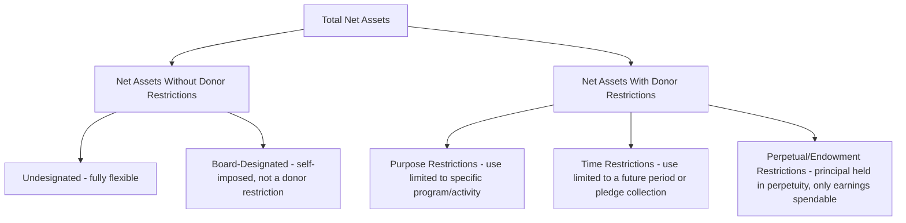

## Net Asset Classification With and Without Donor Restrictions

### Overview

Not-for-profit (NFP) organizations report net assets — the residual of assets minus liabilities — using a classification scheme distinct from the equity accounts used by commercial or governmental entities. The current framework, established by **FASB Accounting Standards Update (ASU) 2016-14**, *Presentation of Financial Statements of Not-for-Profit Entities*, requires NFPs to classify net assets into just **two** categories based on the existence and nature of donor-imposed restrictions: **net assets without donor restrictions** and **net assets with donor restrictions**. This simplified the prior three-category model (unrestricted, temporarily restricted, permanently restricted) that had been in place under the earlier standard, FASB Statement No. 117.

### The Two-Category Model (Post-ASU 2016-14)

### Net Assets Without Donor Restrictions

Net assets that are **not subject to donor-imposed restrictions** — the organization's governing board and management have full discretion over their use, subject only to the broad limits resulting from the nature of the organization, the environment in which it operates, and any purposes specified in its articles of incorporation or bylaws.

**Board Designations Are Not Donor Restrictions**

A governing board may voluntarily set aside a portion of net assets without donor restrictions for a specific future use (e.g., a "board-designated reserve fund" or "board-designated for building renovation"). This is called a **board designation**, and while many organizations disclose these designations for transparency, they remain classified as **net assets without donor restrictions**, because the board itself imposed the limitation and can also remove it — this is fundamentally different from a donor-imposed restriction, which the organization cannot unilaterally override.

**Example**

A nonprofit's board votes to set aside $500,000 of unrestricted net assets into a "Board-Designated Capital Reserve" for a future facility expansion.

| Account | Debit | Credit |
| --- | --- | --- |
| Net Assets Without Donor Restrictions — Undesignated | 500,000 |  |
| Net Assets Without Donor Restrictions — Board-Designated |  | 500,000 |

Both sub-accounts remain within the "without donor restrictions" category on the statement of financial position; the designation is typically disclosed in the notes rather than presented as a separate financial statement classification line.

### Net Assets With Donor Restrictions

Net assets subject to donor-imposed stipulations that either (a) will be satisfied by the passage of time or by actions of the organization, or (b) neither expire with time nor can be removed by the organization's actions (perpetual restrictions, such as endowment principal).

#### Purpose Restrictions

The donor specifies that the contribution must be used for a particular program, project, or activity.

**Example**

A donor contributes $100,000 specifically restricted to funding the organization's youth literacy program.

| Account | Debit | Credit |
| --- | --- | --- |
| Cash | 100,000 |  |
| Contribution Revenue — With Donor Restrictions |  | 100,000 |

When the organization incurs $100,000 of qualifying literacy program expenses, the restriction is considered satisfied, and a reclassification (net asset release) occurs:

| Account | Debit | Credit |
| --- | --- | --- |
| Net Assets Released from Restriction — With Donor Restrictions | 100,000 |  |
| Net Assets Released from Restriction — Without Donor Restrictions |  | 100,000 |

The underlying program expense itself ($100,000) is always reported within net assets without donor restrictions on the statement of activities, since FASB requires all expenses to be reported as decreases in net assets without donor restrictions, regardless of the source of funding used to pay for them.

#### Time Restrictions

The donor specifies that the contribution cannot be used until a future period, or the restriction arises implicitly from the nature of the promise (e.g., a multi-year pledge, where amounts due in future years are treated as time-restricted until that future period arrives).

**Example**

A donor makes a $300,000 unconditional pledge, payable $100,000 per year for three years, with no purpose restriction specified (only a time restriction implicit in the multi-year payment schedule).

$$\text{Present Value of Pledge (assuming a discount rate reflecting the time value of money)} = \sum \frac{100{,}000}{(1+r)^t}$$

At initial recognition (assuming, for simplicity, an undiscounted $300,000 for illustration purposes; in practice, multi-year unconditional promises are recorded at the present value of estimated future cash flows):

| Account | Debit | Credit |
| --- | --- | --- |
| Pledges Receivable | 300,000 |  |
| Contribution Revenue — With Donor Restrictions |  | 300,000 |

As each year's $100,000 installment becomes due and available for use, that portion is released from the time restriction into net assets without donor restrictions.

#### Perpetual (Endowment) Restrictions

The donor specifies that the contributed principal must be maintained in perpetuity (or for a specified term), with only the investment income/appreciation available for spending, and even that income may itself carry a further purpose or time restriction specified by the donor.

**Example**

A donor establishes a $1,000,000 permanent endowment, stipulating that the principal is held in perpetuity and that investment earnings must be used to support scholarships.

| Account | Debit | Credit |
| --- | --- | --- |
| Cash/Investments | 1,000,000 |  |
| Contribution Revenue — With Donor Restrictions |  | 1,000,000 |

The $1,000,000 principal remains permanently within "net assets with donor restrictions" (it can never be released, since the restriction never expires). Investment earnings generated on this endowment (e.g., $45,000 in a given year) are initially also recorded with donor restrictions (since the donor restricted their use to scholarships), then released to "without donor restrictions" as scholarships are actually awarded.

### Statement of Financial Position Presentation

The statement of financial position (the NFP equivalent of a balance sheet) reports net assets in two lines:

| Net Assets | Amount |
| --- | --- |
| Without donor restrictions | 2,400,000 |
| With donor restrictions | 1,850,000 |
| **Total net assets** | **4,250,000** |

Underlying detail (board designations, and the nature/amounts of donor restrictions by purpose, time, or perpetuity) is disclosed in the notes to the financial statements rather than presented as additional face-of-statement categories, consistent with ASU 2016-14's simplification objective.

### Statement of Activities Presentation

The statement of activities reports changes in each net asset class separately, then combines them into the total change in net assets — analogous in structure to a multi-column income statement.

**Example — Simplified Statement of Activities Excerpt**

|  | Without Donor Restrictions | With Donor Restrictions | Total |
| --- | --- | --- | --- |
| Contributions | 1,200,000 | 400,000 | 1,600,000 |
| Program service revenue | 300,000 | — | 300,000 |
| Net assets released from restriction | 350,000 | (350,000) | — |
| **Total revenues and releases** | **1,850,000** | **50,000** | **1,900,000** |
| Program expenses | (1,400,000) | — | (1,400,000) |
| Supporting services expenses | (350,000) | — | (350,000) |
| **Change in net assets** | **100,000** | **50,000** | **150,000** |

**Key Point**: All expenses appear only in the "without donor restrictions" column, since donor restrictions govern only how contributed resources may be *used* to generate program activity, not where expense recognition itself is reported.

### Underwater Endowments

When the fair value of a donor-restricted endowment fund falls below the original gift amount (or the amount required to be maintained by donor stipulation or law), the fund is considered "underwater." Under ASU 2016-14, the **entire fair value** of an underwater endowment fund — even the deficiency portion — is classified within **net assets with donor restrictions** (a change from the prior standard, which allowed the deficiency to be reported as a reduction of unrestricted net assets).

**Example**

An endowment with an original gift amount of $500,000 has a current fair value of $460,000 due to investment losses (a $40,000 deficiency, "underwater" by $40,000).

Under ASU 2016-14, the full $460,000 remains classified as net assets with donor restrictions; the organization must disclose (a) the aggregate fair value, (b) the aggregate original gift amount (or level required to be maintained), and (c) the aggregate amount of the deficiency for all underwater funds, along with the organization's policy regarding spending from underwater funds.

### Diagram: Restriction Release Flow

<svg xmlns="http://www.w3.org/2000/svg" viewBox="0 0 640 240" font-family="Arial, sans-serif">
<text x="320" y="24" font-size="16" font-weight="bold" text-anchor="middle">Donor Restriction Lifecycle (svg_diagram)</text>
<rect x="30" y="50" width="220" height="60" fill="#fef3c7" stroke="#b45309" rx="6" />
<text x="140" y="75" font-size="12" font-weight="bold" text-anchor="middle">Gift Received</text>
<text x="140" y="95" font-size="11" text-anchor="middle">Recorded With Donor Restrictions</text>
<text x="290" y="85" font-size="18" text-anchor="middle">→</text>
<rect x="330" y="50" width="280" height="60" fill="#dbeafe" stroke="#1e40af" rx="6" />
<text x="470" y="75" font-size="12" font-weight="bold" text-anchor="middle">Restriction Satisfied</text>
<text x="470" y="95" font-size="11" text-anchor="middle">Purpose met, time elapses, or funds spent</text>
<text x="320" y="140" font-size="18" text-anchor="middle">↓ Reclassification Entry</text>
<rect x="30" y="160" width="580" height="60" fill="#dcfce7" stroke="#15803d" rx="6" />
<text x="320" y="185" font-size="12" font-weight="bold" text-anchor="middle">Net Assets Released from Restriction</text>
<text x="320" y="205" font-size="11" text-anchor="middle">Debit With Donor Restrictions / Credit Without Donor Restrictions</text>
</svg>

### Common Pitfalls (Exam Focus)

- Confusing board designations (internal, reversible) with donor restrictions (external, legally binding) — board-designated amounts always remain within net assets *without* donor restrictions.
- Applying the pre-2016 three-category model (unrestricted, temporarily restricted, permanently restricted) — the current standard uses only two categories.
- Recording program expenses within the "with donor restrictions" column — all expenses are reported in net assets without donor restrictions regardless of funding source.
- Reporting an underwater endowment deficiency as a reduction to unrestricted net assets — under ASU 2016-14, the entire fair value of an underwater fund, including the deficiency, remains classified with donor restrictions.
- Failing to record a net asset release from restriction when a purpose or time restriction is satisfied, leaving contribution revenue permanently misclassified.
- Treating conditional promises to give (subject to a barrier and a right of return/release) the same as unconditional promises — conditional promises are not recognized as contribution revenue until the condition is substantially met, a distinction separate from, but often confused with, donor restrictions.

**Related Topics**

- Contribution revenue recognition: conditional vs. unconditional promises to give
- Endowment accounting and UPMIFA (Uniform Prudent Management of Institutional Funds Act)
- Statement of functional expenses and expense allocation
- Split-interest agreements (charitable remainder/lead trusts)
- Statement of cash flows for not-for-profit entities
- In-kind contributions and contributed services recognition