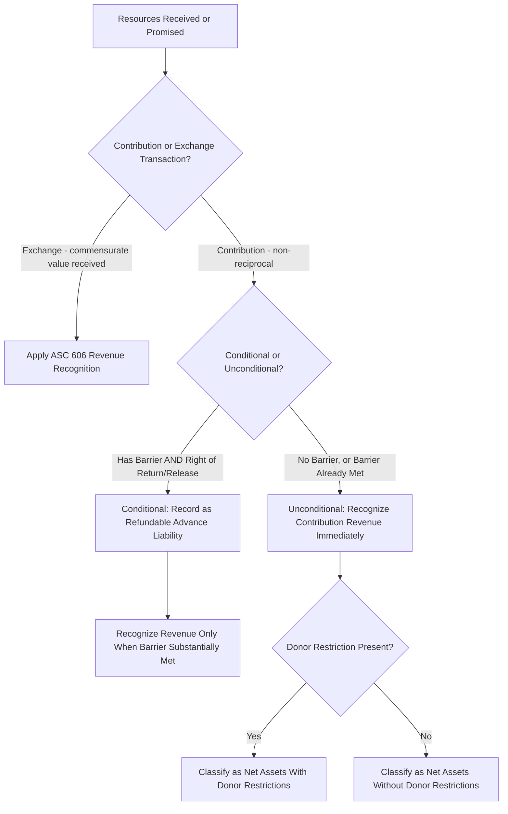

## Contribution Recognition and Conditional Promises to Give

### Overview

Contribution recognition is one of the most technically nuanced areas of not-for-profit (NFP) accounting because the timing of revenue recognition depends critically on distinguishing between **conditional** and **unconditional** promises to give, and between **contributions** (non-reciprocal transfers) and **exchange transactions** (reciprocal transfers where each party receives commensurate value). The governing guidance is FASB Accounting Standards Codification Topic 958-605, substantially clarified by **ASU 2018-08**, *Clarifying the Scope and the Accounting Guidance for Contributions Received and Contributions Made*, which was issued specifically to resolve diversity in practice regarding grant and contract accounting.

### Step 1: Contribution vs. Exchange Transaction

Before applying contribution recognition rules, an organization must first determine whether a transaction is a **contribution** (non-reciprocal — the resource provider receives no direct commensurate value) or an **exchange transaction** (reciprocal — governed by ASC 606, Revenue from Contracts with Customers, not contribution guidance).

**Key Indicators of a Contribution (Non-Reciprocal)**

- The resource provider (including government agencies and foundations) does not receive commensurate value in return.
- Any benefit received by the resource provider (e.g., positive publicity, satisfaction of a broad public benefit) is incidental to the primary societal/public purpose of the transfer, not "commensurate value."
- Execution of the resource provider's mission or the positive sentiment from acting as a donor is explicitly **not** considered commensurate value.

**Example — Contribution vs. Exchange**

A government agency provides a nonprofit $200,000 to operate a community health clinic serving the general public. The agency receives no direct goods or services of commensurate value — it is fulfilling a public policy mission through the nonprofit. **This is a contribution**, even though the agency imposes specific reporting and eligibility requirements on how funds are used.

Contrast: A government agency pays the same nonprofit $200,000 to provide health screenings **specifically and exclusively to the agency's own employees** as an employee benefit. Because the agency itself (as the direct beneficiary/customer) receives the specific service, this is more likely an **exchange transaction**, governed by ASC 606 rather than contribution guidance.

### Step 2: Conditional vs. Unconditional (For Contributions Only)

Once a transaction is determined to be a contribution, the next critical determination is whether it is **conditional** or **unconditional**, because this drives the timing of revenue recognition.

#### Conditional Promises to Give

A promise is **conditional** if it contains **both** of the following characteristics:

1. **A barrier** that must be overcome before the recipient is entitled to the resources (e.g., a measurable performance-related barrier, a specific level of service to be achieved, or a stipulation tied to an identifiable external event).
2. **A right of return** (to the donor) of assets transferred, or a **right of release** (of the donor's obligation to transfer future assets), if the barrier is not overcome.

**Indicators That a Barrier Exists** (per ASU 2018-08, applied holistically rather than as a rigid checklist)

- Measurable performance-related barriers or other measurable outcomes (e.g., "the grantee must serve 500 clients").
- Limits on the recipient's discretion over how resources are spent, going beyond a simple purpose restriction (e.g., a defined matching requirement).
- Stipulations that are related to the purpose of the agreement, as opposed to administrative or trivial requirements (e.g., simple reporting on how funds were spent is generally administrative, not a barrier).

**Recognition Rule**: A conditional contribution is **not recognized as revenue** until the condition(s) are substantially met — it is accounted for as a **refundable advance (liability)** until the barrier is overcome, at which point it converts to contribution revenue.

**Example — Conditional Grant**

A foundation pledges $300,000 to a nonprofit, contingent on the nonprofit raising $300,000 in matching funds from other sources within 18 months (a measurable barrier with an explicit right of return of unspent/unmatched funds).

*At the time of the pledge (before the match is achieved), no entry is made for contribution revenue*, since the promise is conditional and not yet recognizable. If cash is advanced by the foundation before the match is achieved:

| Account | Debit | Credit |
| --- | --- | --- |
| Cash | 300,000 |  |
| Refundable Advance (Liability) |  | 300,000 |

Once the nonprofit successfully raises $300,000 in matching funds (the barrier is overcome):

| Account | Debit | Credit |
| --- | --- | --- |
| Refundable Advance (Liability) | 300,000 |  |
| Contribution Revenue — With Donor Restrictions (if also purpose/time restricted) |  | 300,000 |

**Example — Conditional Grant with Partial Achievement**

A government grant of $500,000 requires the nonprofit to serve a minimum of 1,000 clients over the grant period (a measurable performance barrier) before funds are earned; funds are disbursed to the nonprofit in advance. By year-end, the nonprofit has served 600 clients (60% of the required threshold) and can reasonably measure progress toward the barrier.

[Inference] Under a proportionate/simultaneous release approach that some organizations apply when the condition is a measurable, quantifiable barrier and partial performance can be reliably measured, revenue might be recognized proportionately as the condition is partially met (60% × $500,000 = $300,000 recognized as revenue, $200,000 remaining as a refundable advance) — however, the appropriateness of proportional recognition (as opposed to recognizing nothing until the full threshold is met) depends on the specific facts, the precise wording of the grant agreement, and professional judgment; this is an area where practice guidance and interpretation can vary, and organizations should evaluate their specific facts against the ASU 2018-08 indicators and consult authoritative guidance or professional advice.

#### Unconditional Promises to Give

A promise is **unconditional** if it lacks a barrier, a right of return, or a right of release (or all measurable barriers have already been overcome). Unconditional promises are recognized as **contribution revenue immediately upon the promise being made** (subject to normal recognition principles — i.e., the promise must still be sufficiently verifiable/documented), regardless of whether cash has yet been received, and regardless of whether the funds carry donor-imposed purpose or time restrictions (which affect net asset *classification*, not recognition *timing*).

**Example — Unconditional Multi-Year Pledge**

A donor signs a written, legally enforceable pledge to contribute $150,000 to a nonprofit, payable $50,000 per year for three years, with no performance conditions attached (only an implicit time restriction from the payment schedule).

The **entire unconditional promise** is recognized as contribution revenue immediately, at its present value (discounted for the time value of money, since cash will be received over multiple future years):

$$PV = \sum_{t=1}^{3} \frac{50{,}000}{(1+r)^t}$$

Assuming a discount rate of 5%:

$$PV = \frac{50{,}000}{1.05} + \frac{50{,}000}{1.05^2} + \frac{50{,}000}{1.05^3} \approx 47{,}619 + 45{,}351 + 43{,}192 \approx 136{,}162$$

| Account | Debit | Credit |
| --- | --- | --- |
| Pledges Receivable | 136,162 |  |
| Contribution Revenue — With Donor Restrictions |  | 136,162 |

In subsequent periods, the discount is amortized (accreted) as additional contribution revenue (interest income on the pledge) until the full $150,000 is collected, using the effective interest method:

$$\text{Year 1 Accretion} = 136{,}162 \times 0.05 \approx 6{,}808$$

| Account | Debit | Credit |
| --- | --- | --- |
| Pledges Receivable | 6,808 |  |
| Contribution Revenue (Accretion of Discount) |  | 6,808 |

### Distinguishing Conditions from Restrictions

A common area of confusion: **conditions** affect *whether/when* revenue is recognized at all; **restrictions** affect *how the net assets are classified* once revenue has already been recognized. A single gift can be:

- Unconditional and unrestricted (recognized immediately, classified without donor restrictions).
- Unconditional and restricted (recognized immediately, classified with donor restrictions).
- Conditional (not recognized until the condition is met — restriction classification becomes relevant only *after* the condition is satisfied and revenue is recognized).

**Example Distinguishing the Two**

- "This $50,000 gift must be used for the scholarship program" — a **purpose restriction** (not a condition); revenue is recognized immediately, classified with donor restrictions.
- "This $50,000 will be released to you only if you raise $50,000 in matching funds from other donors" — a **condition** (barrier + right of return); revenue recognition is deferred until the match is achieved.

### Multi-Year Unconditional Pledges: Allowance for Uncollectible Pledges

Because unconditional pledges are recognized as revenue and a receivable immediately, organizations must also estimate and record an **allowance for uncollectible pledges**, similar to an allowance for doubtful accounts in commercial accounting, based on historical collection experience or other reasonable estimation methods.

**Example**

Using the $136,162 present-value pledge above, if the organization estimates 5% of pledges will ultimately prove uncollectible:

$$\text{Allowance} = 136{,}162 \times 0.05 \approx 6{,}808$$

| Account | Debit | Credit |
| --- | --- | --- |
| Contribution Revenue (or Bad Debt Expense, per policy) | 6,808 |  |
| Allowance for Uncollectible Pledges |  | 6,808 |

### Contributed Nonfinancial Assets (Gifts-in-Kind) and Contributed Services

Related recognition considerations apply to non-cash gifts:

- **Contributed nonfinancial assets** (goods, materials, use of facilities) are recognized as contribution revenue at fair value on the date of receipt, with a corresponding expense or asset recorded, and ASU 2020-07 introduced enhanced disclosure requirements requiring disaggregation by category and a description of valuation techniques.
- **Contributed services** are recognized only if they (a) create or enhance a nonfinancial asset, or (b) require specialized skills, are provided by individuals possessing those skills, and would typically need to be purchased if not donated (e.g., pro bono legal or medical services from a licensed professional). General volunteer time that does not meet these criteria is not recognized in the financial statements, though it may be disclosed.

**Example — Recognizable Contributed Services**

A licensed architect donates 40 hours of professional design services for a new community center, normally billed at $150/hour.

$$\text{Value} = 40 \times 150 = 6{,}000$$

| Account | Debit | Credit |
| --- | --- | --- |
| Building Under Construction (or Professional Services Expense, depending on nature) | 6,000 |  |
| Contribution Revenue — Without Donor Restrictions |  | 6,000 |

### Visual: Contribution Recognition Decision Tree

### Diagram: Condition vs. Restriction Distinction

<svg xmlns="http://www.w3.org/2000/svg" viewBox="0 0 640 220" font-family="Arial, sans-serif">
<text x="320" y="24" font-size="16" font-weight="bold" text-anchor="middle">Condition vs. Restriction (svg_diagram)</text>
<rect x="30" y="50" width="280" height="150" fill="#fee2e2" stroke="#b91c1c" rx="6" />
<text x="170" y="73" font-size="13" font-weight="bold" text-anchor="middle">Condition</text>
<text x="45" y="98" font-size="11">Affects WHETHER/WHEN</text>
<text x="45" y="115" font-size="11">revenue is recognized</text>
<text x="45" y="140" font-size="11">Requires: barrier +</text>
<text x="45" y="157" font-size="11">right of return/release</text>
<text x="45" y="182" font-size="11">Recorded as liability until met</text>
<rect x="330" y="50" width="280" height="150" fill="#dbeafe" stroke="#1e40af" rx="6" />
<text x="470" y="73" font-size="13" font-weight="bold" text-anchor="middle">Restriction</text>
<text x="345" y="98" font-size="11">Affects HOW net assets</text>
<text x="345" y="115" font-size="11">are classified</text>
<text x="345" y="140" font-size="11">Purpose, time, or</text>
<text x="345" y="157" font-size="11">perpetual in nature</text>
<text x="345" y="182" font-size="11">Revenue recognized immediately</text>
</svg>

### Common Pitfalls (Exam Focus)

- Treating a simple purpose restriction as if it were a condition — a restriction alone (without a measurable barrier and right of return/release) does not defer revenue recognition.
- Recognizing conditional grant revenue upon receipt of cash rather than waiting until the condition (barrier) is substantially met — cash received on a conditional promise is a liability (refundable advance), not revenue.
- Failing to discount multi-year unconditional pledges to present value, overstating the initial contribution revenue and receivable.
- Recognizing volunteer time broadly as contributed services revenue — only services that create/enhance a nonfinancial asset or require specialized skills the organization would otherwise purchase qualify for recognition.
- Misclassifying a government grant or contract as an exchange transaction by default — the ASU 2018-08 framework requires evaluating whether the resource provider receives *commensurate value*, not merely whether reporting requirements exist.
- Assuming administrative/trivial stipulations (basic reporting requirements) constitute a "barrier" sufficient to make a promise conditional.

**Related Topics**

- Net asset classification with and without donor restrictions
- Contributed nonfinancial assets (gifts-in-kind) disclosure requirements (ASU 2020-07)
- Exchange transactions and ASC 606 revenue recognition for NFPs
- Endowment accounting and UPMIFA
- Statement of functional expenses and expense allocation
- Grant and contract accounting for government-funded NFPs