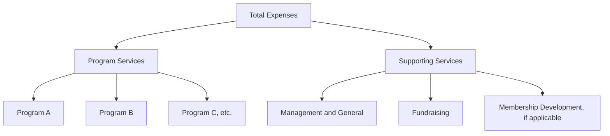

## Statement of Activities and Functional Expense Reporting

### Overview

The **Statement of Activities** is the not-for-profit (NFP) equivalent of a commercial income statement, reporting the change in net assets for a period, disaggregated by net asset class (with and without donor restrictions). **Functional expense reporting** is a complementary and distinctive NFP requirement: organizations must report expenses not only by their **natural classification** (salaries, rent, supplies, depreciation) but also by their **functional classification** (program services vs. supporting services), either on the face of the statement of activities, in the notes, or in a separate **Statement of Functional Expenses**. Both requirements stem from FASB ASC 958 and were substantially reinforced by ASU 2016-14.

### Statement of Activities Structure

The statement of activities reports revenues, expenses, gains, losses, and reclassifications (net assets released from restriction), organized in columns for each net asset class, arriving at the change in each class and total net assets.

**Example — Full Statement of Activities**

|  | Without Donor Restrictions | With Donor Restrictions | Total |
| --- | --- | --- | --- |
| **Revenues and Support** |  |  |  |
| Contributions | 900,000 | 500,000 | 1,400,000 |
| Program service fees | 650,000 | — | 650,000 |
| Investment income | 40,000 | 15,000 | 55,000 |
| Special event revenue (net) | 120,000 | — | 120,000 |
| Net assets released from restriction | 380,000 | (380,000) | — |
| **Total revenues and support** | **2,090,000** | **135,000** | **2,225,000** |
| **Expenses** |  |  |  |
| Program A | 850,000 | — | 850,000 |
| Program B | 620,000 | — | 620,000 |
| Management and general | 280,000 | — | 280,000 |
| Fundraising | 190,000 | — | 190,000 |
| **Total expenses** | **1,940,000** | **—** | **1,940,000** |
| **Change in net assets** | **150,000** | **135,000** | **285,000** |
| Net assets, beginning of year | 1,800,000 | 900,000 | 2,700,000 |
| **Net assets, end of year** | **1,950,000** | **1,035,000** | **2,985,000** |

**Key Point**: All expenses are reported exclusively in the "without donor restrictions" column, regardless of whether the cash used to pay them originated from restricted or unrestricted contributions — restrictions govern classification of contribution revenue and net assets, not the location of expense reporting.

### Revenue Classification Considerations

- **Contributions**: Recognized per the conditional/unconditional framework (see related topic on contribution recognition); classified by net asset category based on donor stipulations.
- **Exchange revenue** (program service fees, membership dues providing commensurate benefits, tuition): Recognized under ASC 606, always reported without donor restrictions since exchange transactions do not carry donor restrictions in the contribution sense.
- **Investment return**: Reported net of investment expenses, typically as a single line (per ASU 2016-14's requirement to net external and direct internal investment expenses against investment return, with disclosure of the netted amount rather than gross presentation).
- **Special events**: Often reported net of direct costs of the event on the face of the statement, with the gross revenue and direct expenses disclosed in the notes if the net presentation is used.

### Functional Expense Classification

All NFPs are required to present an analysis of expenses by both **natural classification** and **functional classification**, in one of three permissible formats: (1) on the face of the statement of activities, (2) as a schedule in the notes, or (3) in a separate **Statement of Functional Expenses**. Voluntary health and welfare organizations have historically been required to present a full matrix-format Statement of Functional Expenses; ASU 2016-14 extended the *analysis* requirement (though not necessarily the specific separate-statement format) to **all** NFPs.

#### Functional Categories

**Program Services**: Activities that result in goods or services being distributed to beneficiaries, customers, or members that fulfill the purposes or mission for which the organization exists — these are the direct mission-related activities.

**Supporting Services**: All activities other than program services, further divided into:

- **Management and General**: Oversight, business management, general recordkeeping, budgeting, financing, and other administrative activities, except for direct conduct of program services or fundraising activities.
- **Fundraising**: Activities undertaken to induce potential donors to contribute money, securities, services, materials, facilities, or time (soliciting contributions from individuals, foundations, government agencies, and others).
- **Membership Development** (if applicable): Activities related to soliciting for prospective members and membership dues, membership relations, and similar activities, when this represents a distinct, significant supporting activity.

### Statement of Functional Expenses (Matrix Format)

**Example — Statement of Functional Expenses**

| Natural Classification | Program A | Program B | Management & General | Fundraising | Total |
| --- | --- | --- | --- | --- | --- |
| Salaries and wages | 380,000 | 260,000 | 140,000 | 95,000 | 875,000 |
| Employee benefits | 76,000 | 52,000 | 28,000 | 19,000 | 175,000 |
| Occupancy | 90,000 | 65,000 | 35,000 | 20,000 | 210,000 |
| Supplies | 120,000 | 95,000 | 15,000 | 12,000 | 242,000 |
| Professional fees | 40,000 | 30,000 | 40,000 | 25,000 | 135,000 |
| Depreciation | 60,000 | 55,000 | 15,000 | 12,000 | 142,000 |
| Postage and printing | 84,000 | 63,000 | 7,000 | 7,000 | 161,000 |
| **Total expenses** | **850,000** | **620,000** | **280,000** | **190,000** | **1,940,000** |

This matrix format directly ties to the totals presented in the functional summary within the statement of activities, providing readers (donors, watchdog rating agencies such as Charity Navigator, grantors) with insight into both the *nature* of costs and *how they support the mission*.

### Cost Allocation Methodology

Joint costs (costs benefiting more than one functional category, such as a building's utilities benefiting both program and administrative space, or a shared executive director's salary) must be allocated across functional categories using a **reasonable, consistently applied allocation methodology**, disclosed in the notes to the financial statements.

**Common Allocation Bases**

| Cost Type | Common Allocation Basis |
| --- | --- |
| Salaries of staff working across functions | Time studies, timesheets, or estimated percentage of effort |
| Occupancy costs | Square footage occupied by each function |
| Depreciation on shared equipment | Usage-based estimates or square footage |
| Information technology costs | Number of users/workstations by function, or headcount |

**Example — Salary Allocation**

An executive director earning $120,000 annually spends an estimated 20% of time on Program A activities, 15% on Program B, 50% on general management/oversight, and 15% on fundraising solicitation, based on a documented time study.

$$\text{Program A} = 120{,}000 \times 0.20 = 24{,}000$$

$$\text{Program B} = 120{,}000 \times 0.15 = 18{,}000$$

$$\text{Management and General} = 120{,}000 \times 0.50 = 60{,}000$$

$$\text{Fundraising} = 120{,}000 \times 0.15 = 18{,}000$$

$$\text{Verification: } 24{,}000 + 18{,}000 + 60{,}000 + 18{,}000 = 120{,}000 \checkmark$$

### Joint Costs of Combined Educational and Fundraising Activities

A special rule applies to **joint activities** that combine a fundraising appeal with an educational or programmatic component (e.g., a mailing that both solicits donations and provides health information). Under ASC 958-720-45, the costs of such a joint activity may be allocated between fundraising and program (rather than the entire cost being classified as fundraising) **only if all three** of the following criteria are met:

1. **Purpose criterion**: The activity accomplishes a program or management/general purpose in addition to fundraising, evidenced by specific criteria regarding call-to-action content and audience selection.
2. **Audience criterion**: The audience is selected based on program or management criteria, not solely based on their ability or likelihood to contribute.
3. **Content criterion**: The activity calls for specific action by the recipient that will help accomplish the organization's mission (beyond simply making a financial contribution).

If **any** of these three criteria are not met, the **entire cost** of the joint activity must be classified as fundraising expense — none of it may be allocated to program services.

**Example**

A nonprofit mails a brochure that (a) includes substantive educational content about disease prevention (satisfying the content criterion via a specific call to action beyond giving), (b) is sent to a broad public health-conscious demographic selected for program-relevant characteristics rather than donor capacity (satisfying audience criterion), and (c) also includes a donation appeal (satisfying purpose criterion). If all three criteria are documented and met, the mailing's $50,000 cost might be allocated, for example, $30,000 to the educational program and $20,000 to fundraising, based on a reasonable allocation methodology. If the mailing instead targeted only the organization's past major donors with no substantive educational content, none of the criteria would likely be met, and the full $50,000 would be classified as fundraising expense.

### Liquidity and Availability Disclosures

Though not part of the statement of activities itself, ASU 2016-14 also introduced a related, often-tested requirement: NFPs must provide both quantitative and qualitative disclosures about the availability of financial assets to meet cash needs for general expenditures within one year of the statement of financial position date, and the organization's liquidity management policies.

### Diagram: Functional Expense Category Relationships

<svg viewBox="0 0 640 220" xmlns="http://www.w3.org/2000/svg" font-family="Arial, sans-serif">
<text x="320" y="24" font-size="16" font-weight="bold" text-anchor="middle">Two Dimensions of Expense Reporting (svg_diagram)</text>
<rect x="180" y="50" width="280" height="40" fill="#dbeafe" stroke="#1e40af"/>
<text x="320" y="75" font-size="12" text-anchor="middle">Natural Classification (Salaries, Rent, Supplies...)</text>
<text x="320" y="105" font-size="16" text-anchor="middle">× intersects with ×</text>
<rect x="180" y="115" width="280" height="40" fill="#dcfce7" stroke="#15803d"/>
<text x="320" y="140" font-size="12" text-anchor="middle">Functional Classification (Program, M&G, Fundraising)</text>
<text x="320" y="170" font-size="16" text-anchor="middle">↓ produces</text>
<rect x="140" y="180" width="360" height="35" fill="#fef3c7" stroke="#b45309"/>
<text x="320" y="202" font-size="12" text-anchor="middle">Matrix: Statement of Functional Expenses</text>
</svg>

### Common Pitfalls (Exam Focus)

- Reporting any expenses within the "with donor restrictions" column of the statement of activities — all expenses belong in the without-restrictions column by requirement.
- Allocating joint-activity costs between program and fundraising without documenting that all three criteria (purpose, audience, content) are met — failing even one criterion requires the entire joint cost to be classified as fundraising.
- Using an arbitrary or undocumented allocation basis for shared costs (salaries, occupancy) rather than a reasonable, consistently applied, and disclosed methodology.
- Omitting the functional expense analysis entirely, assuming only "voluntary health and welfare organizations" must present it — ASU 2016-14 extended this analysis requirement to all NFPs, even if not all must use the separate matrix-format statement.
- Confusing membership development costs (a distinct supporting-services category when significant) with either program services or general fundraising.
- Presenting investment return gross rather than net of investment expenses, contrary to the ASU 2016-14 netting requirement.

**Related Topics**

- Net asset classification with and without donor restrictions
- Contribution recognition and conditional promises to give
- Liquidity and availability of resources disclosures
- Joint cost allocation for combined educational and fundraising activities
- Statement of cash flows for not-for-profit entities
- Endowment accounting and UPMIFA