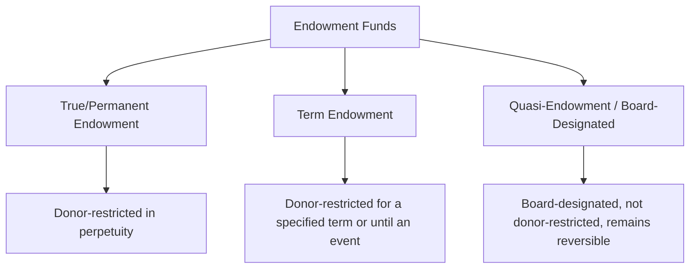
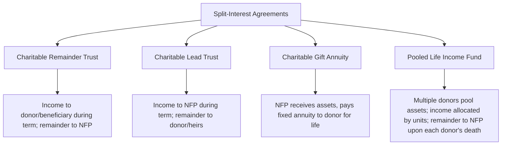

## Endowments and Split-Interest Agreements

### Overview

Endowments and split-interest agreements represent two specialized categories of not-for-profit (NFP) contributions involving long-term or deferred donor arrangements. **Endowments** involve donor-restricted (or board-designated) funds where principal is intended to be maintained and only investment return is typically available for spending. **Split-interest agreements** are arrangements in which a donor transfers assets to a trust or the organization itself, with the benefits of those assets split between the NFP and one or more other beneficiaries (often the donor or the donor's family), typically for a specified term or the beneficiary's lifetime.

### Endowments: Types

#### True (Permanent) Endowment

A fund established by a donor where the gift instrument stipulates that the principal must be maintained in perpetuity, invested to produce income, with only the earnings (or a prudent spending rate thereof) available for the specified or general purposes.

**Example**

A donor contributes $2,000,000 to a university with the stipulation that the principal is never spent, and earnings support a designated professorship.

| Account | Debit | Credit |
| --- | --- | --- |
| Cash/Investments | 2,000,000 |  |
| Contribution Revenue — With Donor Restrictions |  | 2,000,000 |

The $2,000,000 remains classified as net assets with donor restrictions indefinitely (the restriction never expires).

#### Term Endowment

Similar to a true endowment, but the donor restriction on maintaining principal expires after a specified period or upon the occurrence of a specified event (e.g., "maintain principal for 20 years, after which it may be spent" or "until my grandchild graduates").

**Example**

A donor contributes $500,000, stipulating the principal must remain intact for 15 years, after which the organization may use it without restriction.

At the end of the 15-year term, a reclassification (release from restriction) occurs:

| Account | Debit | Credit |
| --- | --- | --- |
| Net Assets Released from Restriction — With Donor Restrictions | 500,000 |  |
| Net Assets Released from Restriction — Without Donor Restrictions |  | 500,000 |

#### Quasi-Endowment (Board-Designated Endowment)

Funds that the organization's **own governing board**, rather than a donor, has determined should be retained and invested for long-term purposes, functioning like an endowment in practice but remaining classified as net assets **without** donor restrictions, since the board itself imposed the limitation and retains the authority to reverse it.

**Example**

A nonprofit's board votes to designate $800,000 of unrestricted net assets as a quasi-endowment to support long-term programmatic stability.

| Account | Debit | Credit |
| --- | --- | --- |
| Net Assets Without Donor Restrictions — Undesignated | 800,000 |  |
| Net Assets Without Donor Restrictions — Board-Designated (Quasi-Endowment) |  | 800,000 |

### UPMIFA — Uniform Prudent Management of Institutional Funds Act

Most U.S. states have adopted a version of UPMIFA, which governs the investment and spending of donor-restricted endowment funds absent explicit donor instructions to the contrary. Key UPMIFA principles include:

- Replaced the older concept of "historic dollar value" (under the prior UMIFA framework) as the floor below which spending was prohibited — UPMIFA instead directs organizations to apply a **prudence standard** considering factors such as duration, preservation of the fund, general economic conditions, expected total return, and the organization's other resources.
- Requires consideration of the donor's intent expressed in the gift instrument.
- Permits appropriation for expenditure of an amount the organization determines to be prudent, even if this could, in some circumstances, reduce the fund below its original gift value (subject to the prudence factors and any explicit donor restriction to the contrary).

[Inference] The precise prudence factors and spending-rate practices are governed by each state's specific UPMIFA statute (since UPMIFA is state law, not federal or FASB-issued guidance), so organizations should confirm the applicable provisions in their state of formation/operation, as adoption details can vary by jurisdiction.

### Underwater Endowments

As addressed under net asset classification guidance (ASU 2016-14), when the fair value of a donor-restricted endowment fund falls below the amount required to be maintained (original gift value, or a UPMIFA-adjusted floor if applicable), the fund is "underwater." The **entire fair value**, including the deficiency, remains classified as **net assets with donor restrictions**; required disclosures include the aggregate fair value, aggregate original gift amount, aggregate deficiency, and the organization's policy on spending from underwater funds (e.g., whether spending continues, is reduced, or is suspended).

**Example**

An endowment with a $500,000 original gift amount has a fair value of $450,000 at year-end due to market losses.

$$\text{Deficiency} = 500{,}000 - 450{,}000 = 50{,}000$$

Both the $450,000 fair value and the $50,000 deficiency remain within net assets with donor restrictions; no portion is reported as a reduction to unrestricted net assets under current guidance.

### Endowment Investment Return Accounting

Investment return on donor-restricted endowments is generally itself restricted according to the donor's specified use for that return (often a purpose restriction, such as funding scholarships), unless the donor specified otherwise. As the organization spends the appropriated amount consistent with its spending policy, a release from restriction occurs.

**Example — Endowment Spending Policy Application**

An endowment with a $2,000,000 fair value operates under a board-adopted spending policy of 4.5% of a trailing 3-year average fair value, intended to smooth spending against market volatility.

$$\text{Trailing 3-Year Average FV} = \frac{1{,}900{,}000 + 2{,}000{,}000 + 2{,}100{,}000}{3} = 2{,}000{,}000$$

$$\text{Appropriated Spending} = 2{,}000{,}000 \times 0.045 = 90{,}000$$

| Account | Debit | Credit |
| --- | --- | --- |
| Net Assets Released from Restriction — With Donor Restrictions | 90,000 |  |
| Net Assets Released from Restriction — Without Donor Restrictions |  | 90,000 |

### Split-Interest Agreements

Split-interest agreements divide the economic benefits of contributed assets between the NFP and one or more other beneficiaries (often the donor or family members), typically for a specified term of years or for the life of an individual. Common forms include charitable remainder trusts, charitable lead trusts, charitable gift annuities, and pooled (life) income funds.

#### Charitable Remainder Trust (CRT)

The donor transfers assets to a trust; a designated income beneficiary (often the donor) receives payments (fixed annuity or a percentage of trust value, revalued annually) for a specified term or lifetime, after which the **remainder** passes to the NFP.

**Recognition**: The NFP recognizes contribution revenue for the **present value of the estimated remainder interest** at the date the trust is established (assuming the NFP is not the trustee, or recognizes an asset for its beneficial interest if it is/controls the trustee role), discounted using an appropriate discount rate and actuarial assumptions (donor life expectancy, payout rate).

**Example**

A donor establishes a $1,000,000 charitable remainder trust, retaining a 6% annual payout for life (donor age and IRS actuarial tables used to estimate life expectancy and discount the remainder).

$$\text{Present Value of Remainder Interest} = \text{Trust Assets} - \text{Present Value of Income Interest Retained by Donor}$$

Assuming the actuarial computation yields a present value of the remainder interest of $420,000:

| Account | Debit | Credit |
| --- | --- | --- |
| Beneficial Interest in Charitable Remainder Trust (or Contribution Receivable) | 420,000 |  |
| Contribution Revenue — With Donor Restrictions |  | 420,000 |

In subsequent periods, the beneficial interest is remeasured (typically annually) to reflect changes in trust asset value and updated actuarial assumptions, with adjustments recognized as changes in the value of split-interest agreements (a gain or loss, not additional contribution revenue).

#### Charitable Lead Trust (CLT)

The reverse structure: the NFP receives payments (income interest) for a specified term, after which the **remainder** reverts to the donor or the donor's designated heirs.

**Recognition**: If the NFP is entitled to fixed payments for the term (and the trust is irrevocable), the NFP recognizes an asset and contribution revenue for the present value of the expected income stream at inception. Because the remainder does not belong to the NFP in a lead trust, no remainder-interest asset is recorded by the NFP.

**Example**

A donor establishes a $1,500,000 charitable lead trust, with the NFP receiving fixed annual payments of $75,000 for 15 years, after which the remaining trust assets revert to the donor's children.

$$PV = \sum_{t=1}^{15} \frac{75{,}000}{(1+r)^t}$$

Assuming a present value (at an appropriate discount rate) of approximately $780,000:

| Account | Debit | Credit |
| --- | --- | --- |
| Contribution Receivable — Charitable Lead Trust | 780,000 |  |
| Contribution Revenue — With Donor Restrictions (time-restricted, if payments span future periods) |  | 780,000 |

#### Charitable Gift Annuity

The donor transfers assets directly to the NFP (not a separate trust), and the NFP contractually agrees to pay the donor (or another named annuitant) a fixed amount for life. The NFP records the full asset received, a liability for the actuarial present value of the annuity obligation, and the difference as contribution revenue.

**Example**

A donor transfers $300,000 to the NFP in exchange for a lifetime annuity paying $15,000/year; the actuarially determined present value of the annuity obligation is $180,000.

$$\text{Contribution Revenue} = 300{,}000 - 180{,}000 = 120{,}000$$

| Account | Debit | Credit |
| --- | --- | --- |
| Cash/Investments | 300,000 |  |
| Annuity Payment Liability |  | 180,000 |
| Contribution Revenue — With Donor Restrictions |  | 120,000 |

The annuity liability is remeasured periodically for actuarial gains/losses (changes in life expectancy assumptions, discount rate changes) and reduced as payments are made to the annuitant, with interest accretion recorded on the liability over time.

### Diagram: CRT vs. CLT Cash Flow Direction

<svg xmlns="http://www.w3.org/2000/svg" viewBox="0 0 640 240" font-family="Arial, sans-serif">
<text x="320" y="24" font-size="16" font-weight="bold" text-anchor="middle">Charitable Remainder vs. Lead Trust (svg_diagram)</text>
<rect x="30" y="50" width="280" height="170" fill="#dbeafe" stroke="#1e40af" rx="6" />
<text x="170" y="73" font-size="13" font-weight="bold" text-anchor="middle">Charitable Remainder Trust</text>
<text x="45" y="100" font-size="11">During term: Income → Donor</text>
<text x="45" y="120" font-size="11">At term end: Remainder → NFP</text>
<text x="45" y="150" font-size="11">NFP recognizes PV of</text>
<text x="45" y="167" font-size="11">remainder interest at inception</text>
<text x="45" y="194" font-size="11">Remeasured for actuarial changes</text>
<rect x="330" y="50" width="280" height="170" fill="#dcfce7" stroke="#15803d" rx="6" />
<text x="470" y="73" font-size="13" font-weight="bold" text-anchor="middle">Charitable Lead Trust</text>
<text x="345" y="100" font-size="11">During term: Income → NFP</text>
<text x="345" y="120" font-size="11">At term end: Remainder → Donor/Heirs</text>
<text x="345" y="150" font-size="11">NFP recognizes PV of</text>
<text x="345" y="167" font-size="11">income stream at inception</text>
<text x="345" y="194" font-size="11">No remainder asset recorded</text>
</svg>

### Common Pitfalls (Exam Focus)

- Classifying a board-designated (quasi-) endowment as net assets with donor restrictions — it remains without donor restrictions since the board, not a donor, imposed the limitation.
- Reporting an underwater endowment's deficiency as a reduction of unrestricted net assets rather than keeping the entire fair value (including the deficiency) within net assets with donor restrictions.
- Confusing a Charitable Remainder Trust (NFP receives the remainder, so income flows to the donor first) with a Charitable Lead Trust (NFP receives the income stream first, remainder reverts to the donor/heirs).
- Recording the full face value of a split-interest agreement as contribution revenue without discounting for the retained interest of the other beneficiary (donor or heirs) using appropriate actuarial and present value techniques.
- Failing to remeasure beneficial interests and annuity liabilities periodically for changes in actuarial assumptions and discount rates, treating the initial recognition as a one-time, static entry.
- Applying "historic dollar value" floor concepts from the older UMIFA framework instead of the prudence-based UPMIFA standard now adopted in most states.

**Related Topics**

- Net asset classification with and without donor restrictions
- Contribution recognition and conditional promises to give
- Statement of activities and functional expense reporting
- Investment return netting and disclosure requirements
- Liquidity and availability of resources disclosures
- Fair value measurement for NFP investments