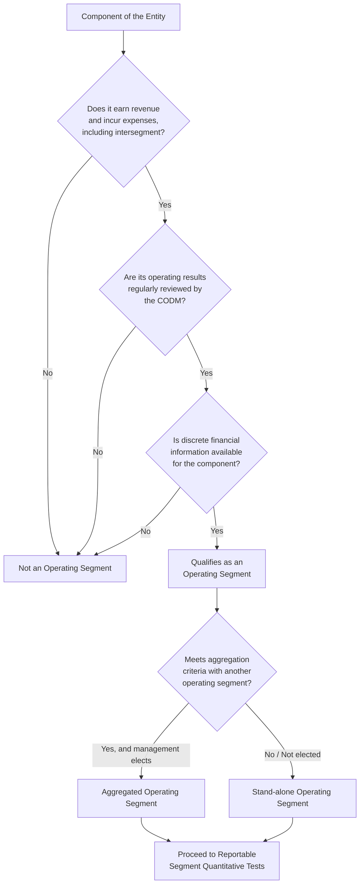

## Operating Segment Identification and the Management Approach

### Overview

The identification of operating segments is the foundational step in segment reporting under both IFRS 8 *Operating Segments* and ASC 280 *Segment Reporting* (US GAAP). Both standards converge on a single methodology known as the **management approach**, which represents a deliberate departure from the earlier **risk-and-reward approach** used under the predecessor standards (IAS 14 *Segment Reporting* and SFAS 14). Understanding why this shift occurred, and how it operates mechanically, is central to mastering this topic.

### Historical Context: Risk-and-Reward vs. Management Approach

**Key Points**

- Under IAS 14 (superseded), segments were defined based on differing risks and rates of return, requiring preparers to construct segments using two bases: business segments and geographical segments, regardless of internal reporting structure.
- This created a disconnect between external segment disclosures and how management actually ran the business, since companies had to re-engineer their internal data into externally-imposed categories.
- The management approach, introduced by SFAS 131 (1997) in the US and later adopted by IFRS 8 (2006, effective 2009), eliminated this disconnect by requiring segments to mirror the internal organizational and reporting structure used by the chief operating decision maker (CODM).
- The rationale: information that management itself uses to run the business and allocate resources is inherently more decision-useful to external users than an artificially constructed segmentation scheme.

### Definition of an Operating Segment

Under both IFRS 8.5 and ASC 280-10-50-1, a component of an entity is an **operating segment** if it meets **all three** of the following criteria:

1. **Revenue-and-expense-generating activities**: It engages in business activities from which it may earn revenues and incur expenses, including revenues and expenses relating to transactions with other components of the same entity (i.e., intercompany/intersegment transactions count).
2. **CODM review**: Its operating results are regularly reviewed by the entity's chief operating decision maker (CODM) to make decisions about resources to be allocated to the segment and to assess its performance.
3. **Discrete financial information availability**: Discrete financial information is available for it.

**Example**

A diversified conglomerate has four internal reporting lines: Consumer Electronics, Industrial Equipment, Financial Services, and a Corporate Treasury function that manages excess cash centrally. Consumer Electronics, Industrial Equipment, and Financial Services each generate revenue from external customers, have discrete P&Ls reviewed monthly by the CEO (the CODM), and receive capital allocation decisions based on those reviews — all three qualify as operating segments. Corporate Treasury generates minimal external revenue (mostly interest income) and exists to serve internal functions; it typically does **not** qualify as an operating segment because it fails criterion 1 in substance (it is not a revenue-generating business activity in the operating sense), even though discrete financials may exist for it. It would instead often be captured within "all other segments" or a corporate/unallocated reconciling category.

### Identifying the Chief Operating Decision Maker (CODM)

The CODM is not necessarily a single individual holding a specific title — it is a **function**, not a position.

**Key Points**

- IFRS 8.7 and ASC 280-10-50-5 describe the CODM as a function that allocates resources to and assesses the performance of the operating segments of an entity.
- The CODM could be the CEO, a COO, an Executive Committee, a Management Committee, or even a group of executives collectively — the substance of the decision-making authority governs, not the job title.
- [Inference] In practice, auditors and preparers typically identify the CODM by examining board packages, internal management reporting packages, budget/forecast review processes, and compensation/bonus metrics tied to segment performance, since these documents reveal who actually receives and acts on segment-level information.
- A company may have more than one set of internal reports (e.g., by product line and by geography). When multiple internal reporting structures exist, the entity must determine which one the CODM primarily uses to allocate resources and assess performance — this becomes the basis for segmentation. If segments identified on bases other than products/services or geography meet the definition (core principle) and the criteria, and are based on a matrix organizational structure, IFRS 8.10 explicitly permits identifying segments based on products/services even when a matrix structure exists.

**Example**

A company organizes internal management reports two ways: (1) by product line (Software, Hardware, Services) reviewed weekly by the CEO for operational decisions, and (2) by geography (Americas, EMEA, APAC) prepared quarterly for board-level strategic discussion only. Because the CEO (CODM) uses the product-line reports regularly to allocate resources (e.g., R&D budget) and assess performance (e.g., deciding whether to divest Hardware), the product-line structure — not geography — determines the operating segments.

### Regular Review and Discrete Financial Information

**Key Points**

- "Regularly reviewed" does not require a fixed frequency (monthly, quarterly) — the standard focuses on whether the CODM uses the information on a recurring basis to make resource allocation and performance assessment decisions, not on a rigid calendar cadence. [Inference] Weekly, monthly, and quarterly reviews are all commonly observed in practice, but ad hoc or one-time reviews would not satisfy "regular."
- "Discrete financial information" means information distinguishable from the rest of the entity — it need not be full GAAP/IFRS-compliant financial statements. Partial information (e.g., only revenue and a contribution margin, without full balance sheet data) can still be discrete financial information if that is the level at which the CODM evaluates the component.
- The absence of a complete set of financials (e.g., no allocated assets or liabilities) does **not** by itself disqualify a component from being an operating segment, provided the CODM regularly reviews whatever operating results are available for it.

### Aggregation of Operating Segments

Once operating segments are identified, an entity may — but is not required to — **aggregate two or more operating segments into a single operating segment** for reporting purposes, provided aggregation is consistent with the core principle of the standard and the segments have **similar economic characteristics**, AND are similar in **all** of the following respects (IFRS 8.12 / ASC 280-10-50-11):

1. The nature of the products and services
2. The nature of the production processes
3. The type or class of customer for their products and services
4. The methods used to distribute their products or provide their services
5. If applicable, the nature of the regulatory environment (e.g., banking, insurance, public utilities)

**Key Points**

- Aggregation happens at the operating-segment level (i.e., before or as part of forming reportable segments), not as a way to bypass identifying operating segments in the first place.
- [Inference] Aggregation is often used to keep the number of reportable segments manageable and to combine genuinely similar businesses so disclosures remain meaningful rather than fragmented, but auditors and regulators (e.g., the SEC) scrutinize aggregation decisions closely because over-aggregation can obscure decision-useful information.
- Two operating segments failing the "similar economic characteristics" test (e.g., materially different gross margins or growth trajectories) generally should not be aggregated even if some of the five qualitative factors match.

**Example**

A retailer operates "Urban Stores" and "Suburban Stores" as two internally reported operating segments. Both sell the same product mix (nature of products/services), use identical supply chain and logistics processes (production/distribution methods), target the same general consumer demographic (type of customer), and operate under the same regulatory environment. If their gross margins and comparable-store sales growth trends are similar (similar economic characteristics), management may aggregate them into a single "Retail Stores" operating segment for reporting purposes.

### From Operating Segments to Reportable Segments

Identifying operating segments is distinct from — and precedes — determining which segments must be **separately reported** ("reportable segments"). This distinction is often tested.

**Key Points**

- Operating segment identification asks: "What are the components of the business the CODM manages and reviews?"
- Reportable segment determination (a separate, subsequent step) applies quantitative thresholds — the 10% tests for revenue, profit or loss, and assets, plus the 75% total external revenue test — to decide which operating segments (or aggregations thereof) must be disclosed separately, with the remainder bucketed into "all other segments."
- [Unverified] The specific mechanics of the quantitative thresholds and the "all other" category are typically covered as a separate syllabus item; this item focuses specifically on the identification methodology (the management approach) rather than the quantification thresholds.

### Diagram: Operating Segment Identification Process Flow

### Diagram: CODM Function Within Governance Structure (svg_diagram)

<svg viewBox="0 0 720 320" xmlns="http://www.w3.org/2000/svg">
<text x="360" y="24" text-anchor="middle" font-size="15" font-weight="bold" font-family="Arial, sans-serif">CODM Function and Segment Information Flow (svg_diagram)</text>
<rect x="270" y="45" width="180" height="50" rx="6" fill="#e8eef7" stroke="#2c5282" stroke-width="1.5"/>
<text x="360" y="66" text-anchor="middle" font-size="12" font-weight="bold" font-family="Arial, sans-serif">Chief Operating</text>
<text x="360" y="82" text-anchor="middle" font-size="12" font-weight="bold" font-family="Arial, sans-serif">Decision Maker (CODM)</text>
<line x1="360" y1="95" x2="360" y2="120" stroke="#4a5568" stroke-width="1.5"/>
<text x="375" y="112" font-size="10" font-family="Arial, sans-serif">reviews &amp; allocates</text>
<rect x="60" y="130" width="150" height="55" rx="6" fill="#f0f4f8" stroke="#4a5568" stroke-width="1.2"/>
<text x="135" y="152" text-anchor="middle" font-size="11" font-family="Arial, sans-serif">Component A</text>
<text x="135" y="167" text-anchor="middle" font-size="10" font-family="Arial, sans-serif">Discrete financials:</text>
<text x="135" y="179" text-anchor="middle" font-size="10" font-family="Arial, sans-serif">Revenue, Margin, Assets</text>
<rect x="285" y="130" width="150" height="55" rx="6" fill="#f0f4f8" stroke="#4a5568" stroke-width="1.2"/>
<text x="360" y="152" text-anchor="middle" font-size="11" font-family="Arial, sans-serif">Component B</text>
<text x="360" y="167" text-anchor="middle" font-size="10" font-family="Arial, sans-serif">Discrete financials:</text>
<text x="360" y="179" text-anchor="middle" font-size="10" font-family="Arial, sans-serif">Revenue, Contribution Margin</text>
<rect x="510" y="130" width="150" height="55" rx="6" fill="#faf0e6" stroke="#a0522d" stroke-width="1.2" stroke-dasharray="4,3"/>
<text x="585" y="152" text-anchor="middle" font-size="11" font-family="Arial, sans-serif">Corporate/Treasury</text>
<text x="585" y="167" text-anchor="middle" font-size="10" font-family="Arial, sans-serif">Not revenue-generating</text>
<text x="585" y="179" text-anchor="middle" font-size="10" font-family="Arial, sans-serif">in the operating sense</text>
<line x1="135" y1="95" x2="135" y2="130" stroke="#2c5282" stroke-width="1.2"/>
<line x1="360" y1="95" x2="360" y2="130" stroke="#2c5282" stroke-width="1.2"/>
<line x1="585" y1="95" x2="585" y2="130" stroke="#a0522d" stroke-width="1.2" stroke-dasharray="4,3"/>
<rect x="60" y="215" width="150" height="40" rx="6" fill="#e6f4ea" stroke="#2f855a" stroke-width="1.5"/>
<text x="135" y="240" text-anchor="middle" font-size="11" font-weight="bold" font-family="Arial, sans-serif">Operating Segment</text>
<rect x="285" y="215" width="150" height="40" rx="6" fill="#e6f4ea" stroke="#2f855a" stroke-width="1.5"/>
<text x="360" y="240" text-anchor="middle" font-size="11" font-weight="bold" font-family="Arial, sans-serif">Operating Segment</text>
<rect x="510" y="215" width="150" height="40" rx="6" fill="#f5e6e6" stroke="#c53030" stroke-width="1.5"/>
<text x="585" y="240" text-anchor="middle" font-size="11" font-weight="bold" font-family="Arial, sans-serif">Excluded / Reconciling</text>
<line x1="135" y1="185" x2="135" y2="215" stroke="#2f855a" stroke-width="1.2"/>
<line x1="360" y1="185" x2="360" y2="215" stroke="#2f855a" stroke-width="1.2"/>
<line x1="585" y1="185" x2="585" y2="215" stroke="#c53030" stroke-width="1.2"/>

<text x="360" y="290" text-anchor="middle" font-size="10" font-style="italic" font-family="Arial, sans-serif">All three components pass criterion 1 & 2 review; only A and B also generate revenue in the operating sense</text>

</svg>

### Common Forensic and Exam Pitfalls

**Key Points**

- **Mislabeling reportable segments as operating segments**: An entity may have, say, 12 operating segments but only 5 reportable segments after applying the 10% quantitative thresholds and aggregation. Candidates frequently conflate the two.
- **Assuming the CODM must be a single named executive**: Exam questions often test whether a Management Committee or group of senior executives can constitute the CODM — it can, since the standard defines a function.
- **Ignoring intersegment transactions**: A component transacting only internally with other segments (transfer pricing arrangements) can still meet the revenue/expense criterion, since IFRS 8.5(a) explicitly includes intersegment revenues and expenses.
- **Forensic accounting angle**: [Inference] Because segment identification is judgment-driven and relies on internal management reporting that is not independently verifiable by outside parties, it can be a vector for earnings management or strategic obfuscation — for example, deliberately structuring internal reporting or CODM review packages to justify aggregating a poorly-performing segment into a stronger one, thereby avoiding disclosure of a business unit's deteriorating economics. Forensic examiners often request the actual internal management reports reviewed by the CODM (board decks, budget review materials) to test whether the externally disclosed segment structure genuinely matches internal reality, since a mismatch is a red flag for manipulated segment disclosure.

### Disclosure Implications Tied to Identification

**Key Points**

- Once operating/reportable segments are identified, IFRS 8.23 and ASC 280-10-50-22 require disclosure of a measure of profit or loss and total assets for each reportable segment, along with specified items included in that measure (e.g., revenues from external customers, intersegment revenues, interest revenue/expense, depreciation and amortization, material non-cash items, income tax expense/benefit, and material non-recurring items) — but **only to the extent such amounts are included in the measure reviewed by the CODM or otherwise regularly provided to the CODM.**
- This is a direct consequence of the management approach: disclosure follows what the CODM actually sees, not a standardized external template. This can result in segment measures of profit that are non-GAAP/non-IFRS internal metrics (e.g., a management-defined "segment contribution" that excludes certain corporate allocations), requiring reconciliation to consolidated totals.

### Reconciliation Requirement

**Key Points**

- Because segment measures may follow internal management definitions rather than the entity's overall accounting policies, both IFRS 8.28 and ASC 280-10-50-30 require reconciliations of total reportable segment revenues, profit or loss, assets, liabilities, and other material items to the corresponding entity totals in the consolidated financial statements.
- [Inference] This reconciliation is often where analysts and forensic examiners look for unexplained "corporate/other" reconciling items that may mask cost allocations, one-time items, or performance that management prefers not to attribute to any single segment.

**Related Topics**

- Reportable segment quantitative thresholds (10% tests) and the 75% external revenue test
- Aggregation criteria applied in practice — case studies of SEC comment letters on segment aggregation
- Entity-wide disclosures (products/services, geographic areas, major customers) under IFRS 8.32–34 / ASC 280-10-50-38–42
- Reconciliation of segment totals to consolidated financial statement totals
- Restatement of segment information upon reorganization of internal reporting structure (IFRS 8.29 / ASC 280-10-50-34)
- Interim segment reporting requirements (IAS 34 vs. ASC 270/280 interaction)
- Forensic red flags in segment disclosure manipulation and SEC enforcement cases involving segment misclassification