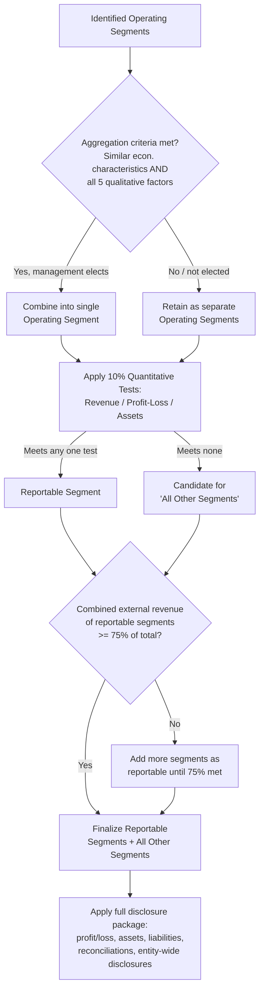

## Segment Disclosure Requirements and Aggregation Criteria

### Overview

Once operating segments have been identified through the management approach, two distinct — but related — analytical steps follow: (1) applying **aggregation criteria** to optionally combine similar operating segments, and (2) applying **quantitative thresholds** to determine which operating segments (aggregated or not) become **reportable segments** subject to detailed disclosure. This item covers both the aggregation mechanics and the full disclosure package required under IFRS 8 *Operating Segments* and ASC 280 *Segment Reporting*.

### Aggregation Criteria (Detailed)

**Key Points**

- Aggregation is **permitted, not required**. Management may elect to combine two or more operating segments into one if the combination is consistent with the core principle of segment reporting and the segments are similar.
- The **core principle** (IFRS 8.1 / ASC 280-10-10-1) is that an entity shall disclose information to enable users of financial statements to evaluate the nature and financial effects of the business activities in which it engages and the economic environments in which it operates. Aggregation must not undermine this objective.
- Two operating segments may be aggregated only if they have **similar economic characteristics** AND are similar in each of the following (all must be met — this is a conjunctive test):
  1. **Nature of products and services**
  2. **Nature of production processes**
  3. **Type or class of customer** for products and services
  4. **Methods used to distribute products or provide services**
  5. **Nature of the regulatory environment**, if applicable (e.g., banking, insurance, utilities)

**Similar Economic Characteristics — Indicators**

[Inference] Neither IFRS 8 nor ASC 280 prescribes a bright-line quantitative test for "similar economic characteristics," but practice (supported by both standards' Basis for Conclusions discussions) generally looks at comparability of:

- Long-term average gross margins
- Historical and expected future growth rates
- Similarity of risk profiles (e.g., cyclicality, capital intensity)
- ASU 2018-19 / ASC 280 implementation guidance suggests entities may look at whether segments have similar expectations of long-term financial performance, such as long-term average gross margins, for entities operating in cyclical industries.

**Example**

A pharmaceutical company has three operating segments: "Branded Prescription Drugs," "Generic Drugs," and "Animal Health." Branded and Generic drugs both involve pharmaceutical manufacturing, target the same regulatory environment (FDA/EMA drug approval regimes), sell to similar customer classes (pharmacies, hospitals, distributors), and use the same distribution channels. However, Branded Drugs typically carries much higher gross margins and different growth dynamics than Generic Drugs due to patent protection versus commoditized pricing — failing the "similar economic characteristics" test despite meeting the five qualitative factors. Aggregation would likely not be appropriate. Animal Health fails on customer type, distribution channel, and often regulatory environment, so it clearly cannot be aggregated with either.

### Quantitative Thresholds for Reportable Segments

An operating segment (or an aggregation of operating segments meeting the aggregation criteria) becomes a **reportable segment** if it satisfies **any one** of the following three quantitative thresholds (IFRS 8.13 / ASC 280-10-50-12):

1. **Revenue test**: Its reported revenue, including both sales to external customers and intersegment sales or transfers, is 10% or more of the combined revenue, internal and external, of all operating segments.
2. **Profit or loss test**: The absolute amount of its reported profit or loss is 10% or more of the greater, in absolute amount, of:

   (i) the combined reported profit of all operating segments that did not report a loss, or

   (ii) the combined reported loss of all operating segments that did report a loss.
3. **Assets test**: Its assets are 10% or more of the combined assets of all operating segments.

**Key Points**

- These are "or" tests — meeting any single threshold is sufficient to require separate reporting; an entity does not need to meet all three.
- [Inference] The profit-or-loss test's "greater of absolute combined profits or absolute combined losses" mechanic is frequently miscalculated by candidates — it is not simply 10% of consolidated net income, and the two pools (profitable segments vs. loss-making segments) must be computed and compared separately before taking the greater one as the denominator.
- Segments not meeting any threshold may still be voluntarily reported separately at management's discretion, or if management believes information about the segment would be useful to users.

**Example — Profit or Loss Test Calculation**

An entity has five operating segments with the following reported profit/(loss):

- Segment A: profit of 800
- Segment B: profit of 500
- Segment C: profit of 200
- Segment D: loss of (300)
- Segment E: loss of (150)

Combined profit of segments not reporting a loss (A+B+C) = 1,500

Combined loss of segments reporting a loss (D+E), absolute value = 450

The greater of the two in absolute terms is 1,500. The 10% threshold is therefore 150.

- Segment A (800) passes — exceeds 150
- Segment B (500) passes
- Segment C (200) passes
- Segment D (300, absolute value) passes
- Segment E (150, absolute value) — exactly equals the threshold, so it **passes** ("10% or more" includes equality)

All five segments meet the profit/loss test in this scenario.

### The 75% External Revenue Test (Sufficiency Test)

**Key Points**

- After identifying reportable segments via the 10% tests, IFRS 8.15 / ASC 280-10-50-13 require an additional check: total external revenue reported by all reportable segments combined must constitute **at least 75%** of total consolidated entity revenue.
- If reportable segments identified via the 10% thresholds do not collectively reach 75% of total external revenue, **additional operating segments must be identified as reportable segments** (even if they individually failed all three 10% tests) until the 75% threshold is satisfied.
- Segments not separately reportable are combined and disclosed in an **"all other segments"** category, with the sources of revenue included in that category described.

**Example**

An entity's total consolidated external revenue is 1,000. Segments meeting the 10% tests (A, B, C) together generate 650 of external revenue — only 65% of the total, below the 75% threshold. Management must therefore designate additional operating segments as reportable — for example, adding Segment D (which failed all three 10% tests but has the next-largest external revenue) — until the cumulative external revenue of reportable segments reaches at least 750 (75%).

### Practical Limit on Number of Segments

**Key Points**

- [Inference] Neither standard sets a hard numerical cap, but both include guidance suggesting that as the number of reportable segments increases beyond ten, the entity should consider whether a practical limit has been reached, since detailed information may begin to lose its usefulness (IFRS 8.19 / ASC 280-10-50-18 both reference this consideration, though "ten" is described as a general guideline rather than a strict rule).
- If the number of reportable segments exceeds this practical limit, management should consider whether some segments should be combined.

### Comprehensive Disclosure Requirements for Reportable Segments

**1. General Information (IFRS 8.22 / ASC 280-10-50-21)**

- Factors used to identify the entity's reportable segments, including the basis of organization (e.g., by products/services, geography, regulatory environment, or a combination)
- Types of products and services from which each reportable segment derives its revenues

**2. Information About Profit or Loss, Assets, and Liabilities (IFRS 8.23–24 / ASC 280-10-50-22)**

A measure of profit or loss for each reportable segment must be disclosed, and the following items **must be separately disclosed if included in the segment profit/loss measure reviewed by the CODM**, or if regularly provided to the CODM even if not included in the profit/loss measure:

- Revenues from external customers
- Revenues from transactions with other operating segments of the same entity (intersegment revenue)
- Interest revenue (reported separately from interest expense unless a majority of segment revenue is from interest and the CODM relies primarily on net interest revenue)
- Interest expense
- Depreciation and amortization
- Material items of income and expense disclosed under IAS 1 (IFRS) or unusual/infrequent items (US GAAP)
- The entity's interest in the profit or loss of equity-method investees
- Income tax expense or benefit
- Material non-cash items other than depreciation and amortization

Total assets and total liabilities must be disclosed for each reportable segment **if such amounts are regularly provided to the CODM**, along with:

- Investment in equity-method associates/joint ventures
- Amounts of additions to non-current assets (IFRS) / long-lived assets (US GAAP) other than financial instruments, deferred tax assets, and certain other exclusions

**3. Measurement Basis**

- Segment amounts are reported on the basis actually used internally by the CODM — not necessarily consistent with the entity's overall recognition and measurement policies under IFRS/US GAAP. This is a direct consequence of the management approach.
- Allocation bases for shared/common costs must be explained if allocated to segments in the measure reviewed by the CODM.

**4. Reconciliations (IFRS 8.28 / ASC 280-10-50-30)**

The entity must reconcile, separately, the totals of all reportable segments' amounts to the corresponding consolidated entity amounts for:

- Revenues
- Profit or loss (with material reconciling items separately identified and described)
- Assets
- Liabilities (if disclosed)
- Every other material disclosed segment item

**5. Entity-Wide Disclosures (IFRS 8.31–34 / ASC 280-10-50-38–42)**

These apply to **all entities within scope, regardless of segment structure** — even entities with only one reportable segment must provide them:

- **Products and services**: revenue from external customers for each product/service or group of similar products/services
- **Geographic areas**: revenue from external customers and non-current assets, both attributed to (a) the entity's country of domicile and (b) all foreign countries in total (with disclosure of material individual countries)
- **Major customers**: if revenues from transactions with a single external customer amount to 10% or more of total entity revenue, that fact must be disclosed, along with the total revenue from each such customer and the identity of the segment(s) reporting the revenue (the customer's identity itself need not be disclosed — only that a major customer relationship exists, unless disclosure is otherwise required). Group of entities known to a reporting entity to be under common control are treated as a single customer for this purpose, as are government entities for jurisdiction-specific counting rules (e.g., federal government as a single customer).

### Diagram: Aggregation and Reportability Decision Sequence

### Diagram: Disclosure Package Components (svg_diagram)

<svg xmlns="http://www.w3.org/2000/svg" viewBox="0 0 740 380">
<text x="370" y="24" text-anchor="middle" font-size="15" font-weight="bold" font-family="Arial, sans-serif">Segment Disclosure Package Components (svg_diagram)</text>
<rect x="290" y="40" width="160" height="40" rx="6" fill="#e8eef7" stroke="#2c5282" stroke-width="1.5" />
<text x="370" y="65" text-anchor="middle" font-size="12" font-weight="bold" font-family="Arial, sans-serif">Reportable Segments</text>
<line x1="370" y1="80" x2="150" y2="110" stroke="#4a5568" stroke-width="1.2" />
<line x1="370" y1="80" x2="370" y2="110" stroke="#4a5568" stroke-width="1.2" />
<line x1="370" y1="80" x2="590" y2="110" stroke="#4a5568" stroke-width="1.2" />
<rect x="60" y="110" width="180" height="55" rx="6" fill="#f0f4f8" stroke="#4a5568" stroke-width="1.2" />
<text x="150" y="130" text-anchor="middle" font-size="11" font-weight="bold" font-family="Arial, sans-serif">General Information</text>
<text x="150" y="146" text-anchor="middle" font-size="9" font-family="Arial, sans-serif">Identification factors,</text>
<text x="150" y="158" text-anchor="middle" font-size="9" font-family="Arial, sans-serif">products/services basis</text>
<rect x="280" y="110" width="180" height="55" rx="6" fill="#f0f4f8" stroke="#4a5568" stroke-width="1.2" />
<text x="370" y="130" text-anchor="middle" font-size="11" font-weight="bold" font-family="Arial, sans-serif">Profit/Loss, Assets,</text>
<text x="370" y="145" text-anchor="middle" font-size="11" font-weight="bold" font-family="Arial, sans-serif">Liabilities</text>
<text x="370" y="159" text-anchor="middle" font-size="9" font-family="Arial, sans-serif">per CODM-reviewed measure</text>
<rect x="500" y="110" width="180" height="55" rx="6" fill="#f0f4f8" stroke="#4a5568" stroke-width="1.2" />
<text x="590" y="130" text-anchor="middle" font-size="11" font-weight="bold" font-family="Arial, sans-serif">Reconciliations</text>
<text x="590" y="146" text-anchor="middle" font-size="9" font-family="Arial, sans-serif">Segment totals to</text>
<text x="590" y="158" text-anchor="middle" font-size="9" font-family="Arial, sans-serif">consolidated totals</text>
<line x1="370" y1="165" x2="370" y2="200" stroke="#4a5568" stroke-width="1.2" />
<rect x="140" y="200" width="460" height="40" rx="6" fill="#e6f4ea" stroke="#2f855a" stroke-width="1.5" />
<text x="370" y="225" text-anchor="middle" font-size="12" font-weight="bold" font-family="Arial, sans-serif">Entity-Wide Disclosures (all entities, even single-segment)</text>
<line x1="370" y1="240" x2="220" y2="270" stroke="#2f855a" stroke-width="1.2" />
<line x1="370" y1="240" x2="370" y2="270" stroke="#2f855a" stroke-width="1.2" />
<line x1="370" y1="240" x2="520" y2="270" stroke="#2f855a" stroke-width="1.2" />
<rect x="120" y="270" width="200" height="40" rx="6" fill="#faf5e6" stroke="#b7791f" stroke-width="1.2" />
<text x="220" y="294" text-anchor="middle" font-size="10" font-family="Arial, sans-serif">Products &amp; Services Revenue</text>
<rect x="340" y="270" width="60" height="40" rx="6" fill="#faf5e6" stroke="#b7791f" stroke-width="1.2" />
<text x="370" y="288" text-anchor="middle" font-size="9" font-family="Arial, sans-serif">Geographic</text>
<text x="370" y="300" text-anchor="middle" font-size="9" font-family="Arial, sans-serif">Areas</text>
<rect x="420" y="270" width="200" height="40" rx="6" fill="#faf5e6" stroke="#b7791f" stroke-width="1.2" />
<text x="520" y="294" text-anchor="middle" font-size="10" font-family="Arial, sans-serif">Major Customers (≥10%)</text>

<text x="370" y="345" text-anchor="middle" font-size="10" font-style="italic" font-family="Arial, sans-serif">Entity-wide disclosures apply regardless of how many reportable segments exist</text>

</svg>

### Interim Financial Reporting Interaction

**Key Points**

- [Unverified] Under IAS 34 *Interim Financial Reporting*, condensed interim financial statements require segment revenue and segment profit/loss disclosures for reportable segments consistent with the most recent annual financial statements, with material changes explained — the full annual disclosure package (all IFRS 8 line items) is not required at interim dates.
- Under ASC 270 (interim reporting) interacting with ASC 280, US GAAP similarly requires interim disclosure of segment revenues from external and intersegment customers, a measure of segment profit or loss, total assets if materially changed, and a description of any differences from the basis used in the last annual report — again a reduced disclosure set relative to full annual reporting.
- This interim/annual distinction is frequently tested as a comparison point separate from full annual segment disclosure requirements.

### Common Forensic and Exam Pitfalls

**Key Points**

- **Applying the 10% test to net income instead of segment-level profit/loss pools**: candidates often incorrectly use consolidated net income as the base for the profit/loss test rather than computing the "greater of absolute combined profits vs. absolute combined losses" of the operating segments themselves.
- **Forgetting the 75% sufficiency test** after applying only the 10% thresholds, resulting in an incomplete set of reportable segments.
- **Treating aggregation as mandatory** rather than an option requiring all five qualitative factors plus similar economic characteristics.
- **Forensic angle**: [Inference] Because segment profit/loss can be measured on an internally-defined, non-GAAP/IFRS basis, this creates an opportunity for management to selectively include or exclude cost allocations in the CODM-reviewed measure to make a segment appear to fail (or pass) the 10% thresholds, effectively controlling which segments must be separately disclosed. Forensic examiners often compare the CODM's internal reporting package against the externally disclosed segment measure to test for this kind of selective measurement engineering, and scrutinize the "all other segments" and reconciling "corporate" categories for unusually large or vaguely described amounts that might be concealing segment-level underperformance.

**Related Topics**

- Operating segment identification and the management approach (foundational prerequisite topic)
- Restatement of previously reported segment information following a change in internal organizational structure
- SEC comment letter trends on segment aggregation and disclosure sufficiency
- Segment reporting under a matrix organizational structure (IFRS 8.10 / dual reporting lines)
- Non-GAAP segment profitability measures and their reconciliation to consolidated GAAP/IFRS net income
- Goodwill impairment testing at the reporting unit/CGU level and its relationship to operating segments (ASC 350 / IAS 36 interaction)
- Geographic and product/service entity-wide disclosures in practice — illustrative disclosures from real filings