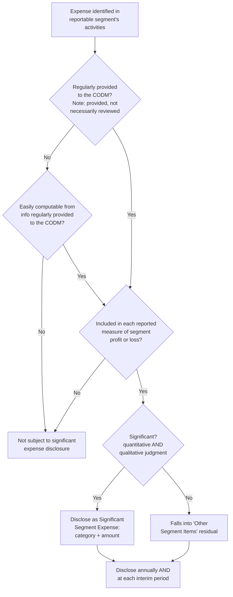

## Chief Operating Decision Maker and Segment Expense Disclosures

### Overview

This item covers two related but distinct dimensions of segment reporting: (1) the identification and specific disclosure of the chief operating decision maker (CODM), and (2) the significantly expanded segment expense disclosure requirements introduced by **ASU 2023-07, *Segment Reporting (Topic 280): Improvements to Reportable Segment Disclosures***, issued by the FASB in November 2023. ASU 2023-07 represents the most significant change to US GAAP segment reporting since SFAS 131 introduced the management approach in 1997, and it is now the current operative guidance under ASC 280 as amended.

### Scope and Effective Date of ASU 2023-07

**Key Points**

- ASU 2023-07 does not change how an entity identifies its CODM, identifies operating segments, aggregates operating segments, or applies the quantitative reportability thresholds — the ASU is intended to improve reportable segment disclosure requirements primarily by requiring entities to provide more disaggregated expense information about their reportable segments, and it does not change how an entity identifies its CODM and operating segments, aggregates operating segments into reportable segments, and applies the quantitative thresholds to determine its reportable segments. [deloitte](https://dart.deloitte.com/USDART/home/codification/presentation/asc280-10/roadmap-segment-reporting/chapter-6-significant-expenses-other-segment/6-1-overview-asu-2023-07)
- ASU 2023-07 is effective for public entities' fiscal years beginning after December 15, 2023, and interim periods within fiscal years beginning after December 15, 2024, with early adoption permitted. [kpmg](https://kpmg.com/us/en/frv/reference-library/2023/fasb-issues-asu-requiring-new-segment-disclosures.html)
- Retrospective application is required — entities must recast prior-period segment disclosures to conform to the new requirements. [edgar](https://app.edgar.tools/companies/AENT/disclosures/new-accounting-standards)
- A critical scope expansion: entities with a single reportable segment must now provide all segment disclosures required in ASC 280, including the new disclosures under the amendments — this eliminated prior ambiguity about whether single-segment entities needed to provide segment-level (as opposed to only entity-level) disclosures. [eisneramper](https://eisneramper.com/insights/audit-assurance/new-segment-disclosures-1024)

### CODM Identity Disclosure Requirement

**Key Points**

- Beyond the pre-existing requirement to *identify* the CODM function for purposes of determining operating segments, ASU 2023-07 adds an explicit **disclosure** requirement: the entity must disclose the title and position of the individual identified as the CODM and an explanation of how the CODM uses the reported measures of a segment's profit or loss in assessing segment performance and deciding how to allocate resources. [sec](https://www.sec.gov/Archives/edgar/data/928340/000155837024012242/R16.htm)
- Where the CODM is not a single individual, disclosure extends to a collective body: the new guidance requires entities to disclose the title and position of the individual or the name of the group or committee identified as the chief operating decision maker. [sec](https://www.sec.gov/Archives/edgar/data/895728/000089572824000028/R24.htm)
- This is a **qualitative narrative disclosure**, distinct from the profit/loss and expense disclosures — it requires prose explaining the CODM's decision-making role, not just a label.

**Example**

A mid-cap manufacturer's segment footnote might state: *"Our Chief Executive Officer is our chief operating decision maker (CODM). The CODM uses segment operating income, which excludes corporate overhead allocations and stock-based compensation, to evaluate segment performance and to decide how to allocate capital expenditures and working capital across the Industrial Products and Consumer Products segments."* This single sentence satisfies both the title/position disclosure and the "how the CODM uses the measure" explanation required by ASU 2023-07.

### The Significant Expense Principle

**Key Points**

- The centerpiece of ASU 2023-07 is the **"significant expense principle."** The amendments require that a public entity disclose, on an annual and interim basis, significant segment expenses that are regularly provided to the CODM and included within each reported measure of segment profit or loss. [wpengine](https://centristage.wpengine.com/?p=3048)
- Three conjunctive conditions must all be met for an expense category to require disclosure: expenses that are (1) considered significant, including categories of expense and amounts; (2) regularly provided to the CODM; and (3) included in each reported measure of segment profit and loss. [deloitte](https://dart.deloitte.com/USDART/home/codification/presentation/asc280-10/roadmap-segment-reporting/chapter-6-significant-expenses-other-segment/6-2-significant-segment-expenses)
- Critically, the "regularly provided" condition is broader than "regularly reviewed": the ASU focuses on the disclosure of information that is regularly provided to the CODM, even if it is not regularly reviewed by the CODM. This is a deliberately lower bar than the CODM-*review* standard used for identifying operating segments in the first place. [deloitte](https://dart.deloitte.com/USDART/home/codification/presentation/asc280-10/roadmap-segment-reporting/chapter-6-significant-expenses-other-segment/6-2-significant-segment-expenses)
- Segment expenses under this principle are still governed by the management approach: the identification of segment expenses by reportable segment is based on the management approach and therefore requires that the segment expenses be regularly provided to the CODM; significant segment expense amounts will not necessarily tie to or be the same as the expense amounts and captions identified on the face of the income statement in accordance with U.S. GAAP. [deloitte](https://dart.deloitte.com/USDART/home/codification/presentation/asc280-10/roadmap-segment-reporting/chapter-6-significant-expenses-other-segment/6-2-significant-segment-expenses)
- Significant expenses are not limited to directly-traceable costs: significant expenses could include direct expenses to reportable segments or allocated costs shared across reportable segments; if an entity does not identify any significant segment expenses, then it will need to disclose the nature of expenses considered by the CODM when managing segment operations. [withum](https://www.withum.com/resources/fasb-issues-disclosure-improvements-to-segment-reporting-in-asu-2023-07/)

### Judgment Areas: "Significant," "Easily Computable," and "Regularly Provided"

**Key Points**

- Public entities need to use judgment in applying the terms "significant," "easily computable," and "regularly provided" when making their segment disclosures. [grantthornton](https://grantthornton.com/insights/articles/audit/2023/snapshot/december/fasb-expands-segment-disclosure-requirements)
- On significance: although the term "significant" is not explicitly defined in ASC 280 or by the amendments, entities are expected to apply the significance threshold in a manner similar to how the threshold is currently applied elsewhere in ASC 280, and the amendments require a public entity to consider both quantitative and qualitative factors when assessing significance, applying consistent judgments, policies, processes, and controls. [grantthornton](https://grantthornton.com/insights/articles/audit/2023/snapshot/december/fasb-expands-segment-disclosure-requirements)
- On "easily computable": the term is also not clearly defined in ASC 280, so entities need to use judgment in determining whether amounts are easily computable by the CODM based on information and metrics provided to the CODM. The Codification provides supplementary implementation guidance on this point: paragraphs 280-10-55-15A through 55-15B provide additional guidance on determining whether segment expense amounts can be easily computed. [grantthornton](https://grantthornton.com/insights/articles/audit/2023/snapshot/december/fasb-expands-segment-disclosure-requirements)[deloitte](https://dart.deloitte.com/USDART/home/codification/presentation/asc280-10/roadmap-segment-reporting/chapter-6-significant-expenses-other-segment/6-2-significant-segment-expenses)
- On "regularly provided" frequency: information provided at least quarterly would generally meet the criteria to be considered regularly provided; however, as communicated by the SEC staff during the 2023 AICPA & CIMA Conference on Current SEC and PCAOB Developments, information provided less than quarterly may also qualify — entities should consider their own facts and circumstances. [deloitte](https://dart.deloitte.com/USDART/home/codification/presentation/asc280-10/roadmap-segment-reporting/appendix-c-faqs-related-accounting-reporting/c-4-significant-segment-expenses-significance)

**Example — "Easily Computable" Trigger**

A company's CODM regularly receives segment revenue and segment gross margin by reportable segment, but not an explicit "cost of sales" line. Because cost of sales can be easily computed from revenue and gross margin amounts provided to the CODM, if cost of sales is significant, the company would need to disclose it as a significant segment expense — even though the CODM never literally saw a line item labeled "cost of sales." This illustrates that the disclosure obligation reaches derivable amounts, not merely amounts appearing verbatim in CODM reporting packages. [crosscountry-consulting](https://crosscountry-consulting.com/insights/blog/asu-2023-07-expansion-of-segment-disclosure-requirements)

### "Other Segment Items" — The Reconciling Category

**Key Points**

- Alongside significant expenses, entities must disclose a residual "other segment items" amount. The "other segment items" category is the difference between segment revenue and the significant expenses disclosed under the significant expense principle, and qualitative descriptions regarding the composition of other segment items must also be included; disclosure should be made for each reported measure of segment profit or loss. [withum](https://www.withum.com/resources/fasb-issues-disclosure-improvements-to-segment-reporting-in-asu-2023-07/)
- More precisely stated: entities are required to disclose other segment items by reportable segment, which are the difference between segment revenues, less significant segment expenses, and less segment profit or loss, along with a description of its composition. [eisneramper](https://eisneramper.com/insights/audit-assurance/new-segment-disclosures-1024)
- This "plug" category is analytically important — it is the bridge that reconciles disclosed significant expenses back to the CODM's reported segment profit/loss measure, and its composition description is where less-granular or miscellaneous costs surface.

### Multiple Measures of Segment Profit or Loss

**Key Points**

- Entities may disclose more than one measure of segment profit or loss provided that they disclose the measure that is most consistent with GAAP measurement principles. Restated: entities may disclose more than one measure of segment profit or loss used by the CODM as long as one of those measures is consistent with the measurement principles in U.S. GAAP. [deloitte](https://dart.deloitte.com/USDART/home/codification/presentation/asc280-10/roadmap-segment-reporting/chapter-1-overview-scope/1-9-improvements-reportable-segment-disclosures)[eisneramper](https://eisneramper.com/insights/audit-assurance/new-segment-disclosures-1024)
- If an entity elects to disclose multiple measures, the disclosure burden multiplies: if more than one measure is disclosed, all disclosure requirements (including significant segment expenses) must be disclosed, along with reconciliations of each measure of segment profit and loss to income before income taxes and discontinued operations. [crosscountry-consulting](https://crosscountry-consulting.com/insights/blog/asu-2023-07-expansion-of-segment-disclosure-requirements)
- [Inference] This provision accommodates entities whose CODM reviews both a GAAP-consistent measure (e.g., segment operating income) and a non-GAAP internal measure (e.g., segment adjusted EBITDA), without forcing a choice between the two — but it correspondingly increases disclosure volume and reconciliation burden when both are presented.
- The SEC has signaled comfort with this dual-measure approach from a non-GAAP-measures-regulation standpoint: the SEC has issued guidance on the use and disclosure of non-GAAP measures and will not object to additional non-GAAP measures being included if they are regularly reviewed and used by the CODM to allocate resources and assess segment performance and comply with the requirements of ASC 280 and the SEC's Regulation G and Regulation S-K. [eisneramper](https://eisneramper.com/insights/audit-assurance/new-segment-disclosures-1024)

### Single Reportable Segment Entities

**Key Points**

- Prior to ASU 2023-07, there was industry ambiguity about whether an entity with only one reportable segment needed segment-level disclosures at all (as opposed to only entity-wide disclosures). Prior to the release of the ASU, while entity-level disclosures were required, there wasn't clarity as to whether segment-level disclosures were required; this update eliminates that lack of clarity, requiring public entities with a single reportable segment to provide all currently required segment disclosures in ASC 280 as well as the incremental required disclosures under the new guidance. [crosscountry-consulting](https://crosscountry-consulting.com/insights/blog/asu-2023-07-expansion-of-segment-disclosure-requirements)
- Practical effect: a single-segment public company must now disclose significant segment expenses, other segment items, the CODM's title/position, and how the CODM uses the profit/loss measure — the full disclosure package — even though it has no segment-to-segment comparison to present.

### Interim Reporting Enhancement

**Key Points**

- ASU 2023-07 also closes a prior gap between annual and interim segment disclosure: entities must provide incremental interim disclosure requirements, and more specifically public entities will be required to provide all annual disclosures currently required by Topic 280 in interim periods. [deloitte](https://dart.deloitte.com/USDART/home/codification/presentation/asc280-10/roadmap-segment-reporting/chapter-6-significant-expenses-other-segment/6-1-overview-asu-2023-07)[edgar](https://app.edgar.tools/companies/AEXA/disclosures/new-accounting-standards)
- Prior to the ASU, interim segment reporting under ASC 270/280 required only a reduced disclosure set (segment revenue, a profit/loss measure, and material changes in assets). Post-ASU, the full annual-level segment expense disclosure package — including significant segment expenses and other segment items — must now also appear at each interim reporting date.

### Recasting of Prior-Period Information

**Key Points**

- Recasting of prior-period segment information to conform to current-period segment information is required if segment information regularly provided to the CODM is changed in a manner that causes the identification of significant segment expenses to change. [deloitte](https://dart.deloitte.com/USDART/home/codification/presentation/asc280-10/roadmap-segment-reporting/chapter-1-overview-scope/1-9-improvements-reportable-segment-disclosures)
- [Inference] This creates a linkage between changes in what the CODM is given internally and the entity's disclosure obligations — if internal management reporting evolves (e.g., a new expense category is added to CODM reports), the significant expense disclosure set may shift, triggering a recast of comparative periods, distinct from and in addition to the pre-existing requirement (IFRS 8.29 / unchanged ASC 280 base guidance) to restate segment information following a reorganization of the reporting structure itself.

### Diagram: Significant Expense Principle Decision Logic

### Diagram: ASC 280 Disclosure Reconciliation Waterfall (svg_diagram)

<svg xmlns="http://www.w3.org/2000/svg" viewBox="0 0 740 300">
<text x="370" y="24" text-anchor="middle" font-size="15" font-weight="bold" font-family="Arial, sans-serif">Segment Revenue to Profit/Loss Waterfall (svg_diagram)</text>
<rect x="40" y="60" width="140" height="60" rx="6" fill="#e8eef7" stroke="#2c5282" stroke-width="1.5" />
<text x="110" y="85" text-anchor="middle" font-size="11" font-weight="bold" font-family="Arial, sans-serif">Segment</text>
<text x="110" y="100" text-anchor="middle" font-size="11" font-weight="bold" font-family="Arial, sans-serif">Revenue</text>

<text x="200" y="95" text-anchor="middle" font-size="18" font-family="Arial, sans-serif">−</text>

<rect x="220" y="60" width="180" height="60" rx="6" fill="#f5e6e6" stroke="#c53030" stroke-width="1.5" />
<text x="310" y="80" text-anchor="middle" font-size="11" font-weight="bold" font-family="Arial, sans-serif">Significant Segment</text>
<text x="310" y="95" text-anchor="middle" font-size="11" font-weight="bold" font-family="Arial, sans-serif">Expenses</text>
<text x="310" y="110" text-anchor="middle" font-size="9" font-family="Arial, sans-serif">(by category, per ASU 2023-07)</text>

<text x="420" y="95" text-anchor="middle" font-size="18" font-family="Arial, sans-serif">−</text>

<rect x="440" y="60" width="150" height="60" rx="6" fill="#faf5e6" stroke="#b7791f" stroke-width="1.5" />
<text x="515" y="85" text-anchor="middle" font-size="11" font-weight="bold" font-family="Arial, sans-serif">Other Segment</text>
<text x="515" y="100" text-anchor="middle" font-size="11" font-weight="bold" font-family="Arial, sans-serif">Items (residual)</text>

<text x="610" y="95" text-anchor="middle" font-size="18" font-family="Arial, sans-serif">=</text>

<rect x="620" y="60" width="100" height="60" rx="6" fill="#e6f4ea" stroke="#2f855a" stroke-width="1.5" />
<text x="670" y="85" text-anchor="middle" font-size="11" font-weight="bold" font-family="Arial, sans-serif">Segment</text>
<text x="670" y="100" text-anchor="middle" font-size="11" font-weight="bold" font-family="Arial, sans-serif">Profit/Loss</text>
<line x1="110" y1="120" x2="110" y2="150" stroke="#4a5568" stroke-width="1" />
<line x1="670" y1="120" x2="670" y2="150" stroke="#4a5568" stroke-width="1" />
<rect x="60" y="160" width="640" height="45" rx="6" fill="#f0f4f8" stroke="#4a5568" stroke-width="1.2" stroke-dasharray="3,3" />
<text x="380" y="180" text-anchor="middle" font-size="10" font-family="Arial, sans-serif">Every element on this line must be "regularly provided to the CODM" and, for expenses,</text>
<text x="380" y="195" text-anchor="middle" font-size="10" font-family="Arial, sans-serif">"included in each reported measure of segment profit or loss" to be subject to disclosure</text>
<line x1="670" y1="120" x2="670" y2="245" stroke="#2f855a" stroke-width="1" />
<rect x="580" y="245" width="180" height="40" rx="6" fill="#e8eef7" stroke="#2c5282" stroke-width="1.2" />
<text x="670" y="270" text-anchor="middle" font-size="10" font-family="Arial, sans-serif">Reconciled to consolidated</text>
</svg>

### Common Forensic and Exam Pitfalls

**Key Points**

- **Confusing "regularly provided" with "regularly reviewed"**: a common exam trap is assuming an expense must be actively reviewed by the CODM to trigger disclosure — the significant expense principle's threshold is lower ("provided," not "reviewed"), which candidates frequently overstate.
- **Overlooking single-segment entity applicability**: candidates often assume a company with one reportable segment is exempt from detailed segment disclosures — post-ASU 2023-07, this is no longer true.
- **Treating "easily computable" amounts as out of scope**: an expense not literally itemized in CODM materials can still require disclosure if it is derivable from what the CODM does receive (e.g., cost of sales computed from revenue and gross margin).
- **Forensic angle**: [Inference] Because "significant" and "easily computable" both require judgment rather than bright-line tests, the significant expense principle creates a new area where management discretion can be exercised to minimize disclosed expense granularity — for example, structuring CODM reporting packages to avoid providing derivable-cost data, or aggressively classifying costs into the residual "other segment items" bucket rather than a named significant-expense category. Forensic examiners reviewing post-2024 filings should compare the qualitative description of "other segment items" composition across periods for unexplained growth in that residual relative to disclosed named expense categories, which may indicate an entity is using the judgment inherent in "significance" determinations to obscure segment-level cost trends.

**Related Topics**

- Operating segment identification and the management approach (foundational prerequisite)
- Segment disclosure requirements and aggregation criteria (10%/75% quantitative thresholds)
- Reconciliation of segment profit/loss measures to consolidated income before taxes
- Interim segment reporting requirements before and after ASU 2023-07
- IFRS 8 convergence status — the IASB has not adopted an equivalent significant expense principle, creating a US GAAP/IFRS divergence point
- SEC Regulation G and Regulation S-K non-GAAP measure requirements as applied to segment profit/loss measures
- Practical application and illustrative disclosures from early adopters' FY2024 Form 10-K filings