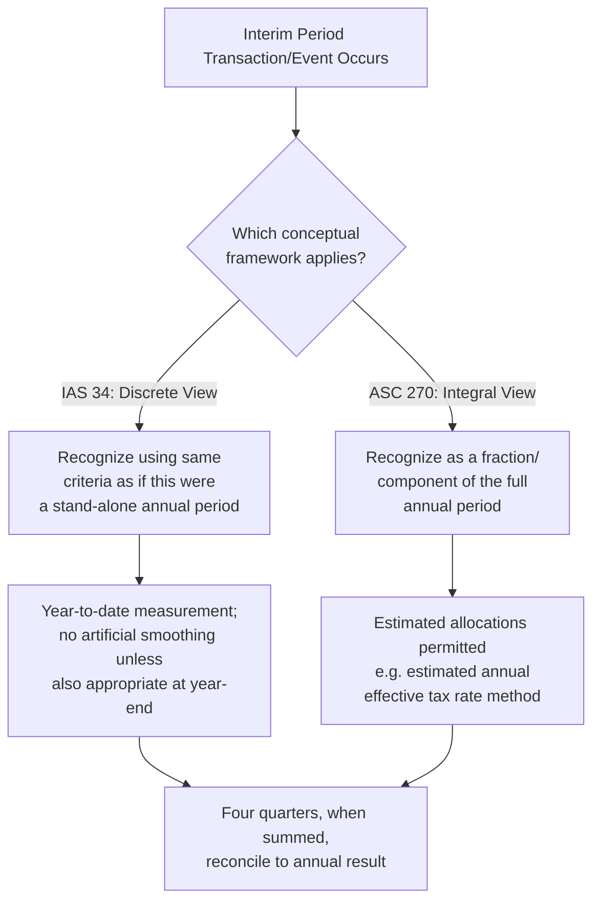

## Interim Reporting Principles and the Integral View

### Overview

Interim financial reporting addresses how an entity prepares financial statements for periods shorter than a full fiscal year (typically quarters). The central conceptual tension in interim reporting is between two competing theories of how an interim period relates to the full annual period: the **discrete view** and the **integral view**. This tension explains most of the technical divergences between IFRS (IAS 34) and US GAAP (ASC 270) approaches to interim reporting, and is one of the most heavily tested conceptual distinctions in this chapter.

### The Two Competing Theories

**Key Points**

**Discrete View**

- Under the discrete view, each interim period is treated as a **discrete, stand-alone accounting period**, conceptually equivalent to a full fiscal year in miniature.
- Revenues and expenses are recognized in the interim period in which they occur, using the same recognition and measurement principles applied in annual reporting, without regard to smoothing results across the full year.
- [Inference] The discrete view treats the interim period essentially as if it were the entity's only reporting period, applying the same accounting judgments and estimates that would be made if this were an annual close.

**Integral View**

- Under the integral view, each interim period is treated as an **integral part of the annual accounting period**. The interim period's results are seen as a fraction of the annual results, and certain costs and revenues may be allocated, accrued, or deferred across interim periods to better reflect the annual pattern of the entity's business activity.
- This view permits and, in some cases, requires interim-period estimation techniques (e.g., using an estimated annual effective tax rate rather than computing actual tax expense discretely each quarter) so that the interim result is a reasonable reflection of the portion of the year it represents.

### IFRS Position: IAS 34 Adopts the Discrete View

**Key Points**

- IAS 34 *Interim Financial Reporting* is built on the **discrete view**: an entity applies the same accounting policies in its interim financial statements as are applied in its annual financial statements, except for disclosure, and measurements for interim reporting purposes are made on a year-to-date basis.
- IAS 34.28 sets out the core discrete-view principle: an entity shall apply the same accounting policies in its interim financial statements as are applied in its annual financial statements. However, the frequency of an entity's reporting (annual, half-yearly, or quarterly) shall not affect the measurement of its annual results — this means that measurements for interim reporting purposes shall be made on a year-to-date basis, such that the interim period is treated as a discrete period, not an artificially smoothed slice of the year.
- [Inference] The practical consequence: under IAS 34, an interim period's revenue and expense recognition should mirror what would have been recognized had that interim period been reported as a stand-alone annual period, subject to the same recognition thresholds (e.g., no smoothing of a cost that occurred entirely within one quarter across multiple quarters merely for presentation evenness).
- Costs that are incurred unevenly during the financial year are only anticipated or deferred in interim reports if it is also appropriate to anticipate or defer that type of cost at the end of the financial year — meaning IAS 34 restricts interim-period smoothing to costs that would legitimately be accrued/deferred under year-end accounting principles in any event, reinforcing the discrete-period philosophy.

### US GAAP Position: ASC 270 Adopts the Integral View

**Key Points**

- ASC 270 *Interim Reporting* is built on the **integral view**: each interim period is viewed primarily as an integral part of an annual period, in contrast to the discrete view under which each interim period is viewed primarily as a discrete accounting period.
- [Inference] This is the foundational conceptual statement in ASC 270-10-45 and represents the core divergence point with IFRS: under the integral view, results for an interim period involve greater use of estimates than annual results, and certain costs are recognized based on estimated relationships to annual results.
- Practical applications of the integral view under US GAAP include:
  - **Estimated annual effective tax rate method**: income tax expense for an interim period is computed by applying the estimated annual effective tax rate to year-to-date pre-tax income, rather than computing tax discretely for each quarter using actual quarterly figures.
  - **Allocation of certain annual costs**: costs that benefit more than one interim period (e.g., annual major repairs, certain planned maintenance, or costs that are known and reasonably estimable at the start of the year) may be allocated across interim periods to better match the pattern of the full year's economic activity, rather than being expensed entirely in the period incurred.
  - **Inventory and cost of goods sold adjustments**: certain interim inventory valuation techniques (e.g., gross profit method for interim LIFO layer liquidations expected to be replaced by year end) reflect an integral-year perspective rather than a strict period-by-period discrete valuation.

### Comparative Table: Discrete View vs. Integral View

| Dimension | Discrete View (IAS 34) | Integral View (ASC 270) |
| --- | --- | --- |
| Conceptual basis | Each interim period stands alone, like a mini annual period | Each interim period is a fraction/component of the full annual period |
| Revenue/expense recognition | Same recognition criteria as annual reporting, applied to that period alone | May involve estimated allocations spread across periods to reflect annual patterns |
| Income tax expense | Computed based on that period's results, using the tax rate applicable to annual earnings applied on a year-to-date basis (though IAS 34 also uses an estimated weighted average annual tax rate applied to interim pre-tax income — note this is a point of practical convergence, discussed below) | Estimated annual effective tax rate applied to year-to-date pre-tax income |
| Cost smoothing | Restricted — a cost is anticipated/deferred at interim only if such treatment would also be appropriate at year-end | Broader latitude to allocate certain costs across interim periods based on estimated relationship to the full year |
| Underlying philosophy | Consistency and comparability of each period on its own merits | Usefulness of interim data as a predictor/component of full-year performance |

### Important Nuance: Convergence on Income Tax

**Key Points**

- [Inference] Despite IAS 34 generally reflecting the discrete view, income tax is a notable area of practical convergence between the two frameworks: IAS 34 also requires an estimated average annual effective tax rate to be applied to interim period pre-tax income (IAS 34.B12–B14 effectively mirrors the integral-view mechanic for tax purposes specifically), even though the standard's general philosophy is discrete. This means income tax expense computation is one of the few areas where IFRS interim reporting employs an integral-view-style estimation technique despite its overall discrete-view framework — a frequently tested nuance, since students often assume IAS 34 is "purely discrete" with no exceptions.
- Under both frameworks, therefore, the estimated annual effective tax rate approach to interim tax expense is broadly similar in mechanics, even though the two standards differ in their stated general philosophy.

### Recognition and Measurement Principles Under IAS 34 (Discrete View Elaborated)

**Key Points**

- IAS 34.28's core principle further elaborates: in measuring the assets, liabilities, income, expenses, and cash flows reported in its financial statements, an entity that reports only annually is able to take into account information that becomes available throughout the financial year; its measurement of income and expenses for the financial year is based on that longer period. In contrast, an entity that reports half-yearly uses information available by mid-year to a greater extent when making the estimates for the first half-year, but information available by year-end may nevertheless result in changes to the estimates for the first half-year.
- Interim period measurements should be made on a **year-to-date basis** such that the frequency of an entity's reporting does not affect the measurement of its annual results. This means the four quarterly results, when combined, should generally equal the annual result (subject to the effect of changes in estimates recognized during the year), which is a check frequently used in practice and in exam problems to validate the internal consistency of an entity's quarterly figures.

### Recognition and Measurement Principles Under ASC 270 (Integral View Elaborated)

**Key Points**

- [Inference] Under the integral view embodied in ASC 270, the following techniques are commonly applied in practice, consistent with the "each interim period is a fraction of the annual period" philosophy:
  - Revenues from products sold or services rendered are generally recognized as earned during an interim period on generally the same basis as followed for the full year.
  - Costs and expenses associated directly with or allocable to the products sold or services rendered for interim periods should generally be treated in the same manner as at annual reporting dates. However, certain costs and expenses (e.g., quantity discounts, or costs that benefit the whole year such as annual property tax assessments determinable early in the year) may be allocated among interim periods based on estimates of time expired, benefit received, or activity associated with the periods.
  - Gains or losses that arise in an interim period similar in nature to those that would not be deferred at year end should not be deferred to later interim periods within the same fiscal year — this constrains excessive smoothing even under the integral view.

### Diagram: Discrete View vs. Integral View Conceptual Flow

### Diagram: Interim Reporting Philosophical Divergence (svg_diagram)

<svg xmlns="http://www.w3.org/2000/svg" viewBox="0 0 740 340">
<text x="370" y="24" text-anchor="middle" font-size="15" font-weight="bold" font-family="Arial, sans-serif">Discrete View vs. Integral View (svg_diagram)</text>
<rect x="40" y="50" width="300" height="50" rx="6" fill="#e8eef7" stroke="#2c5282" stroke-width="1.5" />
<text x="190" y="72" text-anchor="middle" font-size="12" font-weight="bold" font-family="Arial, sans-serif">IAS 34 — Discrete View</text>
<text x="190" y="88" text-anchor="middle" font-size="10" font-family="Arial, sans-serif">Interim = a stand-alone mini annual period</text>
<rect x="400" y="50" width="300" height="50" rx="6" fill="#faf5e6" stroke="#b7791f" stroke-width="1.5" />
<text x="550" y="72" text-anchor="middle" font-size="12" font-weight="bold" font-family="Arial, sans-serif">ASC 270 — Integral View</text>
<text x="550" y="88" text-anchor="middle" font-size="10" font-family="Arial, sans-serif">Interim = a fraction of the annual period</text>
<line x1="190" y1="100" x2="190" y2="130" stroke="#2c5282" stroke-width="1.2" />
<line x1="550" y1="100" x2="550" y2="130" stroke="#b7791f" stroke-width="1.2" />
<rect x="60" y="130" width="260" height="60" rx="6" fill="#f0f4f8" stroke="#4a5568" stroke-width="1" />
<text x="190" y="150" text-anchor="middle" font-size="10" font-family="Arial, sans-serif">Same recognition criteria as annual</text>
<text x="190" y="164" text-anchor="middle" font-size="10" font-family="Arial, sans-serif">Smoothing restricted to what would</text>
<text x="190" y="178" text-anchor="middle" font-size="10" font-family="Arial, sans-serif">also apply at year-end</text>
<rect x="420" y="130" width="260" height="60" rx="6" fill="#f0f4f8" stroke="#4a5568" stroke-width="1" />
<text x="550" y="150" text-anchor="middle" font-size="10" font-family="Arial, sans-serif">Estimated annual effective tax rate</text>
<text x="550" y="164" text-anchor="middle" font-size="10" font-family="Arial, sans-serif">Certain annual costs allocated</text>
<text x="550" y="178" text-anchor="middle" font-size="10" font-family="Arial, sans-serif">across interim periods</text>
<line x1="190" y1="190" x2="370" y2="230" stroke="#4a5568" stroke-width="1" stroke-dasharray="3,3" />
<line x1="550" y1="190" x2="370" y2="230" stroke="#4a5568" stroke-width="1" stroke-dasharray="3,3" />
<rect x="230" y="230" width="280" height="55" rx="6" fill="#e6f4ea" stroke="#2f855a" stroke-width="1.5" />
<text x="370" y="252" text-anchor="middle" font-size="11" font-weight="bold" font-family="Arial, sans-serif">Point of Convergence: Income Tax</text>
<text x="370" y="268" text-anchor="middle" font-size="9" font-family="Arial, sans-serif">Both frameworks use an estimated annual</text>
<text x="370" y="280" text-anchor="middle" font-size="9" font-family="Arial, sans-serif">effective tax rate applied to YTD pre-tax income</text>

<text x="370" y="320" text-anchor="middle" font-size="10" font-style="italic" font-family="Arial, sans-serif">Tax accounting is a notable exception where IAS 34 practically resembles the integral view</text>

</svg>

### Frequency and Timing of Interim Reports

**Key Points**

- [Unverified] IAS 34 does not itself mandate the frequency of interim reporting (annual, half-yearly, or quarterly) — this is determined by governments, securities regulators, stock exchanges, and accountancy bodies in each jurisdiction; IAS 34 applies whenever an entity is required or elects to publish an interim financial report in accordance with IFRS.
- [Unverified] Under US securities law, SEC-registered public companies are generally required to file interim reports quarterly (Form 10-Q), though the requirement to prepare interim reports and its frequency stems from SEC regulation rather than from ASC 270 itself, which addresses only accounting recognition/measurement and disclosure principles once interim reporting is undertaken.

### Minimum Components of an Interim Financial Report

**Key Points**

- [Inference] Under IAS 34.8, a complete or condensed set of interim financial statements includes: a statement of financial position, a statement of profit or loss and other comprehensive income (or separate statements), a statement of changes in equity, a statement of cash flows, and selected explanatory notes — mirroring the annual statement package but in condensed form when an entity elects condensed presentation.
- IAS 34 permits (but does not require) **condensed** interim statements — meaning fewer line items than the annual statements, provided sufficient disaggregation is provided so as not to be misleading, supplemented by selected explanatory notes that update the most recent annual financial statements.
- [Unverified] Under US GAAP, ASC 270 similarly does not require a complete set of financial statements at interim dates; SEC rules (Regulation S-X Article 10) generally permit condensed interim statements provided they include the major captions in the most recent annual statements, with disclosure limited to material changes since the last annual report.

### Common Forensic and Exam Pitfalls

**Key Points**

- **Reversing the IFRS/US GAAP assignment**: candidates frequently mix up which framework uses which view — a very common exam trap is stating that IAS 34 follows the integral view (it does not; IAS 34 is discrete-view based) or that ASC 270 follows the discrete view (it does not; ASC 270 is integral-view based).
- **Overlooking the tax convergence nuance**: assuming IAS 34 never permits estimation techniques because it is "discrete" ignores the explicit exception for the estimated annual effective tax rate, which is a frequently tested nuance precisely because it appears to contradict the general discrete-view framework.
- **Confusing the philosophical view with the disclosure frequency requirement**: the discrete/integral distinction is about recognition and measurement philosophy, not about how often an entity must report — frequency is a separate regulatory/securities-law matter under both frameworks.
- **Forensic angle**: [Inference] The integral view's greater reliance on estimates (particularly the estimated annual effective tax rate and allocated annual costs) creates more opportunities for earnings management within a fiscal year under US GAAP interim reporting than under IFRS's more discrete-period approach, since a change in an estimated annual rate or allocation assumption made mid-year can smooth or shift reported interim results without violating the letter of ASC 270. Forensic examiners reviewing quarterly SEC filings often trace the estimated annual effective tax rate used in each quarter across the fiscal year, looking for unexplained or frequent revisions that coincide suspiciously with periods where reported results would otherwise miss analyst expectations, since such revisions — while technically permitted under the integral view — can be a vector for opportunistic earnings management.

**Related Topics**

- Segment disclosure requirements and aggregation criteria (interim segment disclosure interaction, especially post-ASU 2023-07)
- Interim income tax accounting — the estimated annual effective tax rate method in detail
- Recognition of seasonal, cyclical, or occasional revenue at interim dates (IAS 34.37 / ASC 270 guidance)
- Use of estimates in interim periods and subsequent-period true-ups
- Interim impairment testing (goodwill, long-lived assets) and the reversal-of-loss prohibition under IAS 34
- Condensed interim financial statement minimum disclosure content in detail
- SEC Form 10-Q requirements and Regulation S-X Article 10 interaction with ASC 270