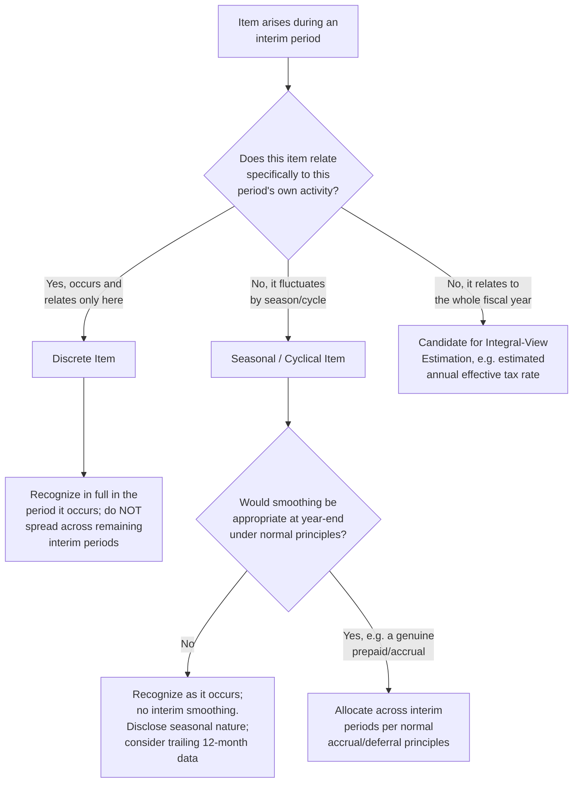

## Seasonal and Discrete Items in Interim Periods

### Overview

This item addresses how interim financial reports handle two categories of items that create recognition and presentation challenges precisely because they do not occur evenly across the fiscal year: **seasonal/cyclical revenues and costs**, and **discrete events** (unusual or infrequent items, gains/losses, and accounting changes) that arise within a single interim period. Both frameworks — IAS 34 and ASC 270 — provide specific guidance to prevent interim reports from either artificially smoothing genuinely seasonal results or improperly deferring/spreading genuinely discrete events.

### Seasonal, Cyclical, or Occasional Revenue

**Key Points**

- IAS 34.37 (part of Appendix B guidance in substance) addresses this directly: revenues that are received seasonally, cyclically, or occasionally within a financial year shall not be anticipated or deferred as of an interim date if anticipation or deferral would not be appropriate at the end of the entity's financial year. Examples cited include dividend revenue, royalties, and government grants. Additionally, some entities consistently earn more revenues in certain interim periods of a financial year than in other interim periods, for example, seasonal revenues of retailers. Such revenues are recognized when they occur.
- The core principle: **IAS 34 does not permit smoothing seasonal revenue across interim periods.** A retailer that earns 40% of its annual revenue in Q4 (holiday season) reports that revenue in Q4 — it does not spread an estimated 25% into each quarter merely for presentational evenness. This is a direct application of the discrete view discussed in the interim reporting principles item.
- [Inference] Because IAS 34 prohibits smoothing seasonal revenue, it instead requires **disclosure** as a substitute remedy: entities whose business is highly seasonal are encouraged to disclose financial information for the twelve months ending on the interim reporting date and comparative information for the prior twelve-month period, in addition to the interim period data itself, so that users can evaluate performance without being misled by within-year seasonal swings not evident from a single quarter's figures.

**Example**

A ski resort operator generates the substantial majority of its annual revenue in Q4 and Q1 (winter season) and minimal revenue in Q2–Q3. Under IAS 34, the entity reports actual Q2 revenue (low) and actual Q4 revenue (high) as they occur — it does not defer Q4 revenue into Q2 to present a "smoothed" quarterly trend. To aid comparability, the entity's interim report would appropriately highlight trailing-twelve-month figures alongside the quarterly figures so users are not misled by comparing a low-season quarter in isolation.

### Seasonal Costs Under IAS 34

**Key Points**

- The same discrete-view constraint that applies to seasonal revenue applies symmetrically to costs: costs that are incurred unevenly during a financial year shall be anticipated or deferred for interim reporting purposes if, and only if, it is also appropriate to anticipate or defer that type of cost at the end of the financial year.
- [Inference] This means a cost like an annual insurance premium paid in Q1 that clearly benefits the whole year can be allocated across interim periods (because deferral of prepaid expense is standard year-end practice regardless), but a cost that is simply lumpy or irregular without an underlying accrual/deferral basis under normal annual accounting cannot be artificially smoothed at interim merely for presentational symmetry.

### Seasonal Items Under ASC 270 (Integral View Application)

**Key Points**

- [Inference] Under the integral view of ASC 270, revenues and costs subject to seasonal fluctuation are still generally recognized as they occur (consistent with the principle that revenue is recognized on the same basis as followed for the full year), but ASC 270 places greater emphasis on **disclosure of the seasonal nature of the business** as the primary tool for helping users interpret interim results, rather than relying purely on the discrete-period presentation IAS 34 emphasizes.
- [Unverified] ASC 270-10-50 requires disclosure, in interim financial reports, of the seasonal nature of the business, and encourages (though does not necessarily strictly mandate in all circumstances) supplemental disclosure of twelve-month-period-ended information for highly seasonal businesses — [Inference] a disclosure objective that parallels IAS 34's encouragement of trailing-twelve-month information, reflecting practical convergence even though the two frameworks start from different conceptual bases (discrete vs. integral).

**Example**

A greeting card and seasonal gift retailer discloses in its Q4 Form 10-Q (and annual Form 10-K) that the majority of its net sales and net income are historically realized during the fourth calendar quarter due to the concentration of holiday-related sales, allowing investors to correctly interpret why Q1–Q3 results appear weak in isolation.

### Discrete Items: Definition and Distinguishing Feature

**Key Points**

- A **discrete item** is an event or transaction that is specifically identifiable with, and expected to affect, only the interim period in which it occurs (or a limited number of periods) — as opposed to a cost or revenue stream that relates to and should be allocated across the entire annual period.
- [Inference] The key analytical question distinguishing a discrete item from an item subject to interim allocation/estimation techniques is: does this item's economic substance relate only to this period, or does it relate to activity spread across the full fiscal year? A one-time litigation settlement gain recognized in Q2 is discrete (it relates only to Q2); an annual property tax assessment payable in Q1 but benefiting the whole year is not discrete in the same sense — it is a candidate for the allocation techniques (integral view under US GAAP) discussed under interim reporting principles.

### Extraordinary, Unusual, or Infrequent Items at Interim Dates

**Key Points**

- Both frameworks require that discrete, unusual, or infrequent items be recognized in full in the interim period in which they occur, rather than spread across the remaining interim periods of the fiscal year.
- Under IAS 34, this follows directly from the discrete view: material items are recognized in the period they occur, disclosed separately, with a description of the item's nature and amount if material to an understanding of the current interim period — consistent with IAS 34.15B's list of events and transactions for which disclosure is required if significant, including items such as write-downs of inventories to net realizable value and their reversal, recognition of impairment losses, reversals of provisions, litigation settlements, and corrections of prior period errors.
- [Unverified] Under ASC 270 (as historically supplemented by concepts drawn from the now-superseded extraordinary items guidance), unusual or infrequently occurring items are reported separately and disclosed in the interim period in which they occur, rather than being smoothed or allocated across the year — even though the entity generally embraces the integral view for routine items, discrete/unusual items are treated as an important exception carved out of the integral-view smoothing latitude.

### Interim Period Estimates and Subsequent True-Up

**Key Points**

- Both frameworks acknowledge interim periods necessarily involve greater use of estimates than annual periods, precisely because less information is available at an interim date than would be available at year end.
- [Inference] When an estimate made in an earlier interim period is revised in a later interim period of the same fiscal year, the change is reflected in the later period — this is not treated as a correction of an error (which would require retrospective restatement) but rather as a normal refinement of an estimate consistent with the nature of interim reporting.
- IAS 34.B13–B14 address the tax rate estimate specifically, illustrating the broader principle: the estimated average annual effective income tax rate is reapplied at each interim date using the best current estimate of the effective rate expected for the full financial year, with each interim period's tax charge reflecting a catch-up or reduction from the cumulative year-to-date computation — a mechanic that generalizes to other interim estimates.

### Restructuring Costs, Impairments, and Similar Discrete Charges

**Key Points**

- [Inference] Restructuring charges, asset impairments, and similar discrete charges are recognized in full in the interim period in which the recognition criteria under the applicable standard (e.g., IAS 37, IAS 36, ASC 420/720, ASC 350/360) are first met — they are not deferred to a later interim period nor spread retroactively across earlier interim periods of the same year, since doing so would contradict both the discrete view (IAS 34) and the "unusual/infrequent item" exception carved out of the integral view (ASC 270).
- A particularly tested nuance under IAS 34: an impairment loss recognized in an earlier interim period in respect of goodwill (or certain other assets) shall not be reversed in a subsequent interim period — this is a specific, frequently examined exception designed to prevent interim volatility in goodwill impairment assessments from producing whipsawing results across quarters of the same year, even where the discrete-view philosophy might otherwise suggest each period's assessment stands independently.

### Diagram: Classifying an Interim Item — Seasonal, Discrete, or Allocable

### Diagram: Seasonal Revenue Pattern — Smoothed vs. Actual Presentation (svg_diagram)

<svg xmlns="http://www.w3.org/2000/svg" viewBox="0 0 740 320">
<text x="370" y="24" text-anchor="middle" font-size="15" font-weight="bold" font-family="Arial, sans-serif">Seasonal Revenue: Prohibited Smoothing vs. Required Presentation (svg_diagram)</text>
<line x1="80" y1="260" x2="700" y2="260" stroke="#4a5568" stroke-width="1.5" />
<line x1="80" y1="60" x2="80" y2="260" stroke="#4a5568" stroke-width="1.5" />
<text x="40" y="65" font-size="9" font-family="Arial, sans-serif">Revenue</text>

<text x="150" y="278" text-anchor="middle" font-size="10" font-family="Arial, sans-serif">Q1</text>

<text x="300" y="278" text-anchor="middle" font-size="10" font-family="Arial, sans-serif">Q2</text>

<text x="450" y="278" text-anchor="middle" font-size="10" font-family="Arial, sans-serif">Q3</text>

<text x="600" y="278" text-anchor="middle" font-size="10" font-family="Arial, sans-serif">Q4</text>

<rect x="120" y="180" width="60" height="80" fill="#c53030" opacity="0.15" stroke="#c53030" stroke-width="1" stroke-dasharray="4,3" />
<rect x="270" y="180" width="60" height="80" fill="#c53030" opacity="0.15" stroke="#c53030" stroke-width="1" stroke-dasharray="4,3" />
<rect x="420" y="180" width="60" height="80" fill="#c53030" opacity="0.15" stroke="#c53030" stroke-width="1" stroke-dasharray="4,3" />
<rect x="570" y="180" width="60" height="80" fill="#c53030" opacity="0.15" stroke="#c53030" stroke-width="1" stroke-dasharray="4,3" />
<text x="370" y="175" text-anchor="middle" font-size="9" fill="#c53030" font-family="Arial, sans-serif">Prohibited: artificially smoothed equal quarters</text>
<rect x="120" y="230" width="60" height="30" fill="#2f855a" opacity="0.6" stroke="#2f855a" stroke-width="1.2" />
<rect x="270" y="245" width="60" height="15" fill="#2f855a" opacity="0.6" stroke="#2f855a" stroke-width="1.2" />
<rect x="420" y="240" width="60" height="20" fill="#2f855a" opacity="0.6" stroke="#2f855a" stroke-width="1.2" />
<rect x="570" y="70" width="60" height="190" fill="#2f855a" opacity="0.6" stroke="#2f855a" stroke-width="1.2" />
<text x="370" y="300" text-anchor="middle" font-size="9" fill="#2f855a" font-family="Arial, sans-serif">Required: actual revenue recognized as it occurs (e.g., holiday-driven Q4 spike)</text>
</svg>

### Common Forensic and Exam Pitfalls

**Key Points**

- **Assuming all uneven costs qualify for interim allocation**: candidates often over-apply the integral view's allocation latitude to costs that are genuinely discrete rather than truly benefiting the whole year — the test under IAS 34 is whether year-end treatment would also anticipate/defer the cost, not merely whether the cost is inconveniently lumpy.
- **Smoothing seasonal revenue**: a classic exam trap presents a retailer's Q4-heavy revenue pattern and asks whether the entity may allocate a portion of expected Q4 revenue into earlier quarters for "more even" reporting — this is impermissible under both frameworks; seasonal revenue is recognized when earned, not smoothed.
- **Reversing a goodwill impairment recognized in an earlier interim period**: this is explicitly prohibited under IAS 34, and candidates frequently miss this specific exception when reasoning purely from general discrete-view principles (which might otherwise suggest each period should reflect the best current estimate independently).
- **Forensic angle**: [Inference] Interim discrete-item classification is a documented area of financial statement manipulation risk — management under pressure to meet quarterly earnings expectations has an incentive to mischaracterize a genuinely discrete, unfavorable item (e.g., an asset impairment or litigation loss) as somehow relating to or "smoothable" across future periods, or conversely to accelerate recognition of a favorable discrete item into an underperforming quarter while deferring an unfavorable one. Forensic examiners reviewing interim filings often specifically test: (1) whether items labeled "unusual or infrequent" recur suspiciously often across multiple quarters (suggesting mischaracterization to avoid normal integral-view cost allocation scrutiny), and (2) whether goodwill or asset impairment charges show a pattern of being recognized only in quarters that already show weak results (an earnings-management technique sometimes called "big bath" accounting), taking advantage of the fact that once recognized, such impairments cannot be reversed in a later interim period under IAS 34, which removes any subsequent-quarter check on the initial impairment judgment.

**Related Topics**

- Interim reporting principles and the integral view (foundational conceptual prerequisite)
- Interim income tax accounting — estimated annual effective tax rate mechanics in depth
- Goodwill and long-lived asset impairment testing at interim dates (IAS 36 / ASC 350, ASC 360 interaction with IAS 34 / ASC 270)
- Segment disclosure requirements and aggregation criteria — interim segment disclosure interaction
- "Big bath" accounting and earnings management detection techniques in forensic analysis
- Correction of accounting errors versus changes in accounting estimates in interim periods
- Trailing-twelve-month (TTM) financial statement analysis techniques for highly seasonal businesses