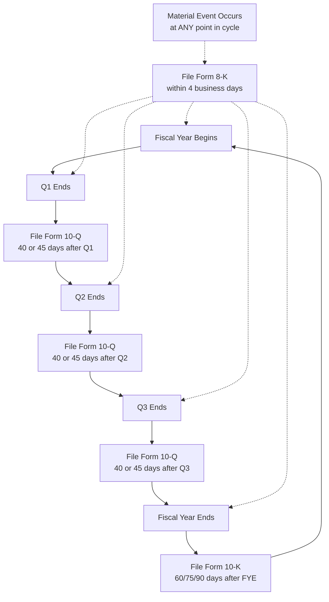

## SEC Reporting Requirements for Forms 10-K, 10-Q, and 8-K

### Overview

Forms 10-K, 10-Q, and 8-K constitute the core periodic and current-event disclosure framework required of SEC-registered public companies under the Securities Exchange Act of 1934. Together they implement the continuous disclosure philosophy underlying US securities regulation: Form 10-K provides comprehensive annual disclosure, Form 10-Q provides condensed quarterly updates, and Form 8-K provides prompt disclosure of specified material corporate events as they occur, outside the periodic reporting cycle.

### Filer Status Categories

**Key Points**

- SEC filing deadlines depend on an issuer's **filer status**, determined primarily by public float (the market value of voting and non-voting common equity held by non-affiliates), measured as of the last business day of the company's most recently completed second fiscal quarter.
- **Large accelerated filer**: Rule 12b-2 requires a public float greater than $700 million, at least 12 months of periodic filing history, at least one previously filed annual report, and non-smaller-reporting-company status — a large accelerated filer is essentially an accelerated filer whose public float exceeds $700 million.
- **Accelerated filer**: public float generally between $75 million and $700 million (subject to the other Rule 12b-2 conditions), with a scaled compliance framework.
- **Non-accelerated filer**: issuers not meeting the accelerated or large accelerated filer thresholds, generally subject to the longest filing deadlines.
- [Inference] "Smaller reporting company" and "emerging growth company" are separate, overlapping SEC classification systems (based on public float and revenue thresholds, and IPO-recency respectively) that primarily affect scaled disclosure content (e.g., reduced executive compensation disclosure, fewer years of audited financials) rather than filing deadlines per se, though they interact with filer status determinations.

### Form 10-K: Annual Report

**Key Points**

**Filing Deadlines** (for a calendar fiscal year-end company):

- Large Accelerated Filer: 60 days after fiscal year end.
- Accelerated Filer: 75 days after fiscal year end.
- Non-Accelerated Filer (All Other Filers): 90 days after fiscal year end.

**Core Content Requirements** (structured in four parts per SEC Regulation S-K):

- **Part I**: Business description (Item 1), Risk Factors (Item 1A), Unresolved Staff Comments (Item 1B), Properties (Item 2), Legal Proceedings (Item 3), Mine Safety Disclosures (Item 4, where applicable).
- **Part II**: Market for the registrant's common equity (Item 5), Management's Discussion and Analysis of Financial Condition and Results of Operations — MD&A (Item 7), Quantitative and Qualitative Disclosures About Market Risk (Item 7A), audited Financial Statements and Supplementary Data (Item 8), Changes in and Disagreements with Accountants (Item 9), Controls and Procedures (Item 9A) — including management's assessment of internal control over financial reporting (ICFR) under Sarbanes-Oxley Section 404, and the auditor's attestation report on ICFR for accelerated and large accelerated filers.
- **Part III**: Directors, executive officers, and corporate governance (Item 10), Executive Compensation (Item 11), Security ownership (Item 12), Certain relationships and related transactions (Item 13), Principal accountant fees and services (Item 14) — [Inference] frequently incorporated by reference from the definitive proxy statement (Form DEF 14A) rather than included directly in the 10-K, provided the proxy statement is filed within 120 days of fiscal year end.
- **Part IV**: Exhibits, financial statement schedules (Item 15), and Form 10-K summary (Item 16, optional).
- Part III information incorporated by reference from the proxy statement is due 120 days after fiscal year end (a separate deadline from the base 10-K filing deadline itself).

**Example**

A large accelerated filer with a December 31 fiscal year-end must file its Form 10-K within 60 days — around early March of the following year. If it intends to incorporate Part III (executive compensation, governance) by reference from its proxy statement rather than including that information directly in the 10-K, it must file that proxy statement no later than 120 days after fiscal year-end (around late April) or else include the Part III information directly in the 10-K itself by the original 60-day deadline.

### Form 10-Q: Quarterly Report

**Key Points**

**Filing Deadlines** (for the first three fiscal quarters; no 10-Q is filed for the fourth quarter, which is instead covered by the Form 10-K):

- Large Accelerated Filer: 40 days after fiscal quarter end.
- Accelerated Filer: 40 days after fiscal quarter end.
- Non-Accelerated Filer: 45 days after fiscal quarter end.
- [Inference] Note that large accelerated and accelerated filers share the same 40-day 10-Q deadline (unlike the 10-K, where their deadlines diverge at 60 vs. 75 days) — a detail frequently mistested by assuming a parallel structure across both forms.

**Content Requirements**:

- **Part I (Financial Information)**: condensed (unaudited) interim financial statements prepared in accordance with the interim reporting principles discussed elsewhere in this chapter (Regulation S-X Article 10 sets the minimum line-item and disclosure requirements for condensed interim statements), MD&A of interim results (Item 2), Quantitative and Qualitative Disclosures About Market Risk (Item 3), Controls and Procedures (Item 4).
- **Part II (Other Information)**: Legal Proceedings (Item 1), Risk Factors updates (Item 1A, material changes from the 10-K only), Unregistered Sales of Equity Securities and Use of Proceeds (Item 2), Defaults Upon Senior Securities (Item 3), Mine Safety Disclosures (Item 4), Other Information (Item 5), Exhibits (Item 6).
- [Inference] Because Form 10-Q financial statements are unaudited, the auditor typically performs only a SAS-100-type review (or its current PCAOB-standard equivalent) rather than a full audit, consistent with the reduced assurance level appropriate for interim reporting.

### Form 8-K: Current Report

**Key Points**

- Unlike the 10-K and 10-Q, Form 8-K is an **event-driven, not calendar-driven**, filing — it is triggered by the occurrence of specified material events, not by the passage of a fiscal period.
- **General filing deadline**: 4 business days after occurrence of a triggering event, for most Item categories.
- Form 8-K is organized into numbered Items grouped by subject-matter section:
  - **Section 1 — Registrant's Business and Operations**: Item 1.01 Entry into a Material Definitive Agreement; Item 1.02 Termination of a Material Definitive Agreement; Item 1.03 Bankruptcy or Receivership; Item 1.04 Mine Safety.
  - **Section 2 — Financial Information**: Item 2.01 Completion of Acquisition or Disposition of Assets; Item 2.02 Results of Operations and Financial Condition (e.g., earnings releases); Item 2.03 Creation of a Direct Financial Obligation; Item 2.04 Triggering Events That Accelerate or Increase a Direct Financial Obligation; Item 2.05 Costs Associated with Exit or Disposal Activities; Item 2.06 Material Impairments.
  - **Section 3 — Securities and Trading Markets**: Item 3.01 Notice of Delisting or Failure to Satisfy Listing Rule; Item 3.02 Unregistered Sales of Equity Securities; Item 3.03 Material Modification to Rights of Security Holders.
  - **Section 4 — Matters Related to Accountants and Financial Statements**: Item 4.01 Changes in Registrant's Certifying Accountant; Item 4.02 Non-Reliance on Previously Issued Financial Statements or a Related Audit Report (i.e., a restatement trigger — one of the most closely scrutinized 8-K items from a forensic perspective).
  - **Section 5 — Corporate Governance and Management**: Item 5.01 Changes in Control; Item 5.02 Departure/Election of Directors or Certain Officers (including principal officer departures); Item 5.03 Amendments to Articles of Incorporation or Bylaws; Item 5.07 Submission of Matters to a Vote of Security Holders; Item 5.08 Shareholder Director Nominations.
  - **Section 6 — Asset-Backed Securities** (specialized, applicable to ABS issuers).
  - **Section 7 — Regulation FD**: Item 7.01 Regulation FD Disclosure (voluntary/furnished, addressing selective disclosure concerns).
  - **Section 8 — Other Events**: Item 8.01 Other Events (catch-all for material events not otherwise specified, often used voluntarily).
  - **Section 9 — Financial Statements and Exhibits**: Item 9.01.
- [Inference] A key technical distinction exists between items that are **"filed"** (subject to Section 18 liability of the Exchange Act and Section 302/906 certification exposure) versus items that are **"furnished"** (such as Item 2.02 earnings releases and Item 7.01 Regulation FD disclosures), which are not deemed "filed" for certain liability purposes and are not automatically incorporated by reference into Securities Act registration statements unless the registrant specifically states otherwise.

**Example — Item 4.02 (Non-Reliance/Restatement Trigger)**

A company's auditor informs management that previously issued financial statements for the prior two fiscal years should no longer be relied upon due to a material accounting error discovered during the current audit cycle. This triggers an Item 4.02 Form 8-K, filed within 4 business days of that determination, disclosing which periods are affected, a description of the facts underlying the non-reliance conclusion, and whether the audit committee or authorized officers discussed the matter with the company's independent accountant. [Inference] Item 4.02 filings are a frequent focus of forensic and regulatory scrutiny because they publicly flag that previously filed financial statements contained material errors, often correlating with subsequent SEC enforcement inquiries or securities litigation.

### Diagram: Relationship Among the Three Forms Across the Reporting Cycle

### Diagram: Filer Status and Deadline Matrix (svg_diagram)

<svg xmlns="http://www.w3.org/2000/svg" viewBox="0 0 740 300">
<text x="370" y="24" text-anchor="middle" font-size="15" font-weight="bold" font-family="Arial, sans-serif">Filer Status vs. Filing Deadlines (svg_diagram)</text>
<line x1="60" y1="60" x2="700" y2="60" stroke="#4a5568" stroke-width="1" />
<text x="200" y="55" text-anchor="middle" font-size="11" font-weight="bold" font-family="Arial, sans-serif">Filer Category</text>
<text x="420" y="55" text-anchor="middle" font-size="11" font-weight="bold" font-family="Arial, sans-serif">Form 10-K</text>
<text x="600" y="55" text-anchor="middle" font-size="11" font-weight="bold" font-family="Arial, sans-serif">Form 10-Q</text>
<line x1="60" y1="90" x2="700" y2="90" stroke="#cbd5e0" stroke-width="0.8" />
<text x="200" y="85" text-anchor="middle" font-size="10" font-family="Arial, sans-serif">Large Accelerated (float &gt; $700M)</text>
<rect x="380" y="70" width="80" height="24" rx="4" fill="#e6f4ea" stroke="#2f855a" stroke-width="1" />
<text x="420" y="86" text-anchor="middle" font-size="10" font-family="Arial, sans-serif">60 days</text>
<rect x="560" y="70" width="80" height="24" rx="4" fill="#e6f4ea" stroke="#2f855a" stroke-width="1" />
<text x="600" y="86" text-anchor="middle" font-size="10" font-family="Arial, sans-serif">40 days</text>
<line x1="60" y1="130" x2="700" y2="130" stroke="#cbd5e0" stroke-width="0.8" />
<text x="200" y="125" text-anchor="middle" font-size="10" font-family="Arial, sans-serif">Accelerated ($75M – $700M)</text>
<rect x="380" y="110" width="80" height="24" rx="4" fill="#faf5e6" stroke="#b7791f" stroke-width="1" />
<text x="420" y="126" text-anchor="middle" font-size="10" font-family="Arial, sans-serif">75 days</text>
<rect x="560" y="110" width="80" height="24" rx="4" fill="#e6f4ea" stroke="#2f855a" stroke-width="1" />
<text x="600" y="126" text-anchor="middle" font-size="10" font-family="Arial, sans-serif">40 days</text>
<line x1="60" y1="170" x2="700" y2="170" stroke="#cbd5e0" stroke-width="0.8" />
<text x="200" y="165" text-anchor="middle" font-size="10" font-family="Arial, sans-serif">Non-Accelerated (All Other Filers)</text>
<rect x="380" y="150" width="80" height="24" rx="4" fill="#f5e6e6" stroke="#c53030" stroke-width="1" />
<text x="420" y="166" text-anchor="middle" font-size="10" font-family="Arial, sans-serif">90 days</text>
<rect x="560" y="150" width="80" height="24" rx="4" fill="#faf5e6" stroke="#b7791f" stroke-width="1" />
<text x="600" y="166" text-anchor="middle" font-size="10" font-family="Arial, sans-serif">45 days</text>
<rect x="60" y="200" width="620" height="50" rx="6" fill="#e8eef7" stroke="#2c5282" stroke-width="1.2" />
<text x="370" y="220" text-anchor="middle" font-size="10" font-family="Arial, sans-serif">Form 8-K: event-driven, NOT tied to filer status — 4 business days</text>
<text x="370" y="236" text-anchor="middle" font-size="10" font-family="Arial, sans-serif">after occurrence of a triggering event, for essentially all filer categories</text>

<text x="370" y="275" text-anchor="middle" font-size="9" font-style="italic" font-family="Arial, sans-serif">Note: Large Accelerated and Accelerated filers share the same 40-day 10-Q deadline</text>

</svg>

### Certifications and Internal Controls (Cross-Cutting Requirement)

**Key Points**

- [Inference] Both Form 10-K and Form 10-Q require CEO and CFO certifications under Sections 302 and 906 of the Sarbanes-Oxley Act, attesting to the accuracy of the financial statements, the effectiveness of disclosure controls and procedures, and (for 302 certifications) responsibility for establishing and maintaining internal controls, including disclosure of any material changes in ICFR during the period covered.
- [Inference] Accelerated and large accelerated filers are additionally required to obtain an independent auditor's attestation report on the effectiveness of internal control over financial reporting (ICFR) as part of the Form 10-K (SOX Section 404(b)); non-accelerated filers are generally exempt from the auditor attestation requirement (though management's own ICFR assessment under Section 404(a) is still required of all filers) — a scaled-disclosure accommodation frequently tested for exam purposes.

### Common Forensic and Exam Pitfalls

**Key Points**

- **Confusing accelerated and large accelerated filer 10-K deadlines with 10-Q deadlines**: candidates often assume the 10-K deadline gap (60 vs. 75 days) also applies to the 10-Q, when in fact both accelerated categories share the same 40-day 10-Q deadline.
- **Treating Item 2.02 and 7.01 8-K disclosures as automatically "filed"**: these are typically "furnished," not "filed," carrying different liability and incorporation-by-reference consequences — a frequently tested technical distinction.
- **Overlooking the 120-day Part III proxy incorporation deadline** as a distinct deadline from the base 10-K filing deadline itself.
- **Forensic angle**: [Inference] Item 4.02 8-K filings (non-reliance on previously issued financial statements) are one of the most forensically significant SEC disclosures because they publicly document that a registrant's own auditor or management determined that prior financial statements were materially wrong — examiners and litigators frequently use the specific language, timing, and disclosed root cause within an Item 4.02 filing as a starting point for assessing whether the underlying error resulted from good-faith estimation revision versus a more troubling control failure or potential fraud, and the interval between the underlying error's occurrence and its eventual 8-K disclosure is itself often scrutinized as an indicator of the timeliness (or lack thereof) of the registrant's internal control and audit committee escalation processes.

**Related Topics**

- Sarbanes-Oxley Section 302 and 404 internal control requirements in detail
- MD&A (Management's Discussion and Analysis) content requirements and forensic red flags
- Regulation S-X and Regulation S-K disclosure requirements
- Regulation FD and selective disclosure enforcement
- Restatement accounting and disclosure — ASC 250 interaction with Item 4.02 8-K triggers
- SEC comment letter process and its interaction with periodic report content
- XBRL structured data tagging requirements for periodic reports