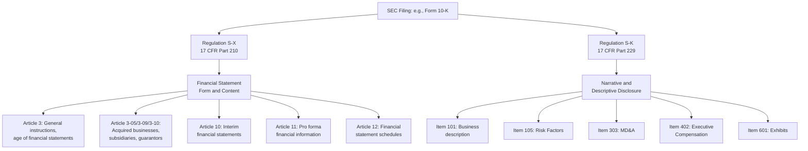

## Regulation S-X and Regulation S-K Requirements

### Overview

Regulation S-X and Regulation S-K are the two foundational SEC rule sets governing the content of disclosure documents filed under the Securities Act of 1933 and the Securities Exchange Act of 1934. They operate in tandem but govern distinct domains: **Regulation S-X governs the form and content of financial statements** (and related schedules and notes) required in filings, while **Regulation S-K governs non-financial-statement disclosure requirements** — narrative, descriptive, and other disclosure items that appear elsewhere in a registration statement or periodic report. Together they form the technical backbone that Forms 10-K, 10-Q, 8-K, and registration statements (e.g., Form S-1) must comply with.

### Regulation S-X: Financial Statement Content

**Key Points**

- Regulation S-X (17 CFR Part 210) prescribes the **form, content, and requirements for financial statements** required to be filed as part of registration statements, periodic reports, and other filings with the SEC.
- Regulation S-X is organized into numbered **Articles**, each addressing a distinct topic area:
  - **Article 1**: Application of Regulation S-X (general provisions, definitions).
  - **Article 2**: Qualifications and reports of accountants (auditor independence rules, audit report content requirements).
  - **Article 3**: General instructions as to financial statements (requirements for balance sheets, income statements, and other statements; age of financial statements permitted).
  - **Article 3-05**: Financial statements of businesses acquired or to be acquired.
  - **Article 3-09/3-10**: Financial statements of subsidiaries not consolidated and 50%-or-less-owned persons; financial statements of guarantors and issuers of guaranteed securities.
  - **Article 4**: Rules of general application (form and order of financial statements, rounding, currency).
  - **Article 5**: Commercial and industrial companies (specific line-item and schedule requirements).
  - **Article 6, 6A, 7, 9**: Industry-specific requirements for registered investment companies, employee stock purchase/savings plans, insurance companies, and bank holding companies, respectively.
  - **Article 8**: Financial statements of smaller reporting companies (scaled requirements).
  - **Article 10**: Interim financial statements (governs condensed financial statements in Forms 10-Q).
  - **Article 11**: Pro forma financial information (required for significant business combinations and dispositions).
  - **Article 12**: Form and content of schedules (supplementary schedules required in certain circumstances).

**Example — Article 3-05 Application**

A public company acquires a target business that is deemed "significant" under the SEC's significance tests (comparing the target's investment, asset, and income measures to the acquirer's consolidated figures — thresholds historically set at 20%, though amended by SEC rulemaking over time). Under Article 3-05, the acquirer must include separate audited financial statements of the acquired business for one to three years (depending on the significance level) in its registration statement or a Form 8-K filed within 75 days of the acquisition's closing, along with Article 11 pro forma financial information showing the combined entity's results as if the acquisition had occurred at the beginning of the earliest period presented.

### Age of Financial Statements (Staleness Rules)

**Key Points**

- [Inference] Regulation S-X Rule 3-12 (and related provisions) governs how "stale" audited financial statements may be before they must be updated in a filing — commonly referred to as "financial statement staleness" rules, which vary by filer status (large accelerated/accelerated filers generally face shorter staleness windows than non-accelerated filers, consistent with their more compressed periodic filing deadlines discussed in the prior item on Forms 10-K/10-Q/8-K).
- [Inference] These staleness rules are a frequent practical driver of registration statement timing — an issuer planning an offering must ensure its included financial statements remain "fresh" as of the filing/effectiveness date, or else must include a more recent interim period.

### Article 11: Pro Forma Financial Information

**Key Points**

- [Inference] Article 11 requires pro forma financial information — a pro forma balance sheet and pro forma income statement(s) — to depict the continuing impact of a significant business combination, disposition, or other specified transaction (e.g., a significant debt or equity issuance with a specific identified use of proceeds) as if the transaction had occurred at an earlier specified date.
- [Inference] The pro forma income statement is typically presented as if the transaction occurred at the beginning of the earliest period presented (usually the most recent full fiscal year), while the pro forma balance sheet is presented as if the transaction occurred at the end of the most recent period presented.
- [Unverified] The SEC significantly amended Article 11 in 2020/2021, streamlining pro forma adjustment categories into "Transaction Accounting Adjustments" and "Autonomous Entity Adjustments," with an optional "Management's Adjustments" category permitted (but not required) to reflect reasonably estimable synergies and dis-synergies — this represented a meaningful simplification from the prior, more prescriptive pro forma adjustment framework.

### Regulation S-K: Non-Financial-Statement Disclosure

**Key Points**

- Regulation S-K (17 CFR Part 229) sets forth disclosure requirements for the **non-financial-statement portions** of registration statements and periodic reports — the narrative and descriptive content.
- Key Regulation S-K Items relevant to periodic reporting include:
  - **Item 101**: Description of Business.
  - **Item 103**: Legal Proceedings.
  - **Item 105**: Risk Factors.
  - **Item 303**: Management's Discussion and Analysis of Financial Condition and Results of Operations (MD&A) — one of the most heavily scrutinized and litigated disclosure items, requiring discussion of liquidity, capital resources, results of operations, and (per amendments) critical accounting estimates.
  - **Item 401–407**: Directors, executive officers, corporate governance, audit committee matters.
  - **Item 402**: Executive Compensation (including Compensation Discussion & Analysis).
  - **Item 404**: Related party transactions.
  - **Item 601**: Exhibits (specifies the exhibit index and required exhibit types, e.g., material contracts, subsidiaries list, auditor consent).
- [Inference] Regulation S-K's disclosure items are cross-referenced by the specific line-item requirements of each SEC form (e.g., Form 10-K's Part I/II/III items each map back to specific Regulation S-K item numbers), meaning Regulation S-K functions as a centralized disclosure-content library that individual forms draw upon rather than each form separately specifying its own narrative content requirements from scratch.

### MD&A Requirements Under Item 303 (Detailed)

**Key Points**

- [Inference] Item 303 MD&A requires discussion of: (1) liquidity and capital resources, including known trends or uncertainties that will result in, or that are reasonably likely to result in, a material increase or decrease in liquidity; (2) results of operations, including material year-over-year changes and the underlying reasons for those changes; (3) off-balance sheet arrangements (following the SEC's 2019/2020 amendments, this was integrated into the broader liquidity and capital resources discussion rather than kept as a wholly separate mandated caption); and (4) critical accounting estimates — a requirement clarified and formalized by SEC rule amendments effective for fiscal years ending on or after December 15, 2021, replacing the less-defined "critical accounting policies" discussion practice that had developed under prior guidance.
- [Inference] The "known trends or uncertainties" language in Item 303 is a frequently litigated disclosure standard — plaintiffs in securities litigation often allege that a company knew of an adverse trend (e.g., declining demand, cost pressures, litigation exposure) that was reasonably likely to have a material future effect and failed to disclose it under Item 303, making MD&A one of the highest-forensic-scrutiny sections of the 10-K/10-Q.

### Interaction Between Regulation S-X and Regulation S-K

**Key Points**

- [Inference] The two regulations are complementary rather than overlapping: a 10-K's Item 8 (Financial Statements and Supplementary Data) draws its content requirements from Regulation S-X, while the same 10-K's Item 7 (MD&A) draws its content requirements from Regulation S-K Item 303 — both discuss the same underlying financial results, but S-X governs the audited statements themselves while S-K governs the narrative discussion surrounding them.
- [Inference] This division is a frequently tested conceptual distinction: candidates should be able to correctly attribute a given disclosure requirement (e.g., "pro forma financial statements for a significant acquisition" → Regulation S-X Article 11; "discussion of critical accounting estimates" → Regulation S-K Item 303) to the correct regulation.

### Diagram: Regulation S-X vs. Regulation S-K Domain Split

### Diagram: MD&A (Item 303) Required Discussion Components (svg_diagram)

<svg xmlns="http://www.w3.org/2000/svg" viewBox="0 0 720 320">
<text x="360" y="24" text-anchor="middle" font-size="15" font-weight="bold" font-family="Arial, sans-serif">Item 303 MD&amp;A Components (svg_diagram)</text>
<rect x="270" y="45" width="180" height="45" rx="6" fill="#e8eef7" stroke="#2c5282" stroke-width="1.5" />
<text x="360" y="72" text-anchor="middle" font-size="12" font-weight="bold" font-family="Arial, sans-serif">MD&amp;A (Item 303)</text>
<line x1="360" y1="90" x2="130" y2="130" stroke="#4a5568" stroke-width="1.2" />
<line x1="360" y1="90" x2="290" y2="130" stroke="#4a5568" stroke-width="1.2" />
<line x1="360" y1="90" x2="450" y2="130" stroke="#4a5568" stroke-width="1.2" />
<line x1="360" y1="90" x2="610" y2="130" stroke="#4a5568" stroke-width="1.2" />
<rect x="50" y="130" width="160" height="60" rx="6" fill="#f0f4f8" stroke="#4a5568" stroke-width="1.2" />
<text x="130" y="152" text-anchor="middle" font-size="10" font-weight="bold" font-family="Arial, sans-serif">Liquidity &amp;</text>
<text x="130" y="166" text-anchor="middle" font-size="10" font-weight="bold" font-family="Arial, sans-serif">Capital Resources</text>
<text x="130" y="180" text-anchor="middle" font-size="8" font-family="Arial, sans-serif">incl. known trends</text>
<rect x="220" y="130" width="140" height="60" rx="6" fill="#f0f4f8" stroke="#4a5568" stroke-width="1.2" />
<text x="290" y="152" text-anchor="middle" font-size="10" font-weight="bold" font-family="Arial, sans-serif">Results of</text>
<text x="290" y="166" text-anchor="middle" font-size="10" font-weight="bold" font-family="Arial, sans-serif">Operations</text>
<text x="290" y="180" text-anchor="middle" font-size="8" font-family="Arial, sans-serif">YoY changes &amp; drivers</text>
<rect x="380" y="130" width="140" height="60" rx="6" fill="#f0f4f8" stroke="#4a5568" stroke-width="1.2" />
<text x="450" y="152" text-anchor="middle" font-size="10" font-weight="bold" font-family="Arial, sans-serif">Off-Balance</text>
<text x="450" y="166" text-anchor="middle" font-size="10" font-weight="bold" font-family="Arial, sans-serif">Sheet Arrangements</text>
<text x="450" y="180" text-anchor="middle" font-size="8" font-family="Arial, sans-serif">integrated into liquidity</text>
<rect x="540" y="130" width="140" height="60" rx="6" fill="#f0f4f8" stroke="#4a5568" stroke-width="1.2" />
<text x="610" y="152" text-anchor="middle" font-size="10" font-weight="bold" font-family="Arial, sans-serif">Critical Accounting</text>
<text x="610" y="166" text-anchor="middle" font-size="10" font-weight="bold" font-family="Arial, sans-serif">Estimates</text>
<text x="610" y="180" text-anchor="middle" font-size="8" font-family="Arial, sans-serif">formalized 2021 amendment</text>
<rect x="180" y="230" width="360" height="50" rx="6" fill="#f5e6e6" stroke="#c53030" stroke-width="1.2" />
<text x="360" y="250" text-anchor="middle" font-size="10" font-weight="bold" font-family="Arial, sans-serif">High Forensic/Litigation Scrutiny Zone</text>
<text x="360" y="265" text-anchor="middle" font-size="9" font-family="Arial, sans-serif">"Known trends or uncertainties" disclosure standard</text>
</svg>

### Scaled Disclosure Accommodations

**Key Points**

- [Inference] Both regulations provide scaled disclosure accommodations for smaller reporting companies and emerging growth companies — for example, Regulation S-X Article 8 sets reduced financial statement requirements for smaller reporting companies (e.g., two years of audited income statements rather than three), while corresponding Regulation S-K items permit reduced executive compensation disclosure (e.g., Summary Compensation Table covering two years rather than three, no Compensation Discussion & Analysis requirement) for smaller reporting companies.
- [Inference] Emerging growth companies (as defined under the JOBS Act) receive additional scaled accommodations under both regulations, including reduced audited financial statement history in an IPO registration statement and exemption from certain executive compensation disclosure and auditor attestation requirements, for a transition period following their IPO.

### Common Forensic and Exam Pitfalls

**Key Points**

- **Misattributing a disclosure requirement to the wrong regulation**: candidates frequently confuse whether a specific requirement (e.g., pro forma statements, MD&A critical accounting estimates, executive compensation tables) falls under S-X or S-K — the reliable heuristic is: if it's an actual financial statement, schedule, or directly financial-statement-derived pro forma presentation, it's S-X; if it's narrative, descriptive, or governance-related disclosure, it's S-K.
- **Overlooking the 2020/2021 Article 11 pro forma simplification**: candidates trained on older materials may reference the pre-amendment pro forma adjustment categories (e.g., "pro forma adjustments" as a single undifferentiated category) rather than the current "Transaction Accounting Adjustments" / "Autonomous Entity Adjustments" / optional "Management's Adjustments" framework.
- **Forensic angle**: [Inference] Item 303 MD&A's "known trends or uncertainties" disclosure standard is one of the most frequently litigated theories in securities fraud class actions, because it requires forward-looking judgment about what a company "knew" and whether an adverse trend was "reasonably likely" to have a material future effect — forensic accountants and litigation consultants often reconstruct the internal information available to management (board materials, internal forecasts, risk committee minutes) at the time of a challenged MD&A disclosure to assess whether the then-available internal information supported an inference that management knew of a undisclosed adverse trend, making the gap between internal management information and external MD&A narrative a central forensic inquiry in Section 10(b)/Rule 10b-5 litigation.

**Related Topics**

- SEC reporting requirements for Forms 10-K, 10-Q, and 8-K (foundational forms these regulations govern)
- Business combination accounting under ASC 805 and its interaction with Article 3-05/Article 11 acquisition disclosure
- Critical accounting estimates disclosure — practical drafting approaches and SEC comment letter trends
- Non-GAAP financial measures — Regulation G and Item 10(e) of Regulation S-K
- XBRL structured data tagging requirements (Regulation S-T interaction)
- Securities litigation theories arising from MD&A and risk factor disclosure deficiencies
- Smaller reporting company and emerging growth company scaled disclosure accommodations in depth