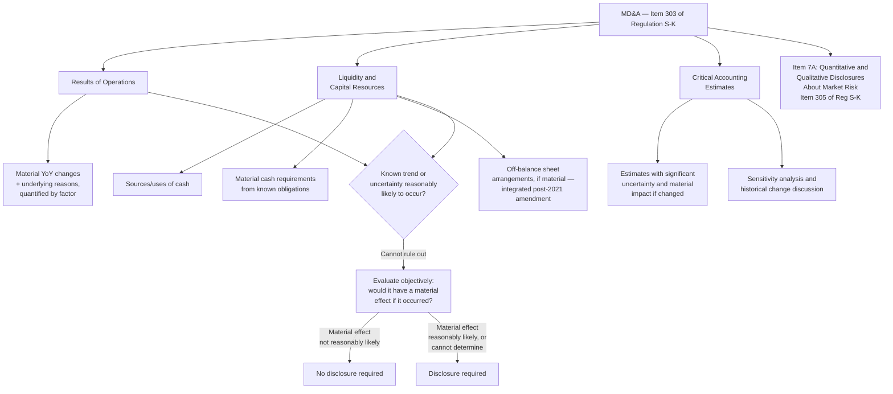

## Management's Discussion and Analysis

### Overview

Management's Discussion and Analysis (MD&A) is the narrative disclosure required in Item 7 of Form 10-K and Item 2 of Part I of Form 10-Q, governed substantively by **Item 303 of Regulation S-K**. MD&A is often described as providing management's own explanatory lens on the financial statements — a forward-and-backward-looking narrative intended to give investors the ability to view the company "through the eyes of management." It is one of the most heavily scrutinized, most frequently the subject of SEC comment letters, and most frequently litigated sections of any periodic report.

### Purpose and Core Philosophy

**Key Points**

- [Inference] The SEC's stated objective for MD&A is to provide a narrative explanation of a company's financial statements that enables investors to see the company through the eyes of management, providing the historical and prospective context necessary to understand the company's financial condition and results of operations, in a manner the raw financial statements alone cannot fully convey.
- [Inference] MD&A is explicitly meant to complement, not duplicate, the financial statements — it should explain *why* results changed, not simply restate the numbers that are already visible in the financial statements themselves. A common SEC comment letter criticism is that a registrant's MD&A merely repeats dollar and percentage variances without providing the underlying business reasons for those variances.

### Core Required Components Under Item 303

**Key Points**

**1. Results of Operations**

- [Inference] Discussion of material changes in the results of operations, including the underlying reasons for those changes (not just the amount of the change), covering revenue, cost of revenue, operating expenses, and other significant income statement line items, for each period presented.
- [Inference] Where two or more factors contribute to a material change, each factor's individual quantified contribution should be disclosed and discussed separately to the extent practicable — a general trend statement without quantification of the underlying drivers is a frequent target of SEC comment letters.

**2. Liquidity and Capital Resources**

- [Inference] Discussion of the company's liquidity position, sources and uses of cash, and material cash requirements, including known trends or uncertainties that will result in, or that are reasonably likely to result in, the company's liquidity increasing or decreasing in a material way.
- [Inference] This includes discussion of material cash requirements from known contractual and other obligations, an area that, following SEC rule amendments effective for fiscal years ending on or after December 15, 2021, replaced a previously prescribed tabular contractual obligations disclosure with a more principles-based narrative discussion requirement.

**3. Off-Balance Sheet Arrangements**

- [Inference] Following the 2019–2021 SEC amendments to Item 303, the previously separate, standalone off-balance sheet arrangements disclosure requirement was eliminated and instead integrated as part of the broader liquidity and capital resources discussion — meaning off-balance sheet arrangements are now discussed to the extent they are material to a registrant's liquidity or capital resources, rather than under a separately captioned, independently mandated heading.

**4. Critical Accounting Estimates**

- [Inference] The 2021 amendments formalized and clarified what had previously developed as a less well-defined market practice around "critical accounting policies" discussion, replacing it with an explicit requirement to disclose **critical accounting estimates** — those estimates involving a significant level of estimation uncertainty that have had, or are reasonably likely to have, a material impact on the registrant's financial condition or results of operations.
- [Inference] For each critical accounting estimate, registrants are expected to disclose why the estimate is subject to uncertainty, and to the extent material, quantitative and qualitative information about the sensitivity of the reported amount to the methods, assumptions, and estimates underlying its calculation, and how much each estimate and/or assumption has changed over a relevant period, together with the reasons for the change.

### Forward-Looking Statements and Trend Disclosure

**Key Points**

- [Inference] The "known trends or uncertainties" standard embedded throughout Item 303 (in both the results of operations and liquidity/capital resources discussions) is a materially forward-looking disclosure obligation: it requires management to disclose known trends and uncertainties that are reasonably likely to have a material future effect on the registrant's financial condition or results of operations, not merely to explain past results.
- [Inference] This is distinct from — but often analyzed alongside — the safe harbor protections available under the Private Securities Litigation Reform Act (PSLRA) for forward-looking statements accompanied by meaningful cautionary language; MD&A disclosures often rely on PSLRA safe harbor protection for their forward-looking components.
- [Inference] A two-step SEC Staff analytical framework is commonly applied (drawn from long-standing SEC interpretive guidance, e.g., the 1989 MD&A interpretive release) to determine whether a known trend or uncertainty must be disclosed: (1) is the known trend, demand, commitment, event, or uncertainty reasonably likely to occur? If management determines it is not reasonably likely to occur, no disclosure is required. (2) If management cannot make that determination, or if it determines the matter is reasonably likely to occur, it must evaluate objectively the consequences of the matter, assuming it does occur, and disclosure is then required unless management determines that a material effect on the registrant's financial condition or results of operations is not reasonably likely to occur.

### Quantitative and Qualitative Disclosures About Market Risk (Item 7A)

**Key Points**

- [Inference] Item 7A (governed by Item 305 of Regulation S-K) is presented immediately adjacent to MD&A in Form 10-K and requires disclosure about the registrant's exposure to market risk, including interest rate risk, foreign currency exchange rate risk, commodity price risk, and equity price risk, typically satisfied through one or a combination of: (1) a tabular presentation of expected cash flows and related weighted-average interest rates by expected maturity, (2) sensitivity analysis disclosing the potential loss in future earnings, fair values, or cash flows from selected hypothetical changes in market rates or prices, or (3) value-at-risk disclosures.
- [Inference] Smaller reporting companies are generally not required to provide Item 7A disclosure, consistent with the broader scaled-disclosure accommodations available to that filer category.

### MD&A at Interim Reporting Dates (Form 10-Q)

**Key Points**

- [Inference] MD&A in Form 10-Q (Item 2 of Part I) applies the same substantive Item 303 requirements as the annual MD&A but is scoped to the interim period, with a particular focus on material changes since the most recent fiscal year-end and discussion of the current quarter's and, where applicable, the year-to-date period's results compared to the corresponding prior-year period(s).
- [Inference] Interim MD&A is generally expected to be more abbreviated than annual MD&A, consistent with the condensed nature of interim financial statements under Regulation S-X Article 10, but is not exempt from the "known trends or uncertainties" forward-looking disclosure obligation, which applies with equal force at interim reporting dates.

### Non-GAAP Financial Measures Within MD&A

**Key Points**

- [Inference] MD&A frequently includes non-GAAP financial measures (e.g., adjusted EBITDA, free cash flow, organic revenue growth) to supplement the GAAP-based discussion; such measures are governed by Regulation G and Item 10(e) of Regulation S-K, which require, among other things, that any non-GAAP measure be reconciled to the most directly comparable GAAP measure, that the GAAP measure be presented with equal or greater prominence, and that the registrant not exclude charges or liabilities that required, or will require, cash settlement (absent specified exceptions) from a non-GAAP performance measure.
- [Inference] The SEC has periodically issued Compliance and Disclosure Interpretations (C&DIs) sharpening the "equal or greater prominence" and "individually tailored accounting principles" restrictions on non-GAAP measures, reflecting sustained regulatory attention to potential investor confusion from non-GAAP metric proliferation in MD&A.

### Diagram: MD&A Structural Components and Their Regulatory Basis

### Diagram: The Two-Step Trend Disclosure Test (svg_diagram)

<svg xmlns="http://www.w3.org/2000/svg" viewBox="0 0 700 320">
<text x="350" y="24" text-anchor="middle" font-size="15" font-weight="bold" font-family="Arial, sans-serif">Item 303 Trend Disclosure Analysis (svg_diagram)</text>
<rect x="220" y="50" width="260" height="55" rx="6" fill="#e8eef7" stroke="#2c5282" stroke-width="1.5" />
<text x="350" y="72" text-anchor="middle" font-size="11" font-weight="bold" font-family="Arial, sans-serif">Step 1: Is the trend/uncertainty</text>
<text x="350" y="88" text-anchor="middle" font-size="11" font-weight="bold" font-family="Arial, sans-serif">reasonably likely to occur?</text>
<line x1="280" y1="105" x2="150" y2="140" stroke="#4a5568" stroke-width="1.2" />
<line x1="420" y1="105" x2="550" y2="140" stroke="#4a5568" stroke-width="1.2" />
<rect x="60" y="140" width="180" height="55" rx="6" fill="#e6f4ea" stroke="#2f855a" stroke-width="1.5" />
<text x="150" y="162" text-anchor="middle" font-size="10" font-weight="bold" font-family="Arial, sans-serif">Not reasonably likely</text>
<text x="150" y="178" text-anchor="middle" font-size="10" font-weight="bold" font-family="Arial, sans-serif">No disclosure required</text>
<rect x="460" y="140" width="180" height="55" rx="6" fill="#faf5e6" stroke="#b7791f" stroke-width="1.5" />
<text x="550" y="162" text-anchor="middle" font-size="10" font-weight="bold" font-family="Arial, sans-serif">Reasonably likely, or</text>
<text x="550" y="178" text-anchor="middle" font-size="10" font-weight="bold" font-family="Arial, sans-serif">cannot determine</text>
<line x1="550" y1="195" x2="550" y2="220" stroke="#4a5568" stroke-width="1.2" />
<rect x="400" y="220" width="300" height="60" rx="6" fill="#faf5e6" stroke="#b7791f" stroke-width="1.5" />
<text x="550" y="240" text-anchor="middle" font-size="10" font-weight="bold" font-family="Arial, sans-serif">Step 2: Objectively evaluate</text>
<text x="550" y="255" text-anchor="middle" font-size="10" font-weight="bold" font-family="Arial, sans-serif">consequences assuming it occurs</text>
<text x="550" y="270" text-anchor="middle" font-size="9" font-family="Arial, sans-serif">Material effect reasonably likely?</text>
<line x1="450" y1="280" x2="350" y2="300" stroke="#4a5568" stroke-width="1" />
<line x1="650" y1="280" x2="680" y2="300" stroke="#4a5568" stroke-width="1" />
<rect x="200" y="295" width="180" height="20" rx="4" fill="#e6f4ea" stroke="#2f855a" stroke-width="1" />
<text x="290" y="309" text-anchor="middle" font-size="9" font-family="Arial, sans-serif">Not likely → No disclosure</text>
<rect x="470" y="295" width="220" height="20" rx="4" fill="#f5e6e6" stroke="#c53030" stroke-width="1" />
<text x="580" y="309" text-anchor="middle" font-size="9" font-family="Arial, sans-serif">Likely / uncertain → Disclosure required</text>
</svg>

### SEC Comment Letter Trends and Enforcement Focus

**Key Points**

- [Inference] Frequent SEC Division of Corporation Finance comment letter themes on MD&A include: (1) discussing variances by dollar/percentage amount without explaining the underlying business drivers of the change; (2) failing to quantify the individual contribution of multiple factors driving a material change; (3) inconsistency between risk factor disclosures (which describe known risks) and MD&A's trend disclosure (which should discuss whether those risks have already begun to materialize); and (4) non-GAAP measure prominence and reconciliation deficiencies.
- [Inference] MD&A disclosure is a central focus of SEC enforcement actions and private securities litigation under Section 10(b) and Rule 10b-5 of the Exchange Act, because the "known trends or uncertainties" standard requires an inherently judgment-based determination about what management knew and when — making the internal consistency between a company's MD&A disclosures and its contemporaneous internal forecasts, board materials, and risk assessments a frequent subject of forensic reconstruction in litigation and regulatory inquiries.

### Common Forensic and Exam Pitfalls

**Key Points**

- **Treating MD&A as purely historical/backward-looking**: a frequent misconception is that MD&A only explains past results — in fact, the "known trends or uncertainties" requirement imposes a materially forward-looking disclosure obligation that is central to the item's regulatory design and litigation exposure.
- **Conflating "critical accounting policies" (pre-2021 market practice terminology) with "critical accounting estimates" (the current, formally defined Item 303 requirement)**: candidates using older study materials may use outdated terminology or fail to apply the more specific sensitivity-disclosure expectations introduced by the 2021 amendments.
- **Overlooking that off-balance sheet arrangements disclosure is no longer a standalone caption**: post-2021 amendment, this is integrated into liquidity and capital resources discussion, not separately captioned.
- **Forensic angle**: [Inference] Because Item 303's trend disclosure standard requires management to make a subjective, two-step judgment call about the likelihood and materiality of known trends, MD&A is a particularly fertile area for detecting a gap between what management privately knew (as reflected in internal forecasts, board minutes, and risk committee materials) and what was disclosed publicly — forensic accountants and litigation support professionals frequently reconstruct this internal-knowledge timeline specifically to test whether a company's MD&A silence on a subsequently-materialized adverse trend reflected a good-faith application of the two-step test or a failure to disclose a trend that internal documents show was already known to be reasonably likely and material at the time of the filing.

**Related Topics**

- Regulation S-X and Regulation S-K requirements (foundational regulatory framework for MD&A)
- SEC reporting requirements for Forms 10-K, 10-Q, and 8-K
- Non-GAAP financial measures — Regulation G and Item 10(e) reconciliation requirements
- Private Securities Litigation Reform Act (PSLRA) safe harbor for forward-looking statements
- Critical accounting estimates disclosure drafting and sensitivity analysis techniques
- SEC comment letter process and Division of Corporation Finance review cycles
- Securities litigation under Section 10(b) / Rule 10b-5 arising from MD&A disclosure deficiencies