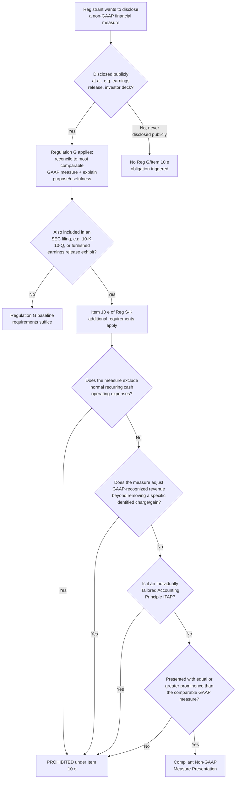

## Non-GAAP Financial Measures and Regulation G

### Overview

Non-GAAP financial measures — numerical measures of a registrant's historical or future financial performance, financial position, or cash flows that exclude or include amounts different from those in the most directly comparable GAAP measure — are pervasive in earnings releases, investor presentations, and MD&A. Their use is governed primarily by **Regulation G** (17 CFR Part 244) and **Item 10(e) of Regulation S-K**, supplemented extensively by SEC Staff **Compliance and Disclosure Interpretations (C&DIs)**, which represent the most granular and frequently updated source of practical guidance in this area. Non-GAAP measures have consistently remained among the SEC's top areas of comment letter focus.

### Regulatory Framework: Regulation G vs. Item 10(e)

**Key Points**

- **Regulation G** applies broadly whenever a registrant (or person acting on its behalf) publicly discloses or releases material information that includes a non-GAAP financial measure — this includes earnings releases, investor presentations, and other public disclosures, **not limited to SEC filings**.
- **Item 10(e) of Regulation S-K** applies more narrowly and imposes additional, more prescriptive requirements specifically for non-GAAP measures included **within SEC filings** (e.g., a Form 10-K or 10-Q, or an earnings release furnished as an exhibit to a Form 8-K).
- [Inference] The practical relationship: Regulation G sets a baseline requirement (reconciliation to the most comparable GAAP measure, and a statement of the reasons management believes the non-GAAP measure provides useful information) applicable to essentially any public non-GAAP disclosure, while Item 10(e) layers additional requirements — most notably the "equal or greater prominence" requirement for the GAAP measure — specifically for filings submitted to the SEC.

### Core Regulation G Requirements

**Key Points**

- [Inference] Whenever a registrant publicly discloses a non-GAAP financial measure, Regulation G requires: (1) presentation of the most directly comparable GAAP financial measure, with equal or greater prominence; (2) a quantitative reconciliation of the non-GAAP measure to the most directly comparable GAAP measure; and (3) a statement disclosing the purpose for which management uses the non-GAAP measure and why management believes it provides useful information to investors.
- [Inference] Regulation G also contains a general prohibition against non-GAAP measures that, taken together with the accompanying disclosure, contain an untrue statement of a material fact or omit a material fact necessary to make the presentation, in light of the circumstances, not misleading.

### Item 10(e) Specific Prohibitions and Requirements

**Key Points**

Item 10(e) imposes several specific prohibitions on non-GAAP measures presented within SEC filings:

- **Prohibition on excluding normal, recurring cash operating expenses**: a registrant may not exclude charges or liabilities that required, or will require, cash settlement (absent specified limited exceptions) from a non-GAAP liquidity measure.
- **Prohibition on adjusting revenue recognized in accordance with GAAP**, except to reflect the removal of a specific, identified charge or gain that is presented in the income statement in accordance with GAAP.
- **Prohibition on presenting non-GAAP measures on the face of GAAP financial statements** or in the accompanying notes.
- **Prohibition on using titles or descriptions for non-GAAP measures that are the same as, or confusingly similar to, titles or descriptions used for GAAP measures.**
- **Prohibition on presenting a non-GAAP measure with more prominence than the most directly comparable GAAP measure** — this "equal or greater prominence" requirement is one of the most frequently cited SEC comment letter themes, and prohibits practices such as: presenting the non-GAAP measure before the comparable GAAP measure; using a bolder or larger font for the non-GAAP measure; providing forward-looking non-GAAP guidance without a corresponding GAAP guidance figure or a reconciliation (unless reliance is placed on the "unreasonable efforts" exception); and describing a non-GAAP measure using language suggesting it is superior to or more representative than the comparable GAAP measure.

### The December 2022 C&DI Updates

**Key Points**

- On December 13, 2022, the SEC's Division of Corporation Finance issued the most significant update to the non-GAAP C&DIs since May 2016, updating Questions 100.01, 100.04–100.06, and 102.10(a)(b)(c).
- **Revised Question 100.01** clarifies that whether an adjustment not explicitly prohibited nonetheless renders a non-GAAP measure misleading depends on the registrant's individual facts and circumstances, and expands on the example that a non-GAAP performance measure excluding normal, recurring, cash operating expenses necessary to operate the registrant's business could be misleading — the amendment adds that the staff considers the nature and effect of the adjustment and how it relates to the company's operations, revenue-generating activities, business strategy, industry, and regulatory environment. Notably, the amendment states that the staff would view an operating expense that occurs repeatedly or occasionally, including at irregular intervals, as recurring — a clarification narrowing the ability to characterize an expense as "non-recurring" simply because it does not occur every single period.
- **Revised Question 100.04** substantially overhauled the C&DI's treatment of **individually tailored accounting principles (ITAPs)** — non-GAAP measures that effectively substitute a company-specific recognition or measurement principle for a GAAP principle (for example, adjustments that accelerate revenue recognition relative to GAAP). The updated C&DI expanded the list of illustrative ITAP examples beyond revenue-related adjustments to other line items the staff may view as misleading if adjusted using non-GAAP-specific recognition or measurement conventions.
- [Inference] These 2022 C&DI updates remain the most recent substantive guidance in this area and continue to shape SEC comment letter practice; non-GAAP measures have remained among the top areas of SEC staff comment in subsequent reporting cycles.

### Individually Tailored Accounting Principles (ITAPs) — Elaborated

**Key Points**

- [Inference] An ITAP is a non-GAAP adjustment that, in substance, applies a recognition, measurement, or presentation principle different from GAAP — rather than simply adding back or removing a specific, identified GAAP-recognized item, an ITAP effectively creates an alternative accounting framework specific to that registrant.
- [Inference] Classic examples the SEC staff has identified as potentially problematic ITAPs include: presenting revenue on a basis that accelerates recognition relative to ASC 606; adjusting cost of goods sold to reflect a hypothetical "normalized" gross margin not based on actual GAAP-basis costs; and presenting a non-GAAP measure that in substance changes the units of a transaction (e.g., recognizing multi-year contracts on an upfront basis when GAAP requires recognition over the contract term).
- [Inference] The core concern underlying the ITAP prohibition is that such adjustments do not merely supplement GAAP information with useful additional context (the legitimate purpose of a non-GAAP measure) but instead substitute an entirely different — and non-comparable, non-verifiable — accounting model for the GAAP-based figure, undermining the comparability and reliability that GAAP measures are designed to provide.

### Key Performance Indicators (KPIs) and Metrics — Related but Distinct Guidance

**Key Points**

- [Inference] The SEC has separately addressed disclosure expectations for key performance indicators and metrics (which may or may not be "non-GAAP financial measures" in the technical Regulation G sense, depending on whether they are derived from financial statement line items) — for example, subscriber counts, same-store sales, or other operational metrics used in MD&A — generally expecting disclosure of a clear definition of the metric, a discussion of why the metric is useful to investors, and disclosure of any material changes to the definition or methodology of the metric period-over-period, along with consideration of whether disclosure controls and procedures are designed to ensure the metric's accuracy and consistency.
- [Inference] Metrics that are not literally derived by adjusting a GAAP financial statement line item (e.g., a purely operational statistic like units shipped) generally fall outside strict Regulation G/Item 10(e) technical scope, but the SEC has signaled through guidance that similar principles of consistency, accuracy, and non-misleading presentation apply to their disclosure as a matter of general anti-fraud and disclosure-quality expectations.

### Diagram: Non-GAAP Measure Disclosure Compliance Path

### Diagram: Equal or Greater Prominence Requirement (svg_diagram)

<svg xmlns="http://www.w3.org/2000/svg" viewBox="0 0 720 300">
<text x="360" y="24" text-anchor="middle" font-size="15" font-weight="bold" font-family="Arial, sans-serif">"Equal or Greater Prominence" — Compliant vs. Non-Compliant (svg_diagram)</text>
<rect x="40" y="50" width="300" height="200" rx="6" fill="#f5e6e6" stroke="#c53030" stroke-width="1.5" />
<text x="190" y="75" text-anchor="middle" font-size="12" font-weight="bold" fill="#c53030" font-family="Arial, sans-serif">NON-COMPLIANT</text>

<text x="190" y="110" text-anchor="middle" font-size="16" font-weight="bold" font-family="Arial, sans-serif">Adjusted EBITDA: $450M</text>

<text x="190" y="140" text-anchor="middle" font-size="10" font-family="Arial, sans-serif">GAAP Net Income: $180M</text>

<text x="190" y="165" text-anchor="middle" font-size="9" font-family="Arial, sans-serif">(non-GAAP measure shown first,</text>

<text x="190" y="178" text-anchor="middle" font-size="9" font-family="Arial, sans-serif">larger font, before GAAP figure)</text>

<text x="190" y="225" text-anchor="middle" font-size="9" fill="`#c53030`" font-family="Arial, sans-serif">Violates equal-or-greater-prominence rule</text>

<rect x="380" y="50" width="300" height="200" rx="6" fill="#e6f4ea" stroke="#2f855a" stroke-width="1.5" />
<text x="530" y="75" text-anchor="middle" font-size="12" font-weight="bold" fill="#2f855a" font-family="Arial, sans-serif">COMPLIANT</text>

<text x="530" y="110" text-anchor="middle" font-size="14" font-weight="bold" font-family="Arial, sans-serif">GAAP Net Income: $180M</text>

<text x="530" y="140" text-anchor="middle" font-size="14" font-weight="bold" font-family="Arial, sans-serif">Adjusted EBITDA: $450M</text>

<text x="530" y="165" text-anchor="middle" font-size="9" font-family="Arial, sans-serif">(GAAP measure shown first,</text>

<text x="530" y="178" text-anchor="middle" font-size="9" font-family="Arial, sans-serif">equal font size/weight)</text>

<text x="530" y="200" text-anchor="middle" font-size="9" font-family="Arial, sans-serif">+ full quantitative reconciliation</text>

<text x="530" y="215" text-anchor="middle" font-size="9" font-family="Arial, sans-serif">+ statement of usefulness to investors</text>

<text x="530" y="235" text-anchor="middle" font-size="9" fill="`#2f855a`" font-family="Arial, sans-serif">Satisfies Item 10(e) / Reg G</text>

</svg>

### Reconciliation Requirements in Detail

**Key Points**

- [Inference] The quantitative reconciliation required by both Regulation G and Item 10(e) must show each individual adjustment made to derive the non-GAAP measure from the most directly comparable GAAP measure, not merely a single aggregated adjustment figure — sufficient granularity must be provided for an investor to understand what specifically was added back or removed.
- [Inference] For forward-looking non-GAAP measures (e.g., non-GAAP guidance), Item 10(e) generally requires a quantitative reconciliation unless the registrant discloses that the reconciliation is not available without unreasonable efforts, in which case it must disclose that fact and identify the information that is unavailable and its probable significance, along with any available information regarding the excluded items.

### Common Forensic and Exam Pitfalls

**Key Points**

- **Confusing Regulation G's scope with Item 10(e)'s scope**: candidates often fail to distinguish that Regulation G applies to any public non-GAAP disclosure while Item 10(e)'s more prescriptive requirements (equal-or-greater prominence, specific prohibitions) apply specifically within SEC filings.
- **Assuming any excluded expense is automatically permissible if labeled "non-recurring"**: the December 2022 C&DI update specifically narrowed this, clarifying that expenses occurring repeatedly or occasionally, including at irregular intervals, are still viewed as recurring by the staff.
- **Overlooking the ITAP concept as distinct from simple GAAP-measure adjustment**: candidates should recognize that an ITAP is not merely "an aggressive adjustment" but specifically an adjustment that substitutes a different recognition/measurement principle for GAAP, which is the analytically distinguishing feature the SEC staff scrutinizes.
- **Forensic angle**: [Inference] Non-GAAP financial measures are a well-documented area of earnings management and investor-perception manipulation risk, precisely because management has latitude to define and adjust these measures without the constraint of GAAP's codified recognition and measurement rules — forensic accountants and litigation consultants frequently analyze the period-over-period consistency of a registrant's non-GAAP adjustments (watching for a pattern of adding back an increasing variety or magnitude of charges over time, sometimes termed "non-GAAP creep"), the correlation between non-GAAP adjustment magnitude and periods of GAAP earnings weakness (suggesting the non-GAAP measure may be selectively deployed to mask deteriorating GAAP performance), and whether the qualitative "why this measure is useful" disclosure genuinely reflects how management internally uses the measure (e.g., for compensation or resource-allocation decisions) as opposed to being a post-hoc justification constructed primarily for external presentation purposes.

**Related Topics**

- Management's Discussion and Analysis (primary disclosure location for most non-GAAP measures)
- Regulation S-X and Regulation S-K requirements (Item 10(e) as part of the broader Regulation S-K framework)
- SEC comment letter process and typical non-GAAP-related comment themes
- Key performance indicators and metrics disclosure guidance
- Segment reporting's "significant expense principle" under ASU 2023-07 and its interaction with CODM-used non-GAAP segment profit measures
- Forensic detection techniques for earnings management via non-GAAP adjustment patterns
- SEC enforcement actions involving non-GAAP financial measure violations