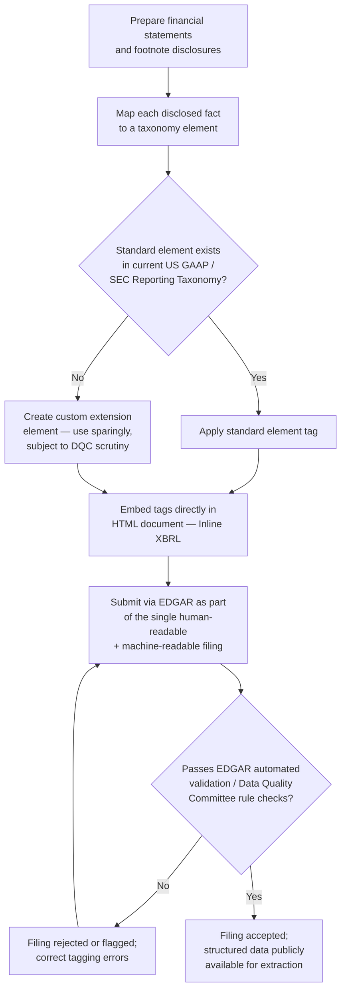

## XBRL Tagging and Structured Data Reporting

### Overview

XBRL (eXtensible Business Reporting Language) is the SEC-mandated structured data format used to tag financial statement and related disclosure information in periodic and other reports, enabling machine-readable extraction, aggregation, and analysis of financial data across registrants. The SEC's structured data program is governed principally by **Regulation S-T** (17 CFR Part 232), which addresses electronic filing requirements generally, together with SEC rules specifically mandating **Inline XBRL (iXBRL)** — the current required tagging format — and the periodically updated **XBRL taxonomies** that define the specific data elements (tags) available for use.

### What XBRL Is and Why It Exists

**Key Points**

- [Inference] XBRL is an XML-based markup language that allows individual financial statement line items, footnote disclosures, and other structured data points to be tagged with standardized, machine-readable identifiers (elements) drawn from a defined taxonomy, rather than existing only as unstructured text or numbers within a human-readable document.
- [Inference] The regulatory purpose of mandating XBRL is to make financial statement data readily and reliably extractable by investors, analysts, data aggregators, and the SEC's own internal analytical and risk-assessment tools (e.g., financial statement fraud detection models), without requiring manual re-keying of data from PDF or HTML-formatted filings.

### Inline XBRL (iXBRL): The Current Required Format

**Key Points**

- [Inference] The SEC transitioned from requiring XBRL data as a separate exhibit (a standalone XBRL "instance document" attached to, but distinct from, the human-readable filing) to requiring **Inline XBRL**, in which the XBRL tags are embedded directly within the human-readable HTML document itself — meaning a single document serves as both the human-readable filing and the machine-readable structured data source, eliminating the need to prepare and reconcile two separate versions of the same information.
- [Inference] The Inline XBRL mandate was phased in over several years by filer category, with large accelerated filers required to comply first, followed by accelerated filers, and finally all other filers (including smaller reporting companies) — the phase-in is now complete, and Inline XBRL is the uniformly required tagging format for financial statement and related structured data across virtually all operating company filers.
- [Inference] Inline XBRL benefits filers by eliminating duplicative preparation and improves data quality by ensuring the human-readable and machine-readable versions of a filing cannot diverge (since they are, in fact, the same document), a problem that could arise under the prior separate-exhibit approach.

### What Gets Tagged

**Key Points**

- [Inference] Core financial statements (balance sheet, income statement, statement of comprehensive income, statement of cash flows, statement of changes in equity) are tagged at the individual line-item level.
- [Inference] Footnote disclosures are tagged using a combination of: (1) individual numeric or text-block tags for discrete disclosed facts (e.g., a specific dollar amount of goodwill by reporting unit), and (2) larger "text block" tags that capture an entire footnote's narrative content as a single block of tagged text, used where granular element-by-element tagging of narrative disclosure would be impractical.
- [Inference] Document and Entity Information (DEI) — such as the registrant's name, CIK (Central Index Key) number, fiscal year-end, filer status, and shares outstanding — is tagged using a dedicated DEI taxonomy, distinct from the US GAAP Financial Reporting Taxonomy used for the financial statements themselves.
- [Inference] Cover page data required by SEC cover page redesign rules is likewise tagged, enabling automated extraction of basic filing metadata without needing to parse the narrative document.

### Taxonomies: The Available Tag Library

**Key Points**

- The **US GAAP Financial Reporting Taxonomy** and the **SEC Reporting Taxonomy** are updated annually; the 2025 versions reflect the same taxonomy versions the FASB made available in December 2024, and EDGAR was upgraded to support them as of March 2025.
- [Inference] The US GAAP taxonomy is maintained principally by the FASB (as taxonomy content largely mirrors the Accounting Standards Codification's structure and terminology), while the SEC separately maintains certain taxonomies addressing SEC-specific disclosure requirements not directly sourced from GAAP (e.g., the SEC Reporting Taxonomy, the DEI taxonomy, and industry- or transaction-specific taxonomies).
- Specialized taxonomies exist for particular filer types or transaction categories — for example, the 2025 taxonomy cycle newly added a **Special Purpose Acquisition Company (SPAC) taxonomy**, including elements needed for tagging the enhanced disclosure requirements for SPAC initial public offering and de-SPAC transactions adopted as part of final SEC rules on SPACs, shell companies, and projections; this SPAC taxonomy was further updated in an October 2025 EDGAR release.
- Other specialized taxonomies include the Closed-End Fund (CEF), Open-End Fund (OEF), Variable Insurance Product (VIP), Self-Regulatory Organizations (SRO), Employee Benefit Plan, and Risk/Return Summary taxonomies, each tailored to the disclosure content required of the corresponding filer category or transaction type.
- A **Data Quality Committee Rules Taxonomy (DQCRT)** is also maintained and updated; the 2025 version introduces enhanced validation rules to assist regulators in ensuring data accuracy — reflecting the SEC's and XBRL US's ongoing effort to improve the quality and consistency of tagged data submitted across registrants.
- [Inference] Taxonomy versions are generally not cross-compatible — a filer must use elements from a consistent taxonomy version (or a permitted transitional overlap window) within a single filing, and EDGAR periodically discontinues support for older taxonomy versions (for example, the June 2025 EDGAR 25.2 release discontinued acceptance of 2023-version taxonomies across a range of standard taxonomy categories), which requires filers and their financial reporting software to stay current with the SEC's taxonomy release cycle.
- The SEC periodically issued an **IFRS Taxonomy** for use by foreign private issuers reporting under IFRS as issued by the IASB, with the most recent 2025 version supported in EDGAR as of the June 2025 (Release 25.2) update, reflecting the IASB's taxonomy version made available in March 2025.

### Custom (Extension) Tags

**Key Points**

- [Inference] Where a standard taxonomy element does not exist for a company-specific line item or disclosure, filers may create a **custom extension element** specific to their own filing — however, SEC staff and the XBRL US Data Quality Committee generally discourage overuse of custom extensions where a suitable standard element exists, since extension elements reduce cross-company comparability (a primary purpose of standardized tagging in the first place).
- [Inference] SEC staff review (including automated Data Quality Committee validation rule checks applied to EDGAR submissions) and periodic guidance have historically flagged registrants with unusually high rates of custom extension element usage relative to industry peers as a data-quality concern warranting closer scrutiny, since excessive extension usage can signal either genuinely unusual financial statement presentation or simply inadequate effort to map disclosures to available standard elements.

### Filing Mechanics and Certification

**Key Points**

- [Inference] XBRL/Inline XBRL data is submitted through the SEC's EDGAR (Electronic Data Gathering, Analysis, and Retrieval) system as part of the same submission as the human-readable filing (given the inline format), subject to EDGAR's automated validation checks that reject or flag submissions containing certain classes of tagging errors before acceptance.
- [Inference] Regulation S-T governs the general electronic filing framework, including signature, format, and submission requirements applicable to EDGAR filings, of which the Inline XBRL requirements form a specific technical component.
- On January 12, 2025, the SEC published a final rule mandating the use of structured data formats, including Inline XBRL and XML, for certain additional regulatory filings under the Securities Exchange Act of 1934 — reflecting the SEC's continued expansion of structured data requirements to filing types beyond the core periodic reports historically covered by the Inline XBRL mandate. [Unverified] The specific filing types newly brought within this expanded structured-data mandate, and the associated compliance timeline, should be confirmed against the SEC's final rule release for precision, as details of scope and phase-in were not fully captured in available summary sources.

### Diagram: XBRL Tagging Workflow

### Diagram: XBRL Taxonomy Ecosystem (svg_diagram)

<svg xmlns="http://www.w3.org/2000/svg" viewBox="0 0 740 340">
<text x="370" y="24" text-anchor="middle" font-size="15" font-weight="bold" font-family="Arial, sans-serif">XBRL Taxonomy Ecosystem (svg_diagram)</text>
<rect x="270" y="45" width="200" height="45" rx="6" fill="#e8eef7" stroke="#2c5282" stroke-width="1.5" />
<text x="370" y="65" text-anchor="middle" font-size="11" font-weight="bold" font-family="Arial, sans-serif">EDGAR / SEC Structured</text>
<text x="370" y="80" text-anchor="middle" font-size="11" font-weight="bold" font-family="Arial, sans-serif">Data Framework</text>
<line x1="370" y1="90" x2="150" y2="120" stroke="#4a5568" stroke-width="1.2" />
<line x1="370" y1="90" x2="370" y2="120" stroke="#4a5568" stroke-width="1.2" />
<line x1="370" y1="90" x2="590" y2="120" stroke="#4a5568" stroke-width="1.2" />
<rect x="50" y="120" width="200" height="55" rx="6" fill="#f0f4f8" stroke="#4a5568" stroke-width="1.2" />
<text x="150" y="142" text-anchor="middle" font-size="10" font-weight="bold" font-family="Arial, sans-serif">US GAAP Financial</text>
<text x="150" y="156" text-anchor="middle" font-size="10" font-weight="bold" font-family="Arial, sans-serif">Reporting Taxonomy</text>
<text x="150" y="169" text-anchor="middle" font-size="8" font-family="Arial, sans-serif">FASB-maintained, annual</text>
<rect x="270" y="120" width="200" height="55" rx="6" fill="#f0f4f8" stroke="#4a5568" stroke-width="1.2" />
<text x="370" y="142" text-anchor="middle" font-size="10" font-weight="bold" font-family="Arial, sans-serif">DEI / SEC Reporting /</text>
<text x="370" y="156" text-anchor="middle" font-size="10" font-weight="bold" font-family="Arial, sans-serif">Specialized Taxonomies</text>
<text x="370" y="169" text-anchor="middle" font-size="8" font-family="Arial, sans-serif">SPAC, CEF, OEF, VIP, etc.</text>
<rect x="490" y="120" width="200" height="55" rx="6" fill="#f0f4f8" stroke="#4a5568" stroke-width="1.2" />
<text x="590" y="142" text-anchor="middle" font-size="10" font-weight="bold" font-family="Arial, sans-serif">IFRS Taxonomy</text>
<text x="590" y="156" text-anchor="middle" font-size="10" font-weight="bold" font-family="Arial, sans-serif">(Foreign Private Issuers)</text>
<text x="590" y="169" text-anchor="middle" font-size="8" font-family="Arial, sans-serif">IASB-sourced, annual</text>
<line x1="150" y1="175" x2="370" y2="210" stroke="#4a5568" stroke-width="1" stroke-dasharray="3,3" />
<line x1="370" y1="175" x2="370" y2="210" stroke="#4a5568" stroke-width="1" stroke-dasharray="3,3" />
<line x1="590" y1="175" x2="370" y2="210" stroke="#4a5568" stroke-width="1" stroke-dasharray="3,3" />
<rect x="220" y="210" width="300" height="50" rx="6" fill="#faf5e6" stroke="#b7791f" stroke-width="1.5" />
<text x="370" y="232" text-anchor="middle" font-size="10" font-weight="bold" font-family="Arial, sans-serif">Data Quality Committee</text>
<text x="370" y="246" text-anchor="middle" font-size="10" font-weight="bold" font-family="Arial, sans-serif">Rules Taxonomy (DQCRT)</text>
<line x1="370" y1="260" x2="370" y2="285" stroke="#b7791f" stroke-width="1.2" />
<rect x="240" y="285" width="260" height="35" rx="6" fill="#e6f4ea" stroke="#2f855a" stroke-width="1.2" />
<text x="370" y="307" text-anchor="middle" font-size="10" font-family="Arial, sans-serif">Validation rules applied at EDGAR submission</text>
</svg>

### Data Quality Committee (DQC) Validation Rules

**Key Points**

- [Inference] The XBRL US Data Quality Committee develops and maintains validation rules (published as the DQCRT) designed to catch common tagging errors before or upon EDGAR submission — examples of rule categories include checks for mathematically inconsistent sums (e.g., component line items that do not sum to a tagged total), sign errors (a value tagged as positive that should logically be negative, or vice versa, given the element's balance type), and inappropriate use of certain elements outside their intended context.
- [Inference] These validation rules function as an automated quality gate: submissions that fail certain rule checks may be rejected by EDGAR outright, while others generate a warning that a filer may choose to address or, in limited circumstances, document as an appropriately explained exception.

### Common Forensic and Exam Pitfalls

**Key Points**

- **Confusing standalone XBRL exhibits with the current Inline XBRL requirement**: candidates using outdated study materials may reference the pre-Inline-XBRL regime (a separate XBRL exhibit distinct from the human-readable document) as though it remains current practice — it has been superseded by Inline XBRL across essentially all operating company filers.
- **Underestimating the significance of custom extension elements**: candidates often treat XBRL tagging as a mechanical, low-judgment exercise, when in fact the decision to use a standard element versus create a custom extension involves meaningful judgment and carries data-quality and regulatory-scrutiny implications.
- **Forensic angle**: [Inference] XBRL-tagged data has become an important input to SEC and academic financial-statement-fraud detection research, since structured, machine-readable data enables large-scale, automated comparison of a registrant's reported figures against industry peers and against that registrant's own historical patterns — an unusually high rate of custom extension element usage, unusual or inconsistent tagging of the same conceptual line item across periods, or DQC validation rule failures/overrides can themselves function as forensic red flags warranting closer review, on the theory that a registrant attempting to obscure an unusual accounting treatment may also exhibit atypical or evasive tagging behavior (for example, using a custom extension specifically to avoid a standard element that would make an aggressive classification more readily comparable to, and thus more easily flagged against, industry peers).

**Related Topics**

- SEC reporting requirements for Forms 10-K, 10-Q, and 8-K (the primary filings to which Inline XBRL tagging applies)
- Regulation S-X and Regulation S-K requirements (the substantive content that XBRL tagging structures)
- SEC's use of structured data in financial statement fraud detection (e.g., academic and regulatory research using XBRL-derived datasets)
- EDGAR filing mechanics and the SEC's electronic filing framework under Regulation S-T
- Data Quality Committee validation rules and common XBRL tagging error patterns
- Cover page and Document and Entity Information (DEI) tagging requirements
- Taxonomy update cycles and filer transition management for annual XBRL taxonomy changes