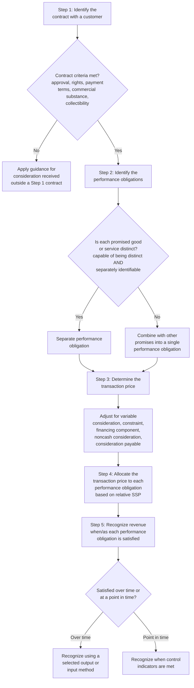

## Five-Step Revenue Recognition Model

### Overview

The five-step model is the core recognition and measurement framework established by **ASC 606, *Revenue from Contracts with Customers*** (US GAAP) and its converged counterpart **IFRS 15, *Revenue from Contracts with Customers*** (IFRS). Issued jointly by the FASB and IASB, the model replaced the prior, largely industry-specific and rules-based revenue recognition guidance (including SAB 104, EITF consensuses, and numerous industry-specific SOPs under legacy US GAAP, and IAS 18/IAS 11 under legacy IFRS) with a single, principles-based framework applicable across virtually all industries and transaction types.

### Core Recognition Principle

**Key Points**

- The core principle of ASC 606/IFRS 15 is that an entity recognizes revenue to depict the transfer of promised goods or services to customers in an amount that reflects the consideration to which the entity expects to be entitled in exchange for those goods or services.
- [Inference] This principle represents a fundamental shift from legacy revenue recognition guidance's emphasis on "risks and rewards" transfer and "realized or realizable and earned" criteria toward a **control-transfer** model, in which the central analytical question becomes precisely when the customer obtains control of the promised good or service, rather than when risks and rewards of ownership have passed.
- The five steps operationalize this core principle as a sequential analytical framework applied to each contract (or, in certain circumstances, combined contracts) with a customer.

### Step 1: Identify the Contract with a Customer

**Key Points**

- [Inference] A contract exists, for purposes of applying the model, only when all of the following criteria are met: (1) the parties have approved the contract and are committed to perform their respective obligations; (2) the entity can identify each party's rights regarding the goods or services to be transferred; (3) the entity can identify the payment terms; (4) the contract has commercial substance; and (5) it is probable that the entity will collect substantially all of the consideration to which it will be entitled in exchange for the goods or services transferred to the customer.
- [Inference] The collectibility assessment focuses on the customer's ability and intention to pay the amount of consideration to which the entity will be entitled, which may be less than the contract's stated price if the entity intends to offer a price concession.
- [Inference] Contract combination guidance requires an entity to combine two or more contracts entered into at or near the same time with the same customer (or related parties) and account for them as a single contract if specified criteria are met — for example, if the contracts are negotiated as a package with a single commercial objective, if the amount of consideration in one contract depends on the price or performance of the other, or if the goods or services promised in the contracts represent a single performance obligation.
- [Inference] If the Step 1 criteria are not met, an entity generally does not apply the remaining steps of the model to that arrangement and instead applies specific guidance addressing consideration received when a contract does not meet the Step 1 criteria (e.g., recognizing consideration received as a liability until the criteria are subsequently met or specified other conditions occur).

### Step 2: Identify the Performance Obligations in the Contract

**Key Points**

- [Inference] A performance obligation is a promise in a contract with a customer to transfer to the customer either: (1) a distinct good or service (or bundle of goods or services), or (2) a series of distinct goods or services that are substantially the same and have the same pattern of transfer to the customer.
- [Inference] A promised good or service is **distinct** if both of the following criteria are met: (a) the customer can benefit from the good or service either on its own or together with other readily available resources (capable of being distinct), and (b) the entity's promise to transfer the good or service is separately identifiable from other promises in the contract (distinct within the context of the contract).
- [Inference] Factors indicating that a promise to transfer a good or service is not separately identifiable (and therefore should be combined with other promises into a single performance obligation) include: the entity provides a significant integration service combining the goods or services into a combined output; one or more of the goods or services significantly modifies or customizes another good or service promised in the contract; or the goods or services are highly interdependent or highly interrelated.

**Example**

A software company sells a perpetual software license bundled with one year of unspecified when-and-if-available updates and telephone technical support. The license is capable of being distinct (the customer can use the software on its own or with readily available resources) and is separately identifiable (the updates and support do not significantly modify or customize the license, and there is no significant integration service combining them into a single output). This arrangement therefore contains three distinct performance obligations: (1) the software license, (2) the updates, and (3) the technical support — each analyzed and recognized separately rather than as a single bundled obligation.

### Step 3: Determine the Transaction Price

**Key Points**

- [Inference] The transaction price is the amount of consideration to which an entity expects to be entitled in exchange for transferring promised goods or services to a customer, excluding amounts collected on behalf of third parties (e.g., certain sales taxes).
- [Inference] Determining the transaction price requires consideration of several factors: **variable consideration** (amounts that vary due to discounts, rebates, refunds, credits, price concessions, incentives, performance bonuses, penalties, or other similar items, or where the entity's entitlement to the amount is contingent on a future event), **the constraint on variable consideration** (variable consideration is included in the transaction price only to the extent it is probable that a significant reversal of cumulative revenue recognized will not occur when the uncertainty is subsequently resolved), **the existence of a significant financing component** (requiring adjustment of the promised consideration for the time value of money when the timing of payments agreed to by the parties provides the customer or the entity with a significant financing benefit), **noncash consideration** (measured at fair value), and **consideration payable to the customer** (generally recognized as a reduction of the transaction price, unless the payment is in exchange for a distinct good or service from the customer).
- [Inference] Two methods are available for estimating variable consideration: the **expected value method** (the sum of probability-weighted amounts in a range of possible consideration amounts, appropriate when an entity has a large number of contracts with similar characteristics) and the **most likely amount method** (the single most likely amount in a range of possible consideration amounts, appropriate when the contract has only two possible outcomes, such as an entity either achieving or not achieving a specified performance bonus).

**Example**

A manufacturer sells products subject to a volume rebate: if the customer purchases more than 1,000 units during the calendar year, it receives a retroactive 10% rebate on all units purchased during the year. Based on historical experience, the manufacturer estimates the customer will likely exceed the 1,000-unit threshold. Using the expected value or most likely amount method (whichever better predicts the amount of consideration), the manufacturer would reduce the transaction price for each unit sold to reflect the estimated rebate, recognizing revenue net of that estimate from the outset — subject to the constraint that revenue subject to significant reversal is not recognized until the uncertainty is resolved.

### Step 4: Allocate the Transaction Price to the Performance Obligations

**Key Points**

- [Inference] For a contract with more than one performance obligation, an entity allocates the transaction price to each distinct performance obligation in an amount that depicts the amount of consideration to which the entity expects to be entitled in exchange for satisfying each performance obligation — generally accomplished by allocating on a **relative standalone selling price (SSP)** basis.
- [Inference] The standalone selling price is the price at which an entity would sell a promised good or service separately to a customer; where the standalone selling price is not directly observable, an entity must estimate it, using approaches such as the **adjusted market assessment approach**, the **expected cost plus a margin approach**, or, in limited circumstances, a **residual approach** (permitted only when the SSP is highly variable or uncertain, such as when the good or service has not previously been sold or the price is highly variable because a broad range of prices is charged to different customers).
- [Inference] A discount inherent in the overall contract price (i.e., where the sum of standalone selling prices of the individual goods or services exceeds the total contract consideration) is generally allocated proportionately across all performance obligations, unless observable evidence indicates the entire discount relates to only one or some, but not all, performance obligations in the contract, in which case specific allocation criteria must be met to allocate the discount entirely to those specific obligations.
- [Inference] Similarly, variable consideration (or a subsequent change in the transaction price) may be allocated entirely to one or more, but not all, performance obligations or distinct goods/services in a series, if specified criteria are met linking the variable amount specifically and exclusively to the effort of satisfying that specific obligation or transferring that specific distinct good/service.

### Step 5: Recognize Revenue When (or As) the Entity Satisfies a Performance Obligation

**Key Points**

- [Inference] An entity recognizes revenue when (or as) it satisfies a performance obligation by transferring a promised good or service to a customer — control of the asset transfers, meaning the customer obtains the ability to direct the use of, and obtain substantially all of the remaining benefits from, the asset.
- [Inference] Each performance obligation is analyzed to determine whether it is satisfied **over time** or **at a point in time**. A performance obligation is satisfied over time if at least one of the following criteria is met: (a) the customer simultaneously receives and consumes the benefits provided by the entity's performance as the entity performs; (b) the entity's performance creates or enhances an asset that the customer controls as the asset is created or enhanced; or (c) the entity's performance does not create an asset with an alternative use to the entity, and the entity has an enforceable right to payment for performance completed to date.
- [Inference] If none of the over-time criteria are met, the performance obligation is satisfied — and revenue is recognized — at a point in time, based on indicators of control transfer such as: the entity has a present right to payment; the customer has legal title; the entity has transferred physical possession; the customer has the significant risks and rewards of ownership; and the customer has accepted the asset.
- [Inference] For performance obligations satisfied over time, an entity selects a single method to measure progress toward complete satisfaction — either an **output method** (measuring progress based on direct measurements of value transferred to the customer, such as units delivered, milestones reached, or surveys of performance completed to date) or an **input method** (measuring progress based on the entity's efforts or inputs to satisfaction, such as costs incurred, labor hours expended, or machine hours used, relative to total expected inputs) — and applies that method consistently to similar performance obligations in similar circumstances.

### Diagram: The Five-Step Model

### Diagram: Distinct Performance Obligation Test (svg_diagram)

<svg xmlns="http://www.w3.org/2000/svg" viewBox="0 0 720 300">
<text x="360" y="24" text-anchor="middle" font-size="15" font-weight="bold" font-family="Arial, sans-serif">Two-Part Distinctness Test — Step 2 (svg_diagram)</text>
<rect x="240" y="45" width="240" height="40" rx="6" fill="#e8eef7" stroke="#2c5282" stroke-width="1.5" />
<text x="360" y="70" text-anchor="middle" font-size="11" font-weight="bold" font-family="Arial, sans-serif">Promised Good or Service</text>
<line x1="360" y1="85" x2="200" y2="115" stroke="#4a5568" stroke-width="1.2" />
<line x1="360" y1="85" x2="520" y2="115" stroke="#4a5568" stroke-width="1.2" />
<rect x="90" y="115" width="220" height="70" rx="6" fill="#f0f4f8" stroke="#4a5568" stroke-width="1.2" />
<text x="200" y="138" text-anchor="middle" font-size="10" font-weight="bold" font-family="Arial, sans-serif">Criterion A:</text>
<text x="200" y="153" text-anchor="middle" font-size="10" font-weight="bold" font-family="Arial, sans-serif">Capable of Being Distinct</text>
<text x="200" y="170" text-anchor="middle" font-size="9" font-family="Arial, sans-serif">Customer can benefit alone or</text>
<text x="200" y="182" text-anchor="middle" font-size="9" font-family="Arial, sans-serif">with readily available resources</text>
<rect x="410" y="115" width="220" height="70" rx="6" fill="#f0f4f8" stroke="#4a5568" stroke-width="1.2" />
<text x="520" y="138" text-anchor="middle" font-size="10" font-weight="bold" font-family="Arial, sans-serif">Criterion B:</text>
<text x="520" y="153" text-anchor="middle" font-size="10" font-weight="bold" font-family="Arial, sans-serif">Separately Identifiable</text>
<text x="520" y="170" text-anchor="middle" font-size="9" font-family="Arial, sans-serif">Not a significant integration,</text>
<text x="520" y="182" text-anchor="middle" font-size="9" font-family="Arial, sans-serif">modification, or high interdependency</text>
<line x1="200" y1="185" x2="360" y2="220" stroke="#4a5568" stroke-width="1" stroke-dasharray="3,3" />
<line x1="520" y1="185" x2="360" y2="220" stroke="#4a5568" stroke-width="1" stroke-dasharray="3,3" />
<rect x="220" y="220" width="280" height="55" rx="6" fill="#e6f4ea" stroke="#2f855a" stroke-width="1.5" />
<text x="360" y="242" text-anchor="middle" font-size="11" font-weight="bold" font-family="Arial, sans-serif">Both criteria met →</text>
<text x="360" y="258" text-anchor="middle" font-size="11" font-weight="bold" font-family="Arial, sans-serif">Distinct Performance Obligation</text>
</svg>

### Contract Costs

**Key Points**

- [Inference] ASC 606/IFRS 15 also address the accounting for certain contract-related costs: **incremental costs of obtaining a contract** (e.g., sales commissions) are capitalized as an asset if the entity expects to recover them, unless the amortization period for the asset would be one year or less, in which case a practical expedient permits immediate expensing.
- [Inference] **Costs to fulfill a contract** that are not within the scope of other guidance (such as inventory, PP&E, or intangible asset guidance) are capitalized if they relate directly to an existing contract, generate or enhance resources that will be used to satisfy performance obligations in the future, and are expected to be recovered.
- [Inference] Capitalized contract costs are amortized on a systematic basis consistent with the transfer of the goods or services to which the asset relates, and are subject to impairment testing.

### Common Forensic and Exam Pitfalls

**Key Points**

- **Conflating "distinct" with merely "separately priced"**: candidates often assume that if a contract separately prices two items, they must be two performance obligations — separate pricing is not part of the distinctness test itself; the analysis turns on capability of being distinct and separate identifiability, regardless of how the contract prices the components.
- **Misapplying the residual approach for estimating standalone selling price**: this approach is permitted only in narrow circumstances (highly variable or uncertain SSP) — using it merely because it is administratively convenient, rather than because the specific qualifying conditions are met, is a common error.
- **Overlooking the constraint on variable consideration**: candidates sometimes recognize the full expected value of variable consideration without applying the "probable no significant reversal" constraint, which can result in premature revenue recognition.
- **Forensic angle**: [Inference] The five-step model's heavy reliance on management judgment — particularly in performance obligation identification (Step 2), variable consideration estimation (Step 3), and standalone selling price estimation (Step 4) — creates multiple potential vectors for revenue-recognition-based earnings management, a historically common category of financial statement fraud. Forensic accountants frequently focus on: (1) whether an entity's performance obligation identification judgments are applied consistently across similar contracts and periods, or whether they shift opportunistically (e.g., combining obligations to accelerate recognition in a weak quarter, or separating them to defer recognition when results are already strong); (2) whether variable consideration estimates and their required constraint application are supported by contemporaneous, objective historical data or instead appear to be reverse-engineered to produce a desired revenue outcome; and (3) whether standalone selling price estimates for bundled arrangements (particularly under the residual approach) are consistently derived or instead adjusted period-to-period in ways that shift revenue recognition timing across performance obligations without an underlying change in the economics of the arrangements.

**Related Topics**

- Variable consideration and the constraint on revenue recognition in depth
- Principal versus agent considerations under ASC 606/IFRS 15
- Licensing arrangements — right to access versus right to use intellectual property
- Contract modifications and their accounting treatment under the five-step model
- Warranties — assurance-type versus service-type warranty accounting
- Disaggregation of revenue disclosure requirements
- Industry-specific revenue recognition application (software, construction, long-term contracts, franchising)