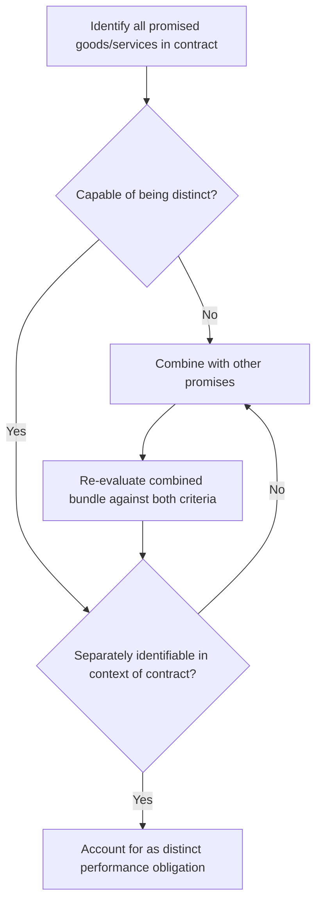

## Identifying Performance Obligations

### Overview

A performance obligation is a promise in a contract with a customer to transfer a distinct good or service (or a distinct bundle of goods or services) to the customer. Under ASC 606 and IFRS 15, identifying performance obligations is **Step 2** of the five-step revenue recognition model and directly determines how, and over what pattern, revenue is recognized.

### Regulatory Framework

- **ASC 606-10-25-14 through 25-22** (US GAAP)
- **IFRS 15, paragraphs 22–30** (International)

Both frameworks are substantially converged on this topic, though minor application differences exist (e.g., practical expedients around shipping and handling).

### The Distinct Criteria

A promised good or service is **distinct** — and therefore accounted for as a separate performance obligation — only if both criteria are met:

1. **Capable of being distinct**: The customer can benefit from the good or service either on its own or together with other readily available resources.
2. **Distinct within the context of the contract**: The promise to transfer the good or service is separately identifiable from other promises in the contract.

$$\text{Distinct Performance Obligation} = \text{Capable of Being Distinct} \cap \text{Separately Identifiable}$$

#### Criterion 1: Capable of Being Distinct

A good or service is capable of being distinct if the customer could use, consume, sell, or hold it in a way that generates economic benefit. This is generally satisfied for most standard goods and services, since the customer could theoretically obtain equivalent goods/services from other sources.

#### Criterion 2: Separately Identifiable (Contract-Level Assessment)

ASC 606-10-25-21 lists factors indicating the promise is **not** separately identifiable (i.e., should be bundled):

- The entity provides a **significant integration service** — combining goods/services into a combined output.
- One good or service **significantly modifies or customizes** another.
- The goods or services are **highly interdependent or highly interrelated** — each significantly affects the other, such that the entity would not be able to fulfill the promise by transferring each independently.

**[Inference]** In practice, the "highly interdependent" factor tends to be the most judgment-intensive and is a frequent focus of SEC comment letters and auditor scrutiny.

### Decision Framework

### Common Performance Obligation Scenarios

#### 1. Software License + Implementation Services

**Key Points**

- Standard license + significant customization/integration services → often **one** combined performance obligation (customization criterion triggered).
- Standard license + basic installation (off-the-shelf, no modification) → typically **two** performance obligations, since installation doesn't significantly modify the software.

#### 2. Equipment Sale + Extended Warranty

- Base assurance-type warranty (ASC 460 territory) is **not** a separate performance obligation — it's a cost accrual.
- Service-type warranty (offers a service beyond assuring conformance to specifications) **is** a separate performance obligation under ASC 606-10-55-30 through 55-35.

#### 3. Multi-Element SaaS Arrangements

- SaaS subscription + standard customer support + standard upgrades → often bundled as **one** obligation (a "series" of distinct services satisfied over time, per ASC 606-10-25-14(b) and 25-15, if substantially the same and same pattern of transfer).
- SaaS + professional services that significantly customize the platform → **may combine** into one obligation.

### The Series Guidance (ASC 606-10-25-14(b))

A series of distinct goods or services is treated as a **single performance obligation** when:

1. Each distinct good/service in the series is substantially the same, **and**
2. Each has the same pattern of transfer to the customer (i.e., each would meet the over-time criteria in ASC 606-10-25-27 individually).

This is critical for SaaS, outsourcing, and other repetitive-delivery arrangements, since it avoids artificially fragmenting a contract into hundreds of daily/monthly obligations.

### Example: Forensic Accounting Application

**Example**

A forensic accountant reviewing a technology company's revenue recognition might identify **improper obligation bundling** as a fraud risk indicator:

- **Understatement scheme**: Company improperly bundles a distinct, upfront-deliverable license with ongoing services to defer revenue recognition and smooth earnings.
- **Overstatement scheme**: Company improperly *unbundles* an integrated arrangement (e.g., treats implementation as distinct when it's actually highly interdependent with the license) to accelerate revenue recognition upon delivery, inflating current-period results.

Forensic red flags include:

- Contract terms that contradict the stated accounting treatment (e.g., no standalone value language for supposedly "distinct" items).
- Frequent, unexplained changes in performance obligation identification between similar contracts.
- Standalone selling price allocations that lack support or fluctuate without business justification.

### Practical Expedients

- **Shipping and handling after control transfer**: Entities may elect, as an accounting policy, to treat shipping/handling as a fulfillment activity rather than a separate performance obligation (ASC 606-10-25-18B).
- **Immaterial promised goods/services**: An entity is not required to assess whether promises are performance obligations if they are immaterial in the context of the contract (ASC 606-10-25-16A).

### Documentation and Audit Considerations

**Output**

A well-supported performance obligation analysis should document:

1. Complete inventory of all promises in the contract (explicit and implicit).
2. Assessment against both distinct criteria, with specific facts supporting each conclusion.
3. Treatment of options, material rights, and customer-negotiated terms.
4. Consistency of treatment across similar contract types (a control point auditors and forensic examiners test heavily).

### Common Pitfalls

- Failing to identify **implied promises** arising from customary business practices (e.g., published policies, industry practice) — these are still promises even if not explicitly stated in the contract.
- Overlooking **material rights** (e.g., discount vouchers on future purchases) as separate performance obligations under ASC 606-10-55-42 through 55-45.
- Applying a "one-size-fits-all" bundling conclusion across a portfolio of contracts without contract-specific analysis, which is itself a forensic red flag suggesting managed/manufactured accounting outcomes rather than fact-based judgment.

### Related Topics

- Determining the transaction price
- Allocating the transaction price to performance obligations (relative standalone selling price method)
- Recognizing revenue over time vs. at a point in time
- Variable consideration and constraint estimation
- Material rights and customer options for additional goods/services
- Contract modifications and their effect on performance obligations
- Principal vs. agent considerations in obligation identification
- Forensic indicators of revenue recognition fraud under ASC 606