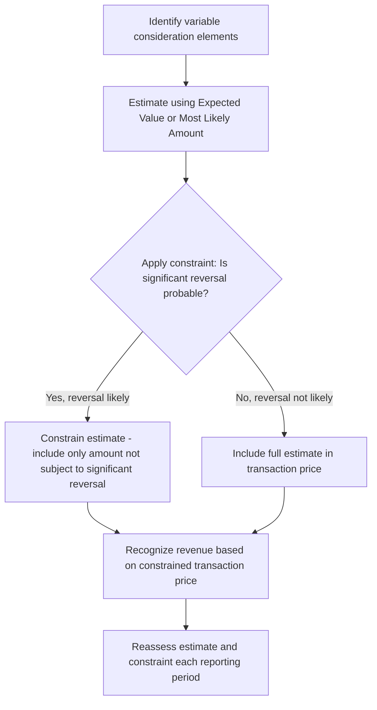

## Variable Consideration and Constraints

### Overview

Variable consideration arises when the transaction price in a contract with a customer includes an amount that may vary due to discounts, rebates, refunds, credits, price concessions, incentives, performance bonuses/penalties, royalties, or other similar items. Under ASC 606 / IFRS 15, variable consideration must be **estimated** and then **constrained** to the extent it is probable (US GAAP) / highly probable (IFRS, using "highly probable" language differences aside — IFRS uses "highly probable") that a significant reversal of cumulative revenue will not occur.

### Regulatory Framework

- **ASC 606-10-32-5 through 32-14** (Variable Consideration and the Constraint)
- **IFRS 15, paragraphs 50–59**

### Step 1: Identifying Variable Consideration

**Key Points**

Common sources of variable consideration include:

- Discounts and rebates
- Refunds and returns
- Credits and price concessions
- Incentives and performance bonuses
- Penalties for late delivery or non-performance
- Royalties (subject to the sales-/usage-based royalty exception for IP licenses)
- Consideration payable to a customer (may reduce transaction price)

An amount is variable even if the variability is only resolved at a future point — for example, a right of return creates variable consideration at contract inception even though the stated price is fixed.

### Step 2: Estimating Variable Consideration

Two estimation methods are permitted, and the entity selects **whichever better predicts the amount of consideration to which it will be entitled**:

#### Expected Value Method

Sum of probability-weighted amounts in a range of possible outcomes. Most appropriate when an entity has a **large number of contracts with similar characteristics**.

$$E[X]=\sum_{i=1}^{n}p_i \cdot x_i$$

where $p_i$ is the probability of outcome $x_i$.

#### Most Likely Amount Method

The single most likely amount in a range of possible outcomes. Most appropriate when the contract has **only two possible outcomes** (e.g., an entity either achieves a performance bonus or does not).

**[Inference]** In practice, entities generally apply one method consistently to a similar type of variable consideration across a portfolio, and switching methods without a substantive change in circumstances would likely draw scrutiny from auditors.

### Step 3: Applying the Constraint

After estimating variable consideration, the entity includes the estimate in the transaction price **only to the extent it is probable that a significant reversal in the amount of cumulative revenue recognized will not occur** when the uncertainty is subsequently resolved (ASC 606-10-32-11).

#### Factors Indicating Increased Likelihood of Significant Reversal (ASC 606-10-32-12)

1. The amount is highly susceptible to factors **outside the entity's influence** (market volatility, judgment/actions of third parties, weather, high obsolescence risk).
2. The uncertainty is **not expected to be resolved for a long period of time**.
3. The entity's experience (or other evidence) with similar contracts is **limited**, or has limited predictive value.
4. The entity has a practice of either **offering a broad range of price concessions** or changing payment terms.
5. The contract has a **large number and broad range of possible consideration amounts**.

### Reassessment Requirement

The constrained estimate of variable consideration is **not a one-time determination**. ASC 606-10-32-14 requires updating the estimated transaction price at the end of each reporting period, including updating the constraint assessment, to represent conditions at the reporting date and changes in circumstances during the period.

### The Sales- and Usage-Based Royalty Exception (IP Licenses)

**Key Points**

For licenses of intellectual property, ASC 606-10-55-65 provides a **specific exception** overriding the general constraint framework: revenue from a sales- or usage-based royalty is recognized at the **later of**:

1. When the subsequent sale or usage occurs, or
2. The satisfaction (or partial satisfaction) of the performance obligation to which the royalty relates.

This exception applies whether the royalty relates *solely* to a license of IP or the license is the *predominant item* to which the royalty relates (i.e., it isn't proportionally allocated between IP and non-IP elements if the license predominates).

### Example: Right of Return

**Example**

A retailer sells $1,000,000 of product with a historical return rate of 5%, based on substantial historical experience with similar products.

- **Estimated returns**: $50,000 (using expected value method, supported by robust historical data)
- **Transaction price**: $950,000
- **Journal entries at point of sale**:
  - Dr. Accounts Receivable $1,000,000
  - Cr. Revenue $950,000
  - Cr. Refund Liability $50,000
- A corresponding **asset for the right to recover product** from customers is recognized (not derecognizing the related inventory cost fully), measured with reference to the former carrying amount of inventory.

Because the entity has substantial historical experience with a large volume of homogeneous transactions, the constraint is not expected to result in a significant reversal, and the full $950,000 estimate is recognized.

### Example: Constrained Performance Bonus

**Example**

A construction contractor is eligible for a $500,000 bonus if a project completes 60 days early. At contract inception, weather and subcontractor risk create significant uncertainty, and the contractor has limited experience with similarly time-constrained projects.

- Applying the most likely amount method with the constraint, the contractor may conclude that **none** of the bonus should be included in the transaction price at inception, because the uncertainty is unlikely to resolve for a long period and the outcome is highly susceptible to factors outside the contractor's control.
- As the project progresses and early-completion likelihood becomes more certain, the transaction price estimate is **updated upward**, with a cumulative catch-up adjustment to revenue recognized to date under the cumulative catch-up method (ASC 606-10-25-36).

### Forensic Accounting Considerations

**Output**

Variable consideration and the constraint are high-risk areas for **earnings management**, because they require significant management judgment. Forensic red flags include:

- **Aggressive inclusion of variable consideration** without sufficient historical basis to support that a significant reversal is not probable — often used to accelerate revenue recognition and meet earnings targets.
- **Understated constraint application** — management fails to constrain highly uncertain variable amounts, front-loading revenue.
- **Inconsistent application of estimation methods** (expected value vs. most likely amount) across similar contract types without a documented rationale.
- **Channel-stuffing combined with liberal return estimates** — recognizing revenue on shipments with insufficient return reserves.
- Lack of **quarter-over-quarter documentation** supporting reassessment of constrained estimates — a control deficiency that also obscures manipulation.
- Side letters or informal understandings that create **undisclosed variable consideration** (e.g., unwritten rights of return, informal price protection commitments) not reflected in the recorded transaction price.

### Interaction with Consideration Payable to a Customer

Consideration payable to a customer (e.g., coupons, credits, slotting fees) is generally accounted for as a **reduction of the transaction price**, unless it is payment for a distinct good or service received from the customer. If the amount payable exceeds the fair value of the distinct good/service received, the excess still reduces the transaction price.

### Related Topics

- Determining the transaction price (non-cash consideration, significant financing components)
- Allocating the transaction price to performance obligations
- Identifying performance obligations
- The sales- and usage-based royalty exception for IP licenses
- Contract modifications affecting variable consideration
- Principal vs. agent considerations and their effect on variable consideration
- Forensic indicators of channel stuffing and reserve manipulation
- Disclosure requirements for variable consideration under ASC 606-10-50