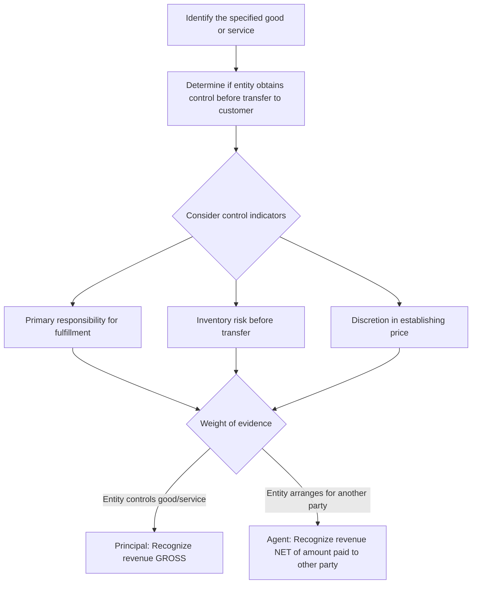

## Principal versus Agent Considerations

### Overview

When another party is involved in providing goods or services to a customer, an entity must determine whether its promise is to provide the good/service itself (acting as a **principal**, recognizing revenue on a **gross** basis) or to arrange for another party to provide the good/service (acting as an **agent**, recognizing revenue on a **net** basis, i.e., only the fee or commission earned).

### Regulatory Framework

- **ASC 606-10-55-36 through 55-40** (Principal vs. Agent Considerations)
- **IFRS 15, paragraphs B34–B38**

This guidance was substantially amended in 2016 (ASU 2016-08) to clarify and align the control-based framework, replacing the older "risks and rewards" indicators model that existed under legacy GAAP.

### The Core Principle: Control

**Key Points**

The determination hinges on **control**, not merely risks and rewards. An entity is a **principal** if it controls the specified good or service **before** that good or service is transferred to the customer. An entity is an **agent** if its performance obligation is to arrange for another party to provide the goods or services.

$$\text{Principal} \iff \text{Entity Controls Good/Service Before Transfer to Customer}$$

### Identifying the Specified Good or Service

Before assessing control, the entity must identify the **specified good or service** to be provided to the customer — this could be:

- A distinct good or service itself, **or**
- A right to a good or service to be provided by another party (e.g., a ticket that gives the customer a right to a future flight).

**[Inference]** Misidentifying the specified good or service is a common root cause of principal/agent errors — for example, treating a travel booking platform's "specified good or service" as the flight itself rather than the *booking/arranging service* can lead to an incorrect gross presentation conclusion.

### Indicators of Control (ASC 606-10-55-39)

When it is unclear whether the entity controls the good or service before transfer, ASC 606-10-55-39 lists three (not exhaustive) indicators — a change from the pre-2016 list of indicators that also removed "primary obligor" and "credit risk" as indicators (they may still be relevant but are not dispositive):

1. **Primary responsibility** for fulfilling the promise to provide the specified good or service, including responsibility for the good/service's acceptability.
2. **Inventory risk** — the entity has inventory risk before the specified good/service is transferred to the customer, or after transfer of control in the case of a right of return.
3. **Discretion in establishing price** for the specified good or service.

**[Inference]** These are indicators, not a checklist requiring unanimous agreement — the overall conclusion is based on judgment as to which party controls the good or service, weighing indicators holistically rather than mechanically counting them.

### Gross vs. Net Presentation

#### Principal (Gross Presentation)

- Recognizes revenue at the **gross amount** of consideration to which it expects to be entitled.
- Recognizes the cost of obtaining the good/service from the other party as **cost of sales / cost of revenue**.

#### Agent (Net Presentation)

- Recognizes revenue at the **net amount** — the fee or commission it retains, which may be the difference between consideration received from the customer and the amount owed to the other party providing the goods/services.

### Example: E-Commerce Marketplace

**Example**

An online marketplace lists third-party sellers' products. Customers purchase directly through the platform; the platform collects payment, and the seller ships the product.

Analysis:

| Indicator | Assessment |
| --- | --- |
| Primary responsibility for fulfillment | Seller ships; platform's terms of service disclaim responsibility for product quality/acceptability |
| Inventory risk | Platform never takes title or physical possession; no inventory risk |
| Pricing discretion | Seller sets the price; platform cannot unilaterally change it |

**Conclusion**: The platform does not control the product before transfer to the customer. The platform is an **agent** and recognizes revenue **net** — i.e., only the commission/referral fee retained, not the full transaction value.

### Example: Retailer Selling Manufacturer's Goods

**Example**

A retailer purchases inventory from a manufacturer, takes title and physical possession, bears risk of loss/obsolescence while the goods sit on its shelves, and sets its own retail price independent of the manufacturer.

**Conclusion**: The retailer controls the goods before transfer to the customer (inventory risk and pricing discretion both present) — the retailer is a **principal** and recognizes revenue **gross** at the full retail sales price, with cost of goods sold recorded separately.

### Common Application Areas

- **Travel and booking platforms** (airline tickets, hotel bookings)
- **Digital app marketplaces / app stores** (platform fees vs. developer's share)
- **Freight/shipping arrangements** (freight forwarders vs. carriers)
- **Gift cards and stored value** (issuer vs. redeeming merchant)
- **Consignment arrangements** (consignor typically retains control until final sale)
- **Staffing and outsourcing arrangements**

### Forensic Accounting Considerations

**Output**

Principal vs. agent classification is a significant fraud and earnings-management risk area because gross presentation **inflates both revenue and cost of sales without affecting net income**, but it can:

- Materially affect **revenue growth metrics**, which are often scrutinized by investors and used in valuation multiples (e.g., price-to-revenue).
- Affect **compliance with debt covenants** tied to revenue thresholds.
- Affect **executive compensation metrics** tied to top-line revenue.
- Distort **gross margin percentages**, potentially masking deteriorating unit economics.

Forensic red flags include:

- **"Round-tripping" or "bill-and-hold" arrangements** dressed up as principal relationships to inflate reported revenue without genuine economic substance.
- **Post-ASU 2016-08 restatements** — companies (particularly online marketplaces and platform businesses) that historically recognized revenue gross and subsequently restated to net (or vice versa) warrant scrutiny of the underlying judgment and any incentive to have originally overstated revenue.
- Contractual terms that are **inconsistent with the stated accounting position** — e.g., accounting for a transaction as agent (net) while contracts show the entity bears primary responsibility for fulfillment and inventory risk.
- **Changing classification** of economically similar arrangements between reporting periods without a substantive change in facts, suggesting the conclusion is being reverse-engineered to hit specific revenue targets.

### Disclosure Considerations

Entities are required to disclose significant judgments made in evaluating principal vs. agent conclusions when the determination requires significant judgment (ASC 606-10-50-17 through 50-21, qualitative disclosures about performance obligations and significant judgments).

### Related Topics

- Identifying performance obligations
- Determining the transaction price
- Consideration payable to a customer
- Gross vs. net revenue presentation and comparability across industries
- Consignment arrangements under ASC 606
- Forensic indicators of channel stuffing and round-tripping
- SEC comment letter trends on gross vs. net revenue presentation