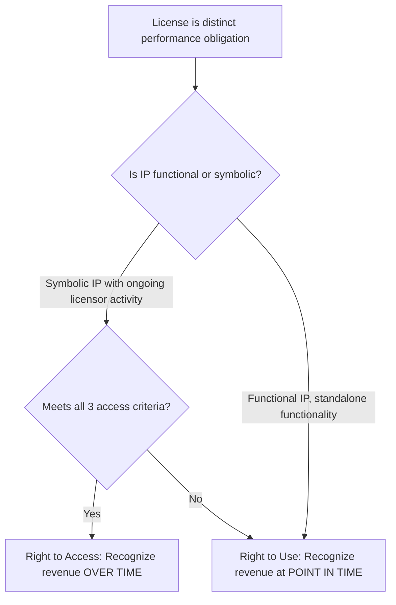
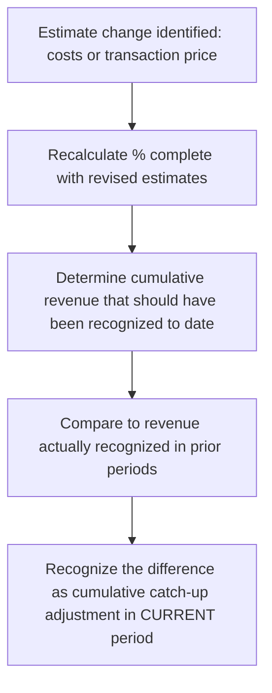

## Licensing, Royalties, and Long-Term Contracts

### Overview

This topic covers three interconnected areas of ASC 606 / IFRS 15 application: (1) licensing of intellectual property, (2) royalty arrangements, and (3) long-term contracts, particularly those recognized over time using percentage-of-completion-type approaches. Each involves elevated estimation complexity and is a frequent area of restatement and forensic scrutiny.

### Regulatory Framework

- **ASC 606-10-55-54 through 55-65** (Licensing)
- **ASC 606-10-25-27 through 25-37** (Over-Time Recognition, relevant to long-term contracts)
- **IFRS 15, paragraphs B52–B63** (Licensing) and paragraphs 35–45 (Over-Time Recognition)

---

## Part 1: Licensing of Intellectual Property

### Distinct Licenses: Right to Use vs. Right to Access

**Key Points**

If a license is distinct from other promises in the contract, the entity determines whether the license transfers:

1. **A right to access** the entity's IP as it exists throughout the license period → recognized **over time**.
2. **A right to use** the entity's IP as it exists at the point in time the license is granted → recognized **at a point in time**.

#### Right-to-Access Criteria (ASC 606-10-55-59)

A license provides a right to access (over-time recognition) when **all three** conditions are met:

1. The contract requires, or the customer reasonably expects, that the entity will undertake activities that **significantly affect the IP** to which the customer has rights.
2. The rights granted by the license **directly expose the customer** to any positive or negative effects of the entity's activities.
3. Those activities **do not result in the transfer of a good or service** to the customer as they occur (i.e., they're not a separate performance obligation).

This typically applies to licenses of **brand, trade name, or symbolic IP** where the licensor continues to support/evolve the brand (e.g., a well-known sports team logo license where the team's ongoing performance affects the brand's value).

#### Right-to-Use (Point-in-Time Recognition)

If the criteria above are not met, the license is a **right to use** — recognized at the point in time the customer can direct the use of, and obtain substantially all the remaining benefits from, the license. This typically applies to **functional IP** (software, completed media content, patented formulas) that has significant standalone functionality not substantially affected by the licensor's ongoing activities.

### The Sales- and Usage-Based Royalty Exception

For licenses of IP, royalties based on sales or usage are recognized at the **later of**:

$$\text{Royalty Revenue Recognition Timing} = \max(\text{Subsequent Sale/Usage Occurs}, \text{Performance Obligation Satisfied})$$

This exception overrides the general variable consideration estimation-and-constraint model and applies:

- When the royalty relates **solely** to a license of IP, or
- When the license is the **predominant item** to which the royalty relates (in a bundle with other goods/services) — the entire royalty is treated under the exception in this case, not just the IP-attributable portion.

**[Inference]** Determining whether a license is "predominant" in a bundled arrangement is judgment-based and inconsistent conclusions across similar contracts is a common area of auditor/forensic focus.

### Example: Franchise Licensing

**Example**

A restaurant franchisor grants a 10-year license to use its trade name, recipes, and operating system, while continuing to run national marketing campaigns and periodically update the menu (activities that significantly affect the brand).

- **Initial franchise fee**: Recognized **over time** as a right-to-access license (franchisor's ongoing brand-building activities directly affect the franchisee).
- **Continuing royalty fees** (typically a % of franchisee sales): Recognized as usage occurs, applying the sales-based royalty exception — i.e., recognized as the franchisee generates sales, not upfront.

---

## Part 2: Long-Term Contracts and Over-Time Recognition

### The Over-Time Criteria (ASC 606-10-25-27)

An entity recognizes revenue over time if **one** of the following criteria is met:

1. The customer **simultaneously receives and consumes** the benefits as the entity performs (e.g., routine/recurring services).
2. The entity's performance **creates or enhances an asset** that the **customer controls** as the asset is created or enhanced (e.g., construction on customer-owned land).
3. The entity's performance **does not create an asset with an alternative use** to the entity, **and** the entity has an **enforceable right to payment** for performance completed to date.

If none of these criteria are met, revenue is recognized at a **point in time** (control transfer, per ASC 606-10-25-30).

### Measuring Progress: Output vs. Input Methods

#### Output Methods

Directly measure the value transferred to the customer:

- Units delivered/produced
- Milestones reached
- Surveys of performance completed
- Appraisals

#### Input Methods

Measure progress based on the entity's efforts/inputs relative to total expected inputs:

$$\text{\% Complete} = \frac{\text{Costs Incurred to Date}}{\text{Total Estimated Costs}}$$

**Key Points**: Input methods (particularly cost-to-cost) require adjustment for inputs that don't proportionately depict performance — e.g., significant uninstalled materials at a job site should generally be excluded from the cost-to-cost calculation and, in some cases, revenue is recognized only to the extent of costs incurred (a "zero-margin" approach) until the entity can reasonably measure the outcome.

### Example: Construction Contract (Cost-to-Cost Method)

**Example**

A contractor has a $10,000,000 fixed-price contract to build a customer-owned facility (asset controlled by customer as created — Criterion 2 met, over-time recognition applies). Total estimated costs are $8,000,000.

| Year | Costs Incurred (Cumulative) | % Complete | Cumulative Revenue | Revenue This Year |
| --- | --- | --- | --- | --- |
| 1 | $2,000,000 | 25% | $2,500,000 | $2,500,000 |
| 2 | $5,000,000 | 62.5% | $6,250,000 | $3,750,000 |
| 3 | $8,000,000 | 100% | $10,000,000 | $3,750,000 |

$$\text{Revenue Recognized} = \frac{\text{Cumulative Costs Incurred}}{\text{Total Estimated Costs}} \times \text{Total Transaction Price}$$

### Contract Assets, Contract Liabilities, and Loss Contracts

- **Contract asset**: Recognized when the entity has transferred goods/services (recognized revenue) but has not yet billed/received an unconditional right to payment.
- **Contract liability**: Recognized when the entity has received consideration (or it is due) before transferring the related goods/services.
- **Loss contracts**: If total estimated costs exceed the total transaction price, the **entire estimated loss** is recognized immediately in the period identified (not spread over the remaining contract term) — this remains governed largely by ASC 605-35 legacy guidance principles as codified/referenced in practice, applied alongside ASC 606's revenue mechanics.

### Estimate Changes and Cumulative Catch-Up

Changes in estimated total costs or the transaction price on long-term contracts are accounted for as **changes in accounting estimate**, recognized on a **cumulative catch-up basis** in the period the change in estimate is identified (ASC 606-10-25-36), not retrospectively.

---

## Forensic Accounting Considerations

**Output**

Licensing, royalty, and long-term contract accounting present some of the highest fraud-risk areas in revenue recognition due to heavy reliance on management estimates:

- **Percentage-of-completion manipulation**: Understating total estimated costs to accelerate the % complete and inflate current-period revenue — a classic long-running fraud pattern (e.g., historical cases involving inflated POC estimates at engineering/construction firms).
- **Cost front-loading or back-loading**: Misclassifying costs (e.g., including uninstalled materials in cost-to-cost calculations inappropriately) to manipulate the progress measure.
- **Failure to recognize loss contracts** timely — deferring recognition of known losses to smooth earnings across periods.
- **Right-to-access misclassification**: Improperly classifying a functional IP license (which should be point-in-time) as a right-to-access license to spread/defer revenue recognition, or vice versa to accelerate it.
- **Round-tripping royalties**: Structuring related-party licensing arrangements with circular payment flows to inflate both parties' reported revenue.
- **Enforceable right to payment disputes**: Asserting over-time recognition (Criterion 3) without genuine legal enforceability of payment for work performed to date — a common area where forensic examiners test the underlying contract language and applicable law against management's stated conclusion.

### Disclosure Requirements

Entities with material long-term contracts and licensing arrangements must provide disaggregated revenue disclosures (ASC 606-10-50-5 through 50-6), contract balance rollforwards (ASC 606-10-50-8 through 50-10), and remaining performance obligation disclosures (ASC 606-10-50-13 through 50-15), all of which are frequently cross-referenced by forensic examiners against underlying contract files.

### Related Topics

- Identifying performance obligations
- Variable consideration and constraints
- Contract modifications
- Determining the transaction price (significant financing components in long-term contracts)
- Disaggregation of revenue disclosures
- Percentage-of-completion fraud case studies
- Enforceable right to payment and legal enforceability analysis
- Onerous contract / loss contract accounting