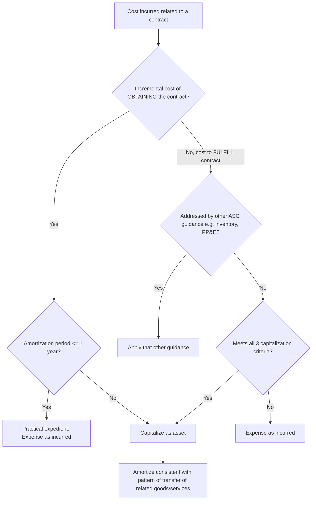
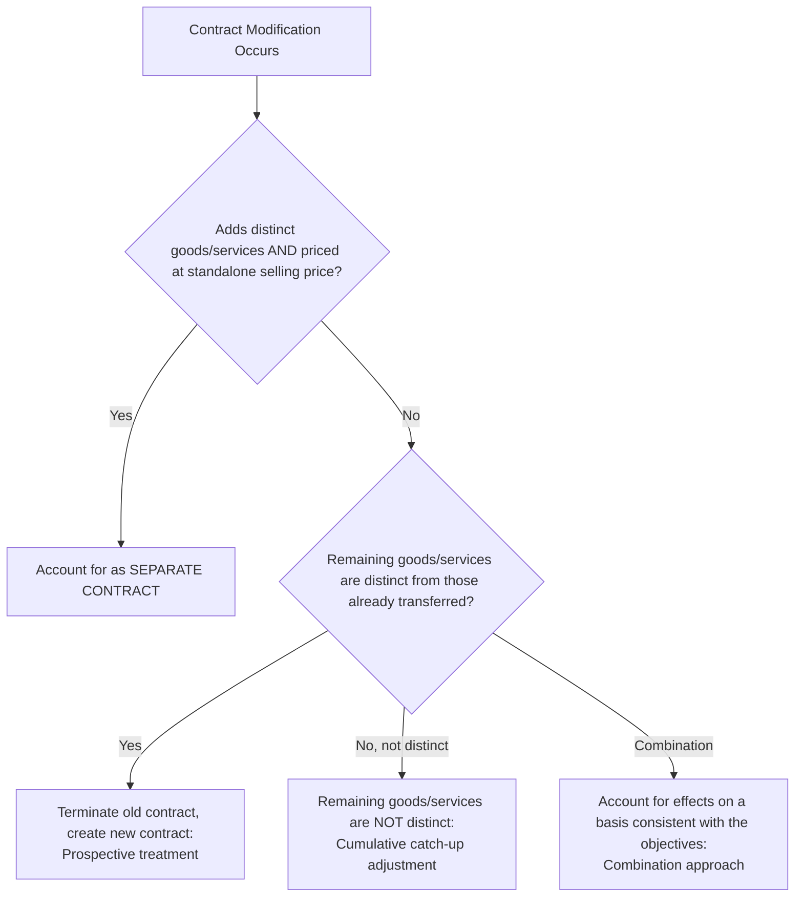

## Contract Costs and Contract Modifications

### Overview

This topic covers two related but distinct areas under ASC 606 / IFRS 15: (1) the accounting for costs associated with obtaining and fulfilling customer contracts, and (2) the accounting for changes to existing contracts (contract modifications). Both areas require significant judgment and are frequent sources of diversity in practice.

### Regulatory Framework

- **ASC 340-40** (Other Assets and Deferred Costs — Contracts with Customers), cross-referenced from ASC 606-10-25
- **ASC 606-10-25-10 through 25-13** (Contract Modifications)
- **IFRS 15, paragraphs 91–104** (Contract Costs) and paragraphs 18–21 (Contract Modifications)

---

## Part 1: Contract Costs

### Incremental Costs of Obtaining a Contract

**Key Points**

Costs that an entity would **not have incurred if the contract had not been obtained** (e.g., sales commissions) must be capitalized as an asset if the entity expects to recover them (ASC 340-40-25-1).

- Costs that would have been incurred **regardless** of whether the contract was obtained (e.g., a salesperson's base salary, RFP/bid costs that would be incurred win-or-lose) are **expensed as incurred**, unless explicitly chargeable to the customer regardless of outcome.
- **Practical expedient**: An entity may expense incremental costs of obtaining a contract immediately if the expected amortization period is **one year or less** (ASC 340-40-25-4).

$$\text{Capitalize Cost} \iff \text{Cost Would Not Have Been Incurred Absent the Contract} \; \cap \; \text{Expected to Be Recovered}$$

### Costs to Fulfill a Contract

If costs incurred in fulfilling a contract are not addressed by other guidance (e.g., ASC 330 Inventory, ASC 360 PP&E, ASC 350-40 Internal-Use Software), they are capitalized under ASC 340-40-25-5 only if **all three** criteria are met:

1. The costs relate **directly** to an existing contract or a specifically identifiable anticipated contract.
2. The costs **generate or enhance resources** that will be used to satisfy performance obligations in the future.
3. The costs are expected to be **recovered**.

### Amortization of Capitalized Contract Costs

Capitalized costs (both costs to obtain and costs to fulfill) are amortized on a **systematic basis consistent with the transfer of the goods or services** to which the asset relates — this may extend beyond the initial contract term if the asset relates to goods/services expected to be provided under **anticipated contracts** (e.g., expected contract renewals), a nuance often missed in practice.

### Impairment of Contract Cost Assets

Capitalized contract cost assets are tested for impairment when the carrying amount exceeds:

$$\text{Remaining Consideration Expected} - \text{Remaining Costs to Provide Goods/Services}$$

An impairment loss is recognized in profit or loss for the excess of carrying amount over this recoverable amount (ASC 340-40-35-3).

### Example: Sales Commission Capitalization

**Example**

A SaaS company pays a 10% commission on a 3-year subscription contract with a total contract value of $300,000 ($30,000 commission). The company has determined the commission is incremental and would not have been paid absent the contract, and it does not qualify for the one-year practical expedient.

- **Capitalized asset**: $30,000
- **Amortization period**: Judgment required — if the company expects a customer to renew and anticipates a similar (lower, "trailing") commission on renewal, the amortization period may extend beyond the initial 3-year term to the estimated customer relationship period, not just the stated contract term.
- **[Inference]** In practice, many SaaS entities elect an accounting policy of amortizing over the initial contract term only, absent clear evidence supporting a longer expected benefit period — this is an area of judgment that warrants specific documentation.

---

## Part 2: Contract Modifications

### Definition

A contract modification is a change in the **scope and/or price** of a contract that is approved by the parties. Approval can be written, oral, or implied by customary business practices, and may exist even if the parties are disputing scope/price (as long as enforceable rights to payment exist for the approved scope change).

### The Four-Way Modification Framework

#### Scenario 1: Separate Contract

The modification is accounted for as a **wholly separate contract** if:

1. The scope increases due to the addition of **distinct** promised goods or services, **and**
2. The price increase reflects the entity's **standalone selling price** of the additional goods/services (adjusted for circumstances of the particular contract, e.g., existing-customer discounts justified by cost savings).

**No impact** on the original contract's accounting.

#### Scenario 2: Termination of Old Contract / Creation of New Contract (Prospective)

If the modification is **not** a separate contract, and the remaining goods/services **are distinct** from those already transferred, the entity accounts for the modification as if it **terminated the existing contract and created a new contract**. Revenue recognized to date is **not adjusted**; the remaining transaction price (original unrecognized amount + modification consideration) is allocated prospectively to the remaining performance obligations.

$$\text{New Transaction Price} = \text{Unrecognized Original Consideration} + \text{Modification Consideration}$$

#### Scenario 3: Cumulative Catch-Up Adjustment

If the remaining goods/services **are not distinct** from those already provided (i.e., part of a single performance obligation partially satisfied), the modification is accounted for as if it were part of the **original contract**, with a **cumulative catch-up adjustment** to revenue as of the modification date. This mirrors the same mechanics used for estimate changes in long-term contracts.

#### Scenario 4: Combination Approach

When a modification includes elements of both distinct and non-distinct remaining goods/services, the entity applies the **allocation objectives of ASC 606** on a basis consistent with the modification's substance — effectively a hybrid of the above.

### Example: Scope Increase Without Standalone Pricing

**Example**

A software company has a 2-year, $240,000 SaaS contract ($10,000/month), with $60,000 of revenue recognized to date (6 months in). The customer adds 50% more user licenses for the remaining 18 months at a **discounted rate below standalone selling price**, for an additional $90,000.

- The SaaS subscription is a **series** of distinct services with the same pattern of transfer (over time, ratably) — remaining services (original + added licenses) are not distinct from each other in the sense that they combine into the ongoing series.
- Because the added licenses are priced **below standalone selling price**, this **fails Scenario 1**.
- Because the remaining performance obligation is a single series (the "distinct from services already transferred" test is met — future months are distinct from past months already delivered) → treated as **termination of old contract / new contract (prospective)**.
- **New remaining transaction price**: $180,000 (unrecognized original) + $90,000 (modification) = $270,000, recognized ratably over the remaining 18 months at $15,000/month.

### Forensic Accounting Considerations

**Output**

Contract costs and modifications present distinct forensic risk profiles:

- **Contract cost capitalization abuse**: Improperly capitalizing costs that don't meet the incremental cost criteria (e.g., capitalizing base salaries or general marketing costs) to inflate near-term earnings by deferring expense recognition.
- **Manipulated amortization periods**: Extending amortization periods for capitalized commissions beyond a supportable expected benefit period to reduce current-period expense.
- **Skipped impairment testing**: Failing to test contract cost assets for impairment when contract profitability deteriorates (e.g., high customer churn in SaaS businesses), overstating asset values.
- **Modification mischaracterization**: Deliberately classifying a modification as a "separate contract" (no impact on existing contract) when pricing does not actually reflect standalone selling price, in order to **avoid a cumulative catch-up adjustment** that would otherwise reduce currently reported revenue.
- **Undocumented informal modifications**: Side agreements or verbal scope changes not reflected in the accounting, particularly around period-end, to manage the timing of revenue recognition — a classic "cut-off" fraud risk.
- **Circumventing loss recognition**: Structuring a modification to avoid identifying/recognizing a previously-unrecognized onerous element of a long-term contract.

### Disclosure Requirements

Entities must disclose the closing balances of assets recognized for costs to obtain/fulfill contracts and the amount of amortization/impairment recognized in the period (ASC 606-10-50-9, ASC 340-40-50-2 through 50-3).

### Related Topics

- Licensing, royalties, and long-term contracts
- Variable consideration and constraints
- Identifying performance obligations
- Determining and allocating the transaction price
- Series guidance for distinct goods/services
- Onerous/loss contract accounting
- Disaggregation of revenue and contract balance disclosures
- Forensic indicators of cut-off manipulation at period end