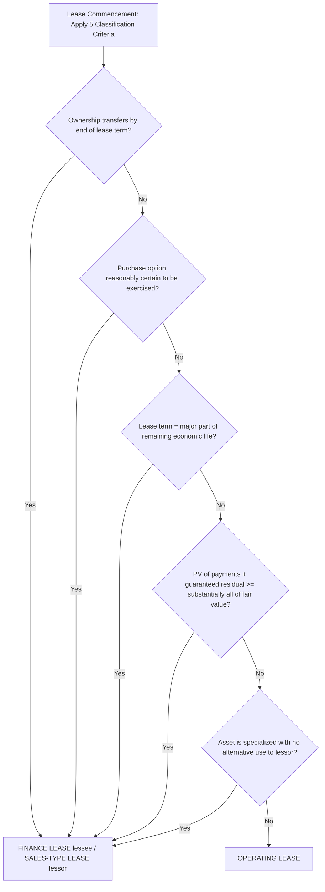
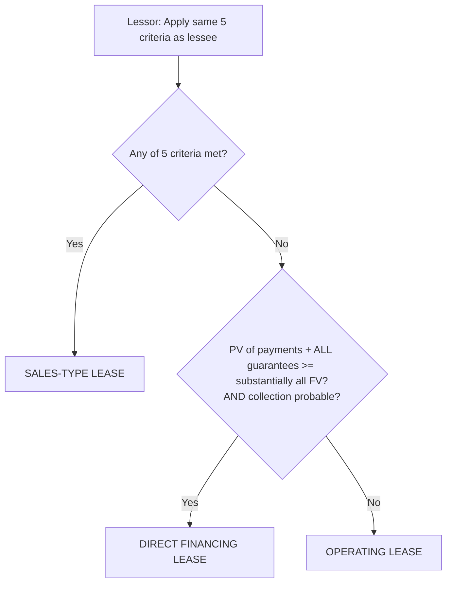

## Lease Classification Criteria

### Overview

Lease classification determines the accounting model applied by both lessees and lessors under ASC 842 (US GAAP) and IFRS 16. Under ASC 842, lessees classify leases as **finance leases** or **operating leases** (both recognized on-balance-sheet), while under IFRS 16, lessees apply a **single lessee model** with no classification distinction (nearly all leases are recognized similarly to a finance lease). Lessors under both frameworks continue to classify leases as **sales-type**, **direct financing**, or **operating** leases.

### Regulatory Framework

- **ASC 842-10-25-2 through 25-3** (Lessee Classification Criteria)
- **ASC 842-10-25-23 through 25-30** (Lessor Classification Criteria)
- **IFRS 16, paragraphs 61–66** (Lessor classification only; lessee model is single-model)

**Key Points**: A critical exam/practice distinction — IFRS 16 eliminated the operating/finance lease distinction for **lessees only**. Lessors under IFRS 16 still classify leases using criteria substantially similar to ASC 842's finance lease criteria (largely converged with legacy IAS 17 concepts).

### The Five Classification Criteria (ASC 842-10-25-2)

A lessee classifies a lease as a **finance lease** (and a lessor classifies as **sales-type**) if **any one** of the following five criteria is met at lease commencement:

$$\text{Finance/Sales-Type Lease} \iff C_1 \cup C_2 \cup C_3 \cup C_4 \cup C_5$$

1. **Transfer of ownership**: The lease transfers ownership of the underlying asset to the lessee by the end of the lease term.
2. **Purchase option reasonably certain to be exercised**: The lease grants the lessee an option to purchase the underlying asset that the lessee is **reasonably certain** to exercise.
3. **Lease term is a major part of remaining economic life**: The lease term is for the **major part** of the remaining economic life of the underlying asset (a lease term of 75% or more is a commonly applied, though not codified as a bright line, benchmark carried forward from legacy guidance — **not applicable** if commencement is near the end of the asset's economic life, generally the last 25%).
4. **Present value test**: The present value of the sum of lease payments and any residual value guaranteed by the lessee equals or exceeds **substantially all** of the fair value of the underlying asset (commonly applied benchmark: 90% or more, also carried forward informally from legacy practice, not codified as a bright line).
5. **Specialized nature**: The underlying asset is of such a **specialized nature** that it is expected to have no alternative use to the lessor at the end of the lease term.

If **none** of the five criteria are met, the lessee classifies the lease as an **operating lease**.

### Lessor-Specific Classification: Sales-Type vs. Direct Financing

For lessors, if none of the five criteria above are met, **two additional criteria** determine whether the lease is a **direct financing lease** rather than an operating lease (ASC 842-10-25-3):

1. The present value of lease payments and any residual value guaranteed by the lessee **and/or any other third party** equals or exceeds substantially all of the fair value of the underlying asset, **and**
2. It is **probable** that the lessor will collect the lease payments plus any amount necessary to satisfy a residual value guarantee.

If a lease meets one of the original five criteria, it's **sales-type**. If it meets neither the five criteria nor the two additional lessor criteria, it's an **operating lease** for the lessor. If it fails the five criteria but meets the two additional criteria, it's a **direct financing lease**.

**Key Points**: The key distinction between sales-type and direct financing is whether the lessor is effectively "selling" the asset outright (transferring substantially all risks/rewards directly per the five lessee-mirrored criteria) versus merely financing a third party's residual interest as well — direct financing leases specifically arise when **third-party residual value guarantees** (not just the lessee's) are what push the lease over the present value threshold.

### Key Definitions Underlying the Criteria

#### Lease Term

The lease term includes the **non-cancelable period**, plus periods covered by:

- Options to extend the lease that the lessee is **reasonably certain** to exercise.
- Options to terminate the lease that the lessee is **reasonably certain not** to exercise.
- Periods covered by an option to extend (or not terminate) controlled by the **lessor**.

#### Reasonably Certain

A high threshold — similar to "reasonably assured" under legacy guidance — requiring an assessment of all relevant economic factors (contract-based, asset-based, entity-based, and market-based factors per ASC 842-10-55-26).

#### Discount Rate

- Lessees use the **rate implicit in the lease** if readily determinable; otherwise, the lessee's **incremental borrowing rate**.
- **Private company practical expedient**: Private companies (excluding certain not-for-profits and employee benefit plans) may elect to use a **risk-free rate** as an accounting policy election, by class of underlying asset (ASC 842-20-30-3).
- Lessors always use the **rate implicit in the lease**.

### Example: Applying the Present Value Criterion

**Example**

A lessee enters a 5-year lease for equipment with a fair value of $500,000. Annual lease payments are $110,000 paid at the end of each year, and the lessee's incremental borrowing rate is 6%. There is no purchase option, ownership transfer, or residual value guarantee, and the asset is not specialized. The asset's remaining economic life is 8 years.

$$PV = \sum_{t=1}^{5}\frac{110{,}000}{(1.06)^t}$$

Calculating:

| Year | Payment | PV Factor @ 6% | Present Value |
| --- | --- | --- | --- |
| 1 | $110,000 | 0.9434 | $103,774 |
| 2 | $110,000 | 0.8900 | $97,900 |
| 3 | $110,000 | 0.8396 | $92,356 |
| 4 | $110,000 | 0.7921 | $87,131 |
| 5 | $110,000 | 0.7473 | $82,203 |
| **Total** |  |  | **$463,364** |

- **PV as % of fair value**: $463,364 / $500,000 = **92.7%**

**Analysis**:

- Criterion 3 (major part of economic life): 5 years / 8 years = 62.5% → **not met** (below the ~75% commonly applied benchmark).
- Criterion 4 (present value): 92.7% ≥ ~90% commonly applied benchmark → **met**.

**Conclusion**: Because Criterion 4 is met, this is a **finance lease** for the lessee (assuming the lessor also concludes collection is probable and no additional guarantees exist, it would be a **sales-type lease** for the lessor, since Criterion 4 is one of the original five).

### Reassessment of Classification

**Key Points**: Under ASC 842, lease classification is **not reassessed** after commencement unless there is a **contract modification** that is not accounted for as a separate contract (ASC 842-10-25-1, 25-8 through 25-18). Routine changes in estimates (e.g., updated expectations about renewal likelihood absent a modification) do **not** trigger reclassification — a key difference from some legacy practice expectations.

### Short-Term Lease Practical Expedient

Lessees may elect, by class of underlying asset, **not to recognize** a right-of-use asset and lease liability for leases with a lease term of **12 months or less** and that do not include a purchase option the lessee is reasonably certain to exercise (ASC 842-20-25-2). Lease payments for short-term leases are recognized as expense on a straight-line basis (or another systematic basis).

### Forensic Accounting Considerations

**Output**

Lease classification is a significant judgment area, and ASC 842's expansion of balance sheet lease recognition (compared to ASC 840) heightened the stakes of classification manipulation:

- **Structuring to avoid finance lease classification**: Deliberately setting lease term or payment terms just below the commonly applied 75%/90% benchmarks to achieve operating lease treatment, thereby keeping the pattern of expense recognition straight-line (impacting EBITDA presentation, since operating lease expense is a single line item rather than split between interest and amortization).
- **Understating discount rates**: Using an artificially low incremental borrowing rate to reduce the calculated present value of lease payments below the substantially-all threshold, avoiding finance lease classification.
- **Manipulating "reasonably certain" conclusions**: Asserting renewal/purchase options are not reasonably certain to be exercised (shortening the lease term for classification purposes) when economic facts (e.g., a bargain purchase price, or a facility with no viable relocation alternative) suggest otherwise.
- **Sale-leaseback abuse**: Structuring arrangements to achieve sale accounting and generate an immediate gain, when the "repurchase option" or continuing involvement provisions should have precluded sale treatment under ASC 842-40's control-transfer-based sale-leaseback model (which explicitly ties into ASC 606 control principles).
- **Related-party lease terms**: Non-arm's-length lease terms with related parties (specialized asset assertions, unusual residual guarantees) engineered to reach a preferred classification outcome.
- **Embedded leases not identified**: Failing to identify leases embedded within service contracts (ASC 842-10-15-3 through 15-9), keeping lease liabilities and right-of-use assets off the balance sheet entirely — a completeness assertion risk frequently tested by auditors and forensic examiners alike.

### Disclosure Requirements

Lessees must disclose qualitative and quantitative information about leases, including a lessee's finance and operating lease costs, weighted-average remaining lease term, and weighted-average discount rate (ASC 842-20-50-4). These disclosures are frequently cross-referenced against classification judgments during forensic review.

### Related Topics

- Lease measurement: initial recognition and subsequent accounting
- Sale-leaseback transactions under ASC 842-40
- Embedded leases and identifying a lease under ASC 842-10-15
- Lessee vs. lessor accounting mechanics (ROU asset amortization, interest expense, lease receivable)
- Variable lease payments and their treatment
- Lease modifications and reassessment triggers
- Practical expedients: short-term leases, risk-free rate election, package of practical expedients
- Forensic red flags in off-balance-sheet financing structures