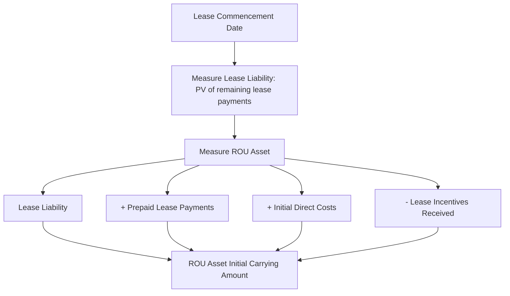
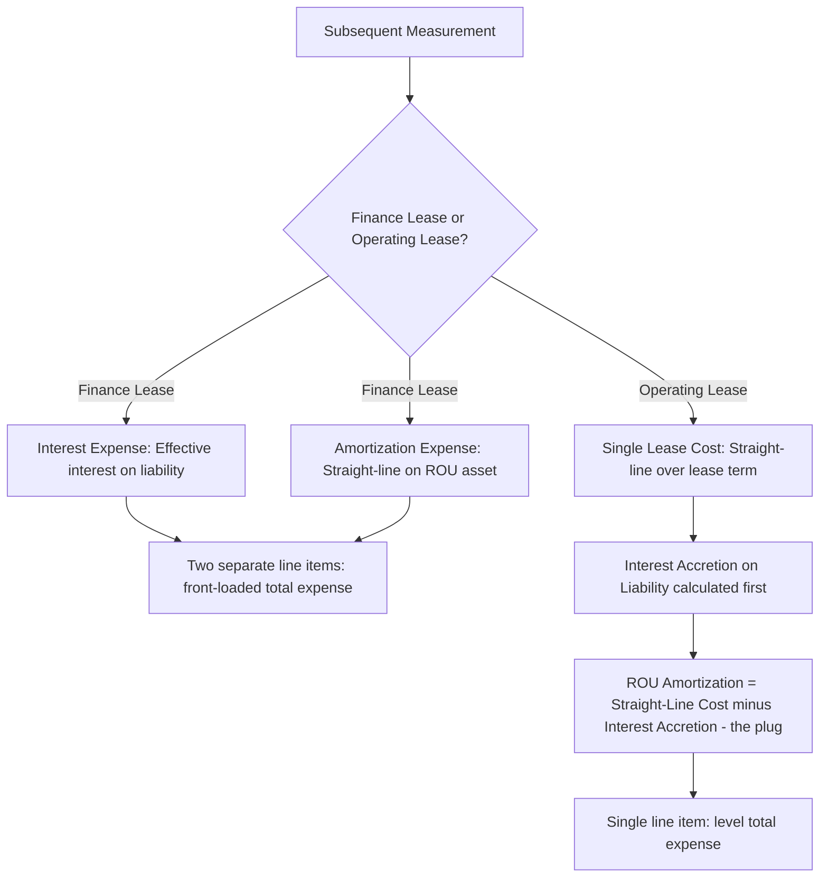

## Lessee Accounting for Right-of-Use Assets and Lease Liabilities

### Overview

Once a lease is classified (finance or operating, per ASC 842's lessee classification criteria), the lessee applies a largely parallel **on-balance-sheet recognition model** for both lease types at commencement, with the two types diverging only in **subsequent measurement and expense pattern**. This represents the core structural change from legacy ASC 840, which kept operating leases entirely off-balance-sheet.

### Regulatory Framework

- **ASC 842-20-25** (Initial Recognition and Measurement)
- **ASC 842-20-30** (Subsequent Measurement)
- **ASC 842-20-35** (Subsequent Measurement — continued: reassessment, remeasurement)
- **IFRS 16, paragraphs 22–35** (Lessee — single model, closely converged with ASC 842 finance lease mechanics)

### Initial Measurement of the Lease Liability

At the **commencement date**, the lessee measures the lease liability at the **present value of the lease payments** not yet paid, discounted using the rate implicit in the lease (if readily determinable) or the lessee's incremental borrowing rate.

$$\text{Lease Liability}_0 = \sum_{t=1}^{n}\frac{LP_t}{(1+r)^t}$$

where $LP_t$ is the lease payment in period $t$ and $r$ is the discount rate.

#### Components of Lease Payments (ASC 842-10-30-5)

Included in the measurement of lease payments:

1. **Fixed payments**, less any lease incentives receivable from the lessor.
2. **Variable lease payments that depend on an index or rate** (e.g., CPI-linked payments), initially measured using the index/rate at commencement.
3. The **exercise price of a purchase option** the lessee is reasonably certain to exercise.
4. Payments for **penalties for terminating the lease**, if the lease term reflects the lessee exercising an option to terminate.
5. **Amounts probable of being owed under residual value guarantees**.
6. For lessees only: fees paid by the lessee to owners of a special-purpose entity for structuring the transaction.

**Excluded**: Variable lease payments based on usage or performance (e.g., a percentage of sales, or payments tied to hours of equipment use) are **excluded** from the initial lease liability measurement and expensed as incurred in the period they're incurred — a frequently tested distinction from index/rate-based variable payments.

### Initial Measurement of the Right-of-Use (ROU) Asset

$$\text{ROU Asset}_0 = \text{Lease Liability}_0 + \text{Prepaid Lease Payments} + \text{Initial Direct Costs} - \text{Lease Incentives Received}$$

**Key Points**: Initial direct costs are **incremental costs** that would not have been incurred if the lease had not been obtained (paralleling the ASC 340-40 concept for contract costs) — e.g., commissions paid to a broker to obtain the lease. General overhead, negotiation costs that would have been incurred regardless, and legal fees for lease review generally do **not** qualify.

### Subsequent Measurement: Finance Leases

For finance leases, the lessee recognizes **two separate expense components**, similar to a financed asset purchase:

1. **Interest expense** on the lease liability, using the **effective interest method**:

$$\text{Interest Expense}_t = \text{Lease Liability}_{t-1} \times r$$

2. **Amortization expense** on the ROU asset — generally on a **straight-line basis** over the shorter of the lease term or the useful life of the underlying asset (or the useful life of the asset itself if ownership transfers or a purchase option is reasonably certain to be exercised).

$$\text{Total Periodic Expense (Finance Lease)} = \text{Interest Expense}_t + \text{Amortization Expense}_t$$

This produces a **front-loaded expense pattern** (higher combined expense in earlier periods, declining over time as the liability amortizes) — mirroring the pattern of a capital lease under legacy ASC 840.

### Subsequent Measurement: Operating Leases

For operating leases, the lessee recognizes a **single lease cost** on a **straight-line basis** over the lease term (subject to certain adjustments for variable payments and impairment). The ROU asset amortization is a **plug** — calculated as the difference between the straight-line total lease cost and the period's interest accretion on the liability, rather than computed independently.

$$\text{ROU Amortization}_t = \text{Straight-Line Lease Cost} - \text{Interest on Lease Liability}_t$$

**[Inference]** This "plug" mechanic is one of the more conceptually counterintuitive aspects of ASC 842 for students transitioning from finance lease/legacy capital lease mechanics, since the ROU asset does not amortize on a simple straight-line basis for operating leases — it's designed purely to produce a level total expense.

### Example: Finance Lease Amortization Schedule

**Example**

A lessee enters a 4-year finance lease with annual payments of $50,000 at the end of each year, a discount rate of 7%, and no residual guarantee or purchase option. Initial lease liability and ROU asset both equal the present value of payments: $169,257.

| Year | Beginning Liability | Interest (7%) | Payment | Ending Liability | ROU Amortization (SL) | Ending ROU Asset |
| --- | --- | --- | --- | --- | --- | --- |
| 1 | $169,257 | $11,848 | $50,000 | $131,105 | $42,314 | $126,943 |
| 2 | $131,105 | $9,177 | $50,000 | $90,282 | $42,314 | $84,629 |
| 3 | $90,282 | $6,320 | $50,000 | $46,602 | $42,314 | $42,314 |
| 4 | $46,602 | $3,398* | $50,000 | $0 | $42,314 | $0 |

*Rounding adjustment in final period to zero out the liability.

**Total Year 1 Expense**: $11,848 (interest) + $42,314 (amortization) = $54,162 — higher than Year 4's $3,398 + $42,314 = $45,712, illustrating the front-loaded pattern.

### Example: Operating Lease — Level Expense Mechanic

**Example**

Same fact pattern as above, but classified as an **operating lease**. Total undiscounted payments = $200,000 over 4 years → straight-line lease cost = $50,000/year (level).

| Year | Beginning Liability | Interest (7%) | Straight-Line Lease Cost | ROU Amortization (Plug) | Payment | Ending Liability |
| --- | --- | --- | --- | --- | --- | --- |
| 1 | $169,257 | $11,848 | $50,000 | $38,152 | $50,000 | $131,105 |
| 2 | $131,105 | $9,177 | $50,000 | $40,823 | $50,000 | $90,282 |
| 3 | $90,282 | $6,320 | $50,000 | $43,680 | $50,000 | $46,602 |
| 4 | $46,602 | $3,398 | $50,000 | $46,602 | $50,000 | $0 |

**Total lease cost recognized each year**: a level $50,000 — a single "lease expense" line item on the income statement, unlike the finance lease's bifurcated interest/amortization presentation.

### Remeasurement Triggers

**Key Points**: The lease liability (and correspondingly the ROU asset) is **remeasured** upon certain events, using updated inputs (discount rate, lease term, payment amounts):

- A **lease modification** not accounted for as a separate contract.
- A change in the lease term or the assessment of an option the lessee is reasonably certain to exercise/not exercise.
- A change in amounts probable of being owed under a **residual value guarantee**.
- A change in **variable lease payments that depend on an index or rate** — but only when a **contingency is resolved** that requires liability remeasurement (i.e., not every routine index reset, subject to specific guidance), or concurrently with a remeasurement triggered for another reason.

Remeasurement of the ROU asset is capped at zero — if the remeasurement adjustment would reduce the ROU asset below zero, the excess is recognized in profit or loss.

### Balance Sheet Presentation

Lessees present:

- **ROU assets** — either together for finance and operating leases, or separately, but if presented together, disclosed separately in the notes; classified as noncurrent.
- **Lease liabilities** — split between current and noncurrent portions, and either combined or separately presented from other financial liabilities (with note disclosure if combined).

Finance lease ROU assets/liabilities may **not** be presented in the same line item as operating lease ROU assets/liabilities.

### Impairment of the ROU Asset

The ROU asset is subject to the long-lived asset impairment guidance in **ASC 360**, tested as part of an asset group when a triggering event indicates the carrying amount may not be recoverable. Impairment losses reduce the ROU asset carrying amount, which then affects subsequent amortization/lease cost calculations.

### Forensic Accounting Considerations

**Output**

The mechanics of ROU asset/lease liability accounting create several manipulation and error risk points:

- **Understating the lease liability** through omission of in-substance fixed payments (payments structured as "variable" but economically fixed, e.g., a minimum guaranteed variable payment) — understating both the liability and the corresponding ROU asset, and understating leverage metrics.
- **Discount rate manipulation**: Selecting an artificially high discount rate to reduce the present value of lease payments recognized, understating both sides of the balance sheet and improving reported leverage ratios (debt covenants often reference lease liabilities).
- **Initial direct cost misclassification**: Capitalizing costs that don't meet the "incremental" definition (e.g., internal legal or negotiation salaries) into the ROU asset, inflating the asset and deferring expense recognition.
- **Improper straight-lining plug manipulation**: For operating leases, errors or intentional misstatement in the ROU amortization "plug" calculation to smooth expense recognition inconsistent with the actual straight-line total cost mechanic.
- **Failure to remeasure**: Not remeasuring the lease liability/ROU asset timely upon a triggering event (e.g., exercising a previously "not reasonably certain" renewal option), understating both the liability and future expense recognition — a completeness and cutoff risk.
- **Impairment avoidance**: Failing to test ROU assets for impairment under ASC 360 despite clear indicators (e.g., vacated leased space, subleased at a loss), overstating asset values — a pattern seen in real estate-heavy companies during business contractions.
- **Embedded lease omission carrying forward**: Building on the classification-stage risk, ROU assets/liabilities for unidentified embedded leases within service contracts remain entirely absent from the balance sheet, understating both assets and liabilities — a completeness assertion failure with balance sheet-wide implications.

### Disclosure Requirements

ASC 842-20-50 requires lessees to disclose the components of lease cost (finance lease interest/amortization separately, operating lease cost, variable and short-term lease costs), a maturity analysis of lease liabilities, weighted-average remaining lease term, and weighted-average discount rate by lease type — all frequently cross-referenced by auditors and forensic examiners against the underlying lease liability roll-forward.

### Related Topics

- Lease classification criteria
- Lease modifications and remeasurement
- Sale-leaseback transactions under ASC 842-40
- Variable lease payments: index/rate-based vs. usage-based treatment
- Impairment of right-of-use assets under ASC 360
- Lessor accounting: sales-type, direct financing, and operating leases
- Embedded leases and identifying a lease under ASC 842-10-15
- Forensic red flags in lease liability understatement and discount rate selection