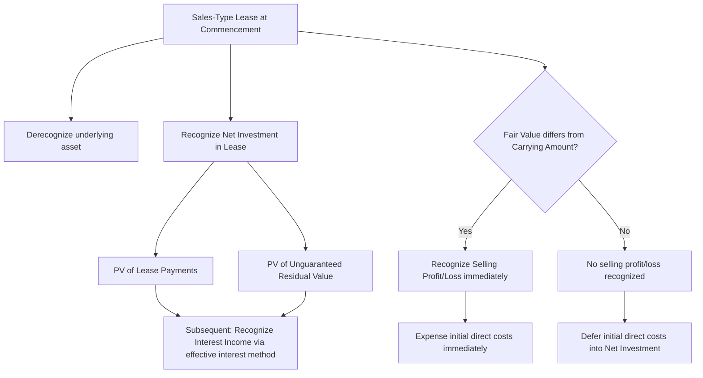
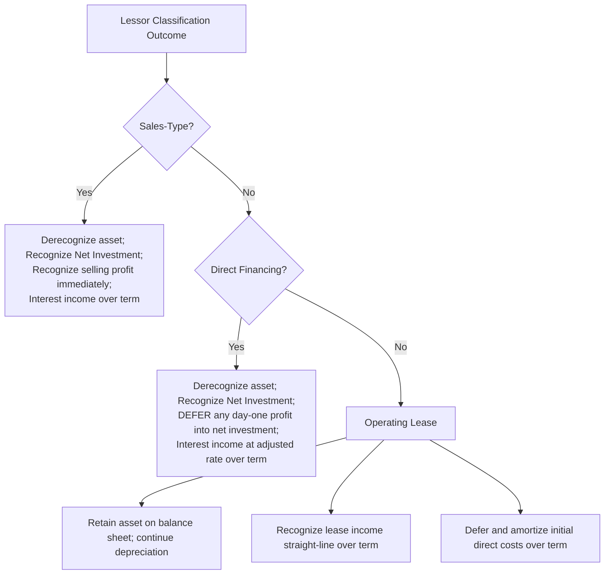

## Lessor Accounting for Sales-Type, Direct Financing, and Operating Leases

### Overview

After classifying a lease as sales-type, direct financing, or operating (per the lessor classification criteria), the lessor applies distinct recognition and measurement models for each. Unlike the lessee's largely parallel treatment of finance and operating leases, the three lessor categories diverge significantly — particularly in whether **profit is recognized at lease commencement**.

### Regulatory Framework

- **ASC 842-30-25** (Lessor — Initial Measurement)
- **ASC 842-30-30** (Lessor — Subsequent Measurement)
- **ASC 842-30-45** (Lessor — Presentation)
- **IFRS 16, paragraphs 67–97** (Lessor accounting — closely converged with ASC 842)

### Sales-Type Leases

**Key Points**

A sales-type lease is accounted for by the lessor as if it were **selling the underlying asset** to the lessee, financed through the lease. At commencement, the lessor:

1. **Derecognizes** the underlying asset from its balance sheet.
2. Recognizes a **net investment in the lease** (lease receivable), measured as the present value of lease payments plus the present value of any unguaranteed residual value.
3. Recognizes **selling profit or loss** at commencement (the difference between the fair value of the asset and its carrying amount, net of certain adjustments), **unless** the lessor is a manufacturer/dealer and other conditions apply differently.
4. Recognizes **interest income** over the lease term using the effective interest method on the net investment.

$$\text{Net Investment in Lease}_0 = PV(\text{Lease Payments}) + PV(\text{Unguaranteed Residual Value})$$

$$\text{Selling Profit} = \text{Fair Value of Underlying Asset} - \text{Carrying Amount of Underlying Asset} - \text{Deferred Initial Direct Costs (if applicable)}$$

#### Manufacturer/Dealer Lessors

For manufacturer or dealer lessors, sales-type lease classification typically results in recognition of **both revenue and cost of goods sold** at commencement (similar to a cash sale), with selling profit recognized immediately — this is a common structure for equipment manufacturers using leasing as a sales channel.

#### Initial Direct Costs — Sales-Type Leases

- If there is **selling profit or loss**, initial direct costs are **expensed at commencement** (matched against the immediately recognized profit).
- If there is **no selling profit or loss** (fair value equals carrying amount — common for non-manufacturer/dealer lessors), initial direct costs are **deferred and included in the net investment in the lease**, recognized over the lease term as a yield adjustment.

### Direct Financing Leases

A direct financing lease arises when the lease fails the five primary classification criteria but meets the additional two criteria involving **third-party residual value guarantees** and probable collectibility. Key distinctions from sales-type leases:

1. The lessor **derecognizes** the underlying asset and recognizes a **net investment in the lease**, similarly computed.
2. **No selling profit is recognized at commencement.** Instead, any day-one "profit" implied by the arrangement is recognized as a **reduction of the net investment in the lease** — effectively **deferred and recognized over the lease term** as part of the yield, rather than immediately.
3. Interest income is recognized over the lease term using a rate that produces a **constant periodic rate of return** on the net investment — this may differ from the rate implicit in the lease when selling profit exists but is deferred, requiring a recalculated **"rate implicit in the lease adjusted for the deferred selling profit."**
4. **Initial direct costs are included** in the net investment measurement and effectively reduce the implicit rate, recognized over the lease term.

$$\text{Direct Financing Lease: Day-One Profit} \rightarrow \text{Deferred, reduces Net Investment, recognized as adjustment to yield over lease term}$$

**[Inference]** This deferred-profit mechanic is one of the more nuanced computational aspects of lessor accounting and is a common area of confusion — the intuitive parallel is that a direct financing lease is economically similar to a sales-type lease with profit, but the accounting deliberately **defers** that profit rather than accelerating it, reflecting the lessor's more limited economic transfer of the asset (since collectibility of a third-party guarantee, not the lessee's own credit, is what pushed the lease into on-balance-sheet financing treatment).

### Operating Leases (Lessor)

For operating leases, the lessor **retains** the underlying asset on its balance sheet (continuing to depreciate it under applicable PP&E guidance) and recognizes:

1. **Lease income** on a **straight-line basis** over the lease term (or another systematic basis if more representative of the pattern of benefit).
2. **Continued depreciation** of the underlying asset, presented separately from lease income (not netted).
3. **Initial direct costs deferred and amortized** over the lease term on the same basis as lease income (straight-line, typically).

$$\text{Lessor Operating Lease Profit} = \text{Straight-Line Lease Income} - \text{Depreciation Expense} - \text{Initial Direct Cost Amortization}$$

### Example: Sales-Type Lease with Selling Profit (Manufacturer Lessor)

**Example**

An equipment manufacturer leases equipment with a carrying amount (manufacturing cost) of $400,000 and a fair value of $500,000. The lease has a 5-year term, annual payments of $120,000 at year-end, and an implicit rate of 6%. There is no residual value (fully amortizing lease), and collectibility is probable.

- **Net investment in the lease**: PV of $120,000 for 5 years at 6% = $505,637 (approximately equal to fair value, confirming the implicit rate).
- **At commencement**:
  - Dr. Net Investment in Lease $505,637 *(approx., rounding to fair value $500,000 for this example)*
  - Dr. Cost of Goods Sold $400,000
  - Cr. Revenue (Sales) $500,000
  - Cr. Inventory (equipment) $400,000
  - **Selling profit recognized immediately**: $100,000
- **Subsequent periods**: Interest income recognized via effective interest method on the $500,000 net investment at 6%, declining as the balance amortizes with each $120,000 payment.

### Example: Operating Lease — Lessor Retains Asset

**Example**

A lessor leases equipment (carrying amount $300,000, 10-year useful life, straight-line depreciation) under a 3-year operating lease with total contractual payments of $150,000 ($50,000/year, level, no escalation).

| Year | Lease Income (SL) | Depreciation Expense | Net Lease Profit |
| --- | --- | --- | --- |
| 1 | $50,000 | $30,000 | $20,000 |
| 2 | $50,000 | $30,000 | $20,000 |
| 3 | $50,000 | $30,000 | $20,000 |

The equipment remains on the lessor's balance sheet at declining net book value throughout the lease term, and the lessor continues to bear the risk of the asset's residual value at lease-end — the defining economic characteristic distinguishing operating leases from the two finance-type classifications.

### Lease Receivable Impairment

The net investment in the lease (for sales-type and direct financing leases) is subject to **credit loss impairment testing under ASC 326** (Current Expected Credit Losses, CECL), not the general receivables guidance previously applied, reflecting the post-2016 convergence of lease receivables into the broader financial instruments credit loss framework.

### Variable Lease Payments and Lessor Income

Variable payments not included in the net investment in the lease (e.g., usage-based or performance-based payments) are recognized by the lessor as income in the period **earned** (generally when the variable payment-generating events occur), consistent with the lessee-side exclusion of such payments from liability measurement.

### Presentation

- **Sales-type/direct financing leases**: Net investment in the lease presented as a **single line item** (not split between current/noncurrent unless a classified balance sheet requires it), often within "lease receivables."
- **Operating leases**: The underlying asset continues to be presented within PP&E (or a similar caption), subject to normal depreciation and impairment guidance (ASC 360).

### Forensic Accounting Considerations

**Output**

Lessor accounting creates distinct incentives and risk areas, particularly for manufacturer/dealer lessors and finance companies:

- **Sales-type classification abuse (channel stuffing via leasing)**: Manufacturers structuring marginal leases to qualify as sales-type in order to recognize **immediate revenue and selling profit**, accelerating earnings recognition that would otherwise occur ratably under an operating lease — a well-documented historical fraud pattern in equipment leasing and technology hardware sectors.
- **Inflated fair value assumptions**: Overstating the fair value of leased equipment at commencement to inflate the selling profit recognized immediately in sales-type leases.
- **Misclassifying direct financing as sales-type** (or vice versa) to control the **timing** of profit recognition — immediate (sales-type) vs. deferred over the lease term (direct financing) — without a substantive change in the underlying facts (particularly around third-party guarantee structuring).
- **Residual value assumption manipulation**: Overstating unguaranteed residual values to inflate the net investment in the lease and support a higher selling profit conclusion, particularly for specialized or rapidly obsoleting equipment (e.g., technology hardware).
- **CECL under-reserving**: Insufficient credit loss allowances on lease receivables relative to actual default experience, particularly in economically stressed lessee portfolios (equipment finance, auto, aircraft leasing).
- **Sale-leaseback lessor-side collusion**: Related-party or structured transactions where the "lessor" role is used to help a counterparty achieve off-balance-sheet treatment inconsistent with economic substance.
- **Round-tripping via captive finance subsidiaries**: Intercompany lease arrangements between a parent and its captive leasing subsidiary structured to move profit recognition between reporting periods or entities for consolidated earnings management purposes.

### Disclosure Requirements

ASC 842-30-50 requires lessors to disclose the components of lease income (profit/loss on sales-type leases, interest income on the net investment, lease income relating to variable payments, and income from operating leases), along with a maturity analysis of undiscounted lease payments and a qualitative discussion of how the lessor manages residual asset risk.

### Related Topics

- Lease classification criteria
- Lessee accounting for right-of-use assets and lease liabilities
- Sale-leaseback transactions under ASC 842-40
- Current expected credit losses (CECL) under ASC 326 applied to lease receivables
- Variable lease payments: recognition timing for lessors vs. lessees
- Manufacturer/dealer lessor revenue recognition interactions with ASC 606
- Forensic indicators of channel stuffing through captive leasing arrangements
- Residual value guarantee accounting and risk transfer analysis