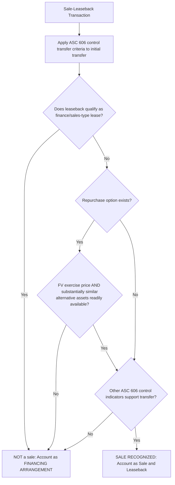
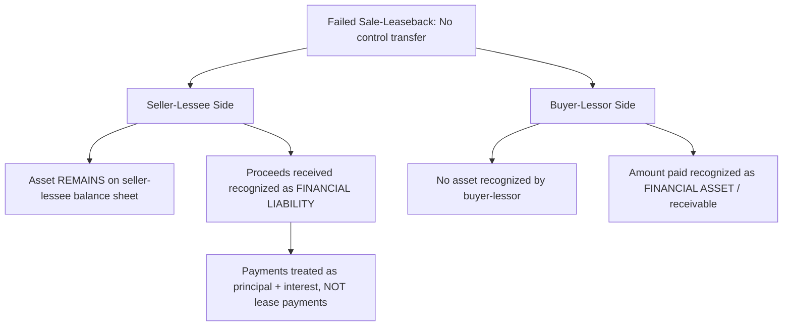

## Sale-Leaseback Transactions

### Overview

A sale-leaseback transaction occurs when an entity (the seller-lessee) transfers an asset to another entity (the buyer-lessor) and then leases that same asset back. ASC 842-40 establishes a **control-based framework**, explicitly anchored to **ASC 606's sale/control transfer principles**, to determine whether the initial transfer qualifies as a sale — a significant change from the risk/reward-based analysis under legacy ASC 840.

### Regulatory Framework

- **ASC 842-40-25** (Sale-Leaseback: Determining Whether the Transfer Is a Sale)
- **ASC 842-40-30** (Sale-Leaseback: Sale and Leaseback Transaction Accounting)
- **ASC 842-40-25-1** explicitly cross-references **ASC 606-10-25-30** (control transfer criteria)
- **IFRS 16, paragraphs 98–103** (substantially converged with ASC 842's approach, both tied to their respective revenue standards)

### The Core Question: Is There a "Sale"?

**Key Points**

The seller-lessee first applies the **control transfer guidance in ASC 606** to determine whether the transfer of the asset qualifies as a sale. This is a fundamentally different starting point from legacy guidance, which used a separate risks-and-rewards test specific to sale-leasebacks.

$$\text{Sale Recognized} \iff \text{Control of Underlying Asset Transfers to Buyer-Lessor per ASC 606}$$

#### Factors That Preclude Sale Accounting

Per ASC 842-40-25-1 through 25-4, the transfer is **not** accounted for as a sale (and is instead accounted for as a **financing arrangement**) if:

1. The leaseback would be classified as a **finance lease** by the seller-lessee (or a **sales-type lease** by the buyer-lessor) — this is treated as strong evidence the seller-lessee retains control, since the seller-lessee has effectively retained substantially all the risks/rewards it purportedly "sold."
2. The seller-lessee has an option to **repurchase** the asset, **unless**:
   - The exercise price equals the asset's fair value at the time of exercise, **and**
   - There are alternative assets, substantially the same as the transferred asset, readily available in the marketplace.
3. Other indicators under ASC 606 suggest control has not transferred (e.g., significant continuing involvement that limits the buyer-lessor's ability to direct the use of the asset).

### Accounting When a Sale Occurs

If control transfers (a **sale** is recognized), the seller-lessee:

1. **Derecognizes** the carrying amount of the asset.
2. Recognizes the **sale transaction** following ASC 606 (recognizing a gain or loss, generally the full amount, subject to adjustment below).
3. Recognizes a **new lease** (the leaseback) under the standard lessee ROU asset/lease liability model, classified per the normal lease classification criteria (typically operating, since finance/sales-type classification would have precluded sale treatment in the first place).

#### Off-Market Terms Adjustment

If the sale price is **not at fair value**, the seller-lessee and buyer-lessor must make adjustments:

- **Sale price above fair value**: The excess is accounted for as **additional financing** provided by the seller-lessee to the buyer-lessor (increasing the lease liability/payments).
- **Sale price below fair value**: The shortfall is accounted for as a **prepayment of lease payments** (reducing the lease liability, i.e., treated as if the seller-lessee prepaid rent), unless it represents compensation for something else evidenced in the contract.

$$\text{Off-Market Adjustment} = \text{Sale Price} - \text{Fair Value of Asset}$$

$$\text{Adjustment} > 0 \Rightarrow \text{Additional Financing}; \quad \text{Adjustment} < 0 \Rightarrow \text{Prepaid Rent}$$

### Accounting When No Sale Occurs (Failed Sale-Leaseback)

If the transfer does **not** qualify as a sale, **neither party derecognizes/recognizes the asset transfer**:

- **Seller-lessee**: Continues to recognize the asset on its balance sheet (no derecognition) and accounts for the amounts received as a **financial liability** (a financing obligation) under the guidance for financial liabilities (effectively interest-bearing debt), **not** as a lease.
- **Buyer-lessor**: Does **not** recognize the underlying asset; instead recognizes a **financial asset** (a receivable) consistent with lending guidance.

### Buyer-Lessor Accounting (When a Sale Occurs)

The buyer-lessor accounts for the purchase of the asset applying **other applicable GAAP** (e.g., ASC 360 for the asset acquisition) and then accounts for the leaseback as a **lessor** under the normal lessor classification and measurement guidance (sales-type, direct financing, or operating), just as with any other lease.

### Example: Successful Sale-Leaseback at Fair Value

**Example**

A company sells its headquarters building (carrying amount $3,000,000) to an investor for $5,000,000 (equal to fair value) and simultaneously leases it back for 10 years under terms that classify as an **operating lease** for the seller-lessee.

**Analysis**:

- Since the leaseback classifies as an operating lease (not finance), and the sale price equals fair value with no problematic repurchase option, this qualifies as a **sale** under ASC 606 control transfer principles.

**Seller-lessee entries at commencement**:

- Dr. Cash $5,000,000
- Cr. Building $3,000,000
- Cr. **Gain on Sale** $2,000,000 *(recognized immediately in full, since sale price = fair value)*
- Recognize new operating lease ROU asset and lease liability based on the leaseback terms (present value of the 10-year lease payments).

### Example: Sale Price Above Fair Value (Off-Market Adjustment)

**Example**

Same fact pattern, but the sale price is $5,500,000 while the independently appraised fair value is $5,000,000 — a $500,000 excess.

**Analysis**:

- The $500,000 excess is **not** part of the true sale gain. It represents **additional financing** provided by the seller-lessee to the buyer-lessor (in substance, the buyer-lessor "overpaid" for the asset in exchange for the seller-lessee agreeing to higher future lease payments).
- **Gain on sale recognized**: $5,000,000 (fair value) − $3,000,000 (carrying amount) = **$2,000,000** (not $2,500,000).
- The $500,000 excess increases the **initial lease liability** (and correspondingly the ROU asset) beyond what the stated lease payments alone would produce, effectively imputing additional "loan" principal and interest into the leaseback payment stream.

### Example: Failed Sale-Leaseback

**Example**

A company sells equipment to a finance company for $800,000 and leases it back for 8 years — a term representing the **major part of the equipment's remaining 9-year economic life**, which causes the leaseback to be classified as a **finance lease**.

**Analysis**:

- Because the leaseback would be classified as a finance lease, this is definitive evidence under ASC 842-40-25-1 that control has **not** transferred to the buyer-lessor.
- **No sale is recognized.** The seller-lessee continues to carry the equipment on its balance sheet and continues depreciating it.
- The $800,000 received is recognized as a **financial liability** (financing obligation), with subsequent "lease" payments split between **principal reduction** and **interest expense** — economically indistinguishable from a secured borrowing, despite the legal form of a sale-leaseback.

### Forensic Accounting Considerations

**Output**

Sale-leaseback transactions are a classic **off-balance-sheet financing and earnings management** structure, and the ASC 842-40 control-based framework was specifically designed to curtail historical abuse patterns:

- **Structuring to force sale-gain recognition**: Deliberately designing leaseback terms (e.g., shortening the lease term or reducing payments to avoid finance lease classification) specifically to **force qualification as a sale**, enabling **immediate gain recognition** on real estate or equipment that the seller-lessee continues to use and substantively control — a technique historically used to manufacture one-time earnings boosts, particularly by financially stressed companies (a well-documented pattern in real estate and airline industry restructurings).
- **Off-market pricing disguised as arm's-length**: Structuring a sale price meaningfully above fair value (disguised financing) without properly bifurcating the excess as additional financing, inflating the recognized gain on sale.
- **Fair value manipulation**: Using an inflated independent appraisal to support a favorable off-market adjustment calculation or repurchase option analysis.
- **Repurchase option structuring**: Including a repurchase option priced at other than fair value, or asserting (without evidentiary support) that "substantially similar alternative assets" are readily available in the marketplace, to avoid the automatic failed-sale conclusion that a non-fair-value repurchase option should trigger.
- **Related-party sale-leasebacks**: Transactions with related entities (including special purpose entities) structured to achieve sale accounting and gain recognition while the economic substance indicates continued control by the seller-lessee — a pattern connecting to broader consolidation and variable interest entity (VIE) analysis under ASC 810.
- **Failed sale-leaseback misclassification**: Failing to identify that leaseback terms meet the finance lease criteria (and therefore should preclude sale accounting), improperly recognizing a sale and gain when the transaction should be accounted for as a financing arrangement with the asset remaining on the books.

### Interaction with Other Standards

- **ASC 606**: Provides the control transfer criteria that gate sale-leaseback sale recognition — the direct doctrinal link explaining why this topic sits at the intersection of revenue recognition and lease accounting.
- **ASC 810 (Consolidation)**: Relevant when the buyer-lessor is a special purpose entity that may require consolidation analysis by the seller-lessee as a variable interest entity.
- **ASC 470 (Debt)**: Governs the financial liability recognized in a failed sale-leaseback, including debt issuance cost and effective interest considerations.

### Disclosure Requirements

Entities must disclose the main terms and conditions of sale-leaseback transactions, including a description of terms creating continuing involvement, and any gains or losses arising from the transactions, separate from other lease disclosures (ASC 842-40-50-1 through 50-4 by cross-reference to general lessee/lessor disclosure requirements).

### Related Topics

- Lease classification criteria
- Lessee accounting for right-of-use assets and lease liabilities
- Lessor accounting for sales-type, direct financing, and operating leases
- Control transfer principles under ASC 606
- Variable interest entities and consolidation under ASC 810
- Financing arrangement accounting under ASC 470
- Forensic indicators of off-balance-sheet financing structures
- Continuing involvement analysis in asset transfers