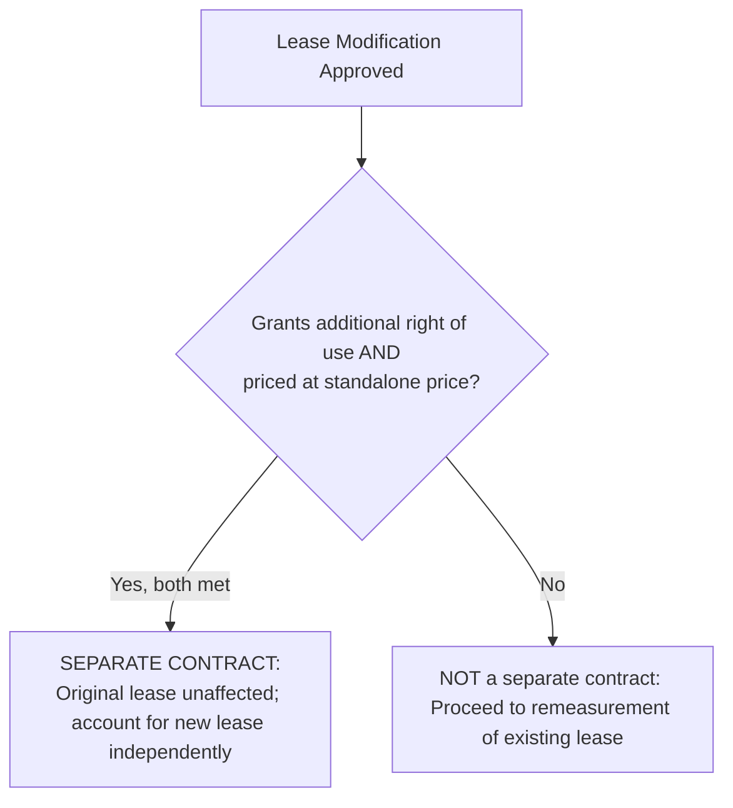
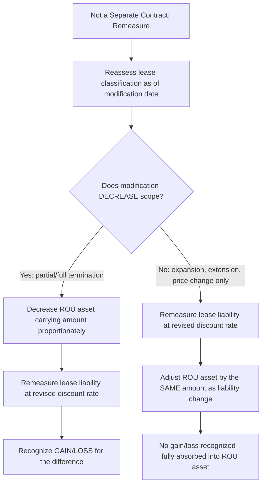

## Lease Modifications and Remeasurement

### Overview

A lease modification is a change to the **scope or consideration** of a lease that was not part of the original terms and conditions (e.g., adding or terminating the right to use additional assets, extending or shortening the lease term). ASC 842-10-25-8 through 25-18 establishes a decision framework closely paralleling the ASC 606 contract modification model, determining whether a modification is accounted for as a **separate contract** or requires **remeasurement** of the existing lease.

### Regulatory Framework

- **ASC 842-10-25-8 through 25-18** (Lease Modifications)
- **ASC 842-10-25-1 through 25-3, 35-1 through 35-5** (Reassessment — non-modification triggers)
- **IFRS 16, paragraphs 44–46** (Lessee modifications), **paragraphs 79–80** (Lessor modifications)

### Modification vs. Reassessment: A Critical Distinction

**Key Points**

Two distinct triggers cause changes to lease accounting, and they are **not** the same thing:

1. **Lease modification**: A change **approved by both parties** that was not part of the original lease terms (e.g., negotiating additional floor space, agreeing to extend the term).
2. **Reassessment** (without modification): A **remeasurement event** triggered by a change in circumstances **within the original contract's terms** — e.g., the lessee's own reassessment of whether it is reasonably certain to exercise an existing renewal option, a change in the assessment of a purchase option, or a change in amounts probable of being owed under a residual value guarantee. No new negotiation with the lessor is required; only the lessee's judgment changes.

**[Inference]** This distinction is frequently tested because the accounting mechanics differ: modifications first pass through a "separate contract" gate (see below), while non-modification reassessment events go **directly** to remeasurement of the existing lease liability using a revised discount rate as of the reassessment date.

### Step 1: Is the Modification a Separate Contract?

A lease modification is accounted for as a **separate contract** (with no effect on the original, unmodified lease) if **both** of the following are met:

1. The modification **grants the lessee an additional right of use** not included in the original lease (e.g., additional square footage, an additional piece of equipment), **and**
2. The **increase in consideration** for the lease is commensurate with the **standalone price** of the additional right of use, adjusted for the circumstances of the particular contract.

$$\text{Separate Contract} \iff \text{Additional ROU Granted} \; \cap \; \text{Price Increase} \approx \text{Standalone Price of Addition}$$

If both criteria are met, the original lease is **entirely unaffected** — the new right of use is accounted for as if it were a wholly new, independent lease.

### Step 2: Accounting When Not a Separate Contract

If the modification does not qualify as a separate contract, the lessee **reassesses lease classification** as of the modification effective date and **remeasures the lease liability**, using a **revised discount rate** determined at the modification date. The treatment then depends on whether the modification **decreases** or **does not decrease** the scope of the lease:

#### Modification That Decreases Scope (Partial or Full Termination)

For a modification that **fully or partially terminates** an existing lease (e.g., the lessee gives back a portion of leased floor space):

1. The lessee decreases the **carrying amount of the ROU asset** to reflect the partial or full termination, on a basis reflecting the reduction in scope (e.g., proportionate to the reduction in the ROU asset, or based on the decrease in the lease liability if that better reflects the reduced scope).
2. The lessee recognizes a **gain or loss** for the difference between the reduction in the lease liability and the proportionate reduction in the ROU asset.
3. The lease liability is remeasured based on the **revised** lease terms and revised discount rate.

$$\text{Gain/Loss on Partial Termination} = \Delta \text{Lease Liability} - \Delta \text{ROU Asset (proportionate)}$$

#### Modification That Does Not Decrease Scope (Expansion, Extension, Price Change)

For all other modifications not accounted for as a separate contract (e.g., extending the term, adding a non-distinct right of use, or changing only the consideration):

1. **Remeasure the lease liability** using a revised discount rate, based on the revised lease payments and revised lease term.
2. Recognize the corresponding adjustment as a **corresponding change to the ROU asset** (no gain or loss recognized — the entire remeasurement effect flows through the asset).

### Example: Modification Qualifying as a Separate Contract

**Example**

A lessee leases 10,000 sq ft of office space. Midway through the lease, the lessee negotiates to add an additional 5,000 sq ft in the same building at a rate the lessor confirms is consistent with its current standalone asking rate for comparable space (no discount tied to the existing relationship beyond what a new tenant would receive).

**Analysis**: Both separate-contract criteria are met — additional distinct right of use, priced at standalone rate. The original 10,000 sq ft lease continues completely unaffected (no reassessment of its liability, ROU asset, or classification). The additional 5,000 sq ft is accounted for as a **brand new, independent lease** with its own commencement date, initial ROU asset, and lease liability measurement.

### Example: Modification Requiring Remeasurement — Term Extension

**Example**

A lessee has an existing operating lease for equipment with 2 years remaining, a current lease liability of $180,000 (based on the original 5% discount rate), and an ROU asset carrying amount of $175,000. The lessee negotiates to extend the lease by 3 additional years at an increased annual payment, with a revised incremental borrowing rate of 6% as of the modification date.

**Analysis**:

- Not a separate contract (extension of existing space/equipment, not an additional distinct right of use).
- Does not decrease scope → falls under the "no scope decrease" category.
- **Remeasure the lease liability**: Recalculate using the revised total payments (2 remaining original years + 3 new years) discounted at the **revised 6% rate** as of the modification date.
- Assume the remeasured liability is $410,000 (up from $180,000 pre-modification).
- **Adjustment**: $410,000 − $180,000 = $230,000 increase, recognized as a **corresponding increase to the ROU asset**: $175,000 + $230,000 = **$405,000** new ROU asset carrying amount.
- **No gain or loss recognized** — reassess lease classification at the modification date using the revised terms (still concludes operating lease in this example).

### Example: Modification Decreasing Scope — Partial Termination

**Example**

A lessee leases a 20,000 sq ft warehouse with a lease liability of $500,000 and an ROU asset of $480,000. The lessee negotiates to give back 8,000 sq ft (40% of the space) for the remaining lease term, with a proportionate reduction in future payments.

**Analysis**:

- Modification decreases scope → partial termination treatment.
- **ROU asset reduction**: 40% × $480,000 = $192,000 reduction → new ROU asset = $288,000.
- **Lease liability remeasurement**: Recalculate the liability based on the reduced future payments (60% of original space) at a revised discount rate — assume this yields a new liability of $285,000 (a reduction of $215,000 from $500,000).
- **Gain on partial termination**: $215,000 (liability reduction) − $192,000 (ROU asset reduction) = **$23,000 gain**, recognized in profit or loss at the modification date.

### Lessor Accounting for Modifications

The lessor applies a parallel but distinct framework:

- If the modification qualifies as a **separate contract** (same two criteria as lessee), account for it as a new, separate lease.
- If not a separate contract, and the modification would have resulted in a **different classification** had it been in effect at commencement, the lessor accounts for the modification as if it were a **new lease** as of the modification effective date (using the fair value of the underlying asset at that date and remaining costs to be recovered).
- If the modified lease would still be classified the **same** and it is **not** a separate contract, and it was previously an operating lease, the lessor generally continues operating lease accounting, adjusting future lease income prospectively.

### Non-Modification Reassessment Events

**Key Points**

Distinct from modifications, a lessee **reassesses** (without a bilateral contract change) upon:

- A change in the lessee's determination of whether it is **reasonably certain** to exercise a renewal, termination, or purchase option **already in the contract**.
- The occurrence of an event specified in the contract that **requires** reassessment of the lease term or a purchase option.
- A change in the amount **probable of being owed** under a residual value guarantee.

These events also trigger **remeasurement** of the lease liability (using a revised discount rate if the lease term or purchase option assessment changed) with the offsetting adjustment to the ROU asset, following the same "no scope decrease" mechanics illustrated above — but critically, **no "separate contract" analysis applies**, since there was no bilateral modification.

### Forensic Accounting Considerations

**Output**

Lease modification accounting introduces judgment-heavy remeasurement triggers that create manipulation opportunities:

- **Mischaracterizing scope-decreasing modifications**: Classifying a modification that economically reduces scope as a "no scope decrease" event to avoid recognizing an immediate loss (or to defer/inflate a gain calculation), routing the full adjustment through the ROU asset instead of properly bifurcating a gain/loss.
- **Discount rate manipulation at remeasurement**: Selecting a favorable revised discount rate at the modification date to manage the resulting change in lease liability and ROU asset, particularly when the remeasurement significantly affects reported leverage metrics.
- **Separate contract mischaracterization**: Asserting a modification qualifies as a "separate contract" (avoiding any remeasurement of the existing lease) when the pricing does not genuinely reflect standalone pricing for the additional right of use — used to avoid recognizing an unfavorable remeasurement on the original lease.
- **Undocumented informal modifications**: Verbal or informal agreements to change lease terms (common in related-party or distressed-tenant situations) not properly identified and accounted for as modifications, creating a completeness gap in the lease liability.
- **Selective reassessment timing**: Delaying recognition of a reassessment event (e.g., an increasingly certain renewal option) to a more favorable future period, understating the lease liability and ROU asset in the interim — a cutoff manipulation risk.
- **Partial termination gain manufacturing**: Structuring a modification to be characterized as a partial termination in order to recognize an immediate gain, when the substance is more consistent with a straightforward scope reduction that should be measured differently or combined with other concurrent changes.

### Disclosure Requirements

Entities must disclose significant judgments and assumptions made in remeasuring lease liabilities upon modification, including the revised discount rate methodology, as part of the broader qualitative lease disclosures under ASC 842-20-50 (lessee) and ASC 842-30-50 (lessor).

### Related Topics

- Lease classification criteria
- Lessee accounting for right-of-use assets and lease liabilities
- Lessor accounting for sales-type, direct financing, and operating leases
- Sale-leaseback transactions
- Contract modifications under ASC 606 (parallel framework)
- Variable lease payments and their treatment in remeasurement
- Discount rate determination: rate implicit in the lease vs. incremental borrowing rate
- Forensic indicators of undocumented related-party lease changes