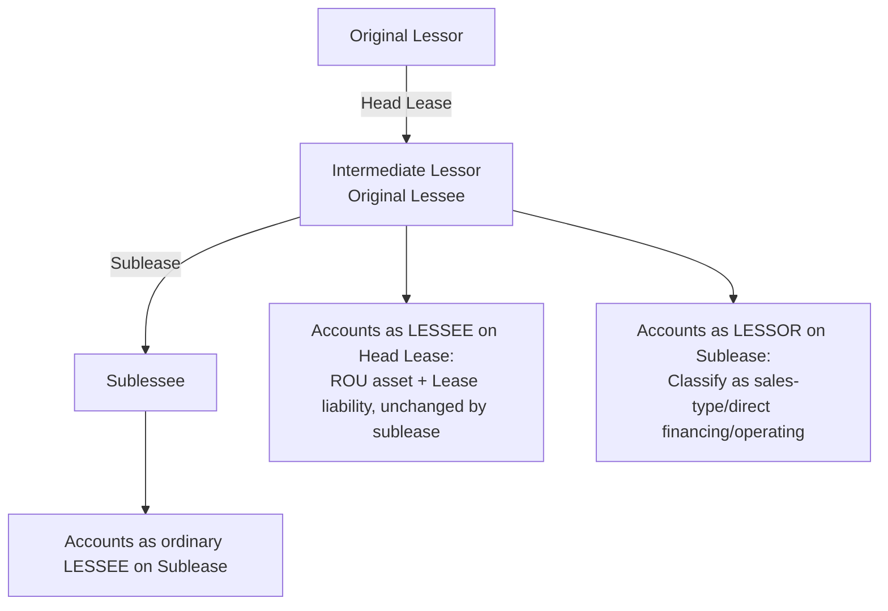
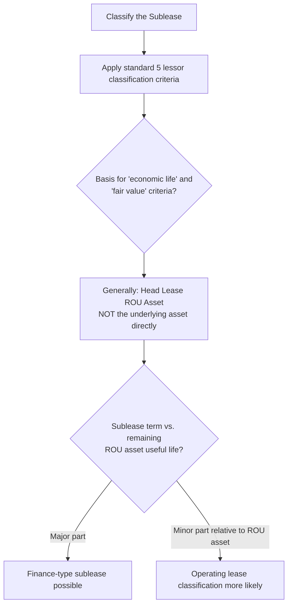

## Sublease Accounting

### Overview

A sublease occurs when the original lessee (now acting as an **intermediate lessor**) leases the underlying asset (or a portion of the right-of-use asset) to a third party (the **sublessee**), while remaining primarily obligated under the **head lease** with the original lessor. Sublease accounting requires the intermediate lessor to apply **both** lessee accounting (for the head lease) **and** lessor accounting (for the sublease) simultaneously — a dual-role structure that is frequently a source of confusion and error.

### Regulatory Framework

- **ASC 842-10-25-19 through 25-20** (Sublease scoping and classification basis)
- **ASC 842-30** (Lessor accounting, applied to the sublease itself)
- **IFRS 16, paragraphs B58** and related application guidance (substantially converged approach)

### The Core Structural Concept: Three Parties, Two Contracts

**Key Points**

A sublease involves three parties but **two separate lease contracts**:

1. **Head lease**: Original lessor ↔ Original lessee (now the "intermediate lessor" for sublease purposes). The intermediate lessor continues to account for this as a **lessee** under the standard ROU asset/lease liability model — the head lease is **not derecognized or altered** by the existence of the sublease itself (absent a separate head lease modification).
2. **Sublease**: Intermediate lessor ↔ Sublessee. The intermediate lessor applies **lessor accounting** to this new contract, classifying it under the standard lessor classification criteria (sales-type, direct financing, or operating).

$$\text{Intermediate Lessor's Position} = \text{Lessee (Head Lease)} + \text{Lessor (Sublease)}$$

The sublessee has **no direct relationship** with the original head lessor and accounts for the sublease purely as an ordinary lessee, applying the standard lessee model to its contract with the intermediate lessor.

### Classifying the Sublease: The Key Nuance

**Key Points**

When classifying the sublease, the intermediate lessor evaluates the standard lessor classification criteria (transfer of ownership, purchase option, major part of economic life, present value substantially all of fair value, specialized asset), but with one **critical modification**: the intermediate lessor generally references the **right-of-use asset arising from the head lease** — not the fair value or economic life of the **underlying asset itself** — as the basis for the classification tests (ASC 842-10-25-19).

$$\text{Sublease Classification Basis} = \text{ROU Asset from Head Lease} \; (\text{not the underlying asset directly})$$

**Practical implication**: If the remaining head lease term is short relative to the underlying asset's total economic life, using the ROU asset (with its shorter remaining useful life) as the basis makes it **less likely** the sublease will meet the "major part of remaining economic life" criterion — often resulting in **operating lease** classification for subleases even when the head lease itself was a finance lease, since the intermediate lessor cannot practically transfer more than what it holds (the ROU asset), and the "underlying asset" and "economic life" concepts need to be reframed relative to what the intermediate lessor actually controls.

**[Inference]** This is one of the more technically nuanced and frequently misapplied aspects of sublease accounting — practitioners sometimes incorrectly apply the original lessor's classification framework (based on the underlying asset's total fair value/economic life) rather than correctly rebasing the analysis to the head lease ROU asset.

### Head Lease Accounting: Unaffected by the Sublease

**Key Points**

Entering into a sublease, by itself, does **not** modify or remeasure the head lease. The intermediate lessor continues to:

- Recognize and amortize the head lease **ROU asset** per the original lessee accounting model.
- Recognize and accrete the head lease **lease liability**.
- Assess the head lease ROU asset for **impairment** under ASC 360 — critically, when a sublease is entered into at a loss (sublease income less than head lease costs), this is often a **triggering event** requiring impairment testing of the head lease ROU asset, since it may indicate the ROU asset's carrying amount is not recoverable.

The head lease is only remeasured if it is **separately modified** (e.g., the intermediate lessor renegotiates directly with the original lessor) — the existence of a sublease with a third party is not, by itself, a head lease modification.

### Sublease Accounting: Operating Classification

If the sublease is classified as **operating**, the intermediate lessor:

1. **Continues** to recognize the head lease ROU asset and lease liability (as lessee), unaffected.
2. Recognizes **sublease income** on a straight-line basis (as lessor) over the sublease term.
3. Presents sublease income **separately** from head lease expense (interest/amortization or single lease cost) — not netted, similar to general lessor presentation requirements.

### Sublease Accounting: Sales-Type or Direct Financing Classification

If the sublease is classified as **sales-type** or **direct financing**:

1. The intermediate lessor **derecognizes the head lease ROU asset** (or the relevant portion) attributable to the subleased asset.
2. Recognizes a **net investment in the sublease** (lessor-side receivable).
3. For a sales-type sublease, recognizes **selling profit or loss** at sublease commencement — the difference between the net investment in the sublease and the carrying amount of the derecognized ROU asset (portion).
4. The **head lease liability remains** on the intermediate lessor's books, unaffected by the sublease's classification — creating a scenario where the intermediate lessor may have **derecognized the ROU asset** but **still carries the corresponding lease liability**, a structurally important point often tested.

$$\text{Sales-Type Sublease Profit} = \text{Net Investment in Sublease} - \text{Carrying Amount of (portion of) Head Lease ROU Asset}$$

### Example: Operating Sublease — Loss Position Triggering Impairment

**Example**

A company leases 50,000 sq ft of office space under a 10-year head lease (5 years remaining), with an ROU asset carrying amount of $4,000,000 and annual head lease cost of $1,000,000 (straight-line operating lease). Due to a shift to remote work, the company subleases the entire space to a third party for the remaining 5 years at $700,000/year (an operating sublease, since it's a short remaining term relative to the building's total economic life).

**Analysis**:

- **Sublease income**: $700,000/year, recognized straight-line, presented separately from head lease cost.
- **Net cash/expense impact**: $1,000,000 (head lease cost) − $700,000 (sublease income) = $300,000/year net cost — an unfavorable sublease.
- **Impairment trigger**: Entering into a sublease at a rate below the head lease cost is a strong indicator requiring the company to test the head lease ROU asset for impairment under ASC 360, since projected cash flows (now anchored to the $700,000 sublease income rather than the space's original utility to the company) may be insufficient to recover the $4,000,000 carrying amount.
- If impairment testing indicates the ROU asset's carrying amount exceeds its fair value (estimated based on the sublease terms and any period before sublease commencement), an **impairment loss** is recognized, reducing the ROU asset and the subsequent amortization pattern.

### Example: Sales-Type Sublease

**Example**

An intermediate lessor holds a head lease on specialized manufacturing equipment (ROU asset carrying amount $600,000, 8 years remaining) and subleases the equipment to a third party for the **entire remaining 8-year term** with terms causing the sublease to meet the "major part of remaining economic life" criterion **relative to the head lease ROU asset** (since the sublease term equals the full remaining ROU asset life) — resulting in **sales-type** classification.

**Analysis**:

- **Derecognize** the $600,000 head lease ROU asset.
- **Recognize net investment in the sublease**: present value of sublease payments, assume $750,000.
- **Selling profit recognized**: $750,000 − $600,000 = **$150,000**, recognized at sublease commencement.
- **Head lease liability**: Remains on the books at its existing carrying amount, continuing to accrete interest and require payment per the original head lease terms — **entirely separate** from the sublease receivable now recognized.
- Subsequent periods: intermediate lessor recognizes **interest income** on the net investment in the sublease (lessor side) **and** continues to recognize **interest expense** on the head lease liability (lessee side) — both sides of the dual role continue independently.

### Forensic Accounting Considerations

**Output**

Sublease accounting's dual-role complexity creates specific manipulation and error risks:

- **Misapplying the classification basis**: Incorrectly using the underlying asset's full fair value/economic life (rather than the head lease ROU asset) to classify the sublease, potentially avoiding sales-type classification (and the associated profit recognition and derecognition) when it should apply, or vice versa — used to control the timing of gain recognition.
- **Failure to test head lease ROU asset impairment**: Entering into a loss-making sublease without performing (or without adequately supporting) the required impairment assessment of the head lease ROU asset, overstating the asset on the balance sheet — a pattern common in corporate real estate downsizing during economic contractions.
- **Overstated selling profit on sales-type subleases**: Using an inflated net investment in the sublease (e.g., an unsupported discount rate or optimistic collectibility assumption) to inflate the "selling profit" recognized at sublease commencement.
- **Netting presentation abuse**: Improperly netting sublease income against head lease expense on the income statement, obscuring the true gross magnitude of both the ongoing head lease obligation and the sublease arrangement — reducing transparency for financial statement users assessing real estate risk exposure.
- **Related-party sublease structuring**: Subleasing to a related entity at non-arm's-length terms to manage the classification outcome, the resulting profit/loss recognition, or to shift lease costs between related reporting entities for consolidated earnings management purposes.
- **Disguised head lease modifications**: Structuring what is economically a head lease renegotiation as a "new sublease" to avoid head lease remeasurement that would otherwise be required, when the substance indicates the original lessor was effectively party to the renegotiated terms.

### Disclosure Requirements

Intermediate lessors must provide disclosures addressing both their lessee position (head lease) and lessor position (sublease) under the respective general lease disclosure requirements (ASC 842-20-50 and ASC 842-30-50), and are encouraged to disclose the amount of sublease income presented on a **gross basis**, separately from head lease expense, to preserve transparency.

### Related Topics

- Lease classification criteria
- Lessee accounting for right-of-use assets and lease liabilities
- Lessor accounting for sales-type, direct financing, and operating leases
- Sale-leaseback transactions
- Lease modifications and remeasurement
- Impairment of right-of-use assets under ASC 360
- Related-party lease transaction disclosures
- Forensic indicators of corporate real estate downsizing and loss-position subleases