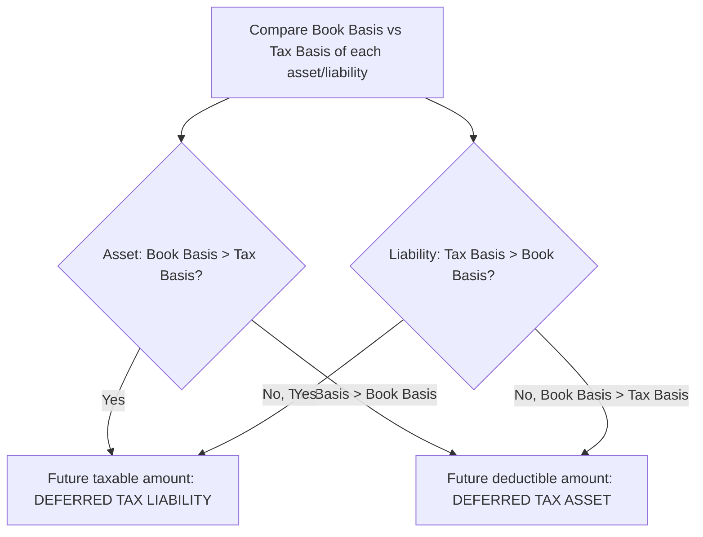
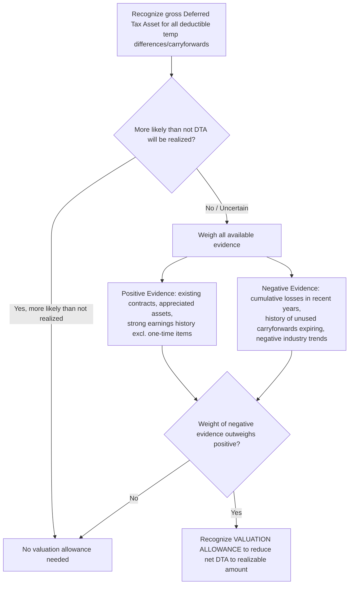

## Deferred Tax Asset and Liability Recognition

### Overview

Deferred tax assets (DTAs) and deferred tax liabilities (DTLs) arise from **temporary differences** between the financial statement (book) carrying amount of assets and liabilities and their corresponding tax basis, as well as from certain carryforwards. ASC 740 requires a **balance sheet approach** (the asset-and-liability method) to income tax accounting, recognizing the future tax consequences of events already reflected in the financial statements.

### Regulatory Framework

- **ASC 740-10-25** (Recognition)
- **ASC 740-10-30** (Initial Measurement)
- **IAS 12** (International — largely converged on the balance sheet approach, though with notable differences in specific areas such as the initial recognition exception and outside basis differences)

### The Balance Sheet (Asset-and-Liability) Approach

**Key Points**

Under ASC 740, deferred taxes are computed by comparing the **book basis** and **tax basis** of each asset and liability, applying enacted tax rates expected to apply in the periods the differences reverse.

$$\text{Temporary Difference} = \text{Book Basis} - \text{Tax Basis}$$

$$\text{Deferred Tax Liability or Asset} = \text{Temporary Difference} \times \text{Enacted Future Tax Rate}$$

- A temporary difference that will result in **taxable amounts** in future years (book basis > tax basis for an asset, or tax basis > book basis for a liability) gives rise to a **deferred tax liability**.
- A temporary difference that will result in **deductible amounts** in future years (tax basis > book basis for an asset, or book basis > tax basis for a liability) gives rise to a **deferred tax asset**.

### Common Sources of Temporary Differences

#### Deferred Tax Liabilities (Book Basis > Tax Basis for Assets)

- **Accelerated tax depreciation** (e.g., MACRS) vs. straight-line book depreciation — PP&E tax basis is lower than book basis.
- **Installment sales** recognized for book purposes but deferred for tax purposes.
- **Prepaid expenses** deducted for tax when paid but expensed for book over time.

#### Deferred Tax Assets (Tax Basis > Book Basis for Assets, or Book > Tax for Liabilities)

- **Allowance for credit losses / bad debt reserves** — deductible for tax only when specifically written off, but expensed for book when estimated.
- **Warranty reserves and other accrued liabilities** — deductible for tax when paid, expensed for book when accrued.
- **Net operating loss (NOL) carryforwards** and **tax credit carryforwards**.
- **Stock-based compensation** — book expense recognized over the vesting period; tax deduction (for nonqualified awards) generally occurs at exercise/vesting, often creating temporary book-tax differences (and potential permanent differences if the tax deduction differs from the cumulative book expense).
- **Deferred revenue** recognized for tax purposes upon receipt but recognized for book over time as performance obligations are satisfied.

### Recognition Exceptions

Not all book-tax basis differences result in deferred taxes. ASC 740-10-25-3 identifies specific **exceptions**:

1. **Goodwill** (for book purposes) that is not deductible for tax purposes — no deferred tax liability is recognized for the initial excess of book goodwill over tax-deductible goodwill (an "originating" difference exception), though subsequently recognized deferred taxes on **tax-deductible goodwill in excess of book goodwill** can occur in certain circumstances.
2. **Undistributed earnings of a subsidiary or corporate joint venture** presumed to be permanently reinvested (the **APB 23 exception**, now codified within ASC 740-30) — no deferred tax liability recognized on outside basis differences related to undistributed foreign earnings, provided specific criteria and documentation requirements are met.
3. **Leveraged leases** (a narrow legacy exception for arrangements grandfathered under prior lease accounting).
4. Certain **other exceptions** for specific transactions identified in ASC 740-10-25-3(e) through (h).

**[Inference]** The undistributed foreign earnings exception has become significantly less impactful in practice following U.S. tax reform (the 2017 Tax Cuts and Jobs Act's transition to a modified territorial system with GILTI), though the exception mechanically remains in the codification and can still be relevant for certain outside basis differences.

### Measurement: Enacted Tax Rates

Deferred tax assets and liabilities are measured using the **enacted** tax rate(s) expected to apply when the temporary differences are realized or settled — **not** the rate currently in effect if a rate change has already been enacted (even if not yet effective). A change in tax rates requires **immediate remeasurement** of existing deferred tax balances, with the effect recognized in **income from continuing operations** in the period of enactment (regardless of where the underlying item originally affected the financial statements — a notable exception to the general "intraperiod tax allocation" backwards-tracing principle, per ASC 740-10-45-15).

$$\Delta \text{Deferred Tax Balance (rate change)} = \text{Temporary Difference} \times (\text{New Enacted Rate} - \text{Old Enacted Rate})$$

### Valuation Allowance for Deferred Tax Assets

**Key Points**

A deferred tax asset is recognized in full for all deductible temporary differences and carryforwards, but is then reduced by a **valuation allowance** if it is **more likely than not** (a probability greater than 50%) that some portion or all of the deferred tax asset will **not** be realized (ASC 740-10-30-5).

$$\text{Net Deferred Tax Asset} = \text{Gross DTA} - \text{Valuation Allowance}$$

#### Sources of Taxable Income to Support Realization (ASC 740-10-30-18)

1. **Future reversals of existing taxable temporary differences** (scheduling).
2. **Future taxable income exclusive of reversing temporary differences and carryforwards**, based on forecasts.
3. **Taxable income in prior carryback years**, if carryback is permitted.
4. **Tax-planning strategies** — prudent and feasible actions that would result in the realization of the deferred tax asset (e.g., electing a different tax method, accelerating taxable income).

#### The "More Likely Than Not" Standard and Negative Evidence

A **cumulative loss in recent years** (typically the current year plus the two preceding years) is considered **significant negative evidence** that is difficult to overcome with subjective positive evidence such as management's forecasts of future profitability — this is one of the most heavily litigated and scrutinized judgment areas in ASC 740 practice.

### Example: Basic Deferred Tax Liability — Depreciation Difference

**Example**

A company purchases equipment for $1,000,000. For book purposes, it depreciates straight-line over 10 years ($100,000/year). For tax purposes, it uses MACRS, resulting in $300,000 of tax depreciation in Year 1. The enacted tax rate is 21%.

|  | Book | Tax | Difference |
| --- | --- | --- | --- |
| Year 1 Depreciation | $100,000 | $300,000 | $200,000 |
| Year 1 Ending Book Basis | $900,000 | $700,000 | $200,000 |

- **Temporary difference at year-end**: Book basis ($900,000) > Tax basis ($700,000) = $200,000 (a future taxable amount, since tax depreciation will be lower in future years as book "catches up").
- **Deferred Tax Liability**: $200,000 × 21% = **$42,000**.

### Example: Deferred Tax Asset with Valuation Allowance

**Example**

A company has a $5,000,000 net operating loss carryforward (indefinite life under current U.S. tax law, subject to an 80%-of-taxable-income annual usage limitation) and has incurred **cumulative losses in the current year and prior two years**. The enacted rate is 21%.

- **Gross Deferred Tax Asset**: $5,000,000 × 21% = $1,050,000.
- **Assessment**: The three-year cumulative loss position constitutes significant negative evidence. Management's forecasts of future profitability (positive evidence) are generally insufficient, standing alone, to overcome this negative evidence without objectively verifiable factors (e.g., a signed contract for a new profitable business line, or expiration of a specific loss-generating event).
- **Conclusion**: A full (or substantial) **valuation allowance** is recorded against the $1,050,000 gross DTA, resulting in little to no net deferred tax asset recognized on the balance sheet, with the valuation allowance change flowing through the income tax provision (increasing tax expense) in the period established.

### Intraperiod Tax Allocation

**Key Points**

Deferred tax effects are generally allocated among continuing operations, discontinued operations, other comprehensive income (OCI), and items charged/credited directly to equity, following the **intraperiod tax allocation** rules in ASC 740-20 — generally **excluding** the tax rate change remeasurement effect discussed above, which is an explicit exception recognized entirely within continuing operations.

### Forensic Accounting Considerations

**Output**

Deferred tax accounting, particularly valuation allowance judgment, is one of the most fraud-and-earnings-management-prone areas of financial reporting due to its heavy reliance on subjective forecasts:

- **Valuation allowance manipulation for earnings management**: Selectively releasing (reversing) a valuation allowance to generate a one-time tax benefit and boost net income in a target period, without adequate objective positive evidence supporting the "more likely than not" realization conclusion — a well-documented technique for smoothing or inflating earnings, especially near financial covenant thresholds or executive bonus targets.
- **Delayed valuation allowance recognition**: Failing to establish a valuation allowance timely despite clear negative evidence (cumulative losses), overstating deferred tax assets and net income.
- **Aggressive tax-planning strategy assumptions**: Relying on hypothetical or impractical tax-planning strategies to support DTA realizability that management has no genuine intent or ability to execute.
- **Inconsistent treatment across similar fact patterns**: Applying different valuation allowance conclusions to economically similar deferred tax asset positions (e.g., across subsidiaries or jurisdictions) without a documented, consistent methodology.
- **Rate change remeasurement timing manipulation**: Manipulating the period in which a tax rate change is deemed "enacted" (a specific legal/procedural determination) to control which period absorbs the remeasurement gain or loss.
- **Undisclosed uncertain tax positions**: Failing to properly evaluate and disclose uncertain tax positions under ASC 740-10-25 (the "more likely than not" recognition threshold for tax positions, distinct from the DTA valuation allowance standard, often confused by practitioners) — used to avoid recognizing tax liabilities for aggressive tax return positions.
- **Business combination purchase accounting manipulation**: Improperly allocating deferred taxes in a business combination to manage post-acquisition effective tax rates or to create "cookie jar" reserves for future release.

### Disclosure Requirements

ASC 740-10-50 requires disclosure of the components of the net deferred tax asset/liability by type of temporary difference, the total valuation allowance and the net change in valuation allowance during the year, a rate reconciliation between the statutory and effective tax rates, and information about unrecognized tax benefits (uncertain tax positions) — all frequently cross-examined by forensic accountants assessing the credibility of management's tax-related judgments.

### Related Topics

- Valuation allowance assessment: weighing positive and negative evidence in depth
- Uncertain tax positions and the two-step recognition/measurement model (ASC 740-10-25)
- Business combinations: deferred tax accounting in purchase accounting
- Intraperiod tax allocation mechanics
- Outside basis differences and the APB 23 exception
- Effective tax rate reconciliation and disclosure analysis
- Stock-based compensation: book-tax differences and windfall/shortfall accounting
- Forensic indicators of valuation allowance-driven earnings management