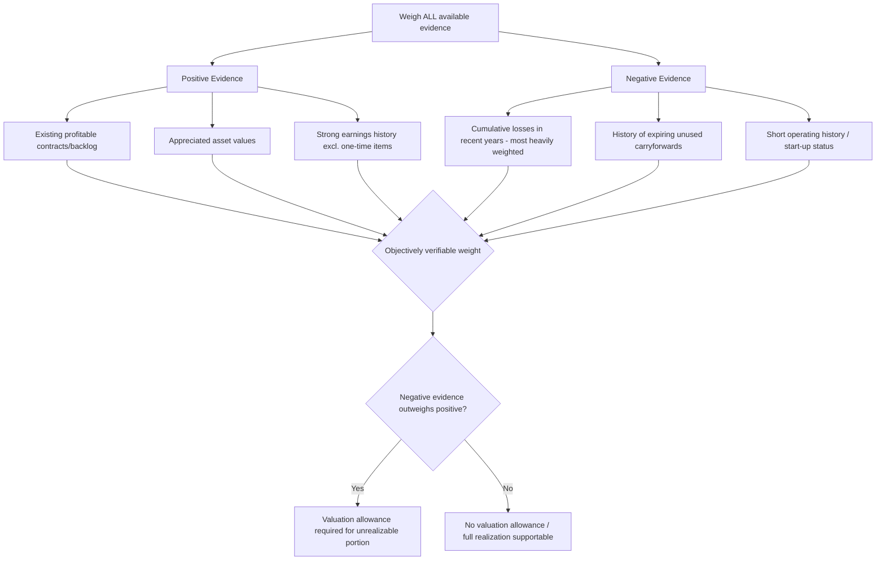

## Valuation Allowances and Realizability Assessments

### Overview

This topic provides a deep, standalone treatment of the **valuation allowance** framework under ASC 740 — the mechanism by which an entity determines the **realizable** portion of its gross deferred tax assets. While introduced at a high level alongside DTA/DTL recognition, the realizability assessment is sufficiently judgment-intensive and litigated to warrant dedicated treatment, particularly the weighting of positive and negative evidence and the specific mechanics of scheduling and tax-planning strategies.

### Regulatory Framework

- **ASC 740-10-30-5 through 30-25** (Valuation Allowance Recognition and Measurement)
- **ASC 740-10-25-20 through 25-22** (Evaluating whether a valuation allowance is needed)
- **IAS 12, paragraphs 24–36** (International — a notably different, more restrictive "probable" recognition threshold applied at initial DTA recognition rather than a separate valuation allowance mechanism)

### The Two-Step Nature of DTA Accounting

**Key Points**

ASC 740 uses a "gross-up-then-reduce" approach, distinct from IFRS's single-step "probable" recognition threshold:

1. **Step 1**: Recognize a deferred tax asset for **all** deductible temporary differences and carryforwards (no threshold applied at this stage).
2. **Step 2**: Assess whether a valuation allowance is needed by evaluating whether it is **more likely than not** (>50% likelihood) that **some or all** of the deferred tax asset will **not** be realized.

$$\text{Net DTA} = \text{Gross DTA} - \text{Valuation Allowance (if any)}$$

**[Inference]** The distinction from IAS 12's single-step model is a common comparative exam point — IFRS asks "is it probable this will be realized?" as a **recognition** gate, while US GAAP recognizes the full gross asset and then asks whether an **allowance** should reduce it — the end **result** is often similar, but the presentation and disclosure mechanics differ, and the standards are not fully converged in edge cases.

### All Available Evidence Must Be Considered

ASC 740-10-30-16 through 30-25 requires that **all available evidence, both positive and negative**, be considered — the assessment cannot rely on a single factor in isolation, and the weight given to each piece of evidence should be **proportional to the extent it can be objectively verified**.

#### Positive Evidence (Supports Realization)

- Existing contracts or firm sales backlog that will produce sufficient future taxable income.
- Appreciated asset value sufficient to realize the deferred tax asset even if held indefinitely.
- Strong earnings history exclusive of the loss that created the carryforward, particularly if the loss is attributable to a **discrete, identifiable, non-recurring cause** (e.g., a one-time litigation settlement, an unusual and non-recurring write-off).
- Existing backlog of profitable orders sufficient to utilize the carryforward before expiration.

#### Negative Evidence (Weighs Against Realization)

- **Cumulative losses in recent years** — the single most heavily weighted factor in practice, generally assessed as pretax income/loss over the current year plus the two preceding years (a "three-year cumulative loss" test commonly applied, though not a bright-line codified rule).
- A history of tax credit or **carryforwards expiring unused**.
- Losses expected in early future years even if profitability is expected later, particularly where **carryforward periods are limited**.
- Unsettled circumstances that, if unfavorably resolved, would adversely affect future operations and profit levels on a continuing basis.
- A short or nonexistent operating history for start-up entities.

### The Cumulative Loss Rule in Practice

**Key Points**

While not a codified bright-line rule, ASC 740-10-30-21 (drawing on the "objective and verifiable" evidence hierarchy) has led to well-established practice: a **cumulative loss position over the three most recent years** (current + prior two) is treated as **significant negative evidence that is difficult to overcome**. Forecasts of future profitability alone — being inherently subjective — generally cannot overcome this negative evidence without substantial corroborating objective evidence.

$$\text{Cumulative Loss Position} = \sum_{t=T-2}^{T}(\text{Pretax Book Income}_t) < 0$$

**[Inference]** In practice, entities in a cumulative loss position rarely successfully avoid a full or near-full valuation allowance absent unusually strong objective evidence (e.g., a specific, contractually committed, non-discretionary event virtually certain to generate future taxable income), since auditors and the SEC apply significant scrutiny to this specific fact pattern.

### Scheduling of Temporary Difference Reversals

One method of supporting DTA realizability is demonstrating that existing **taxable** temporary differences (deferred tax liabilities) will reverse in the same periods and jurisdictions as the deductible temporary differences (deferred tax assets), providing a source of taxable income without relying on future operating profitability.

$$\text{DTA Realizable via Scheduling} = \min(\text{DTA reversing in period } t, \text{DTL reversing in period } t)$$

**Key Points**: This requires jurisdiction-by-jurisdiction and, in some cases, character-by-character (ordinary vs. capital) matching — a capital loss carryforward, for example, generally can only be supported by future **capital gains**, not ordinary taxable income, requiring separate scheduling analysis.

### Tax-Planning Strategies

A **tax-planning strategy** is an action that:

1. Is **prudent and feasible**.
2. An entity **ordinarily might not take** but would take to prevent a carryforward from expiring unused.
3. Would result in realization of the deferred tax asset.

Examples include electing to **capitalize** and amortize research costs rather than expensing them currently (accelerating taxable income), or a **sale-leaseback** of appreciated property to generate a taxable gain. The strategy must be evaluated for feasibility considering the tax effects of implementing it and any **material costs** — if implementing the strategy would itself result in a significant, non-recurring expense or loss, the net benefit must be assessed.

### Example: Full Valuation Allowance — Cumulative Loss Position

**Example**

A technology company has pretax losses of $8M, $12M, and $5M in the current year and prior two years, respectively (a clear cumulative loss position), driven by ongoing R&D investment and market expansion costs. It has $25M in gross deferred tax assets (primarily NOL carryforwards and R&D credit carryforwards), and no significant existing deferred tax liabilities to support scheduling.

**Analysis**:

- **Negative evidence**: Three-year cumulative pretax loss of $25M — significant and difficult to overcome.
- **Positive evidence considered**: Management's projections of profitability driven by a new product launch — but these are **subjective** forecasts, not objectively verifiable, and the company has no history of achieving projected results (a new product with no sales history).
- **Tax-planning strategies**: None identified that are both prudent, feasible, and would generate sufficient objectively verifiable taxable income.
- **Conclusion**: A **full valuation allowance** is recorded against the $25M gross DTA (assuming no offsetting DTLs from scheduling), resulting in $0 net deferred tax asset. The increase in valuation allowance (if this is a new position) is recognized as additional income tax expense in the current period.

### Example: Partial Valuation Allowance — Scheduling Supports Some Realization

**Example**

A manufacturing company has $10M of gross deferred tax assets from warranty reserves and bad debt allowances (all reversing within 2–3 years), and is in a cumulative loss position raising realizability concerns. However, the company also has $6M of deferred tax **liabilities** from accelerated tax depreciation that are scheduled to reverse (generate taxable income) within the same 2–3 year window.

**Analysis**:

- Scheduling supports realization of $6M of the $10M gross DTA (the deferred tax liability reversal provides a source of future taxable income independent of operating profitability).
- The remaining $4M is evaluated against other sources — if no other positive evidence sufficiently overcomes the cumulative loss negative evidence, a **partial valuation allowance of $4M** is recorded, with $6M of net DTA remaining recognized (supported by the scheduled DTL reversals).

### Valuation Allowance Release: Evidentiary Standard

Releasing (reversing) a previously established valuation allowance requires the **same rigorous, objective evidentiary standard** as establishing one — a shift to sustained profitability, particularly a return to cumulative positive income over the trailing three years, along with corroborating objective evidence (e.g., a track record of exceeding forecasts, or a specific identifiable and non-recurring cause of the historical losses that has demonstrably resolved), is generally required before a release is supportable. A premature release, driven by optimistic but unproven forecasts, is a specific area of heightened audit and regulatory scrutiny.

### Forensic Accounting Considerations

**Output**

The valuation allowance realizability assessment is one of the **most heavily scrutinized judgment areas** in financial reporting for fraud and earnings management purposes:

- **Premature or unsupported valuation allowance releases**: Reversing a valuation allowance to generate a large, one-time tax benefit that inflates net income in a specific period (often timed to coincide with a debt covenant test, executive bonus measurement period, or to offset weak operating results) — a well-documented historical technique for "manufacturing" earnings, since the tax benefit flows directly to net income with no corresponding revenue or operating improvement.
- **Overreliance on subjective forecasts**: Supporting DTA realizability primarily through management's own profitability projections, without sufficient objectively verifiable corroborating evidence, particularly when the entity is in a cumulative loss position.
- **Selective jurisdiction/character scheduling**: Manipulating the scheduling analysis (which temporary differences are assumed to reverse in which periods) to support a favorable realizability conclusion without genuine analytical basis.
- **Fabricated or non-genuine tax-planning strategies**: Asserting a tax-planning strategy is "prudent and feasible" when management has no actual intent to execute it, purely to support DTA realization.
- **Inconsistent treatment across reporting periods or segments**: Applying different realizability conclusions to economically similar fact patterns in different jurisdictions or business units without documented justification — often a sign the conclusion is being reverse-engineered to achieve a target consolidated effective tax rate.
- **Delayed recognition of a needed valuation allowance**: Failing to establish a valuation allowance timely despite mounting negative evidence (e.g., a third consecutive loss year), overstating deferred tax assets and net income — frequently identified in restatements and SEC enforcement actions.
- **Big-bath accounting interaction**: Establishing an overly conservative (excessive) valuation allowance in a period of otherwise poor results (a "big bath"), positioning the entity for an artificially favorable earnings comparison via a future release.

### Disclosure Requirements

ASC 740-10-50-2 requires disclosure of the total valuation allowance and the **net change** in the valuation allowance during the year; SEC guidance and practice further expect disclosure of the significant judgments underlying valuation allowance conclusions, especially in MD&A, given the materiality and subjectivity typically involved — a frequent focus area of SEC comment letters.

### Related Topics

- Deferred tax asset and liability recognition
- Uncertain tax positions and the recognition/measurement model
- Business combinations: deferred tax accounting in purchase accounting
- Intraperiod tax allocation mechanics
- Effective tax rate reconciliation and disclosure analysis
- Scheduling of temporary difference reversals in multi-jurisdictional entities
- Big-bath accounting and earnings management techniques
- Forensic indicators of valuation allowance-driven earnings management