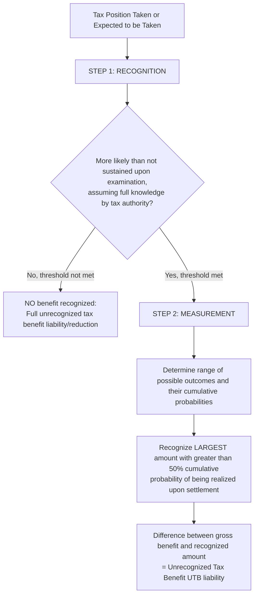

## Uncertain Tax Positions

### Overview

Uncertain tax positions (UTPs) arise when there is uncertainty regarding whether a tax position taken (or expected to be taken) in a tax return will ultimately be sustained upon examination by taxing authorities. ASC 740-10-25 establishes a **two-step recognition and measurement model** specifically for evaluating and accounting for the financial statement effects of uncertain tax positions — a framework distinct from, though related to, the deferred tax asset valuation allowance model.

### Regulatory Framework

- **ASC 740-10-25-6 through 25-14** (Recognition)
- **ASC 740-10-30-7 through 30-18** (Measurement)
- **ASC 740-10-40** (Derecognition)
- **IAS 12** / **IFRIC 23** (Uncertainty over Income Tax Treatments) — International, using a somewhat different "probable" threshold and expected value/most likely amount measurement approach, creating notable divergence from US GAAP's more rules-based two-step model.

### The Two-Step Model

**Key Points**

$$\text{Recognized UTP Benefit} = \begin{cases} \text{Largest amount} > 50\% \text{ cumulative probability of being sustained} & \text{if Step 1 recognition threshold met} \\ 0 & \text{otherwise} \end{cases}$$

#### Step 1: Recognition

The entity determines whether it is **more likely than not** (a likelihood of more than 50%) that a tax position will be **sustained upon examination**, based on the technical merits of the position, **assuming the taxing authority has full knowledge of all relevant information** (i.e., detection risk is explicitly **not** a factor in the recognition assessment — this is a frequently tested nuance).

- If the **more-likely-than-not** threshold **is met** → proceed to Step 2 (Measurement).
- If the threshold **is not met** → **no benefit is recognized** in the financial statements (the full tax benefit associated with the position is not recorded, resulting in a liability for unrecognized tax benefits or a reduction of a related deferred tax asset/NOL carryforward, as applicable).

#### Step 2: Measurement

For positions that meet the Step 1 recognition threshold, the tax benefit is measured as the **largest amount of benefit that is greater than 50% likely of being realized upon ultimate settlement** with the taxing authority, presuming full knowledge of all relevant facts — this is effectively a **cumulative probability assessment across a range of possible outcomes**, not simply the single most likely outcome.

### Key Conceptual Distinctions

**Key Points**

1. **Detection risk is irrelevant** at Step 1 — the entity must assume the tax authority will examine the position and have full knowledge of all relevant facts, regardless of the actual likelihood of audit or discovery. This prevents entities from taking aggressive positions simply because they judge the position unlikely to be audited.
2. **"More likely than not" (Step 1) is a different concept from "largest amount > 50% likely" (Step 2)** — Step 1 is a binary threshold gate (either the position clears the bar or it doesn't); Step 2 is a **measurement exercise** across a probability-weighted range of potential settlement outcomes, even for positions that cleared Step 1.
3. This differs conceptually from the **valuation allowance** standard for deferred tax assets, which evaluates the likelihood of having sufficient **future taxable income** to utilize an asset — UTP evaluation instead assesses the technical sustainability of a position **already taken or expected to be taken** on a filed return.

### Unrecognized Tax Benefits (UTB) and the Liability

The difference between the **gross tax benefit** claimed (or to be claimed) on the tax return and the **amount recognized** under the two-step model is the **unrecognized tax benefit (UTB)**, generally presented as a liability (or, in certain circumstances, netted against a related deferred tax asset or NOL/credit carryforward per ASC 740-10-45-10A through 45-11 when specific offsetting criteria are met — a 2013 ASU clarification that resolved significant diversity in practice).

$$\text{Unrecognized Tax Benefit (UTB)} = \text{Gross Tax Benefit Claimed} - \text{Recognized Benefit (per Two-Step Model)}$$

### Interest and Penalties

Interest on underpayments related to unrecognized tax benefits is accrued beginning in the period the interest would begin accruing under the relevant tax law, generally as a component of **income tax expense** (though an entity may elect, as an accounting policy, to classify interest and penalties outside of income tax expense — e.g., within interest expense and operating expense, respectively — with consistent application and disclosure of the election).

### Changes in Judgment and Subsequent Events

A previously recognized (or unrecognized) tax benefit is **reassessed** each reporting period based on new information. Changes may result from:

- **Expiration of the statute of limitations** for a particular tax year, generally resulting in full recognition of the previously unrecognized benefit at that time.
- **Settlement with the taxing authority** — the position is remeasured/derecognized based on the actual terms reached.
- **New information** that clarifies or changes the technical merits assessment (e.g., a court decision on a similar issue, new administrative guidance).

A change in judgment is **not** treated as a correction of an error (unless it relates to information that existed and should have been considered in a prior period) — it is generally recognized in the period the change in judgment occurs.

### Example: Step 1 Fails — Aggressive R&D Credit Position

**Example**

A manufacturing company claims a $2,000,000 R&D tax credit for activities that, upon careful technical review by tax counsel, are assessed to have only a **35% likelihood** of being sustained upon IRS examination (assuming full IRS knowledge of the facts) — the qualifying nature of the activities is genuinely uncertain under current regulations.

**Analysis**:

- Step 1 (Recognition): 35% likelihood is **below** the more-likely-than-not (>50%) threshold.
- **Conclusion**: **No benefit is recognized** in the financial statements. The full $2,000,000 gross credit claimed on the tax return is treated as an **unrecognized tax benefit**, recorded as a liability (or netted against a related deferred tax asset, if applicable) — the position provides **no financial statement benefit** despite being claimed on the filed tax return, until and unless the assessment changes or the statute of limitations expires.

### Example: Step 1 Passes, Step 2 Measurement Applied — Transfer Pricing Position

**Example**

A multinational company takes a transfer pricing position resulting in a $10,000,000 tax benefit. Tax counsel assesses this as **65% likely** to be sustained in full upon examination (clearing the Step 1 more-likely-than-not threshold). However, in evaluating the **range of possible settlement outcomes** for Step 2 measurement:

| Possible Outcome | Benefit Amount | Individual Probability | Cumulative Probability |
| --- | --- | --- | --- |
| Full benefit sustained | $10,000,000 | 40% | 40% |
| Partial settlement | $7,000,000 | 30% | 70% |
| Further reduced settlement | $4,000,000 | 20% | 90% |
| Position fully disallowed | $0 | 10% | 100% |

**Analysis**:

- Step 1: Combined probability of the position being sustained (in full or in part, i.e., not fully disallowed) is 90% (100% − 10%), which is used to assess whether the position clears the more-likely-than-not threshold for at least some benefit — **threshold met**.
- Step 2: Identify the **largest amount** with a **cumulative probability greater than 50%**. Working down from full benefit: $10,000,000 (40% cumulative) does not exceed 50%; $7,000,000 (70% cumulative) **does** exceed 50%.
- **Recognized benefit**: **$7,000,000** (the largest amount with >50% cumulative probability of being realized).
- **Unrecognized tax benefit (UTB) liability**: $10,000,000 − $7,000,000 = **$3,000,000**.

### Forensic Accounting Considerations

**Output**

Uncertain tax position accounting is a specialized but significant area of financial statement fraud risk, given its technical complexity and reliance on legal/tax judgment that is often opaque to financial statement users:

- **Understated UTB liabilities**: Failing to properly identify and evaluate aggressive tax return positions under the two-step model, understating the unrecognized tax benefit liability and overstating net income — often uncovered only through IRS examination results that reveal previously unrecognized exposure.
- **Improper reliance on detection risk**: Implicitly (and improperly) factoring in a low likelihood of audit/detection when assessing the "more likely than not" threshold, contrary to the explicit requirement to assume full knowledge by the taxing authority.
- **Manipulated probability distributions**: Constructing an artificially favorable range of possible settlement outcomes in the Step 2 measurement analysis to support recognition of a larger benefit than genuinely supportable, particularly for complex, negotiated positions like transfer pricing.
- **Premature or unsupported UTB reversals**: Recognizing a previously unrecognized tax benefit (reducing the UTB liability, boosting net income) based on a change in judgment that is not adequately supported by new information or genuine legal/technical developments — timed to coincide with earnings targets.
- **Statute of limitations gamesmanship**: Manipulating the timing of positions or amended returns to accelerate or delay the recognition benefit associated with statute of limitations expirations for financial reporting purposes.
- **Inconsistent interest/penalty accounting policy application**: Selectively changing the classification or calculation of accrued interest/penalties on UTBs to manage the presentation of income tax expense versus other expense categories.
- **Undisclosed material uncertain positions**: Omitting or understating disclosure of significant uncertain tax positions reasonably possible of significant change within the next twelve months, as required by ASC 740-10-50-15, depriving users of material information about potential future earnings volatility.

### Disclosure Requirements

ASC 740-10-50-15 through 50-15A require a **tabular reconciliation** of the total amounts of unrecognized tax benefits at the beginning and end of the period, the total amount that, if recognized, would affect the effective tax rate, and disclosure of positions for which it is **reasonably possible** that the total unrecognized tax benefits will significantly change within twelve months, along with a description of open tax years by major jurisdiction.

### Related Topics

- Deferred tax asset and liability recognition
- Valuation allowances and realizability assessments
- Effective tax rate reconciliation and disclosure analysis
- Business combinations: deferred tax accounting in purchase accounting
- Transfer pricing documentation and forensic review
- Statute of limitations analysis by jurisdiction
- IFRIC 23 and international convergence gaps in uncertain tax position accounting
- Forensic indicators of understated tax contingency liabilities