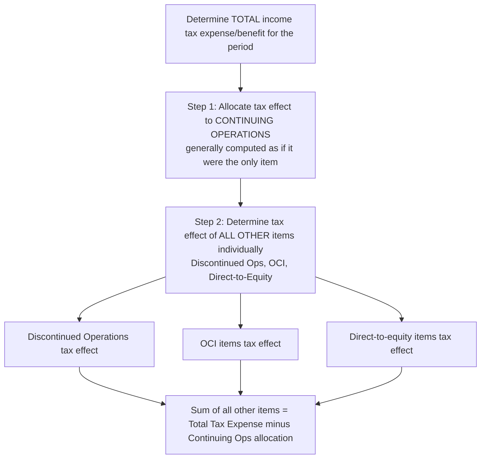

## Intraperiod Tax Allocation

### Overview

Intraperiod tax allocation is the process of allocating an entity's **total income tax expense or benefit for a period** among the various components of the financial statements that gave rise to it — continuing operations, discontinued operations, other comprehensive income (OCI), and items charged or credited directly to equity. Unlike interperiod allocation (deferred taxes, addressed elsewhere), intraperiod allocation addresses **where within the current period's financial statements** the tax effect is presented, not when it is recognized.

### Regulatory Framework

- **ASC 740-20** (Intraperiod Tax Allocation)
- **ASC 220-10-45** (Comprehensive Income — presentation interaction)
- **IAS 12, paragraphs 61A–65** (International — a broadly similar allocation principle, though with some differences in specific mechanics)

### The Allocation Categories

**Key Points**

Total income tax expense/benefit for the period is allocated among:

1. **Income (loss) from continuing operations**
2. **Discontinued operations** (net of tax presentation)
3. **Other comprehensive income (OCI)** items (e.g., unrealized gains/losses on available-for-sale debt securities, foreign currency translation adjustments, certain pension adjustments)
4. **Items charged or credited directly to equity** (e.g., certain stock-based compensation adjustments, cumulative effect of accounting changes recognized in equity, quasi-reorganizations)

$$\text{Total Tax Expense/Benefit} = \text{Tax on Continuing Ops} + \text{Tax on Discontinued Ops} + \text{Tax on OCI Items} + \text{Tax on Direct-to-Equity Items}$$

### The "With-and-Without" Method

**Key Points**

The general allocation approach requires determining the tax effect of **each item** by comparing income tax expense/benefit calculated **with** and **without** that item, applied in a specified sequence:

1. First, determine the tax effect related to **continuing operations** — generally computed as if it were the **only item** present (i.e., the tax provision that would result from continuing operations income/loss alone, applying all other necessary adjustments such as changes in judgment about valuation allowances or other tax positions that relate to continuing operations).
2. The tax effects of **all other items** (discontinued operations, OCI, equity) are then determined **individually**, using the incremental effect of including each item, generally **without regard to the effects of other such items** — but net operating losses and other tax attributes require careful ordering, and the sum of the individually-computed tax effects of all other items must equal the residual after removing the amount allocated to continuing operations.

$$\text{Tax Effect of Item}_i = \text{Tax Expense (with Item}_i\text{ included)} - \text{Tax Expense (without Item}_i\text{)}$$

### The Exception: Items Recognized Entirely in Continuing Operations

**Key Points**

ASC 740-10-45-15 and ASC 740-20-45-3 identify specific circumstances where the general "with-and-without" allocation is **overridden**, and the tax effect is recognized **entirely within continuing operations**, regardless of where the originating item was recognized:

1. **Changes in tax laws or rates** — the effect of a change in enacted tax rates (or other tax law changes) on **existing** deferred tax balances is recognized entirely in income from continuing operations, even if the underlying deferred tax balances originally arose from an item in OCI or equity (this is the "backwards tracing" prohibition — pre-ASU 2018-02 practice required a form of backwards tracing for certain OCI-originated items, but current guidance under ASC 740-20-45-11 through 45-12 generally prohibits it except in narrow cases).
2. **Changes in judgment about valuation allowances** related to deferred tax assets that were originally recognized in a source **other than continuing operations** in a prior year — under current guidance, this is also generally recognized in continuing operations, similarly reflecting the prohibition on backwards tracing established by ASU 2018-02.
3. Certain **other specific exceptions** identified in the codification.

**[Inference]** The 2018 ASU 2018-02 amendment (issued in response to the 2017 Tax Cuts and Jobs Act) specifically addressed "stranded tax effects" in accumulated OCI resulting from the federal rate change, and separately prohibited backwards tracing for most subsequent changes in judgment — this is a frequently tested area of recent standard-setting history relevant to intraperiod allocation mechanics.

### Discontinued Operations

The tax effect allocated to discontinued operations includes the tax on the **operating results** of the discontinued component for the period, as well as the tax effect of any **gain or loss on disposal**, presented net of tax within the discontinued operations line item per ASC 205-20. This requires computing what the incremental tax effect of the discontinued operations activity was, isolated from continuing operations.

### Items Recognized in OCI

Tax effects of items recognized in OCI are presented within OCI itself (either net of tax with a separate disclosure of the tax effect, or gross with a separate line for the aggregate tax effect, per ASC 220-10-45-12). Common OCI items requiring intraperiod allocation:

- Unrealized gains/losses on **available-for-sale debt securities**
- **Foreign currency translation adjustments**
- Certain **pension and other postretirement benefit** actuarial gains/losses and prior service cost adjustments
- Effective portions of **cash flow hedge** gains/losses

### Example: Basic Allocation — Continuing Operations and Discontinued Operations

**Example**

A company has pretax income from continuing operations of $10,000,000 and pretax income from discontinued operations of $2,000,000 (including a $500,000 gain on disposal). The applicable combined statutory tax rate is 25%, and there are no other complicating factors (no OCI items, no changes in judgment, no valuation allowance considerations).

**Step 1 — Continuing Operations** (computed as if the only item present):

$$\text{Tax on Continuing Operations} = \$10{,}000{,}000 \times 25\% = \$2{,}500{,}000$$

**Step 2 — Discontinued Operations** (incremental effect of including this item):

$$\text{Tax on Discontinued Operations} = \$2{,}000{,}000 \times 25\% = \$500{,}000$$

**Presentation**:

| Line Item | Pretax Amount | Tax Effect | After-Tax Amount |
| --- | --- | --- | --- |
| Income from continuing operations | $10,000,000 | ($2,500,000) | $7,500,000 |
| Income from discontinued operations | $2,000,000 | ($500,000) | $1,500,000 |
| **Total** | **$12,000,000** | **($3,000,000)** | **$9,000,000** |

### Example: Rate Change Effect — Continuing Operations Exception Applied

**Example**

A company has an accumulated OCI balance related to unrealized gains on available-for-sale debt securities, with an associated **deferred tax liability** of $1,050,000 (based on a 21% enacted rate on a $5,000,000 unrealized gain). During the current year, a new tax law is enacted, **increasing** the enacted rate to 25%, effective immediately. The company also has $8,000,000 of pretax income from continuing operations in the current year (unrelated to the rate change).

**Analysis**:

- **Remeasurement of the existing OCI-related deferred tax liability**: $5,000,000 × (25% − 21%) = **$200,000 additional deferred tax liability**.
- **Despite originating from an OCI item**, per the continuing operations exception (ASC 740-10-45-15), this **$200,000 remeasurement effect is recognized in income tax expense within continuing operations** — **not** in OCI, even though the underlying temporary difference relates to an OCI-originated item. This creates a temporary "disconnect" (a stranded tax effect) between the OCI balance (still reflecting the old 21% rate basis until the security is sold/the gain is otherwise recognized) and the continuing operations tax provision, which is precisely the phenomenon ASU 2018-02 allowed certain companies to elect to reclassify in the specific context of the 2017 rate change.
- **Tax on continuing operations**: ($8,000,000 × 25%) + $200,000 rate-change remeasurement = $2,000,000 + $200,000 = **$2,200,000**.

### Forensic Accounting Considerations

**Output**

Intraperiod tax allocation, while primarily a presentation matter (total tax expense is unaffected), creates specific manipulation and error risks related to **where** tax effects are reported — which can materially affect key metrics like income from continuing operations, a figure closely watched by analysts and often used in covenant and compensation calculations:

- **Improper backwards tracing**: Inappropriately allocating tax effects (particularly rate change remeasurements or valuation allowance judgment changes) to OCI or equity when current guidance requires continuing operations recognition, in order to **inflate reported income from continuing operations** by pushing an unfavorable tax effect "below the line" into OCI where it receives less analyst scrutiny.
- **Manipulating the "with-and-without" sequencing**: Incorrectly computing the tax effect allocated to continuing operations in a way that shifts a disproportionate share of a favorable or unfavorable tax effect to a less-scrutinized category (discontinued operations, OCI) to manage the continuing operations effective tax rate — a key metric in earnings analysis.
- **Discontinued operations tax effect manipulation**: Allocating an inappropriately low tax expense to discontinued operations (inflating the after-tax gain on disposal presented in that separately-disclosed, often "non-core" line item) while correspondingly inflating tax expense in continuing operations — or the reverse, depending on which metric management wishes to present more favorably.
- **Stranded tax effects mismanagement**: Failing to appropriately track and disclose "stranded" tax effects in AOCI following a rate change, misleading users about the composition and quality of accumulated OCI balances.
- **Inconsistent treatment of valuation allowance changes**: Misapplying the exception for valuation allowance judgment changes related to prior OCI/equity-originated deferred tax assets, allocating the effect to the wrong category to manage continuing operations effective tax rate optics.

### Disclosure Requirements

ASC 740-20-50 requires disclosure of the allocation of total income tax expense/benefit among continuing operations, discontinued operations, OCI, and equity, along with the specific components; ASC 220-10-45 requires disclosure of the tax effects allocated to each component of OCI, either on the face of the statement or in the notes.

### Related Topics

- Deferred tax asset and liability recognition
- Valuation allowances and realizability assessments
- Uncertain tax positions
- Effective tax rate reconciliation and disclosure analysis
- Discontinued operations presentation under ASC 205-20
- Accumulated other comprehensive income (AOCI) components and reclassification
- ASU 2018-02 and stranded tax effects from the 2017 Tax Cuts and Jobs Act
- Forensic indicators of continuing operations tax rate manipulation