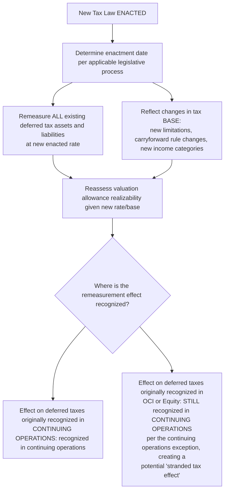

## Accounting for Changes in Tax Law

### Overview

When new tax legislation is **enacted**, ASC 740 requires entities to recognize the effect of the change in the financial statements **in the period of enactment**, not the period the law becomes effective (if different) and not on a prospective/anticipatory basis before enactment. This topic addresses the mechanics of accounting for enacted tax law changes, including rate changes, base-broadening provisions, and other structural tax reforms — a recurring, high-stakes application area given the frequency of significant U.S. and international tax legislation.

### Regulatory Framework

- **ASC 740-10-25-47 through 25-48** (Recognition upon enactment)
- **ASC 740-10-35-4** (Remeasurement of deferred taxes for rate/law changes)
- **ASC 740-10-45-15** (Continuing operations exception for rate/law change effects)
- **IAS 12, paragraph 47** (International — deferred taxes measured at rates enacted or **substantively enacted** by the balance sheet date, a notably **broader** threshold than US GAAP's stricter "enacted" standard)

### The "Enactment" Threshold

**Key Points**

Under US GAAP, a tax law change is recognized only upon **enactment** — the specific point at which a bill becomes law (generally, in the U.S. federal context, upon the President's signature, or upon a legislative override of a veto). Recognition **cannot** be based on:

- Anticipated or probable future legislation, no matter how likely passage may seem.
- Passage by one legislative chamber (e.g., House passage without Senate passage and presidential signature, in the U.S. context).
- Legislative proposals or "framework" agreements not yet enacted into law.

$$\text{Recognition Date} = \text{Date of Enactment} \neq \text{Effective Date of the Law (if later)}$$

**[Inference]** This creates a notable divergence from IFRS, which permits recognition upon "substantive enactment" — a lower threshold that can occur before final enactment in certain legislative systems (e.g., when only a formality remains). This is a frequently tested US GAAP/IFRS comparative point, and multinational entities reporting under both frameworks may recognize the same legislative change in **different reporting periods**.

### What Gets Remeasured

Upon enactment of a new tax law (whether a rate change, a change in the tax base, or both), an entity:

1. **Remeasures all existing deferred tax assets and liabilities** to reflect the **new enacted rate(s)** expected to apply when temporary differences reverse.
2. Reflects any changes in the **tax base** itself (i.e., new limitations on deductions, new categories of income, changes to NOL/credit carryforward rules) in the computation of both current and deferred tax balances.
3. Reassesses the **valuation allowance** as of the enactment date, since a change in future tax rates or the tax base can affect the realizability analysis for existing deferred tax assets (e.g., a rate reduction lowers the dollar value of future tax benefits, which by itself doesn't directly affect realizability likelihood, but changes to the tax base might affect projected future taxable income).

$$\Delta \text{Deferred Tax Balance} = \text{Temporary Difference} \times (\text{New Enacted Rate} - \text{Prior Enacted Rate})$$

### Recognition Location: The Continuing Operations Exception

**Key Points**

Per ASC 740-10-45-15, the **entire effect** of a tax law/rate change on existing deferred tax balances is recognized within **income tax expense from continuing operations** in the period of enactment — **regardless of where the underlying deferred tax balance originally arose** (even if it originated in OCI, discontinued operations, or equity). This is a deliberate, specific exception to the general intraperiod "with-and-without" allocation principle, justified on the basis that the rate change itself is an event of the current period unrelated to the character of the original transaction.

### Stranded Tax Effects

**Key Points**

Because rate change remeasurement flows entirely through continuing operations, but the **original** deferred tax balance may sit within **accumulated other comprehensive income (AOCI)**, a rate change can create a **stranded tax effect** — a mismatch where the AOCI balance continues to reflect tax computed at the **old** rate, while the income statement (continuing operations) has already absorbed the effect of the **new** rate. This mismatch remains in AOCI until the underlying item (e.g., the available-for-sale security or the pension plan) is ultimately settled, sold, or otherwise recognized in earnings.

**ASU 2018-02** (issued following the 2017 Tax Cuts and Jobs Act's federal rate reduction from 35% to 21%) provided a **one-time election** allowing entities to reclassify these specific stranded tax effects from AOCI to retained earnings, though this election did **not** change the general prohibition on backwards tracing for future rate changes — it addressed only the specific historical stranding created by that particular, unusually large rate change.

### Multi-Element Tax Reform: Rate Changes vs. Base-Broadening Provisions

**[Inference]** Major tax reform legislation frequently combines a **rate change** with numerous **base-broadening or -narrowing provisions** (e.g., changes to depreciation rules, interest expense limitations, new minimum tax regimes, international provisions like GILTI/FDII/BEAT introduced by the 2017 Act). Each distinct provision must generally be analyzed separately for its effective date, its effect on temporary vs. permanent differences, and its interaction with existing deferred tax balances — a highly complex undertaking for multinational entities that is a common source of restatement risk in the periods immediately following major tax legislation.

### Example: Federal Rate Reduction — Remeasurement of Deferred Tax Liability

**Example**

A company has an existing net deferred tax liability of $4,200,000 (computed at a 35% rate on $12,000,000 of net taxable temporary differences, primarily accelerated depreciation) as of the beginning of the year in which new legislation is enacted, reducing the federal corporate rate from 35% to 21%, effective for tax years beginning after the enactment date.

**Analysis**:

- **Remeasured DTL**: $12,000,000 × 21% = $2,520,000.
- **Remeasurement benefit (reduction in DTL)**: $4,200,000 − $2,520,000 = **$1,680,000 benefit**.
- Because this is a reduction in a liability, it results in a **deferred tax benefit** of $1,680,000, recognized entirely within **continuing operations** income tax expense/benefit in the period of enactment — even though the underlying temporary differences relate entirely to depreciable PP&E used in ordinary operations (in this example there's no stranded effect issue since the source is entirely continuing operations-related).

### Example: Stranded Tax Effect from a Rate Change

**Example**

A company has $3,000,000 of accumulated unrealized gains on available-for-sale debt securities within AOCI, with an associated deferred tax liability of $1,050,000 (computed at the prior 35% rate). New legislation reduces the enacted rate to 21%.

**Analysis**:

- **Remeasured DTL**: $3,000,000 × 21% = $630,000.
- **Remeasurement benefit**: $1,050,000 − $630,000 = **$420,000 benefit**, recognized in continuing operations income tax expense (per the exception) — **not** in OCI.
- **Resulting stranded effect**: The AOCI balance for the unrealized gain remains presented **net of the original $1,050,000 (35%-rate) deferred tax**, while the income statement has already benefited from the $420,000 rate-change remeasurement. This creates a $420,000 "stranded" tax effect embedded in AOCI, disconnected from the current 21% rate basis, that will only unwind when the securities are ultimately sold and the gain (along with its associated, now-lower, tax effect) flows through earnings.
- Under **ASU 2018-02** (if elected, and if this scenario paralleled the 2017 Act's specific circumstances), the company could have elected to reclassify this $420,000 stranded effect from AOCI directly to retained earnings — but absent such an election (or for a rate change occurring outside that specific historical context, where no comparable election currently exists), the stranding remains until natural reversal.

### Forensic Accounting Considerations

**Output**

Accounting for tax law changes, given its frequently large-dollar and singular (non-recurring) nature, creates specific manipulation risks around the **timing** and **completeness** of recognition:

- **Premature recognition before enactment**: Recognizing the anticipated effect of pending legislation before it is actually enacted (e.g., based on a "highly likely to pass" assessment), improperly accelerating a tax benefit or avoiding recognition of an unfavorable effect into a future period — a clear violation of the enactment threshold.
- **Delayed recognition after enactment**: Failing to recognize the effect of a law change in the period of actual enactment, deferring an unfavorable remeasurement effect to a later, more convenient reporting period — a cutoff violation.
- **Incomplete remeasurement scope**: Failing to identify and remeasure **all** affected deferred tax balances across all jurisdictions and legal entities (particularly in complex multinational structures), resulting in an incomplete and understated (or overstated) remeasurement effect.
- **Misapplication of the continuing operations exception**: Incorrectly routing rate-change remeasurement effects to OCI or equity (improper backwards tracing) rather than continuing operations, to avoid negatively impacting the continuing operations effective tax rate — a specific violation of ASC 740-10-45-15.
- **Manipulated valuation allowance reassessment**: Using a tax law change as a pretext to make an unsupported, favorable change in valuation allowance judgment (e.g., claiming the new law's base-broadening provisions somehow improve DTA realizability without genuine analytical support) to manufacture an additional one-time benefit beyond the legitimate rate remeasurement.
- **Understated one-time transition tax or minimum tax liabilities**: In connection with major international tax reform (e.g., historical transition/repatriation taxes, or minimum tax regimes), understating the computed liability through aggressive or unsupported technical positions — often layering into uncertain tax position considerations as well.
- **Improper stranded tax effect reclassification**: Applying an ASU 2018-02-style AOCI reclassification election inconsistently, retroactively, or to circumstances the specific guidance does not cover, to manage the AOCI/retained earnings presentation favorably.

### Disclosure Requirements

Entities must disclose the nature and financial statement effect of significant enacted tax law changes, including the impact on the effective tax rate reconciliation (ASC 740-10-50-12), and, where material, discuss the effects in MD&A — SEC guidance has historically emphasized timely and complete disclosure following major tax legislation (e.g., specific SEC staff guidance, such as SAB 118, that provided a **measurement period** for entities to complete the accounting for the income tax effects of the 2017 Tax Cuts and Jobs Act when initial estimates were incomplete at the time of enactment-period reporting).

### Related Topics

- Deferred tax asset and liability recognition
- Valuation allowances and realizability assessments
- Intraperiod tax allocation and the continuing operations exception
- Uncertain tax positions
- ASU 2018-02 and reclassification of stranded tax effects
- SAB 118 measurement period accounting for incomplete tax reform analysis
- International tax provisions: GILTI, FDII, BEAT, and minimum tax regimes
- Forensic indicators of tax law change recognition timing manipulation