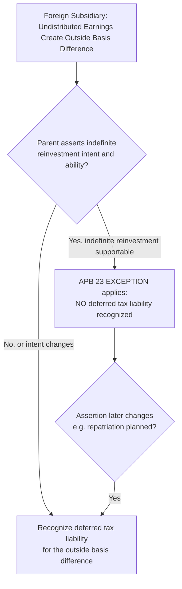
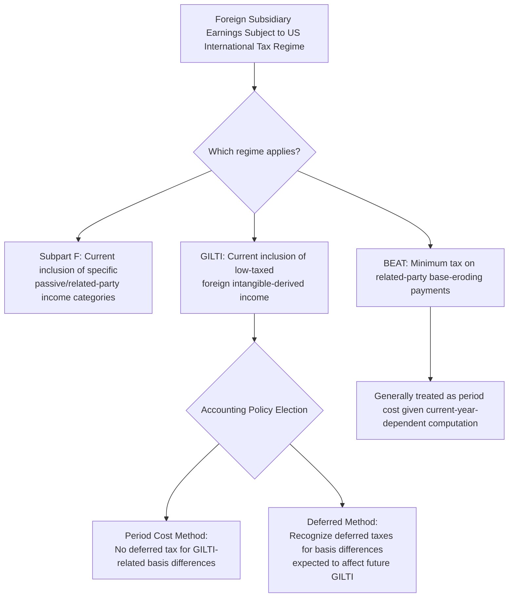

## Multinational and Cross-Border Tax Considerations

### Overview

Multinational entities face additional layers of complexity in applying ASC 740 across multiple tax jurisdictions, including outside basis differences in foreign subsidiaries, the U.S. international tax regime (GILTI, FDII, BEAT, Subpart F), foreign tax credit mechanics, and the interaction of transfer pricing with uncertain tax positions. This topic synthesizes these cross-border-specific extensions of the core deferred tax and uncertain tax position frameworks already covered.

### Regulatory Framework

- **ASC 740-30** (Other Considerations — Outside Basis Differences, formerly APB 23)
- **ASC 740-10-25** (applied jurisdiction-by-jurisdiction for foreign uncertain tax positions)
- **IAS 12, paragraphs 38–45** (Investments in subsidiaries, branches, associates, and joint ventures — the international parallel to the APB 23 outside basis framework, with some differences in the indefinite reversal criteria)

### Outside Basis Differences: The APB 23 Exception

**Key Points**

An **outside basis difference** is the difference between the **book carrying value** of an investment in a subsidiary (as reported in the parent's consolidated financial statements) and the parent's **tax basis** in that investment (generally, cost, adjusted for subsequent events under applicable tax law) — distinct from **inside basis differences**, which are the temporary differences within the subsidiary's own assets and liabilities.

$$\text{Outside Basis Difference} = \text{Book Carrying Value of Investment} - \text{Tax Basis of Investment}$$

The **APB 23 exception**, codified in ASC 740-30-25-3, provides that a deferred tax liability is **not required** to be recognized for outside basis differences related to **undistributed earnings of a foreign subsidiary** (or corporate joint venture) if the parent has demonstrated the intent and ability to **indefinitely reinvest** those earnings, such that the temporary difference is not expected to reverse in the foreseeable future.

### The Indefinite Reversal Criteria and Documentation

**Key Points**

To support the indefinite reinvestment assertion, an entity should have **specific plans** for reinvestment of undistributed earnings that demonstrate the earnings will not be remitted in the foreseeable future — courts and auditors generally look for evidence such as documented reinvestment plans (capital expenditure plans, working capital needs, acquisition financing in the foreign jurisdiction) rather than a bare, undocumented assertion. If the entity cannot demonstrate sufficient evidence to support indefinite reversal, the exception is **not** available, and a deferred tax liability must be recognized for the full outside basis difference.

**[Inference]** In practice, this documentation requirement is a frequent area of audit and forensic scrutiny, since the assertion is inherently forward-looking and subjective, and companies have historically faced restatement or enforcement risk when the assertion was found to be unsupported by contemporaneous evidence.

### Impact of U.S. International Tax Reform (Post-2017)

**[Inference]** The 2017 U.S. Tax Cuts and Jobs Act fundamentally altered the international tax landscape, and while the APB 23 exception mechanically remains in the codification, its practical significance for **U.S.-based multinationals** has been reduced in certain respects because:

- The shift to a **modified territorial system** with a **participation exemption** (dividends received deduction under IRC Section 245A) means many future actual cash repatriations of foreign earnings no longer trigger incremental U.S. federal income tax on the dividend itself (though withholding taxes and state tax consequences may still apply, and outside basis differences related to items other than U.S. federal tax — e.g., state taxes, foreign withholding taxes on distribution — may still require deferred tax recognition even where the federal outside basis difference does not).
- However, outside basis differences can still exist and require careful analysis for items such as **foreign currency translation adjustments** embedded in the outside basis, and for withholding taxes that would apply upon an actual distribution.

### GILTI, FDII, BEAT, and Subpart F — Accounting Policy Elections

**Key Points**

Several U.S. international tax regimes interact directly with deferred tax accounting:

- **Subpart F income** and **GILTI (Global Intangible Low-Taxed Income)**: Both result in current U.S. taxation of certain foreign subsidiary earnings, regardless of actual distribution. A significant accounting policy question is whether to treat GILTI as a **period cost** (recognizing the tax as incurred, with no deferred tax effect for temporary differences that will affect future GILTI computations) or to recognize **deferred taxes** for basis differences expected to affect future GILTI inclusions (the "deferred method"). ASC 740-10-25-51 through 25-52 permits an accounting policy election, applied consistently.
- **FDII (Foreign-Derived Intangible Income)**: A deduction (not directly creating deferred tax complexity in the same way as GILTI) that reduces the effective rate on certain export-related income — primarily affects current tax expense and the effective tax rate reconciliation rather than creating a distinct deferred tax framework.
- **BEAT (Base Erosion and Anti-Abuse Tax)**: A minimum tax on certain related-party payments; because BEAT liability depends on the interaction of numerous current-year factors, it is generally accounted for as a **period cost** when incurred, similar to GILTI's period-cost election, though it can create complexity in effective tax rate reconciliation presentation.

$$\text{GILTI Policy Election}: \text{Period Cost Method} \; \text{OR} \; \text{Deferred Method (basis differences recognized)}$$

### Foreign Tax Credits and Valuation Allowance Interaction

Foreign tax credit (FTC) carryforwards are a **deferred tax asset**, subject to the same **valuation allowance realizability analysis** as any other carryforward — requiring an assessment of whether sufficient future foreign-source taxable income (within applicable FTC limitation categories/baskets) will be generated to utilize the credits before expiration. The U.S. FTC limitation basket system (e.g., separate baskets for GILTI, passive category income, general category income) requires **basket-by-basket** realizability analysis, adding complexity beyond a single consolidated analysis.

### Transfer Pricing and Uncertain Tax Positions

Cross-border transfer pricing arrangements between related entities are a frequent source of **uncertain tax positions**, since transfer pricing methodologies (arm's-length pricing for intercompany transactions) inherently involve judgment and are subject to differing interpretations by tax authorities in different jurisdictions. This creates:

- Risk of **double taxation** if two jurisdictions both assert taxing rights over the same income (one jurisdiction increases taxable income via a transfer pricing adjustment, without a corresponding correlative adjustment/relief in the counterparty jurisdiction).
- The two-step UTP recognition and measurement model applies **on a jurisdiction-by-jurisdiction basis**, requiring separate technical merit and measurement analysis for the position as asserted in each relevant country.
- **Advance Pricing Agreements (APAs)** with tax authorities can provide additional certainty and evidence supporting the technical merits assessment for UTP purposes, once executed.

### Example: APB 23 Exception Applied — Then Reversed

**Example**

A U.S. parent has $50,000,000 of undistributed earnings in a foreign subsidiary, with an outside basis difference of $50,000,000 relative to the subsidiary's book carrying value (assume the tax basis is de minimis). The parent has historically asserted indefinite reinvestment, supported by documented plans to fund a foreign manufacturing expansion, and has not recognized any deferred tax liability on this outside basis difference.

**Year 1 (APB 23 exception applies)**:

- No deferred tax liability recognized, despite the $50,000,000 outside basis difference, based on the documented indefinite reinvestment assertion.

**Year 3 (change in circumstances)**:

- The parent's board approves a plan to repatriate $20,000,000 of the foreign earnings to fund a domestic acquisition, undermining the previous indefinite reinvestment assertion **for that portion**.
- **Analysis**: The parent must recognize a deferred tax liability for the portion of the outside basis difference **no longer supported** by the indefinite reinvestment assertion — i.e., the $20,000,000 planned repatriation, computed considering applicable foreign withholding taxes and any residual U.S. state tax effects (assuming no incremental U.S. federal tax applies under the post-2017 participation exemption regime).
- The remaining $30,000,000 outside basis difference continues to qualify for the APB 23 exception if the indefinite reinvestment assertion remains supportable for that remaining amount.

### Forensic Accounting Considerations

**Output**

Multinational tax accounting presents some of the most complex and least transparent areas of financial reporting, creating significant fraud and earnings management opportunities:

- **Unsupported indefinite reinvestment assertions**: Asserting indefinite reinvestment under APB 23 without genuine, contemporaneously documented plans, to avoid recognizing a material deferred tax liability — a historically common area of SEC enforcement and restatement, particularly when subsequent actual repatriations reveal the original assertion lacked a credible basis.
- **Profit shifting via transfer pricing**: Structuring intercompany transfer pricing arrangements to shift profits to low-tax jurisdictions without genuine economic substance, creating both tax exposure (uncertain tax positions) and potential financial statement fraud risk if the arrangements are not properly evaluated and disclosed.
- **GILTI/BEAT policy election gaming**: Selectively choosing (or inconsistently applying) the period-cost vs. deferred method election for GILTI to manage the timing and pattern of tax expense recognition across periods in a way that doesn't reflect genuine accounting policy consistency.
- **Foreign tax credit realizability overstatement**: Overstating the realizability of foreign tax credit carryforwards without adequately considering basket limitations and genuine forecasts of foreign-source taxable income by category, understating necessary valuation allowances.
- **Jurisdiction-shopping for uncertain tax position technical merits**: Selectively applying a favorable technical merits analysis in one jurisdiction while ignoring less favorable precedent or guidance in a similar cross-border fact pattern elsewhere, without adequate jurisdiction-specific support.
- **Undisclosed related-party cross-border financing arrangements**: Structuring intercompany loans, royalties, or cost-sharing arrangements to manage the effective tax rate or shift earnings between reporting periods and jurisdictions without adequate disclosure of the arrangements' nature and terms.
- **Incomplete outside basis difference identification**: Failing to identify and evaluate all foreign subsidiaries with outside basis differences (a completeness risk, particularly in complex, multi-tier holding structures), resulting in an incomplete deferred tax liability assessment across the consolidated group.

### Disclosure Requirements

ASC 740-30-50-2 requires disclosure of the amount of undistributed earnings for which no deferred tax liability has been recognized under the APB 23 exception (or a statement that determination of the unrecognized deferred tax liability is not practicable), along with general effective tax rate reconciliation disclosures that typically present the effect of foreign operations, GILTI, FDII, and other international provisions as reconciling items between the statutory and effective rates.

### Related Topics

- Deferred tax asset and liability recognition
- Valuation allowances and realizability assessments
- Uncertain tax positions
- Intraperiod tax allocation
- Accounting for changes in tax law
- Effective tax rate reconciliation and disclosure analysis
- Consolidation and variable interest entities under ASC 810 (interaction with foreign subsidiary structures)
- Forensic indicators of cross-border profit shifting and transfer pricing abuse