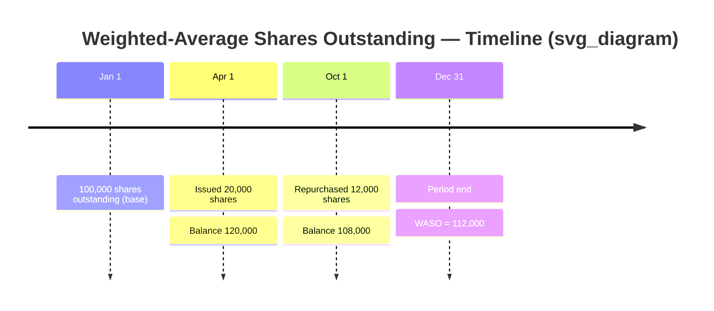

## Basic Earnings per Share Computation

### Definition and Purpose

Basic earnings per share (EPS) measures the amount of income available to common shareholders divided by the weighted-average number of common shares outstanding during a reporting period. It represents the portion of net income attributable to each share of common stock, absent any dilutive effects from convertible securities, options, or warrants. Basic EPS is a required disclosure under both **U.S. GAAP (ASC 260, Earnings per Share)** and **IFRS (IAS 33, Earnings per Share)** for entities with publicly traded common stock or potential common stock.

### Core Formula

$$\text{Basic EPS} = \frac{\text{Net Income Available to Common Shareholders}}{\text{Weighted-Average Number of Common Shares Outstanding}}$$

### Step 1: Determine Income Available to Common Shareholders

Net income available to common shareholders is **not** simply net income. It requires two adjustments:

**Subtract preferred dividends:**

$$\text{Income Available to Common} = \text{Net Income} - \text{Preferred Dividends}$$

The treatment of preferred dividends depends on the nature of the preferred stock:

- **Cumulative preferred stock**: The current-period dividend is deducted whether or not it was declared or paid. If dividends are in arrears, only the current year's dividend requirement is subtracted (not the entire arrearage), because prior-year arrearages were already deducted in prior years' EPS calculations.
- **Noncumulative preferred stock**: Dividends are deducted only if declared during the period. If not declared, no deduction is made.

**Adjust for discontinued operations and other subtotals:**

When an income statement presents multiple subtotals (income from continuing operations, discontinued operations, net income), EPS must be presented for each subtotal that is displayed on the face of the income statement, with preferred dividends deducted only from the "income from continuing operations" line (the first EPS figure), not duplicated at each subsequent level.

### Step 2: Compute the Weighted-Average Number of Shares Outstanding (WASO)

Shares are weighted by the **fraction of the period** they were outstanding. Simply using period-end shares would distort EPS when share counts change mid-year (e.g., due to issuances, buybacks, or stock splits).

**General formula:**

$$\text{WASO} = \sum \left( \text{Shares Outstanding}_i \times \frac{\text{Days (or Months) Outstanding}_i}{\text{Total Days (or Months) in Period}} \right)$$

**Key rules:**

- **Shares issued for cash or other consideration**: Weighted from the date of issuance.
- **Shares reacquired (treasury stock)**: Excluded from the weighted average from the date of reacquisition.
- **Stock dividends and stock splits**: Applied **retroactively** to all periods presented, as if the split/dividend occurred at the beginning of the earliest period reported. No weighting by date is used for splits/dividends — the entire period (including comparative prior periods) is restated.
- **Stock issued in a business combination**: Weighted from the acquisition date.

### Worked Example

A company has the following common share activity during the year:

| Date | Event | Shares Outstanding After Event |
| --- | --- | --- |
| Jan 1 | Beginning balance | 100,000 |
| Apr 1 | Issued 20,000 new shares | 120,000 |
| Oct 1 | Repurchased 12,000 shares (treasury) | 108,000 |

**Weighting (using months, 12-month year):**

| Period | Shares | Months Outstanding | Weight | Weighted Shares |
| --- | --- | --- | --- | --- |
| Jan 1 – Mar 31 | 100,000 | 3 | 3/12 | 25,000 |
| Apr 1 – Sep 30 | 120,000 | 6 | 6/12 | 60,000 |
| Oct 1 – Dec 31 | 108,000 | 3 | 3/12 | 27,000 |

$$\text{WASO} = 25{,}000 + 60{,}000 + 27{,}000 = 112{,}000 \text{ shares}$$

**Assume:**

- Net income: $560,000
- Preferred dividends declared (noncumulative): $40,000

$$\text{Income Available to Common} = \$560{,}000 - \$40{,}000 = \$520{,}000$$

$$\text{Basic EPS} = \frac{\$520{,}000}{112{,}000} = \$4.64 \text{ per share}$$

### Effect of a Stock Split (Retroactive Restatement)

If, on February 1 of the *following* year, the company executes a 2-for-1 stock split, the WASO of **112,000** used for the year just completed must be **restated to 224,000** in any comparative financial statements presenting that prior year — even though the split occurred after year-end but before issuance of the financial statements. This retroactive treatment applies to both current and all comparative periods presented, ensuring comparability across periods.

### Illustrative Diagram — Share Weighting Timeline

### Special Situations Affecting Basic EPS

**Stock dividends declared during the period:**

Treated the same as stock splits — retroactive restatement to the beginning of the earliest period presented. No separate weighting by declaration date.

**Contingently issuable shares:**

Shares issuable for little or no cash consideration upon the satisfaction of certain conditions are included in basic EPS **only when all necessary conditions have been satisfied** (i.e., the shares are no longer contingent as of the balance sheet date). If conditions are based on future earnings or market price targets not yet met, the shares are excluded from basic EPS (though they may factor into diluted EPS computations).

**Rights issues and bonus elements:**

Under IFRS, rights issues offered to existing shareholders at a price below fair value contain a bonus element. The weighted-average shares for all periods before the rights issue must be adjusted by a **bonus factor**:

$$\text{Bonus Factor} = \frac{\text{Fair Value per Share Immediately Before Exercise}}{\text{Theoretical Ex-Rights Fair Value per Share}}$$

This ensures comparability since shareholders effectively received bonus shares embedded in the discounted rights offering. [Unverified — IAS 33's specific bonus-element mechanics can vary in application; consult the standard's implementation guidance for precise computation in a given fact pattern.]

**Mid-period conversions or redemptions of preferred stock:**

If preferred stock is converted to common stock or redeemed during the year, only the dividends attributable to the period the preferred stock was actually outstanding are deducted from net income, and the resulting common shares are weighted from the conversion date forward.

### EPS Presentation Requirements

- EPS must be presented on the **face of the income statement** for income from continuing operations and net income, at minimum, for each period an income statement is presented.
- If a period reports a **loss** attributable to common shareholders, basic (and diluted) loss per share must still be presented — using the same weighted-average share denominator.
- Entities with **only preferred stock outstanding** (no common stock or potential common stock) are not required to report EPS.

### Common Pitfalls

- **Forgetting to deduct preferred dividends** before dividing by WASO, especially for cumulative preferred stock with dividends not yet declared.
- **Using period-end shares instead of weighted-average shares**, which overstates or understates EPS when significant share issuances/repurchases occurred mid-year.
- **Failing to retroactively apply stock splits/dividends** to prior comparative periods, causing inconsistent trend analysis.
- **Double-counting contingently issuable shares** in basic EPS before all contingencies are resolved.

### Relationship to Diluted EPS

Basic EPS serves as the **numerator/denominator baseline** from which diluted EPS is built. Diluted EPS incorporates the potential dilutive effect of convertible securities, stock options, warrants, and other potential common shares using methods such as the treasury stock method (for options/warrants) and the if-converted method (for convertible bonds/preferred stock). Basic EPS by definition excludes all such potential dilution and reflects only shares **actually outstanding**.

**Next Steps**

- Diluted EPS computation and the treasury stock method
- If-converted method for convertible securities
- Contingently issuable shares and their inclusion criteria
- Complex capital structures: sequencing multiple dilutive securities (anti-dilution sequencing)
- EPS for discontinued operations and multiple income subtotals
- Retrospective adjustments for stock splits/dividends in comparative statements
- IFRS vs. U.S. GAAP differences in EPS computation (rights issues, contingently issuable shares)