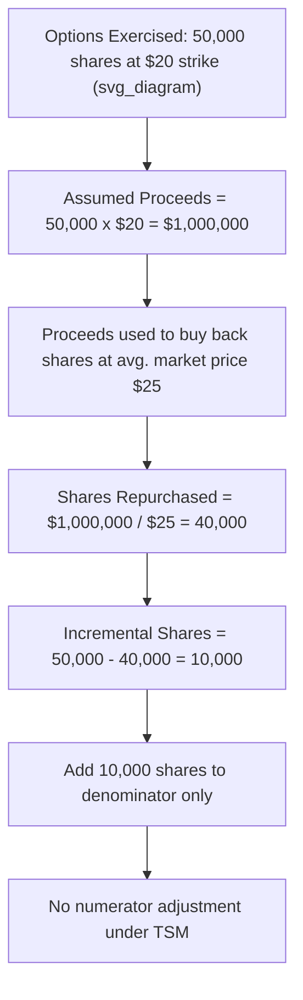

## Diluted Earnings per Share and the Treasury Stock Method

### Definition and Purpose

Diluted earnings per share (EPS) measures the amount of income available to common shareholders, adjusted for the potential dilutive effect of all securities that could convert into common stock, divided by an expanded weighted-average share count. Diluted EPS presents a "worst-case" (most conservative) view of per-share earnings by assuming that all potentially dilutive securities — stock options, warrants, convertible bonds, convertible preferred stock, and contingently issuable shares — are exercised or converted, provided doing so would **reduce** EPS. The objective under both **ASC 260 (U.S. GAAP)** and **IAS 33 (IFRS)** is to warn investors of the maximum potential dilution to their ownership claim on earnings.

### Core Formula

$$\text{Diluted EPS} = \frac{\text{Income Available to Common} + \text{Adjustments for Dilutive Securities}}{\text{Weighted-Average Shares} + \text{Incremental Shares from Dilutive Securities}}$$

Both the numerator and denominator of basic EPS are adjusted: the numerator adds back income effects (e.g., after-tax interest saved from assumed bond conversion), and the denominator adds the incremental shares each dilutive security would create.

### The Dilution Test (Antidilution Screening)

A security is included in diluted EPS **only if its inclusion decreases EPS (or increases loss per share)**. Securities whose inclusion would increase EPS are **antidilutive** and must be excluded. Each potentially dilutive security is tested **individually**, and securities are ranked and included sequentially from most dilutive to least dilutive, since inclusion order affects whether marginal securities remain dilutive.

**Test per security type:**

| Security | Dilution Test |
| --- | --- |
| Options/warrants | Always dilutive if exercise price < average market price (treasury stock method); antidilutive if exercise price > average market price (excluded entirely) |
| Convertible bonds | Dilutive if (after-tax interest expense) / (incremental shares) < basic EPS |
| Convertible preferred | Dilutive if (preferred dividends avoided) / (incremental shares) < basic EPS |

### The Treasury Stock Method (Options, Warrants, and Similar Instruments)

The treasury stock method (TSM) governs how options and warrants affect diluted EPS. It assumes:

1. The options/warrants are exercised at the beginning of the period (or issuance date, if later).
2. The proceeds received from exercise are used to **repurchase shares at the average market price** during the period.
3. The **net incremental shares** (shares issued upon exercise minus shares assumed repurchased) are added to the denominator.

**Formula for incremental shares:**

$$\text{Incremental Shares} = \text{Shares from Exercise} - \frac{\text{Shares from Exercise} \times \text{Exercise Price}}{\text{Average Market Price}}$$

Equivalently:

$$\text{Incremental Shares} = \text{Shares from Exercise} \times \left(1 - \frac{\text{Exercise Price}}{\text{Average Market Price}}\right)$$

**Key mechanics:**

- No adjustment is made to the numerator (income) under the treasury stock method — only the denominator changes.
- If the exercise price **exceeds** the average market price, the option/warrant is antidilutive and excluded entirely (out-of-the-money options never enter diluted EPS).
- The "average market price" is typically the average of the closing prices over the period (often approximated using monthly or quarterly closing prices), not a period-end price.
- Proceeds assumed received include not only cash exercise proceeds but also any unrecognized compensation cost (for stock options under ASC 718) and any excess tax benefits assumed credited to additional paid-in capital, where applicable.

### Worked Example — Treasury Stock Method

**Facts:**

- Company has outstanding stock options for 50,000 shares at an exercise price of $20.
- Average market price of common stock during the year: $25.
- Weighted-average common shares outstanding (basic): 500,000.
- Net income available to common: $1,000,000.

**Step 1 — Assumed proceeds from exercise:**

$$\text{Proceeds} = 50{,}000 \times \$20 = \$1{,}000{,}000$$

**Step 2 — Assumed shares repurchased with proceeds:**

$$\text{Shares Repurchased} = \frac{\$1{,}000{,}000}{\$25} = 40{,}000 \text{ shares}$$

**Step 3 — Incremental (net) shares added to denominator:**

$$\text{Incremental Shares} = 50{,}000 - 40{,}000 = 10{,}000 \text{ shares}$$

**Step 4 — Diluted EPS:**

$$\text{Diluted Shares} = 500{,}000 + 10{,}000 = 510{,}000$$

$$\text{Diluted EPS} = \frac{\$1{,}000{,}000}{510{,}000} = \$1.96$$

Compare to basic EPS of $1,000,000 / 500,000 = $2.00. Since $1.96 < $2.00, the options are dilutive and properly included.

### Illustrative Diagram — Treasury Stock Method Mechanics

### Applying the Treasury Stock Method Under IFRS

IAS 33 applies substantially the same treasury stock method for options and warrants, referring to it as the mechanism for computing the dilutive effect, and reaches materially consistent results with U.S. GAAP in most fact patterns. [Unverified — minor computational differences can arise in edge cases such as the treatment of unrecognized compensation cost; entities reporting under both frameworks should confirm treatment against the applicable standard's current text.]

### Convertible Securities — If-Converted Method (Contrast with TSM)

While options/warrants use the treasury stock method, convertible bonds and convertible preferred stock use the **if-converted method**, which differs structurally:

- **Numerator adjustment**: Add back after-tax interest expense (for convertible debt) or preferred dividends (for convertible preferred) that would not have been paid if conversion occurred at the beginning of the period.
- **Denominator adjustment**: Add the full number of common shares issuable upon conversion (not a net/incremental amount, unlike TSM).

$$\text{Numerator Adjustment (Convertible Bonds)} = \text{Interest Expense} \times (1 - \text{Tax Rate})$$

This is addressed in depth under the dedicated "if-converted method" topic; it is noted here to distinguish it clearly from the treasury stock method, since conflating the two mechanisms is a frequent error.

### Order of Inclusion — Sequencing Multiple Dilutive Securities

When a company has multiple potentially dilutive securities, each is ranked by its **incremental EPS effect** (from most dilutive/lowest incremental EPS to least dilutive), and each is added to the computation sequentially, **recomputing EPS after each addition**, continuing to include securities only as long as each successive inclusion continues to reduce EPS. Once an additional security would increase EPS above the running diluted EPS figure, that security (and any less dilutive ones) is excluded.

**Ranking formula for convertible securities:**

$$\text{Incremental EPS Effect} = \frac{\text{Numerator Effect of Security}}{\text{Denominator Effect of Security}}$$

Securities are ranked from lowest to highest incremental EPS effect and added in that order.

### Special Cases in the Treasury Stock Method

**Options exercisable at multiple exercise prices (tranches):**

Each tranche is treated separately, since different exercise prices produce different incremental share counts; tranches with exercise prices above average market price are excluded individually even if other tranches from the same plan are dilutive.

**Market price volatility and averaging convention:**

Using a simple average of period-end prices (e.g., monthly closes) versus a volume-weighted average can produce different results. Companies should apply their averaging methodology consistently period-over-period.

**Unrecognized compensation cost (U.S. GAAP, ASC 718 interaction):**

For unvested stock options with unrecognized compensation expense, the assumed proceeds in the treasury stock method also include the average unrecognized compensation cost for future service, in addition to the cash exercise price — increasing assumed proceeds and thus reducing incremental dilutive shares relative to a pure cash-exercise-price computation.

**Contingently issuable shares under options:**

If exercisability of the options themselves is contingent on future events not yet met, the options are excluded from diluted EPS until the contingency is resolved, consistent with the treatment of contingently issuable shares generally.

### Common Pitfalls

- **Applying the treasury stock method to convertible bonds/preferred stock** instead of the if-converted method (structurally incorrect — TSM applies to options/warrants only).
- **Adjusting the numerator under TSM** — TSM never adjusts income; only the denominator changes.
- **Including out-of-the-money options** in diluted EPS (antidilutive; must be excluded).
- **Failing to re-test each security's dilutive effect** after adding others sequentially, which can cause improper inclusion of a security that is antidilutive relative to the running subtotal.
- **Using period-end market price instead of the average market price** during the reporting period for the repurchase assumption.
- **Ignoring unrecognized compensation cost** in the assumed proceeds for unvested awards under U.S. GAAP.

### Loss Periods

When a company reports a net loss (or a loss available to common shareholders), all potentially dilutive securities are **antidilutive by definition**, because adding shares to the denominator while the numerator is negative would decrease the loss per share (an improvement), which is prohibited. In loss periods, diluted EPS equals basic EPS, and the treasury stock method's incremental shares are not added.

### Disclosure Requirements

Entities must disclose, at minimum:

- A reconciliation of the numerator and denominator used in basic EPS to those used in diluted EPS, including the individual effect of each class of potentially dilutive security.
- Securities that were antidilutive for the period(s) presented and therefore excluded from the diluted EPS computation, since they could become dilutive in future periods as market prices or interest rates change.

**Next Steps**

- If-converted method for convertible bonds and convertible preferred stock
- Contingently issuable shares — inclusion criteria for diluted EPS
- Antidilution sequencing across multiple securities (ranking methodology in depth)
- Participating securities and the two-class method
- EPS restatement for discontinued operations
- IFRS vs. U.S. GAAP differences in diluted EPS computation