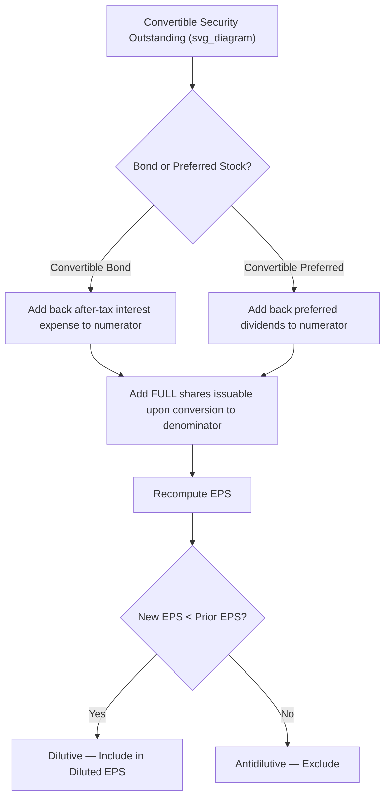

## Convertible Securities and the If-Converted Method

### Definition and Purpose

The if-converted method is the technique prescribed under **ASC 260 (U.S. GAAP)** and **IAS 33 (IFRS)** for measuring the dilutive effect of convertible bonds, convertible notes, and convertible preferred stock on diluted earnings per share (EPS). It assumes conversion of the security into common stock occurs at the **beginning of the period** (or at the date of issuance, if issued during the period), and adjusts **both** the numerator and denominator of the EPS fraction — a structural contrast to the treasury stock method used for options and warrants, which adjusts the denominator only.

### Core Formula

$$\text{Diluted EPS (with convertible security)} = \frac{\text{Income Available to Common} + \text{Numerator Adjustment}}{\text{WASO} + \text{Shares Issuable upon Conversion}}$$

### If-Converted Method for Convertible Bonds (Debt)

**Numerator adjustment — add back after-tax interest expense:**

$$\text{Numerator Adjustment} = \text{Interest Expense} \times (1 - \text{Tax Rate})$$

The logic: if the bonds were converted to common stock at the start of the period, the company would not have incurred the associated interest expense, so net income is increased by the interest expense saved, net of the tax effect (since interest expense is tax-deductible, removing it also removes the associated tax shield).

**Denominator adjustment — add full shares issuable upon conversion:**

Unlike the treasury stock method's *incremental* share addition, the if-converted method adds the **entire** number of common shares that would be issued upon conversion — there is no netting against assumed proceeds or repurchases, because no cash proceeds are assumed to change hands upon conversion of debt to equity.

**Also add back any amortization of discount/premium and issuance costs:**

If the convertible bond was issued at a discount or premium, or carries debt issuance costs being amortized through interest expense, the after-tax effect of that amortization is also reversed out of the numerator adjustment, since it forms part of the reported interest expense being eliminated.

### Worked Example — Convertible Bonds

**Facts:**

- $1,000,000 face value, 6% convertible bonds outstanding all year.
- Each $1,000 bond is convertible into 40 common shares.
- Tax rate: 25%.
- Net income available to common: $800,000.
- Weighted-average common shares outstanding (basic): 200,000.

**Step 1 — Annual interest expense:**

$$\text{Interest Expense} = \$1{,}000{,}000 \times 6\% = \$60{,}000$$

**Step 2 — After-tax add-back to numerator:**

$$\text{Numerator Adjustment} = \$60{,}000 \times (1 - 0.25) = \$45{,}000$$

**Step 3 — Shares issuable upon conversion:**

$$\text{Shares} = \frac{\$1{,}000{,}000}{\$1{,}000} \times 40 = 40{,}000 \text{ shares}$$

**Step 4 — Dilution test:**

$$\text{Incremental EPS Effect} = \frac{\$45{,}000}{40{,}000} = \$1.125 \text{ per share}$$

Compare $1.125 to basic EPS of $800,000 / 200,000 = $4.00. Since $1.125 < $4.00, the bonds are dilutive.

**Step 5 — Diluted EPS:**

$$\text{Diluted EPS} = \frac{\$800{,}000 + \$45{,}000}{200{,}000 + 40{,}000} = \frac{\$845{,}000}{240{,}000} = \$3.52$$

### If-Converted Method for Convertible Preferred Stock

**Numerator adjustment — add back preferred dividends:**

Because preferred dividends were already deducted in computing basic EPS's "income available to common," the if-converted method **adds back** those dividends (no tax effect, since preferred dividends are not tax-deductible — they are a distribution of after-tax income, not an expense).

$$\text{Numerator Adjustment} = \text{Preferred Dividends Declared or Accrued}$$

**Denominator adjustment — add shares issuable upon conversion:**

The full number of common shares issuable upon conversion of the preferred stock is added, again without netting against any proceeds (no cash changes hands upon conversion).

### Worked Example — Convertible Preferred Stock

**Facts:**

- 10,000 shares of $100 par, 8% cumulative convertible preferred stock outstanding all year.
- Each preferred share converts into 5 common shares.
- Net income: $800,000. Basic weighted-average common shares: 200,000 (no other preferred stock).

**Step 1 — Annual preferred dividend:**

$$\text{Dividend} = 10{,}000 \times \$100 \times 8\% = \$80{,}000$$

**Step 2 — Income available to common (basic EPS numerator):**

$$\$800{,}000 - \$80{,}000 = \$720{,}000$$

**Step 3 — Shares issuable upon conversion:**

$$10{,}000 \times 5 = 50{,}000 \text{ shares}$$

**Step 4 — Dilution test:**

$$\text{Incremental EPS Effect} = \frac{\$80{,}000}{50{,}000} = \$1.60$$

Basic EPS = $720,000 / 200,000 = $3.60. Since $1.60 < $3.60, the preferred stock is dilutive.

**Step 5 — Diluted EPS:**

$$\text{Diluted EPS} = \frac{\$720{,}000 + \$80{,}000}{200{,}000 + 50{,}000} = \frac{\$800{,}000}{250{,}000} = \$3.20$$

Note that the numerator reverts to the full $800,000 net income (i.e., adding back the preferred dividend cancels the earlier deduction), which is intuitive: if the preferred were fully converted, there would be no preferred dividend to subtract at all.

### Illustrative Diagram — If-Converted Method Logic Flow

### Contrast: If-Converted Method vs. Treasury Stock Method

| Feature | If-Converted Method | Treasury Stock Method |
| --- | --- | --- |
| Applies to | Convertible bonds, convertible preferred stock | Options, warrants, similar instruments |
| Numerator adjustment | Yes — add back after-tax interest or preferred dividends | No — numerator unchanged |
| Denominator adjustment | Full shares issuable upon conversion | Net incremental shares only (after assumed buyback) |
| Cash proceeds assumed | None (no cash changes hands) | Yes — assumed used to repurchase shares |
| Conversion timing assumed | Beginning of period or issuance date | Beginning of period or issuance date |

### Antidilution Sequencing with Convertible Securities

When multiple convertible securities and options/warrants coexist, each must be ranked by its **incremental EPS effect** (numerator effect divided by denominator effect) from lowest to highest, and included sequentially — recalculating EPS after each addition — continuing only while each inclusion keeps reducing EPS. This sequencing is essential because a security that appears dilutive on a standalone basis can become antidilutive once combined with other securities already included, since the base EPS against which it is tested changes at each step.

### Mandatorily Convertible Instruments

Instruments that **must** convert to common stock (no option to redeem for cash) are included in diluted EPS using the if-converted method from the beginning of the period (or issuance), and are **never excluded as antidilutive** if conversion is unconditional and mandatory under the instrument's terms in most standard fact patterns. [Inference — treatment can vary based on specific contractual mechanics, such as contingent conversion ratios or embedded caps/floors; the precise accounting depends on the instrument's terms and may require separate analysis under derivatives guidance.]

### Contingently Convertible Debt ("Co-Cos")

Convertible instruments with contingent conversion features (e.g., convertible only if the stock price exceeds a trigger threshold, or only upon a specified event) are generally included in diluted EPS **regardless of whether the market price trigger has been met**, under the principle that contingently convertible debt should be treated as if convertible at the reporting date for EPS purposes — reflecting the maximum potential dilution. This differs from other contingently issuable shares, which are typically excluded until the contingency is actually resolved. [Unverified — the treatment of contingently convertible instruments has been an area of specific standard-setting attention (e.g., historical FASB guidance on "Co-Co" bonds); confirm against current authoritative guidance for the applicable instrument and reporting framework, as market-price-trigger conventions have evolved.]

### Multiple Conversion Options and Ranking Interaction

If a convertible security's conversion terms include a choice of settlement (e.g., cash or shares, at the issuer's or holder's option), the EPS treatment depends on which party controls the settlement election and the presumption used:

- If the issuer has the option to settle in cash or shares, the presumption is generally that the instrument will be settled in shares for diluted EPS purposes, unless past experience or a stated policy indicates a cash settlement is expected.
- Instruments with a substantive cash settlement requirement for the principal amount (with only the conversion spread settled in shares) may be evaluated as if only the incremental shares from the spread are added (similar in spirit to treasury-stock-style netting), rather than the gross conversion shares.

### Common Pitfalls

- **Applying treasury stock method mechanics to convertible bonds/preferred** — netting against a repurchase price is incorrect; the if-converted method adds full conversion shares with no repurchase assumption.
- **Forgetting the after-tax adjustment** when adding back bond interest expense to the numerator (pretax interest must not be added directly).
- **Applying a tax effect to preferred dividend add-backs** — preferred dividends are not tax-deductible, so no tax adjustment is made when adding them back.
- **Testing dilution using the full basic EPS** rather than re-testing sequentially against the running EPS after other securities have already been included.
- **Excluding contingently convertible debt from diluted EPS** solely because a market-price trigger has not been met, when the applicable guidance requires inclusion regardless of trigger status.
- **Failing to include amortization of debt discount/premium** in the after-tax interest add-back when the bond was issued at other than par.

### Disclosure Requirements

Entities must disclose the terms and conditions of convertible securities (conversion ratios, conversion prices, and any contingent features) sufficient for users to evaluate future potential dilution, along with the specific numerator and denominator adjustments attributable to each class of convertible security in the EPS reconciliation.

**Next Steps**

- Antidilution sequencing across multiple dilutive securities (detailed ranking methodology)
- Contingently issuable shares — inclusion criteria for diluted EPS
- Participating securities and the two-class method
- Treasury stock method for options and warrants (contrast and interaction)
- Complex capital structures — combining multiple security types in one EPS computation
- IFRS vs. U.S. GAAP differences in convertible instrument classification (liability vs. equity components)