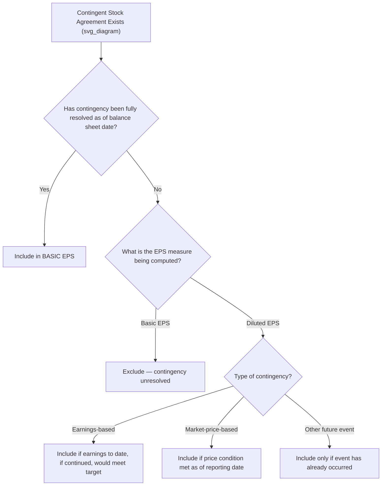

## Contingently Issuable Shares

### Definition and Purpose

Contingently issuable shares are shares of common stock issuable for little or no cash consideration upon the satisfaction of specified conditions in a contingent stock agreement — such as attaining a target level of earnings, achieving a specified market price for the stock, or the occurrence of a specific event (e.g., an acquisition milestone, an IPO, or regulatory approval). Both **ASC 260 (U.S. GAAP)** and **IAS 33 (IFRS)** provide specific guidance on when such shares enter into basic EPS versus diluted EPS, since including unresolved contingencies prematurely would overstate dilution while excluding them entirely could understate it.

### Core Principle: Basic EPS vs. Diluted EPS Treatment

| EPS Measure | Treatment of Contingently Issuable Shares |
| --- | --- |
| Basic EPS | Included **only** when all necessary conditions have been satisfied (i.e., issuance is no longer contingent as of the balance sheet date) |
| Diluted EPS | Included **as of the beginning of the period** (or later issuance/agreement date) if the conditions **would be met** if the end of the reporting period were the end of the contingency period, based on conditions existing at that reporting date |

The diluted EPS test is often referred to as the **"as if the end of the reporting period were the end of the contingency period"** approach — it asks whether the shares would be issuable if the current conditions persisted through the contingency's resolution date.

### Contingency Types and Their EPS Tests

**1. Contingent on a future earnings level:**

Shares are included in diluted EPS if the specified earnings target has **already been achieved** by the reporting date (i.e., based on year-to-date actual earnings, assuming the current rate of earnings continued would meet or exceed the target). If the target is based on *cumulative* earnings over a multi-year period, the computation considers earnings for the appropriate period as if the end of the reporting period were the end of the contingency period.

$$\text{Include in Diluted EPS if: } \text{Actual Earnings to Date} \geq \text{Prorated Target}$$

**2. Contingent on a future market price:**

Shares are included in diluted EPS **if the market price condition has been met as of the end of the reporting period**, regardless of whether it is expected to be sustained. The number of shares included is based on the market price at the end of the period (i.e., the number of shares that would be issuable if the market price at the reporting date were the final measurement price).

**3. Contingent on a future event (e.g., an IPO, product approval, litigation outcome):**

Shares are included in diluted EPS as of the beginning of the period only if the specified event has **actually occurred** by the end of the reporting period. If the event has not occurred, the shares are excluded from diluted EPS entirely, since there is no interim measurement analogous to the earnings/market-price tests.

### Worked Example — Earnings Contingency

**Facts:**

- A business combination agreement specifies that the acquirer will issue an additional 50,000 shares to former shareholders of the acquiree if the acquired business achieves $2,000,000 in cumulative earnings over a 2-year period.
- At the end of Year 1, the acquired business has earned $1,100,000 (which annualizes to a pace exceeding the $2,000,000 two-year target on a straight-line basis: $1,100,000 × 2 = $2,200,000 > $2,000,000).

**Analysis:**

Since the earnings pace to date, if continued, would exceed the cumulative target, the 50,000 contingently issuable shares are included in diluted EPS for Year 1 (weighted from the beginning of the period or the acquisition date, whichever is later). They remain **excluded from basic EPS**, because the contingency has not yet been formally resolved (the two-year measurement period has not concluded).

### Worked Example — Market Price Contingency

**Facts:**

- An agreement provides for issuance of 30,000 additional shares if the company's stock price reaches $50 at any time before the contingency period ends.
- At the reporting date, the stock price is $52.

**Analysis:**

Since the market price condition ($50 threshold) has been satisfied as of the reporting date, the 30,000 shares are included in diluted EPS for the current period, based on conditions at that date. If in a subsequent period the stock price fell back below $50 (and the condition were structured as needing to be maintained through the reporting date, rather than a one-time trigger), the shares could be excluded again in that later period — the test is performed **each period** based on conditions as they exist at each period's reporting date.

### Illustrative Diagram — Contingently Issuable Shares Decision Logic

### Weighting Contingently Issuable Shares in Diluted EPS

Once included, contingently issuable shares are weighted into the diluted EPS denominator from the **later of**:

- The beginning of the period, or
- The date the contingent agreement was entered into (e.g., the acquisition date, if the contingency arose from a business combination).

They are **not** weighted from the date the contingency was satisfied, because diluted EPS conceptually assumes the maximum potential dilution existed throughout the period being measured (consistent with the treasury stock and if-converted methods' beginning-of-period conversion assumptions).

### Contingently Issuable Shares in Business Combinations (Earnout Arrangements)

Contingent consideration in a business combination structured as additional shares issuable upon meeting post-acquisition targets ("earnouts") follows the same basic framework:

- If classified as a **liability** (e.g., a contingent cash-settled obligation that will later be settled in a variable number of shares equal to a fixed dollar value), it is generally **not** treated as a contingently issuable share for EPS purposes in the same way, and may instead affect the numerator or be analyzed as a separate derivative.
- If classified as **equity** (a fixed number of shares contingent on a milestone), the contingently issuable share framework above applies directly.

[Inference — the equity-vs-liability classification analysis for contingent consideration is governed by broader guidance on financial instrument classification (e.g., ASC 480/815 or IFRS equivalents) that interacts with, but is analytically distinct from, the EPS contingently issuable shares guidance; the specific classification should be confirmed against the instrument's precise terms.]

### Interaction with Antidilution Sequencing

Contingently issuable shares that qualify for inclusion in diluted EPS are still subject to the overall antidilution test — they must be ranked alongside other potentially dilutive securities (options, convertibles) by their incremental EPS effect and included only if their addition, in sequence, continues to reduce EPS. Because contingently issuable shares typically involve no exercise price or interest add-back (they are issued for little or no additional consideration), their numerator effect is often zero, making their incremental EPS effect calculation reduce to:

$$\text{Incremental EPS Effect} = \frac{0 \text{ (or minimal numerator effect)}}{\text{Contingently Issuable Shares}} = \$0 \text{ (or near-zero)}$$

This typically makes such shares highly dilutive once the inclusion threshold is met, since they add to the denominator with little or no offsetting numerator benefit.

### Contingently Issuable Shares Held in Escrow

Shares held in escrow pending resolution of a contingency (common in M&A transactions where a portion of consideration shares are held back to satisfy indemnification claims or earnout conditions) are treated as contingently issuable and excluded from both basic and diluted EPS until the applicable release conditions are satisfied, using the same tests described above.

### Common Pitfalls

- **Including contingently issuable shares in basic EPS** before the contingency is actually resolved — a frequent error, since basic EPS has a stricter (resolved-only) inclusion standard than diluted EPS.
- **Failing to re-test market-price contingencies each period** — a market price condition satisfied in one period does not guarantee automatic inclusion in a future period if the condition requires the price to be maintained through the relevant measurement date.
- **Weighting shares from the date the contingency is resolved** rather than from the beginning of the period or agreement date, understating dilution.
- **Treating all earnout share arrangements identically** without first assessing equity vs. liability classification, which affects whether the contingently-issuable-shares EPS framework even applies.
- **Omitting contingently issuable shares from the antidilution sequencing/ranking process**, incorrectly assuming they bypass the ranking test simply because their numerator effect is often zero.

### Disclosure Requirements

Entities must disclose the existence of contingent stock agreements, including the conditions under which shares would be issued and the number of shares that would result if the contingency were resolved — providing users a basis to assess potential future dilution even when shares are currently excluded from both basic and diluted EPS.

**Next Steps**

- Antidilution sequencing across multiple dilutive securities (detailed ranking methodology)
- Participating securities and the two-class method
- Business combination accounting — contingent consideration classification (equity vs. liability)
- Treasury stock method and if-converted method (contrast and interaction with contingent shares)
- Complex capital structures — combining multiple security types in one EPS computation
- IFRS vs. U.S. GAAP differences in contingently issuable share guidance