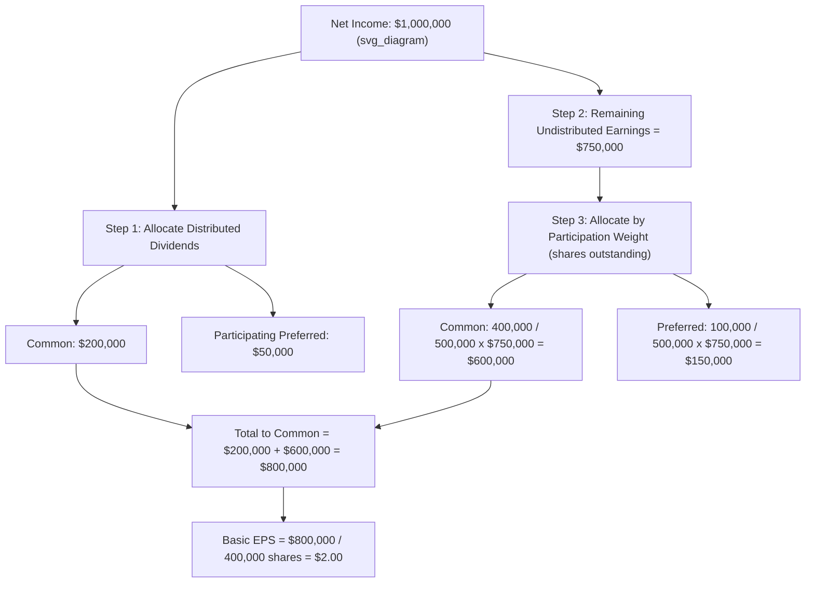

## Options, Warrants, and Participating Securities

<syllabot_broad_topic/>

### Overview

This topic covers three distinct categories of potentially dilutive instruments that affect earnings per share (EPS) computations under **ASC 260 (U.S. GAAP)** and **IAS 33 (IFRS)**: stock options and warrants (governed by the treasury stock method), and participating securities (governed by the two-class method). Although options/warrants and participating securities are both "potential common stock," they require fundamentally different EPS mechanics and are frequently confused in practice.

### Part 1 — Stock Options and Warrants

**Definition:**

Options and warrants are contracts that give the holder the right, but not the obligation, to purchase common stock at a specified exercise (strike) price within a specified period. They are potentially dilutive because their exercise increases the number of shares outstanding without a proportional increase in company resources equal to fair value.

**EPS Mechanism — Treasury Stock Method:**

As detailed in the dedicated treasury stock method topic, options and warrants are incorporated into diluted EPS by:

1. Assuming exercise at the beginning of the period (or issuance date, if later).
2. Assuming the proceeds received are used to repurchase shares at the **average market price** during the period.
3. Adding only the **net incremental shares** to the denominator.

$$\text{Incremental Shares} = \text{Shares from Exercise} \times \left(1 - \frac{\text{Exercise Price}}{\text{Average Market Price}}\right)$$

**Dilution test:** Options/warrants are dilutive only when the exercise price is **below** the average market price during the period (in-the-money). Out-of-the-money instruments are antidilutive and excluded entirely from diluted EPS, though disclosed.

**No numerator adjustment:** Unlike convertible securities, options and warrants never affect the numerator (net income) — only the denominator changes.

### Part 2 — Written Put Options and Purchased Options (Contra-Dilutive Instruments)

**Written put options** (obligations to buy back shares at a fixed price if the holder exercises) are analyzed differently from call options/warrants, since they can require the company to pay cash to repurchase shares — a use of resources, not a source of them.

- If the put exercise price exceeds the average market price, the put is dilutive under a "reverse treasury stock method": assume the company must issue enough shares to raise the funds needed to satisfy the put, and add those incremental shares to the denominator.
- **Purchased put and call options** held by the company (e.g., hedging positions) are generally antidilutive by their nature — since the company benefits when its own stock price moves favorably relative to the strike — and are excluded from diluted EPS computations.

$$\text{Reverse Treasury Stock Method (Written Puts): } \text{Incremental Shares} = \text{Shares Needed} - \frac{\text{Shares} \times \text{Average Market Price}}{\text{Put Exercise Price}}$$

[Inference — the precise mechanics of the reverse treasury stock method for written puts can vary by specific contract terms (physical settlement vs. net-cash settlement); the general concept illustrated is standard, but application should be confirmed against the specific instrument's settlement provisions.]

### Worked Example — Warrants (Treasury Stock Method)

**Facts:**

- Warrants outstanding for 100,000 shares at an exercise price of $15.
- Average market price during the year: $18.
- Basic weighted-average shares: 1,000,000. Net income available to common: $3,000,000.

**Step 1 — Assumed proceeds:**

$$100{,}000 \times \$15 = \$1{,}500{,}000$$

**Step 2 — Assumed shares repurchased:**

$$\frac{\$1{,}500{,}000}{\$18} = 83{,}333 \text{ shares (rounded)}$$

**Step 3 — Incremental shares:**

$$100{,}000 - 83{,}333 = 16{,}667 \text{ shares}$$

**Step 4 — Diluted EPS:**

$$\frac{\$3{,}000{,}000}{1{,}000{,}000 + 16{,}667} = \frac{\$3{,}000{,}000}{1{,}016{,}667} = \$2.95$$

Compared to basic EPS of $3.00, the warrants are dilutive and properly included.

### Part 3 — Participating Securities and the Two-Class Method

**Definition:**

Participating securities are securities (often preferred stock, but also certain classes of common stock or share-based awards) that are entitled to participate with common shareholders in dividends or dividend-equivalent distributions, according to a predetermined formula, in addition to (or instead of) any preferential dividend rights. Because participating securities share economically in undistributed earnings, they must be included in the calculation of both basic **and** diluted EPS using the **two-class method** — not deferred to a dilution test the way options or convertibles are.

**Why participating securities are different:**

Options and convertible securities only affect EPS through the diluted computation. Participating securities affect the allocation of **undistributed earnings** even at the basic EPS level, because their contractual participation rights mean they have a current claim on a portion of current-period earnings regardless of whether a dividend is actually declared.

**Two-Class Method — Computation Steps:**

1. **Determine total earnings to allocate**: Net income (or loss) available to common shareholders and participating security holders combined.
2. **Allocate distributed earnings**: Assign actual dividends declared to each class (common and each class of participating security) according to their contractual dividend rates.
3. **Allocate undistributed earnings**: Any remaining income (after distributed dividends) is allocated between common stock and participating securities based on their **participation rights**, as if all earnings for the period had been distributed.
4. **Compute EPS per class**: Divide each class's total allocated earnings (distributed + undistributed) by the weighted-average shares of that class.

$$\text{Basic EPS (Common)} = \frac{\text{Distributed Earnings to Common} + \text{Allocated Undistributed Earnings to Common}}{\text{Weighted-Average Common Shares}}$$

### Worked Example — Two-Class Method

**Facts:**

- Net income: $1,000,000.
- Common stock: 400,000 weighted-average shares.
- Participating convertible preferred stock: 100,000 shares, participating on an as-if-converted 1-for-1 basis, with no separate liquidation preference affecting this allocation.
- Dividends declared: $200,000 to common ($0.50/share) and $50,000 to preferred ($0.50/share), reflecting the participation formula.

**Step 1 — Total distributed earnings:**

$$\$200{,}000 + \$50{,}000 = \$250{,}000$$

**Step 2 — Undistributed earnings:**

$$\$1{,}000{,}000 - \$250{,}000 = \$750{,}000$$

**Step 3 — Allocate undistributed earnings by participation weight:**

Total participating shares = 400,000 + 100,000 = 500,000

$$\text{Common share of undistributed} = \$750{,}000 \times \frac{400{,}000}{500{,}000} = \$600{,}000$$

$$\text{Preferred share of undistributed} = \$750{,}000 \times \frac{100{,}000}{500{,}000} = \$150{,}000$$

**Step 4 — Total earnings allocated to common:**

$$\$200{,}000 + \$600{,}000 = \$800{,}000$$

**Step 5 — Basic EPS for common:**

$$\frac{\$800{,}000}{400{,}000} = \$2.00 \text{ per share}$$

### Illustrative Diagram — Two-Class Method Allocation Flow

### Diluted EPS for Participating Securities — The "More Dilutive" Test

When computing **diluted** EPS with participating convertible securities, two methods must be evaluated, and the **more dilutive** result is used:

1. **If-converted method**: Assume the participating preferred converts to common at the beginning of the period, and recompute EPS as if only one class of common stock existed.
2. **Two-class method (as computed for basic EPS)**: Retain the participating security as a separate class and use its diluted share count.

The method producing the **lower** diluted EPS for common shareholders is the one reported, consistent with the general principle that diluted EPS reflects maximum potential dilution.

### Participating Securities vs. Contingently Convertible Instruments

Participating securities should not be confused with contingently issuable shares or standard convertible preferred stock without participation rights:

| Feature | Non-Participating Convertible Preferred | Participating Security |
| --- | --- | --- |
| Basic EPS effect | None (only reduces numerator via dividend deduction) | Included in basic EPS via two-class method |
| Diluted EPS method | If-converted method only | Both if-converted and two-class tested; more dilutive used |
| Claim on undistributed earnings | No | Yes, per participation formula |

### Common Types of Participating Securities

- **Participating preferred stock**: Entitled to a stated dividend plus an additional share of any dividends paid to common, often on an as-converted basis.
- **Convertible bonds with dividend participation rights**: Rare, but structurally analyzed the same way if participation terms exist.
- **Certain unvested share-based payment awards**: Under U.S. GAAP, unvested share-based payment awards that contain nonforfeitable rights to dividends or dividend equivalents (whether paid or unpaid) are considered participating securities and must be included in basic EPS via the two-class method, since the right to dividends is not contingent on the vesting condition being met.

### Common Pitfalls

- **Treating participating securities like ordinary convertible preferred**, deferring their effect entirely to the diluted EPS computation — participating securities affect **basic** EPS through the two-class method.
- **Forgetting to test both the if-converted and two-class methods** for diluted EPS and simply defaulting to one method without comparing results.
- **Omitting unvested share-based awards with nonforfeitable dividend rights** from the two-class method, a frequently overlooked category under U.S. GAAP.
- **Allocating undistributed earnings using dividend rates** instead of participation/share-weighting ratios, when the security's participation formula calls for pro-rata sharing based on shares (or as-converted shares).
- **Applying the treasury stock method to participating preferred stock** instead of the two-class or if-converted method — participating securities are not option-like instruments.
- **Ignoring losses**: in loss periods, participating securities generally do not share in the loss unless contractually obligated to do so; many participation agreements only require sharing in profits, not losses, which changes the allocation mechanics.

### Disclosure Requirements

Entities must disclose the nature and terms of participating securities, including their participation formula, along with a reconciliation showing how earnings were allocated between common shareholders and each class of participating security in arriving at basic and diluted EPS.

**Next Steps**

- Treasury stock method — detailed mechanics and worked examples
- If-converted method for convertible bonds and preferred stock
- Contingently issuable shares — inclusion criteria for diluted EPS
- Antidilution sequencing across multiple dilutive securities
- Share-based compensation accounting (ASC 718) and its interaction with EPS
- Complex capital structures — combining options, convertibles, and participating securities in one EPS computation