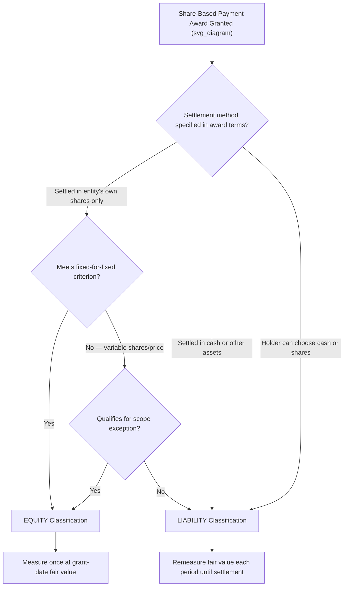

## Classification of Equity-Based and Liability-Based Awards

### Definition and Purpose

Share-based payment awards granted to employees or nonemployees must be classified as either **equity awards** or **liability awards** under **ASC 718 (Compensation—Stock Compensation)** in U.S. GAAP, and under **IFRS 2 (Share-based Payment)** internationally. This classification determines the subsequent accounting treatment — critically, whether the award is measured **once** at grant date (equity-classified) or **remeasured at fair value every reporting period** until settlement (liability-classified). Misclassification can materially distort compensation expense recognition and balance sheet presentation.

### Core Classification Principle

$$\text{Award Classification} = f(\text{Settlement Method}, \text{Contractual Terms}, \text{Underlying Instrument})$$

The overarching test asks: **does the entity have an obligation to settle the award in cash or other assets (liability), or will it settle by issuing its own equity instruments (equity)?**

### Equity-Classified Awards

**General criteria:**

An award is classified as equity if it will be settled through the issuance of the entity's own equity shares, and the award does not contain terms that require or permit cash settlement (except in specific permitted circumstances, such as employee tax withholding obligations up to the maximum statutory rate).

**Common examples:**

- Stock options settled in shares upon exercise.
- Restricted stock awards (RSAs) settled by issuing restricted shares at grant.
- Restricted stock units (RSUs) that settle in shares upon vesting.
- Performance share units (PSUs) settled in shares contingent on performance conditions.

**Measurement:**

Equity awards are measured at **grant-date fair value**, and that fair value is **not subsequently remeasured** for changes in stock price or other assumptions (absent a modification). Total compensation cost is fixed at grant date and recognized over the requisite service period.

$$\text{Total Compensation Cost (Equity)} = \text{Grant-Date Fair Value per Award} \times \text{Number of Awards Expected to Vest}$$

### Liability-Classified Awards

**General criteria:**

An award is classified as a liability if the entity has an obligation to settle it in **cash or other assets** other than its own equity shares, or if the award's terms provide the holder a choice to demand cash settlement, or the entity has a history/practice of settling similar awards in cash such that a cash settlement is probable.

**Common examples:**

- Cash-settled stock appreciation rights (SARs).
- Phantom stock plans (cash payment tied to stock price appreciation, no actual shares issued).
- Awards where the employee can choose cash or shares (generally liability-classified, since the choice of cash settlement rests with the holder).
- Certain awards indexed to a variable number of shares with a fixed monetary value (fails the "fixed-for-fixed" criterion — discussed below).
- Puttable shares issued to employees where the put option requires the company to repurchase shares for cash, if the repurchase feature is not solely within the employee's control in a way that qualifies for equity treatment, or if repurchase is probable within a short period after vesting.

**Measurement:**

Liability awards are measured at fair value at grant date and **remeasured at fair value at each reporting period** until settlement, with changes in fair value recognized in compensation cost (typically as an adjustment to expense) through the settlement date.

$$\text{Compensation Cost (Liability, Period } n\text{)} = \text{Cumulative Fair Value} \times \text{Vesting Progress} - \text{Cumulative Expense Recognized to Date}$$

### The "Fixed-for-Fixed" Criterion (Equity Classification Test for Options)

For stock options and similar instruments to qualify for equity classification, they generally must meet a **fixed-for-fixed** criterion: a fixed number of shares is issued in exchange for a fixed exercise price (in the entity's functional currency, subject to certain exceptions). If either the number of shares or the exercise price can vary based on an underlying variable (e.g., the exercise price is denominated in a foreign currency not meeting specified exceptions, or the number of shares varies with a formula tied to something other than the entity's own stock price), the award generally fails the fixed-for-fixed test and may require liability classification or derivative accounting.

### Illustrative Diagram — Equity vs. Liability Classification Decision Tree

### Awards with Repurchase Features (Puttable/Callable Shares)

Shares issued to employees that are subject to a repurchase feature require careful analysis:

- If the entity has the **right (call option)** to repurchase shares at fair value, and exercise of the call is not probable, equity classification is typically preserved.
- If the employee has the **right (put option)** to require the entity to repurchase shares at fair value, and it is **probable** the put will be exercised, the award (or the repurchase feature) may require liability classification, since the entity has a substantive obligation to transfer cash.
- Repurchase at a fixed price unrelated to fair value (rather than at then-current fair value) is a stronger indicator of liability classification, since it resembles a financing arrangement more than a true equity instrument.

### Modifications and Reclassification

**Modification from equity to liability classification** (e.g., an equity award is modified to add a cash settlement feature) requires:

1. Remeasuring the award at its modification-date fair value.
2. Reclassifying the equity component (previously recognized in additional paid-in capital) to a liability.
3. Recognizing any incremental compensation cost from the modification (the excess of the new fair value over the old fair value, if any) immediately or over the remaining service period, depending on vesting status.

**Modification from liability to equity classification** similarly requires remeasurement at the modification date, with the liability derecognized and the resulting amount reclassified to equity.

### Awards to Nonemployees

Under current U.S. GAAP (following the amendments that largely aligned nonemployee share-based payment accounting with employee awards under ASC 718), the same equity-vs-liability classification framework generally applies to share-based payments to nonemployees (e.g., consultants, vendors) as applies to employees, a change from older guidance that had separately addressed nonemployee awards under different measurement conventions. [Unverified — confirm the applicable transition and effective-date guidance for the specific reporting period and entity, as historical nonemployee award accounting differed materially before this alignment.]

### IFRS 2 Comparison

Under **IFRS 2**, the classification principles are conceptually similar — cash-settled share-based payment transactions are measured at fair value with remeasurement at each reporting date (liability treatment), while equity-settled transactions are measured once at grant date (equity treatment), with special guidance for transactions where the entity or counterparty has a choice of settlement. A key difference in the choice-of-settlement scenario is that IFRS 2 provides a more explicit dual test: when the **counterparty** has the choice, the transaction is generally treated as a compound instrument (split between a liability component for the cash settlement alternative and an equity component); when the **entity** has the choice, it is treated as equity-settled if the entity has a present obligation to settle in cash (making it effectively liability-like) or otherwise based on past practice or substantive commitment. [Unverified — the interaction of choice-of-settlement provisions between IFRS 2 and ASC 718 involves technical nuances that should be verified against current standard text for cross-border reporting entities.]

### Worked Example — Cash-Settled SAR vs. Equity-Settled Option

**Facts:**

- Company A grants 10,000 stock-settled options, grant-date fair value $8/option, 3-year cliff vesting. Classified as **equity**.
- Company B grants 10,000 cash-settled stock appreciation rights (SARs), grant-date fair value $8/SAR, 3-year cliff vesting, fair value at Year 1 end rises to $10/SAR. Classified as **liability**.

**Company A (Equity) — Year 1 expense:**

$$\frac{10{,}000 \times \$8}{3 \text{ years}} = \$26{,}667$$

(No remeasurement — fixed regardless of subsequent stock price changes.)

**Company B (Liability) — Year 1 expense:**

$$10{,}000 \times \$10 \times \frac{1}{3} = \$33{,}333$$

(Fair value remeasured at each reporting date; expense reflects updated fair value multiplied by vesting progress.)

This example illustrates the core practical consequence of classification: liability awards introduce **compensation expense volatility** tied to the company's own stock price movements, while equity awards do not.

### Common Pitfalls

- **Classifying an award as equity simply because it is labeled "stock options" or "RSUs"** without examining the actual settlement mechanics and contractual cash-settlement features.
- **Failing to remeasure liability-classified awards** each reporting period, understating compensation expense volatility.
- **Overlooking the fixed-for-fixed criterion failure** for options with variable exercise prices or share counts tied to non-stock-price variables.
- **Missing probable-exercise assessments on put features**, which can silently convert what looks like an equity award into a liability-classified one.
- **Treating a modification as a new grant without proper reclassification accounting** when classification changes from equity to liability or vice versa.
- **Assuming employee tax withholding net-settlement features always preserve equity classification** — the withholding must generally be limited to the maximum statutory tax rate to avoid triggering liability classification for the entire award.

### Balance Sheet and Expense Presentation Implications

- **Equity awards**: Compensation cost is recognized with an offsetting credit to additional paid-in capital (equity); no liability is recorded.
- **Liability awards**: Compensation cost is recognized with an offsetting credit to a liability account, which remains on the balance sheet (and is remeasured) until settlement, at which point it is derecognized upon cash payment.

### Disclosure Requirements

Entities must disclose a description of each type of share-based payment arrangement, including classification (equity or liability), the method used to estimate fair value, and for liability awards, the total liability recognized as of each balance sheet date and the intrinsic value of vested liability awards.

**Next Steps**

- Grant-date fair value measurement (Black-Scholes, binomial/lattice models, Monte Carlo simulation)
- Vesting conditions — service, performance, and market conditions
- Modification accounting for share-based payment awards
- Nonemployee share-based payment accounting
- Interaction of share-based compensation with diluted EPS (treasury stock method)
- IFRS 2 vs. ASC 718 — comprehensive comparison