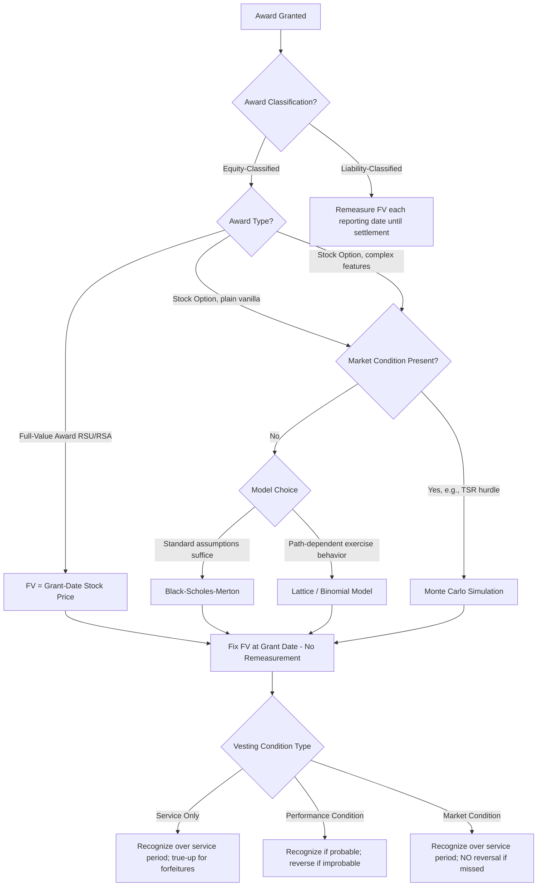

## Grant-Date Fair Value Measurement

### Overview and Governing Framework

Grant-date fair value measurement is the foundational recognition principle under **ASC 718** (*Compensation—Stock Compensation*) for equity-classified share-based payment awards, and under **IFRS 2** (*Share-based Payment*) internationally. The core principle: compensation cost for equity-classified awards is measured **once**, at the grant date, based on the fair value of the equity instruments awarded — and that measurement is **not subsequently remeasured** for changes in stock price, volatility, or other inputs, regardless of whether the award ultimately vests (subject to the service/performance condition exception discussed below).

This contrasts sharply with liability-classified awards (e.g., cash-settled SARs), which are remeasured at fair value at each reporting date until settlement.

$$\text{Total Compensation Cost} = \text{Fair Value per Award (grant date)} \times \text{Number of Awards Expected to Vest}$$

---

### Definition of Grant Date

The grant date is a precise, defined term — not simply "when the board approved the plan." Under ASC 718-10-20, the grant date is established when **all** of the following conditions are met:

- **Mutual understanding**: The employer and employee (or nonemployee grantee) have a mutual understanding of the key terms and conditions of the award.
- **Authorization is complete**: The award has received all necessary approvals (e.g., board of directors, compensation committee) — no further approvals contingent on non-perfunctory processes remain.
- **Grantee acceptance**: The recipient has begun to benefit from, or be adversely affected by, subsequent changes in the stock price (i.e., they have accepted the award, even implicitly).

**Key Points**

- If terms are subject to further negotiation (even with a controlling shareholder), grant date is deferred until finalized.
- Communication of award terms to the employee is generally required before grant date can be established — an approval by the compensation committee without employee notification is **not** a grant date.
- For awards requiring shareholder approval to be legally effective (e.g., increasing shares in an equity plan), grant date cannot precede that approval, since a required approval process is not "perfunctory."
- [Inference] In practice, many companies default the grant date to the corporate action date (board approval) if communication occurs within a short window, though technical accounting requires the mutual-understanding test to actually be satisfied.

---

### Measurement Objective

The fair value measured is that of the **equity instrument**, not of the underlying service received. This is a deliberate simplification: because employee services are difficult to fair-value directly (unlike, say, a vendor's fair-valued goods), ASC 718 requires an indirect approach — value the instrument granted and treat that as a proxy for the value of consideration received.

$$FV_{\text{grant}} = f(S_0, K, \sigma, r, T, q, \text{other award-specific terms})$$

Where:

- $S_0$ = current stock price at grant date
- $K$ = exercise price (for options)
- $\sigma$ = expected volatility
- $r$ = risk-free rate
- $T$ = expected term
- $q$ = expected dividend yield

---

### Measurement Approach by Award Type

#### Restricted Stock / RSUs (Full-Value Awards)

For nonvested share awards with no market or performance conditions beyond service, fair value equals the stock's fair value at grant date (typically closing price, though some policies use opening price or an average — the policy must be consistently applied).

$$FV_{\text{RSU}} = S_0 \times (\text{number of units})$$

Adjustments:

- If **dividends are not paid** to RSU holders during the vesting period (unlike common shareholders), the grant-date fair value must be discounted for the present value of dividends the holder will forgo.
- If dividends **are** paid or accrued during vesting (dividend equivalents), no such discount is needed.

#### Stock Options — Closed-Form Models (Black-Scholes-Merton)

For options without market conditions, the Black-Scholes-Merton (BSM) model remains the most commonly used closed-form approach:

$$C = S_0 e^{-qT} N(d_1) - K e^{-rT} N(d_2)$$

$$d_1 = \frac{\ln(S_0/K) + (r - q + \sigma^2/2)T}{\sigma\sqrt{T}}, \quad d_2 = d_1 - \sigma\sqrt{T}$$

**Six Required Inputs (ASC 718-10-55):**

| Input | Description | Estimation Approach |
| --- | --- | --- |
| Exercise price | Contractual strike | Fixed by award terms |
| Expected term | Expected period option remains outstanding | Historical exercise data; SEC "simplified method" (midpoint of vesting and contractual term) for entities lacking sufficient history |
| Current stock price | Grant-date market price | Observable (public) or valuation (private) |
| Expected volatility | Standard deviation of continuously compounded returns | Historical volatility, implied volatility (if traded options exist), or peer-group volatility for newly public/private companies |
| Risk-free rate | Rate matching expected term | U.S. Treasury zero-coupon yield curve |
| Expected dividends | Dividend yield or expected dividend payments | Historical dividend policy; $q=0$ if no dividends |

**Key Points**

- Expected volatility is frequently the most judgmental and highest-impact input; small changes materially affect fair value.
- Private companies without sufficient trading history commonly reference **implied or historical volatility of comparable public companies** (guideline peer companies).
- [Inference] Practitioners often blend historical and peer volatility using a weighting scheme, though ASC 718 does not mandate a specific blending formula — judgment and consistency are required.

#### Stock Options — Lattice Models (Binomial/Trinomial)

Lattice models are required (or preferred) when award features cannot be captured by BSM's assumptions — e.g., changing volatility/dividends over the option's life, or expected exercise behavior varying with stock price level.

$$V = e^{-r\Delta t}\left[pV_u + (1-p)V_d\right], \quad p = \frac{e^{(r-q)\Delta t} - d}{u - d}$$

Lattice models accommodate:

- Suboptimal early exercise behavior modeled as a function of stock price appreciation.
- Post-vesting termination/forfeiture behavior varying by time.
- Varying expected volatility and dividend assumptions over the contractual term.

**Example**

A private technology company grants 100,000 options with a 10-year contractual term, 4-year cliff vesting, exercise price $10, current FV of common stock $10 (per a 409A valuation), volatility 55% (derived from a peer group of five comparable public SaaS companies), risk-free rate 3.8% (7-year Treasury, matching the simplified expected term), and 0% dividend yield.

Simplified expected term (SEC Staff Accounting Bulletin Topic 14):

$$T = \frac{\text{Vesting Period} + \text{Contractual Term}}{2} = \frac{4 + 10}{2} = 7 \text{ years}$$

Applying BSM with these inputs yields a fair value per option (illustrative) of approximately $5.80–$6.20, translating to total unamortized compensation cost of roughly $580,000–$620,000, expensed over the four-year requisite service period.

#### Market-Condition Awards (Monte Carlo Simulation)

Awards with **market conditions** — e.g., vesting contingent on achieving a specified stock price, total shareholder return (TSR) relative to an index or peer group — cannot use BSM or standard lattice models, because those models don't accommodate path-dependent, relative-performance payoffs. **Monte Carlo simulation** is required.

**Critical distinction**: A market condition is factored into the **grant-date fair value estimate itself** and is **never reversed** — compensation cost is recognized regardless of whether the market condition is ultimately achieved, as long as the requisite service is rendered.

$$FV_{\text{MC}} = e^{-rT} \times \mathbb{E}\left[\text{Payoff}(S_T^{(1)}, S_T^{(2)}, \ldots, S_T^{(n)})\right]$$

Simulation steps:

1. Simulate correlated stock price paths for the company and each peer/index constituent using geometric Brownian motion (or a correlated multivariate process).
2. Determine the relative TSR ranking (or absolute price threshold) at each simulated path's measurement date.
3. Apply the award's payout schedule (e.g., 0% payout below 25th percentile, 200% payout at 75th percentile+) to each path.
4. Discount each path's payoff to present value and average across all simulated paths (typically 50,000–1,000,000+ iterations).

**Key Points**

- Because the market condition is embedded in the valuation, a company that misses its TSR target still recognizes compensation expense in full over the service period (assuming service is rendered) — no true-up or reversal occurs for the market condition outcome itself.
- Correlation assumptions between the company's stock and peer/index constituents are a critical, judgmental input for relative TSR plans.

---

### Performance Conditions vs. Market Conditions vs. Service Conditions — Recognition Treatment

This distinction is one of the most heavily tested and practically significant areas of ASC 718:

| Condition Type | Definition | Grant-Date FV Impact | Recognition if Condition Not Met |
| --- | --- | --- | --- |
| **Service condition** | Requires continued employment/service for a period | No adjustment | Reverse all prior expense (forfeiture) |
| **Performance condition** | Vesting contingent on achieving an operational/financial target (e.g., revenue, EPS) not tied to stock price | No adjustment; probability assessed for **timing/amount** of expense recognition, not FV | Reverse all prior expense if deemed **improbable** and ultimately not achieved |
| **Market condition** | Vesting/exercisability contingent on stock price or TSR-based metric | Condition is **built into the FV estimate** (Monte Carlo) | **No reversal** — expense recognized as long as service is rendered |

$$\text{Expense}_t = FV_{\text{grant}} \times \text{Units Expected to Vest}_t \times \frac{\text{Service Rendered}_t}{\text{Total Requisite Service}} - \text{Cumulative Expense Recognized}_{t-1}$$

**Example**

A performance-condition award (vest if cumulative 3-year revenue exceeds $500M) initially assessed as "probable" would accrue expense over the service period based on grant-date FV (equal to stock price, since no market condition affects valuation). If, in Year 2, achievement becomes improbable, all previously recognized expense is reversed in that period. Contrast this with a TSR-based market-condition award: even if the TSR hurdle is missed, expense already recognized stands, and any unrecognized portion continues to be recognized over the remaining service period.

---

### Nonpublic Entity Considerations

Under ASU 2021-04 and longstanding ASC 718 practical expedients, nonpublic entities have specific accommodations:

- **Practical expedient for expected term**: Simplified method available (similar to SEC SAB Topic 14, though technically that guidance targets public companies — many private companies analogously apply a simplified approach given lack of exercise history).
- **Volatility**: May use the historical, expected, or implied volatility of similar public entities ("calculated value" method) when it is not practicable to estimate expected volatility of the entity's own share price.
- **Election to measure at intrinsic value**: Historically available for certain nonpublic entities unable to reasonably estimate fair value, though this option was **eliminated by ASU 2018-07/ASU 2019-08's alignment provisions** for most nonpublic entities — [Unverified] specific transition guidance and remaining narrow exceptions should be verified against the current codification for the entity's specific fact pattern, as amendments in this area have evolved.

---

### Modifications and Their Interaction with Grant-Date FV

A modification (change in terms after grant date) requires comparing the fair value of the modified award immediately before and after modification:

$$\text{Incremental Cost} = FV_{\text{modified}} - FV_{\text{original}} \quad (\text{if positive; floor at zero})$$

The **original grant-date fair value is never revised downward** for a modification that decreases value — only incremental value from modifications that *increase* fair value is recognized as additional compensation cost. This preserves the "measure once" principle while capturing economically substantive changes (e.g., repricing, extending exercise windows, accelerating vesting).

---

### Diagram: Grant-Date Fair Value Measurement Decision Flow (svg_diagram)

---

### Common Pitfalls and Practice Notes

- **[Inference]** Confusing performance conditions with market conditions is one of the most frequent errors in practice — the reversal treatment differs fundamentally, and misclassification can materially misstate compensation expense in a missed-target scenario.
- Using the wrong volatility source (company-specific vs. peer-derived) without adequate documentation is a common audit/SEC comment area for newly public companies.
- Failing to properly identify the grant date (e.g., using board approval date when employee communication was delayed) can shift the measurement date and thus the fair value used.
- Dividend treatment for RSUs is often overlooked — omitting the present-value-of-forgone-dividends discount when required overstates grant-date fair value.

**Related Topics**

- ASC 718 expense attribution methods (straight-line vs. graded/accelerated)
- Forfeiture rate estimation (post-ASU 2016-09 policy election: estimate vs. as-incurred)
- Modification accounting (Type I–IV classifications)
- Employee Stock Purchase Plans (ESPP) — look-back and discount feature valuation
- Cash-settled SARs and liability classification triggers (ASC 718-10-25)
- IFRS 2 vs. ASC 718 key differences (graded vesting attribution, group share-based payment plans)
- 409A valuations and their relationship to grant-date fair value inputs for private companies